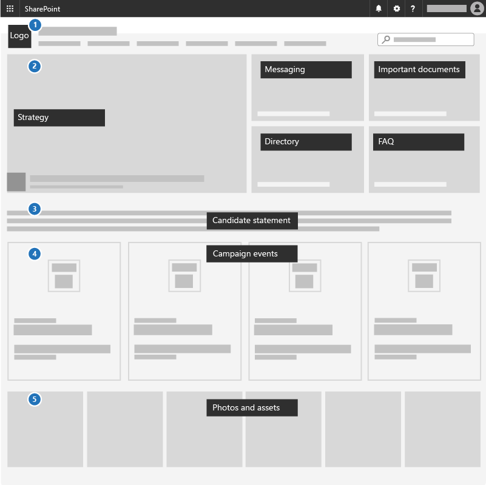

# Create a communications site for your campaign

<<<<<<< HEAD
Use a communication site to broadcast information out to a broad audience. With a communication site typically only a small set of members contribute content that is consumed by a much larger audience.
=======
A great way to communicate priorities, share strategy documents and highlight upcoming events is by using a communications site in SharePoint. Communications sites are for sharing things broadly across your whole campaign - it's your internal campaign site.
>>>>>>> m365-democracy

## Best practices

Include the following elements in your Communications site:

1. Add your campaign logo and colors as a header image and theme
2. Lead with your strategy, message, important documents, a directory, and FAQ in a **Hero web part**.
3. Include a candidate statement to the team in a **Text web part**.
4. Add campaign events to an **Events web part** so everyone can see what's coming up.
5. Add photos that people can use or share to an **Image gallery web part**.

## Set it up

Create a SharePoint communication site to share news, reports, status, and other information in a visually compelling format. Communication sites are responsive and can be viewed from anywhere on any device. For details, see [Create a communication site in SharePoint Online](https://support.office.com/en-us/article/Create-a-communication-site-in-SharePoint-Online-7FB44B20-A72F-4D2C-9173-FC8F59BA50EB).

## Admin settings

If you don't see the **+ Create site** link, then self-service site creation is likbely disabled in Office 365. Contact the person administering Office 365 in your orgainization to create a commuication site. If you're an administrator, see [Manage site creation in SharePoint Online](https://docs.microsoft.com/sharepoint/manage-site-creation) to enable self-service site creation for your organization.
  