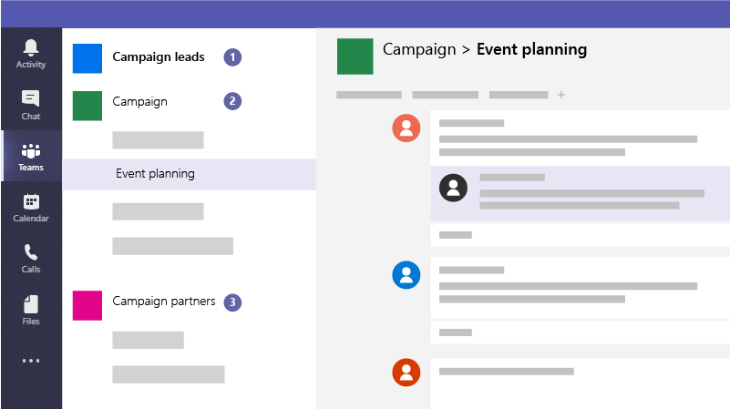

# Create teams for collaboration in Microsoft Teams

Very short introduction about why to do this and why this recommended way. 

## Best practices

Create the following teams so you can communicate and collaborate securely:

1. A Campaign Leads team - set this up as a private team so that only your key campaign members can access it and discuss potentially sensitive concerns.
2. A general Campaign team - this is for everyone to use for day to day communications and work. Individuals, groups, or committees can set up channels in this team to do their work. For example, the event planning people can set up a channel to chat and coordinate logistics for campaign events.
3. A partners team - one where you can coordinate with your vendors, partners, or volunteers without allowing them into anything sensitive.

## Set it up

Short list of summary how-to steps (if brief) with links to any articles that go into more depth. Take a look at: https://docs.microsoft.com/en-us/freelancetoolkit/internalcommunicationdownload.

## Admin settings

If there's something an admin needs to do to make this work, include a brief description of that task and a link to an article for the admin.
  