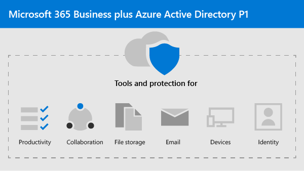

Microsoft 365 for Democracy
===========================

In our current world, keeping data and communications secure is a priority, particularly for political campaigns, medical and legal practices, and many other business types. Microsoft 365 for Democracy was designed to help protect you and your business. 

**What is Microsoft 365 for Democracy?** 
It includes both Microsoft 365 Business and Azure Active Directory P1 so that you can:
- Rely on trusted business productivity and collaboration tools, such as Outlook, Word, Excel, and other Office products 
- Protect your work files on all of your iOS, Android, and Windows 10 devices with enterprise-grade security that is simple to manage 
- Apply extra protection for user accounts and identity with Azure Active Directory P1

Get started
--------------------------

<ul class="panelContent cardsJ">
    <li>
        

            

                

                    

                        

                            
                        

                    

                    

                        
<b>Follow these steps to get started:</b>

                        
<a href="microsoft-365-democracy-overview.md">What's included in Microsoft 365 Democracy?</a>

                        
<a href="get-microsoft-365-democracy.md">Get Microsoft 365 Democracy</a>

                        
<a href="">Set up Microsoft 365 Democracy</a>

                    

                

            

        

    </li>
</ul>

Solutions for your campaign
--------------------------

After you set up your secure Microsoft 365 environment, you can use the following solutions to get working on your campaign:

<ul class="panelContent cardsW cols cols2">
    <li>
        

            

                

                    

                        

                            
                        

                    

                    

                        <h3>Create a communications site</h3>
                        
Share events, message, images, and more with your team in an internal communications site created with SharePoint.

                        
<a href="create-communications-site.md">LEARN MORE</a>

                    

                

            

        

    </li>
    <li>
        

            

                

                    

                        

                            
                        

                    

                    

                        <h3>Create teams for collaboration</h3>
                        
Make a space for communication and collaboration with specific teams for key staff, all staff, and partners or vendors with Microsoft Teams.

                        
<a href="create-teams-for-collaboration.md">LEARN MORE</a>

                    

                

            

        

    </li>
</ul>
