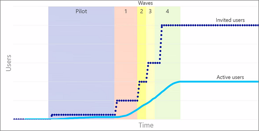

# Planning your portal launch roll-out plan in SharePoint Online

A portal is a SharePoint site on your intranet that has a large number of site viewers who consume content on the site. In large organizations there could be several of these; for example, a company portal and an HR portal. Typically portals have relatively few people who create and author the site and its content. Most visitors to the portal only read and consume the content.

This article describes how to plan your deployment and roll-out plan to SharePoint Online. It also provides approaches to follow as traditional load testing is not permitted on SharePoint Online. SharePoint Online is a cloud service and the load capabilities, health and overall balance of load in the service are managed by Microsoft.

To help in creating a successful portal, follow the basic principles, practices and recommendations detailed in the [Creating, launching and maintaining a healthy portal](/sharepoint/portal-health) 

The deployment approach is highlighted below.

## Overview of capacity planning in SharePoint Online
In order to efficiently use capacity and deal with unexpected growth, in any farm, we have automation that tracks certain usage scenarios. While exact growth is unpredictable for any one tenant in any one farm, the aggregated sum of requests is predictable over time. By identifying the growth trends in SharePoint Online, we can plan for future expansion. For more information on [Capacity planning and load testing SharePoint Online](capacity-planning-and-load-testing-sharepoint-online.md).

A key part of a successful launch is the "wave" or "phased roll-out" approach detailed below. 

## Can I load test SharePoint Online?
SharePoint Online is a shared multi-tenanted environment which is balanced across farms and scale is adjusted in an on-going basis. Load testing an environment, like SharePoint Online, whose scale changes continuously will not only  give you unexpected results but it is not permitted. 

Learn more:  [Capacity planning and load testing SharePoint Online](capacity-planning-and-load-testing-sharepoint-online.md)

## Optimize pages by following recommended guidelines
Pages from an on-Premise deployment should not simply be moved as they are onto SharePoint Online without reviewing them against recommended guidelines for SharePoint Online. The best approach is to always optimize any home page for any site or portal in SharePoint, as this is where most users in your organization will access as the starting point for your site(s).

A few basic factors should be considered:
- On-Premise deployments can leverage traditional server-side caches like object cache, output cache and blob cache. With the topology differences in the cloud, these options are not necessarily available as the sheer scale differences make them less viable approaches.
- Any pages / features / customizations used for cloud consumption should be optimized for higher latency as well as the distributed locations of users, so that users in different areas or regions have a more consistent experience. Cloud offers optimizations like Content Delivery Networks (CDN) to optimize for a distributed user base as well as for modern SharePoint, the last known good (LKG) is utilized by our out of the box (OOTB) web parts.

### What to do:
 - For all site pages in SharePoint Online use the [Page Diagnostics tool](./page-diagnostics-for-spo.md), which is a Chromium extension which will assist with analyzing and providing guidance. This can be used by site owners, editors, administrators and developers as it is designed to be a starting point for analysis and optimization.
 - Developers should also use development tools like F12 browser developer tool as well as CTRL-F12 in the browser on modern pages. [Fiddler](https://www.telerik.com/download/fiddler) can also be used to review the size weight (how large the page is in megabytes) of the page and the number of calls and elements impacting the overall page load. 

This section was a brief summary for optimizing pages.  To learn more see:  [Creating, launching and maintaining a healthy portal](/sharepoint/portal-health).

## Follow a Wave / Phased roll-out approach
The traditional big bang approach for site launches will not allow verification that customizations, external sources, services or processes have been tested at the right scale. This doesn't mean that it will take months to launch, but it is recommended over at least several days dependent on your organization size. Following a wave roll-out plan therefore gives you the option to pause and resolve issues before proceeding with the next phase and therefore lowers the potential number of users impacted by any issues. SharePoint as a service scales your capacity based on usage and predicted usage and whilst we don't need you to notify us of your launch, you should follow the guidelines to ensure success.
  
As shown in the following image, often the number of users that are invited is significantly higher than those that actually use the site. This image shows a strategy about how to roll out a release. This method helps identify ways to improve the SharePoint site before the majority of the users see it.
  

  
In the pilot phase, it is good to get feedback from users that the organization trusts and knows will be engaged. This way it is possible to gauge how the system is being used, as well as how it is performing.
  
During each of the waves, gather user feedback around the features as well as the performance during each wave of deployment. This has the advantage of slowly introducing the system and making improvements as the system gets more use. This also allows us to react to the increased load as the site is rolled out to more and more users and combined with following the guidelines for page optimization ensures a positive experience for your users.

### What to do:
- Decide on the timing of each phase and ensure that you have a contingency / pause opportunity, should you need to make adjustments before continuing
- Plan your first group of users that you want to enable, to ensure you receive the feedback you need to move forward. This means that where possible, select an active group of users that will provide feedback in a timely fashion
- As you plan each wave, try and start with a small user base (less than 5000 users), and then increase the group sizes as you proceed with each wave. This helps to create a staggered approach and allows easier pause opportunities that may be needed.