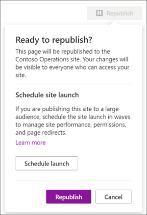
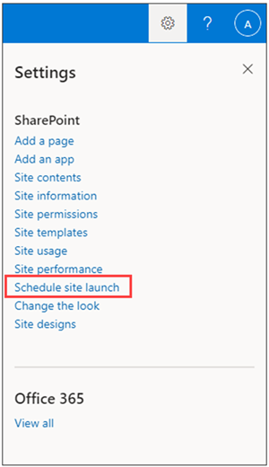
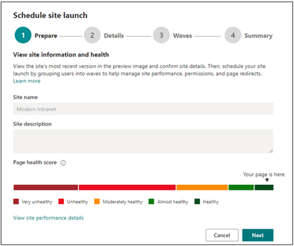
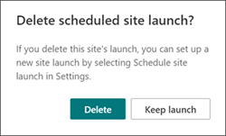

# Launch your portal using the SharePoint Portal launch scheduler

A portal is a SharePoint communication site on your intranet that is high-traffic – a site that has anywhere from 10,000 to over 100,000 viewers over the course of several weeks. Use the Portal launch scheduler to launch your portal to ensure users have a smooth viewing experience when accessing your new SharePoint portal.


The Portal launch scheduler is designed to help you follow a phased roll-out approach by batching viewers in waves and managing the URL redirects for the new portal. During the launch of each wave, you can gather user feedback, monitor portal performance, and pause the launch to resolve issues before proceeding with the next wave. Learn more about how to [plan a portal launch in SharePoint](/microsoft-365/Enterprise/Planportallaunchroll-out).

**There are two types of redirections:**

- **Bidirectional**: launch a new modern SharePoint portal to replace an existing SharePoint classic or modern portal
- **Redirect to a temporary page**: launch a new modern SharePoint portal with no existing SharePoint portal

Site permissions must be set up separately from waves as part of the launch. For example, if you are releasing an organization-wide portal, you can set permissions to "Everyone except external users," then separate your users into waves using security groups. Adding a security group to a wave does not give that security group access to the site.

> [!NOTE]
>
> - This feature will be accessible from the **Settings** panel on the home page of SharePoint communication sites.
> - This feature can only be used on modern SharePoint communication sites using site pages, as they are the default and recommended type to be used for portals.
> - You must have site owner permissions for the site to customize and schedule the launch of a portal.
> - Launches must be scheduled at least seven days in advance and each wave can last one to seven days.
> - The number of waves required is automatically determined by the expected number of users.
> - Before scheduling a portal launch, the [Page Diagnostics for SharePoint tool](https://aka.ms/perftool) must be run to verify that the home page of the site is healthy.
> - At the end of the launch, all users with permissions to the site will be able to access the new site.
> - If your organization is using [Viva Connections](https://microsoft.sharepoint.com/teams/MicrosoftViva/SitePages/Viva-Connections.aspx), users may see your organization's icon in the Microsoft Teams app bar, however when the icon is selected users will not be able to access the portal until their wave has launched.
> - This feature is not available for Office 365 Germany, Office 365 operated by 21Vianet (China), or Microsoft 365 US Government plans.

## Understand the differences between Portal launch scheduler options:

Formerly, portal launches could only be scheduled through SharePoint PowerShell. Now, you have two options to help you schedule and manage your portal's launch. Learn about the key differences between both tools:

**SharePoint PowerShell version:**

- Admin credentials are required to use [SharePoint PowerShell](/powershell/sharepoint/sharepoint-online/introduction-sharepoint-online-management-shell)
- Minimum requirement of one wave
- Schedule your launch based on Coordinated Universal Time (UTC) time zone

**In-product version:**

- Site owner credentials are required
- Minimum requirement of two waves
- Schedule your launch based on the portal's local time zone as indicated in regional settings

## Get started using the Portal launch scheduler

1. Before using the Portal launch scheduler tool, [add all users who will need access to this site](https://support.microsoft.com/office/share-a-site-958771a8-d041-4eb8-b51c-afea2eae3658) through **Site permissions** as a Site owner, Site member, or Visitor.

1. Then, start scheduling your portal's launch by accessing the Portal launch scheduler in one of two ways:

   **Option 1**: The first few times you edit and republish changes to your home page - or up until home page version 3.0 - you will be prompted to use the Portal launch scheduler tool. Select **Schedule launch** to move forward with scheduling. Or select **Republish** to republish your page edits without scheduling the launch.

   

   **Option 2**: At any time, you can navigate to the SharePoint communication site home page, select **Settings** and then **Schedule site launch** to schedule your portal's launch.

   

1. Next, confirm the portal's health score and make improvements to the portal if needed using the [Page Diagnostics for SharePoint](https://aka.ms/perftool) tool until your portal receives a **Healthy** score. Then, select **Next**.

   

   > [!NOTE]
   > The site name and description can't be edited from the Portal launch scheduler and instead can be changed by selecting **Settings** and then **Site information** from the home page.

1. Select the **Number of expected users** from the drop-down. This figure represents the number of users who will most likely need access to the site. The Portal launch scheduler will automatically determine the ideal number of waves depending on the expected users like this:

   - Less than 10k users: Two waves
   - 10k to 30k users: Three waves
   - 30k+ to 100k users: Five waves
   - More than 100k users: Five waves and contact Microsoft support via the steps listed in Launch portal with over 100k users section.

1. Then, determine the **Type of redirect** needed:

   **Option 1: Send users to an existing SharePoint page (bidirectional)** – Use this option when launching a new modern SharePoint portal to replace an existing SharePoint portal. Users in active waves will be redirected to the new site regardless of whether they navigate to the old or new site. Users in a non-launched wave that try to access the new site will be redirected back to the old site until their wave is launched.

   > [!NOTE]
   > When using the bidirectional option, the person scheduling the launch must have site owner permissions to both the new SharePoint portal and existing SharePoint portal. Additionally, the two site URLs must exist within the same tenant/domain in order to validate appropriate permissions. 

   **Option 2: Send users to an autogenerated temporary page (temporary page redirection)** – Use a temporary page redirection should be used when no existing SharePoint portal exists. Users are directed to a new modern SharePoint portal and if a user is in a wave that has not been launched, they will be redirected to a temporary page.

   **Option 3: Send users to an external page** – Provide an external URL to a temporary landing page experience until the user's wave is launched.

1. Break up your audience into waves. Add up to 20 security groups per wave. Wave details can be edited up until the launch of each wave. Each wave can last at minimum one day (24 hours) and at most seven days. This allows SharePoint and your technical environment an opportunity to acclimate and scale to the large volume of site users. When scheduling a launch through the UI, the time zone is based on the site's regional settings.

   > [!NOTE]
   >
   > - The Portal launch scheduler will automatically default to a minimum of 2 waves. However, the PowerShell version of this tool will allow for 1 wave.
   > - Microsoft 365 groups are not supported by this version of the Portal launch scheduler.

1. Determine who needs to view the site right away and enter their information into the **Users exempt from waves** field. These users are excluded from waves and will not be redirected before, during, or after the launch.

    >[!NOTE]
    > Up to 50 distinct users or security groups max can be added. Use security groups when you need more than 50 individuals to get access to the portal before the waves start launching.

1. Confirm portal launch details and select **Schedule**. Once the launch has been scheduled, any changes to the SharePoint portal home page will need to receive a healthy diagnostic result before the portal launch will resume.

### Launch a portal with over 100k users

If you are planning to launch a portal with over 100,000 users, submit a support request following the steps listed below within 10-14 days prior to the launch. Make sure to include all the requested information.

> [!NOTE]
>
> - This process should only be followed if you meet the following requirements:
> - The Launch Page has been completed.
> - [Portal Health Guidance](https://aka.ms/portalhealth) has been followed.
> - The Launch date is within 10-14 days.

**Follow these steps:**

1. As an administrator, select the following link to populate a help query in the admin center.

   [Launch SharePoint Portal with 100k users](https://admin.microsoft.com/AdminPortal/?searchSolutions=Launch%20SharePoint%20Portal%20with%20100k%20users)

1. At the bottom of the pane, select **Contact Support**, and then select **New Service Request**.

1. Under **Description**, enter "Launch SharePoint Portal with 100k users".

1. Fill out the remaining info, and select **Contact me**.

1. After the ticket has been created, ensure you provide the support agent with the following information:
   - Portal URL
   - Number of users expected
   - Estimated launch schedule (detailing the wave sizes)
   - Use the Page Diagnostics tool to "Export the HAR file" of the launch page and share the file with support

## Make changes to a scheduled portal launch

Launch details can be edited for each wave up until the date of the wave's launch.

1. To edit portal launch details, navigate to **Settings** and select **Schedule site launch**.
1. Then, select **Edit**.
1. When you are finished making your edits, select **Update**.

## Delete a scheduled portal launch

Launches scheduled using the Portal launch scheduler tool can be canceled, or deleted, at any time even if some waves have already been launched.

1. To cancel your portal's launch, navigate to **Settings** and **Schedule site launch**.

1. Then, select **Delete** and then when you see the message below select **Delete** again.

   

## Use the PowerShell Portal launch scheduler

The SharePoint Portal launch scheduler tool was originally only available via [SharePoint PowerShell](/powershell/sharepoint/sharepoint-online/introduction-sharepoint-online-management-shell) and will continue to be supported through PowerShell for customers who prefer this method. The same notes at the beginning of this article apply to both versions of the Portal launch scheduler.

> [!NOTE]
> You need administrator permissions to use SharePoint PowerShell.
> Portal launch details for launches created in PowerShell will appear and can be managed in the new Portal launch scheduler tool in SharePoint.

### App setup and connecting to SharePoint Online

1. [Download the latest SharePoint Online Management Shell](https://go.microsoft.com/fwlink/p/?LinkId=255251).

    > [!NOTE]
    > If you installed a previous version of the SharePoint Online Management Shell, go to Add or remove programs and uninstall "SharePoint Online Management Shell."
    >
    > On the Download Center page, select your language and then click the Download button. You'll be asked to choose between downloading a x64 and x86 .msi file. Download the x64 file if you're running the 64-bit version of Windows or the x86 file if you're running the 32-bit version. If you don't know, see [Which version of Windows operating system am I running?](https://support.microsoft.com/help/13443/windows-which-operating-system). After the file downloads, run it and follow the steps in the Setup Wizard.

1. Connect to SharePoint as a [global admin or SharePoint admin](/sharepoint/sharepoint-admin-role) in Microsoft 365. To learn how, see [Getting started with SharePoint Online Management Shell](/powershell/sharepoint/sharepoint-online/connect-sharepoint-online).

### View any existing portal launch setups

To see if there are existing portal launch configurations:

```PowerShell
Get-SPOPortalLaunchWaves -LaunchSiteUrl <object> -DisplayFormat <object>
```

### Schedule a portal launch on the site

The number of waves required depends on your expected launch size.

- Less than 10k users: One wave
- 10k to 30k users: Three waves
- 30k+ to 100k users: Five waves
- More than 100k users: Five waves and contact your Microsoft account team

#### Steps for bidirectional redirection

Bidirectional redirection involves launching a new modern SharePoint Online portal to replace an existing SharePoint classic or modern portal. Users in active waves will be redirected to the new site regardless of whether they navigate to the old or new site. Users in a non-launched wave that try to access the new site will be redirected back to the old site until their wave is launched.

We only support redirection between the default home page on the old site and the default home page on the new site. Should you have administrators or owners that need access to the old and new sites without being redirected, ensure they are listed using the `WaveOverrideUsers` parameter.

To migrate users from an existing SharePoint site to a new SharePoint site in a staged manner:

1. Run the following command to designate portal launch waves.

   ```PowerShell
   New-SPOPortalLaunchWaves -LaunchSiteUrl <object> -RedirectionType Bidirectional -RedirectUrl <string> -ExpectedNumberOfUsers <object> -WaveOverrideUsers <object> -Waves <object>
   ```

   Example:

   ```PowerShell
   New-SPOPortalLaunchWaves -LaunchSiteUrl "https://contoso.sharepoint.com/teams/newsite" -RedirectionType Bidirectional -RedirectUrl "https://contoso.sharepoint.com/teams/oldsite" -ExpectedNumberOfUsers 10kTo30kUsers -WaveOverrideUsers "admin@contoso.com" -Waves '
   [{Name:"Wave 1", Groups:["Viewers 1"], LaunchDateUtc:"2020/10/14"},
   {Name:"Wave 2", Groups:["Viewers 2"], LaunchDateUtc:"2020/10/15"},
   {Name:"Wave 3", Groups:["Viewers 3"], LaunchDateUtc:"2020/10/16"}]'
   ```

2. Complete validation. It can take 5-10 minutes for the redirection to complete its configuration across the service.

#### Steps for redirection to temporary page

Temporary page redirection should be used when no existing SharePoint portal exists. Users are directed to a new modern SharePoint Online portal in a staged manner. If a user is in a wave that has not been launched, they will be redirected to a temporary page (any URL).

1. Run the following command to designate portal launch waves.

   ```PowerShell
   New-SPOPortalLaunchWaves -LaunchSiteUrl <object> -RedirectionType ToTemporaryPage -RedirectUrl <string> -ExpectedNumberOfUsers <object> -WaveOverrideUsers <object> -Waves <object>
   ```

   Example:

   ```PowerShell
   New-SPOPortalLaunchWaves -LaunchSiteUrl "https://contoso.sharepoint.com/teams/newsite" -RedirectionType ToTemporaryPage -RedirectUrl "https://portal.contoso.com/UnderConstruction.aspx" -ExpectedNumberOfUsers 10kTo30kUsers -WaveOverrideUsers "admin@contoso.com" -Waves '
   [{Name:"Wave 1", Groups:["Viewers 1"], LaunchDateUtc:"2020/10/14"},
   {Name:"Wave 2", Groups:["Viewers 2"], LaunchDateUtc:"2020/10/15"},
   {Name:"Wave 3", Groups:["Viewers 3"], LaunchDateUtc:"2020/10/16"}]'
   ```

2. Complete validation. It can take 5-10 minutes for the redirection to complete its configuration across the service.

### Pause or restart a portal launch on the site

1. To pause a portal launch in progress and temporarily prevent upcoming wave progressions from occurring, run the following command:

   ```PowerShell
   Set-SPOPortalLaunchWaves -Status Pause - LaunchSiteUrl <object>
   ```

2. Validate that all users are redirected to the old site.

3. To restart a portal launch that's been paused, run the following command:

   ```PowerShell
   Set-SPOPortalLaunchWaves -Status Restart - LaunchSiteUrl <object>
   ```

4. Validate that the redirection is now restored.

### Delete a portal launch on the site

1. Run the following command to delete a portal launch scheduled or in progress for a site.

   ```PowerShell
   Remove-SPOPortalLaunchWaves -LaunchSiteUrl <object>
   ```

2. Validate that no redirection happens for all users.

## Learn more

[Planning your portal launch roll-out plan in SharePoint Online](./planportallaunchroll-out.md)

[Plan your communication site](https://support.microsoft.com/office/plan-your-sharepoint-communication-site-35d9adfe-d5cc-462f-a63a-bae7f2529182)

