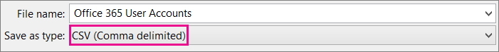
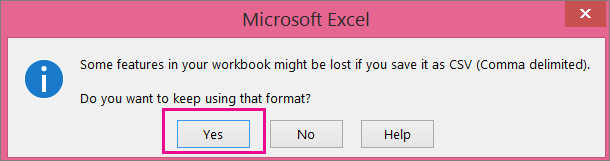

# Add several users at the same time to Microsoft 365 - Admin Help

Each person on your team needs a user account before they can sign in and access Microsoft 365 services, such as email and Office. If you have a lot of people, you can add their accounts all at once from an Excel spreadsheet or other file saved in CSV format. [Not sure what CSV format is](add-several-users-at-the-same-time.md#not-sure-what-csv-format-is)?
  
> [!NOTE]
> If you're not using the new Microsoft 365 admin center, you can turn it on by selecting the **Try the new admin center** toggle located at the top of the Home page.

## Add multiple users in the Microsoft 365 admin center

1. Sign in to Microsoft 365 with your work or school account.

2. In the admin center, choose **Users** \> <a href="https://go.microsoft.com/fwlink/p/?linkid=834822" target="_blank">**Active users**</a>.

3. Select **Add multiple users**.

4. On the **Import multiple users** panel, you can optionally download a sample CSV file with or without sample data filled in.

    Your spreadsheet needs to include the **exact same column headings** as the sample one (User Name, First Name, and so on). If you use the template, open it in a text editing tool, like Notepad, and consider leaving all the data in row 1 alone, and only entering data in rows 2 and below.

    Your spreadsheet also needs to include values for the user name (like bob@contoso.com) and a display name (like Bob Kelly) for each user.

  ```
  User Name,First Name,Last Name,Display Name,Job Title,Department,Office Number,Office Phone,Mobile Phone,Fax,Alternate email address,Address,City,State or Province,ZIP or Postal Code,Country or Region
  chris@contoso.com,Chris,Green,Chris Green,IT Manager,Information Technology,123451,123-555-1211,123-555-6641,123-555-6700,chris@contoso.com,1 Microsoft way,Redmond,Wa,98052,United States
  ben@contoso.com,Ben,Andrews,Ben Andrews,IT Manager,Information Technology,123452,123-555-1212,123-555-6642,123-555-6700,chris@contoso.com,1 Microsoft way,Redmond,Wa,98052,United States
  david@contoso.com,David,Longmuir,David Longmuir,IT Manager,Information Technology,123453,123-555-1213,123-555-6643,123-555-6700,chris@contoso.com,1 Microsoft way,Redmond,Wa,98052,United States
  cynthia@contoso.com,Cynthia,Carey,Cynthia Carey,IT Manager,Information Technology,123454,123-555-1214,123-555-6644,123-555-6700,chris@contoso.com,1 Microsoft way,Redmond,Wa,98052,United States
  melissa@contoso.com,Melissa,MacBeth,Melissa MacBeth,IT Manager,Information Technology,123455,123-555-1215,123-555-6645,123-555-6700,chris@contoso.com,1 Microsoft way,Redmond,Wa,98052,United States
  
  ```

5. Enter a file path into the box, or choose **Browse** to browse to the CSV file location, then choose **Verify**.
  
    If there are problems with the file, the problem is displayed in the panel. You can also download a log file.

6. On the **Set user options** dialog you can set the sign-in status and choose the product license that will be assigned to all users.

7. On the **View your result** dialog you can choose to send the results to either yourself or other users (passwords will be in plain text) and you can see how many users were created, and if you need to purchase more licenses to assign to some of the new users.

## Next steps

- Now that these people have accounts, they need to [Download and install or reinstall Microsoft 365 or Office 2016 on a PC or Mac](https://support.office.com/article/4414eaaf-0478-48be-9c42-23adc4716658). Each person on your team can install Microsoft 365 on up to 5 PCs or Macs.

- Each person can also [Set up Office apps and email on a mobile device](https://support.office.com/article/7dabb6cb-0046-40b6-81fe-767e0b1f014f) on up to 5 tablets and 5 phones, such as iPhones, iPads, and Android phones and tablets. This way they can edit Office files from anywhere.

    See [Set up Microsoft 365 for business](https://support.office.com/article/6a3a29a0-e616-4713-99d1-15eda62d04fa) for an end-to-end list of the setup steps.

## More information about how to add users to Microsoft 365

### Not sure what CSV format is?

A CSV file is a file with comma separated values. You can create or edit a file like this with any text editor or spreadsheet program, such as Excel.
  
You can download [this sample spreadsheet](https://www.microsoft.com/download/details.aspx?id=45485) as a starting point. Remember that Microsoft 365 requires column headings in the first row so don't replace them with something else. 
  
Save the file with a new name, and specify CSV format.
  

  
When you save the file, you'll probably get a prompt that some features in your workbook will be lost if you save the file in CSV format. This is okay. Click **Yes** to continue.
  

  
### Tips for formatting your spreadsheet

- **Do I need the same column headings as in the sample spreadsheet?** Yes. The sample spreadsheet contains column headings in the first row. These headings are required. For each user you want to add to Microsoft 365, create a row under the heading. If you add, change, or delete any of the column headings, Microsoft 365 might not be able to create users from the information in the file.

- **What if I don't have all the information required for each user?** The user name and display name are required, and you cannot add a new user without this information. If you don't have some of the other information, such as the fax, you can use a space plus a comma to indicate that the field should remain blank.

- **How small or large can the spreadsheet be?** The spreadsheet must have at least two rows. One is for the column headings (the user data column label) and one for the user. You cannot have more than 250 rows. If you need to import more than 249 users, you can create more than one spreadsheet.

- **What languages can I use?** When you create your spreadsheet, you can enter user data column labels in any language or characters, but you must not change the order of the labels, as shown in the sample. You can then make entries into the fields, using any language or characters, and save your file in a Unicode or UTF-8 format.

- **What if I'm adding users from different countries or regions?** Create a separate spreadsheet for each area. You'll need to step through the Bulk add users wizard which each spreadsheet, giving a single location of all users included in the file that you're working with.

- **Is there a limit to the number of characters I can use?** The following table shows the user data column labels and the maximum character length for each in the sample spreadsheet.

|**User data column label**|**Maximum character length**|
|:-----|:-----|
|User Name (Required)  <br/> |79 including the at sign (@), in the format name@domain.\<extension\>. The user's alias cannot exceed 50 characters, and the domain name cannot exceed 48 characters.  <br/> |
|First Name  <br/> |64  <br/> |
|Last Name  <br/> |64  <br/> |
|Display Name (required)  <br/> |256  <br/> |
|Job Title  <br/> |64  <br/> |
|Department  <br/> |64  <br/> |
|Office Number  <br/> |128  <br/> |
|Office Phone  <br/> |64  <br/> |
|Mobile Phone  <br/> |64  <br/> |
|Fax  <br/> |64  <br/> |
|Address  <br/> |1023  <br/> |
|City  <br/> |128  <br/> |
|State or Province  <br/> |128  <br/> |
|ZIP or Postal Code  <br/> |40  <br/> |
|Country or Region  <br/> |128  <br/> |

### Still having problems when adding users to Microsoft 365?

- **Double-check that the spreadsheet is formatted correctly.** Check the column headings to make sure they match the headings in the sample file. Make sure you're following the rules for character lengths and that each field is separated by a comma.

- **If you don't see the new users in Microsoft 365 right away, wait a few minutes.** It can take a little while for changes to go across all the services in Microsoft 365. 

## Related articles

[Add users individually or in bulk to Microsoft 365](/office365/admin/add-users/add-users)
