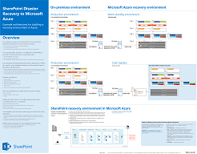

# Architectural models for SharePoint, Exchange, Skype for Business, and Lync

The IT posters in this article describe the architectural models and deployment options for SharePoint, Exchange, Skype for Business, and Lync. They also provide design information for deploying SharePoint in Microsoft Azure.
  
By using Microsoft 365, you can provide familiar collaboration and communication services through the cloud. With a few exceptions, the user experience remains the same whether you're maintaining an on-premises deployment or using Microsoft 365. 

This unified user experience complicates the decision of where to place each workload. It also raises questions:
  
- How do you choose a platform for individual workloads?
    
- Does it make sense to keep any service on-premises?
    
- In what scenario is a hybrid deployment appropriate?
    
- How does Azure fit into the picture?
    
- What configurations of Office server workloads does Azure support?
    
> [!TIP]
> Most posters in this article are available in multiple languages. Available languages include Chinese, English, French, German, Italian, Japanese, Korean, Portuguese, Russian, and Spanish. To download a poster in one of these languages, under the poster thumbnail image, select **More languages**.
  
Let us know what you think! Send us email at [cloudadopt@microsoft.com](mailto:cloudadopt@microsoft.com). 
  
Use the following links to get the posters you need:
  
- **Architectural models**: Use these resources to determine your ideal platform and configuration for SharePoint 2016 and Skype for Business 2015.
    
  - [Microsoft SharePoint 2016 architectural models](architectural-models-for-sharepoint-exchange-skype-for-business-and-lync.md#SP2016_ArchModel)
    
  - [SharePoint Server 2016 databases](architectural-models-for-sharepoint-exchange-skype-for-business-and-lync.md#SP2016_Databases)
    
  - [Microsoft Skype for Business 2015 architectural models](architectural-models-for-sharepoint-exchange-skype-for-business-and-lync.md#SfB2015_ArchModel)
    
- **Platform**: Use these resources to determine your ideal platform and configuration for SharePoint 2013, Exchange 2013, and Lync 2013.
    
  - [SharePoint 2013 platform options](architectural-models-for-sharepoint-exchange-skype-for-business-and-lync.md#SP2013_Options)
    
  - [Exchange 2013 platform options](architectural-models-for-sharepoint-exchange-skype-for-business-and-lync.md#Exch2013_options)
    
  - [Lync 2013 platform options](architectural-models-for-sharepoint-exchange-skype-for-business-and-lync.md#Lync2013_Options)
    
- **SharePoint Server 2013 in Azure**: Use these IT posters to design and configure SharePoint Server 2013 workloads in Azure infrastructure services.
    
  - [Internet sites in Azure using SharePoint Server 2013](architectural-models-for-sharepoint-exchange-skype-for-business-and-lync.md#Azure_sharepoint2013)
    
  - [Design sample: Internet sites in Azure for SharePoint 2013](architectural-models-for-sharepoint-exchange-skype-for-business-and-lync.md#DesignSampleInternetSites)
    
  - [SharePoint disaster recovery to Azure](architectural-models-for-sharepoint-exchange-skype-for-business-and-lync.md#sharepoint_recovery_Azure)
    
## Architectural models posters

The IT posters for SharePoint 2016 and Skype for Business 2015 provide a way to compare deployment methods in an easy-to-print format. The posters list all configuration or platform options. They provide the following information for each option:
  
- **Overview**: A brief summary of the platform, including a conceptual diagram.
    
- **Best for**: Common scenarios that are ideally suited for the platform.
    
- **License requirements**: The licenses you need for deployment.
    
- **Architecture tasks**: The decisions you need to make as an architect.
    
- **IT pro tasks or responsibilities**: The daily responsibilities that your IT staff needs to plan for.
    

### Microsoft SharePoint Server 2016 Architectural Models

|Item|Description|
|---|---|
|[          ](https://www.microsoft.com/download/details.aspx?id=52650)   [PDF](https://download.microsoft.com/download/4/F/A/4FA0F94B-EE2F-41DB-A047-D9864FEF41E9/SharePoint2016ArchitecturalModels.pdf)  \| [Visio](https://download.microsoft.com/download/4/F/A/4FA0F94B-EE2F-41DB-A047-D9864FEF41E9/SharePoint2016ArchitecturalModels.vsdx)  \| [More languages](https://www.microsoft.com/download/details.aspx?id=52650)|This IT poster describes the SharePoint Online, Azure, and SharePoint on-premises configurations that business decision makers and solutions architects need to know about.    - **SharePoint Online (SaaS)**: Consume SharePoint through a software as a service (SaaS) subscription model.   - **SharePoint hybrid**: Move your SharePoint sites and apps to the cloud at your own pace.   - **SharePoint in Azure (IaaS)**: Extend your on-premises environment into Azure, and deploy SharePoint 2016 servers there. (This model is recommended for high availability or disaster recovery environments and dev/test environments.)   - **SharePoint on-premises**: Plan, deploy, maintain, and customize your SharePoint environment in a datacenter that you maintain.|
   

### SharePoint Server 2016 Databases

|Item|Description|
|---|---|
|   [PDF](https://download.microsoft.com/download/D/5/D/D5DC1121-8BC5-4953-834F-1B5BB03EB691/DBrefguideSPS2016_tabloid.pdf)  \| [Visio](https://download.microsoft.com/download/D/5/D/D5DC1121-8BC5-4953-834F-1B5BB03EB691/DBrefguideSPS2016_tabloid.vsdx)  \| [More languages](https://www.microsoft.com/download/details.aspx?id=55041)|This IT poster is a quick reference for SharePoint Server 2016 databases. You'll see details for each database:    - Size   - Scaling guidance   - I/O patterns   - Requirements     The first page shows the SharePoint system databases and the service applications that have multiple databases. The second page shows all of the service applications that have single databases.     For more information, see [Database types and descriptions in SharePoint Server 2016](/SharePoint/technical-reference/database-types-and-descriptions).|
   

### Microsoft Skype for Business 2015 Architectural Models

|Item|Description|
|---|---|
|   [PDF](https://download.microsoft.com/download/7/7/4/7741262C-A60D-41F7-863B-99BF5964FBFE/Skype%20for%20Business%20Architectural%20Models.pdf)  \| [Visio](https://download.microsoft.com/download/7/7/4/7741262C-A60D-41F7-863B-99BF5964FBFE/Skype%20for%20Business%20Architectural%20Models.vsd)  \| [More languages](https://www.microsoft.com/download/details.aspx?id=55022)|This poster describes Skype for Business Online, on-premises, hybrid, and cloud private branch exchange (PBX). It also describes integration with Exchange and SharePoint configurations that business decision makers and solutions architects need to know about.    The poster is intended for IT pros to raise awareness of the fundamental architectural models through which Skype for Business Online and Skype for Business on-premises can be consumed.   Start with the configuration that best suits your organization's needs and plans. Consider and use other configurations as needed. For example, you might want to consider integration with Exchange and SharePoint or a solution that takes advantage of the Microsoft cloud PBX offering.|
   
## Platform options posters

The IT posters for SharePoint 2013, Exchange 2013, and Lync 2013 provide a way to compare the deployment methods at a glance. Each poster lists all of the configurations or platform options. It provides the following information for each option:
  
- **Overview**: A brief summary of the platform, including a conceptual diagram.
    
- **Best for**: Common scenarios that are ideally suited for the platform.
    
- **License requirements**: The licenses you need for deployment.
    
- **Architecture tasks**: The decisions you need to make as an architect.
    
- **IT pro tasks or responsibilities**: The daily responsibilities that your IT staff needs to plan for.
    

## SharePoint 2013 Platform Options

|Item|Description|
|---|---|
|   [PDF](https://go.microsoft.com/fwlink/p/?LinkId=324594)  \| [Visio](https://go.microsoft.com/fwlink/p/?LinkId=324593)  \| [More languages](https://www.microsoft.com/download/details.aspx?id=40332)|For business decision makers and architects, this poster shows the platform options for SharePoint 2013, SharePoint in Microsoft 365, on-premises hybrid with Microsoft 365, Azure, and on-premises-only deployments. It includes an overview of each architecture, recommendations, license requirements, and lists of architect and IT pro tasks for each platform. The poster highlights several SharePoint solutions on Azure.|
   

## Exchange 2013 Platform Options

|Item|Description|
|---|---|
|[          ](https://www.microsoft.com/download/details.aspx?id=42676)   [PDF](https://go.microsoft.com/fwlink/p/?LinkID=398740)  \| [Visio](https://go.microsoft.com/fwlink/p/?LinkID=398742)  \| [More languages](https://www.microsoft.com/download/details.aspx?id=42676)|For business decision makers and architects, this poster describes the platform options for Exchange 2013. Customers can choose from Exchange Online with Microsoft 365, hybrid Exchange, Exchange Server on-premises, and hosted Exchange. The poster details each architectural option, including the ideal scenarios for each, the license requirements, and IT pro responsibilities.|
   

## Lync 2013 Platform Options

|Item|Description|
|---|---|
|[          ](https://www.microsoft.com/download/details.aspx?id=41677)   [PDF](https://go.microsoft.com/fwlink/p/?LinkID=391837)  \| [Visio](https://go.microsoft.com/fwlink/p/?LinkID=391839)  \| [More languages](https://www.microsoft.com/download/details.aspx?id=41677)|For business decision makers and architects, this poster describes the platform options for Lync 2013. Customers can choose from Lync Online with Microsoft 365, hybrid Lync, Lync Server on-premises, and hosted Lync. The IT poster details each architectural option, including the ideal scenarios for each, the license requirements, and IT pro responsibilities.|
   

## SharePoint in Azure solutions posters

The IT posters for SharePoint in Azure show Azure-based solutions that use SharePoint Server 2013.
  

### Internet Sites in Microsoft Azure Using SharePoint Server 2013

|Item|Description|
|---|---|
|[          ](https://www.microsoft.com/download/details.aspx?id=41992)   [PDF](https://go.microsoft.com/fwlink/p/?LinkId=392552)  \| [Visio](https://go.microsoft.com/fwlink/p/?LinkId=392551)  \| [More languages](https://www.microsoft.com/download/details.aspx?id=41992)|This poster outlines key design activities and recommended architecture for internet-facing sites in Azure.     For more information, see the following articles:     - [Internet sites in Azure using SharePoint Server 2013](internet-sites-in-microsoft-azure-using-sharepoint-server-2013.md)   - [Azure architectures for SharePoint 2013](microsoft-azure-architectures-for-sharepoint-2013.md)|
   

### Internet sites in Azure for SharePoint 2013

|Item|Description|
|---|---|
|[          ](https://www.microsoft.com/download/details.aspx?id=41991)   [PDF](https://go.microsoft.com/fwlink/p/?LinkId=392549)  \| [Visio](https://go.microsoft.com/fwlink/p/?LinkId=392548)  \| [More languages](https://www.microsoft.com/download/details.aspx?id=41991)|Use this design sample as a starting point for your own architecture of an internet-facing site in Azure using SharePoint Server 2013.    For more information, see the following articles:     - [Internet sites in Azure using SharePoint Server 2013](internet-sites-in-microsoft-azure-using-sharepoint-server-2013.md)   - [Azure architectures for SharePoint 2013](microsoft-azure-architectures-for-sharepoint-2013.md)|
   

### SharePoint Disaster Recovery to Microsoft Azure

|Item|Description|
|---|---|
|[          ](https://www.microsoft.com/download/details.aspx?id=41993)   [PDF](https://go.microsoft.com/fwlink/p/?LinkId=392555)  \| [Visio](https://go.microsoft.com/fwlink/p/?LinkId=392554)  \| [More languages](https://www.microsoft.com/download/details.aspx?id=41993)|This IT poster shows architecture principles for a disaster recovery environment in Azure.    For more information, see the following articles:     - [SharePoint Server 2013 disaster recovery in Azure](sharepoint-server-2013-disaster-recovery-in-microsoft-azure.md)   - [Azure architectures for SharePoint 2013](microsoft-azure-architectures-for-sharepoint-2013.md)|
   
## See also

- [Microsoft 365 solution and architecture center](../solutions/index.yml)
  
- [Microsoft cloud architecture models](../solutions/cloud-architecture-models.md)
  
- [Microsoft 365 test lab guides](m365-enterprise-test-lab-guides.md)
  
- [Hybrid solutions](hybrid-solutions.md)