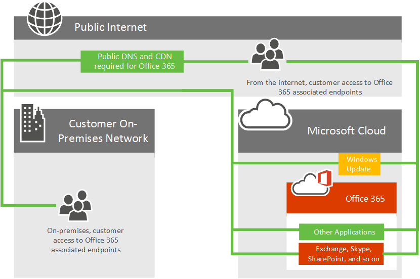
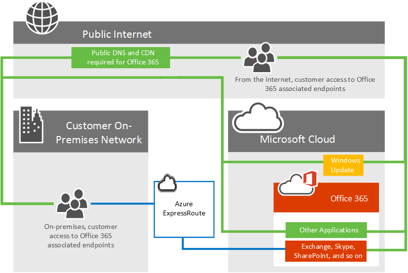

# Azure ExpressRoute for Office 365

*This article applies to both Microsoft 365 Enterprise and Office 365 Enterprise.*

Learn how Azure ExpressRoute is used with Office 365 and how to plan the network implementation project that will be required if you are deploying Azure ExpressRoute for use with Office 365. Infrastructure and platform services running in Azure will often benefit by addressing network architecture and performance considerations. We recommend ExpressRoute for Azure in these cases. Software as a Service offerings like Office 365 and Dynamics 365 have been built to be accessed securely and reliably via the Internet. You can read about Internet performance and security and when you might consider Azure ExpressRoute for Office 365 in the article [Assessing Office 365 network connectivity](assessing-network-connectivity.md).

> [!NOTE]
> Microsoft Defender for Endpoint is not supported in Azure Express Route.

> [!NOTE]
> We do not recommend ExpressRoute for Microsoft 365 because it does not provide the best connectivity model for the service in most circumstances. As such, Microsoft authorization is required to use this connectivity model for Microsoft 365. We review every customer request and authorize ExpressRoute for Microsoft 365 only in the rare scenarios where it is necessary. Please read the [ExpressRoute for Microsoft 365 guide](https://aka.ms/erguide) for more information and following a comprehensive review of the document with your productivity, network, and security teams, work with your Microsoft account team to submit an exception if needed. Unauthorized subscriptions trying to create route filters for Office 365 will receive an [error message](https://support.microsoft.com/kb/3181709).

## Planning Azure ExpressRoute for Office 365

In addition to internet connectivity, you may choose to route a subset of their Office 365 network traffic over a direct connection that offers predictability and a 99.95% uptime SLA for the Microsoft networking components. Azure ExpressRoute provides you with this dedicated network connection to Office 365 and other Microsoft cloud services.

Regardless of whether you have an existing MPLS WAN, ExpressRoute can be added to your network architecture in one of three ways; through a supported cloud exchange co-location provider, an Ethernet point-to-point connection provider, or through an MPLS connection provider. See what [providers are available in your region](/azure/expressroute/expressroute-locations). The direct ExpressRoute connection will enable connectivity to the applications outlined in [What Office 365 services are included?](azure-expressroute.md#BKMK_WhatDoIGet) below. Network traffic for all other applications and services will continue to traverse the internet.

Consider the following high level network diagram which shows a typical Office 365 customer connecting to Microsoft's datacenters over the internet for access to all Microsoft applications such as Office 365, Windows Update, and TechNet. Customers use a similar network path regardless of whether they're connecting from an on-premises network or from an independent internet connection.

Now look at the updated diagram which depicts an Office 365 customer who uses both the internet and ExpressRoute to connect to Office 365. Notice that some connections such as Public DNS and Content Delivery Network nodes still require the public internet connection. Also notice the customer's users who are not located in their ExpressRoute connected building are connecting over the Internet.

Still want more information? Learn how to [manage your network traffic with Azure ExpressRoute for Office 365](https://support.office.com/article/e1da26c6-2d39-4379-af6f-4da213218408) and learn how to [configure Azure ExpressRoute for Office 365](/azure/expressroute/expressroute-faqs). We've also recorded a 10 part [Azure ExpressRoute for Office 365 Training](https://channel9.msdn.com/series/aer) series on Channel 9 to help explain the concepts more thoroughly.

## What Office 365 services are included?

The following table lists the Office 365 services that are supported over ExpressRoute. Please review the [Office 365 endpoints article](./urls-and-ip-address-ranges.md) to understand which network requests for these applications require internet connectivity.

| Applications included |
|:-----|
|Exchange Online1   Exchange Online Protection1   Delve1   |
|Skype for Business Online1   Microsoft Teams 1   |
|SharePoint Online1   OneDrive for Business1   Project Online1   |
|Portal and shared1   Azure Active Directory (Azure AD) 1   Azure AD Connect1   Office1   |

1 Each of these applications have internet connectivity requirements not supported over ExpressRoute, see the [Office 365 endpoints article](./urls-and-ip-address-ranges.md) for more information.

The services that aren't included with ExpressRoute for Office 365 are Microsoft 365 Apps for enterprise client downloads, On-premises Identity Provider Sign-In, and Office 365 (operated by 21 Vianet) service in China.

## Implementing ExpressRoute for Office 365

Implementing ExpressRoute requires the involvement of network and application owners and requires careful planning to determine the new [network routing architecture](https://support.office.com/article/e1da26c6-2d39-4379-af6f-4da213218408), bandwidth requirements, where security will be implemented, high availability, and so on. To implement ExpressRoute, you'll need to:

1. Fully understand the need ExpressRoute satisfies in your Office 365 connectivity planning. Understand what applications will use the internet or ExpressRoute and fully plan your network capacity, security, and high availability needs in the context of using both the internet and ExpressRoute for Office 365 traffic.

2. Determine the egress and peering locations for both internet and ExpressRoute traffic1.

3. Determine the capacity required on the internet and ExpressRoute connections.

4. Have a plan in place for implementing security and other standard perimeter controls1.

5. Have a valid Microsoft Azure account to subscribe to ExpressRoute.

6. Select a connectivity model and an [approved provider](/azure/expressroute/expressroute-locations). Keep in mind, customers can select multiple connectivity models or partners and the partner doesn't need to be the same as your existing network provider.

7. Validate deployment prior to directing traffic to ExpressRoute.

8. Optionally [implement QoS](https://support.office.com/article/ExpressRoute-and-QoS-in-Skype-for-Business-Online-20c654da-30ee-4e4f-a764-8b7d8844431d) and evaluate regional expansion.

1 Important performance considerations. Decisions here can dramatically impact latency which is a critical for applications such as Skype for Business.

For additional references, use our [routing guide](https://support.office.com/article/Routing-with-ExpressRoute-for-Office-365-e1da26c6-2d39-4379-af6f-4da213218408) in addition to the [ExpressRoute documentation](/azure/expressroute/expressroute-introduction).

To purchase ExpressRoute for Office 365, you'll need to work with one or more [approved providers](/azure/expressroute/expressroute-locations) to provision the desired number and size circuits with an ExpressRoute Premium subscription. There are no additional licenses to purchase from Office 365.

Here's a short link you can use to come back: [https://aka.ms/expressrouteoffice365]()

Ready to sign-up for [ExpressRoute for Office 365](https://aka.ms/ert)?

## Related Topics

[Assessing Office 365 network connectivity](assessing-network-connectivity.md)

[Managing ExpressRoute for Office 365 connectivity](managing-expressroute-for-connectivity.md)

[Routing with ExpressRoute for Office 365](routing-with-expressroute.md)

[Network planning with ExpressRoute for Office 365](network-planning-with-expressroute.md)

[Implementing ExpressRoute for Office 365](implementing-expressroute.md)

[Using BGP communities in ExpressRoute for Office 365 scenarios](bgp-communities-in-expressroute.md)

[Media Quality and Network Connectivity Performance in Skype for Business Online](https://support.office.com/article/5fe3e01b-34cf-44e0-b897-b0b2a83f0917)

[Office 365 performance tuning using baselines and performance history](performance-tuning-using-baselines-and-history.md)

[Performance troubleshooting plan for Office 365](performance-troubleshooting-plan.md)

[Office 365 URLs and IP address ranges](urls-and-ip-address-ranges.md)

[Office 365 network and performance tuning](network-planning-and-performance.md)

## See also

[Microsoft 365 Enterprise overview](microsoft-365-overview.md)
