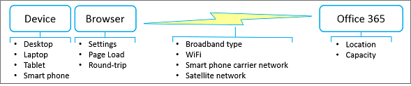

# Best practices for using Office 365 on a slow network

Wouldn't it be nice if your Internet connection was always fast and never down? Perhaps that day will come. But in the meantime, there are practical things you can do to work around a balky network and still get your day-to-day work done. Although Office 365 is a cloud-based service, it also provides many ways to work with your content offline and to smoothly keep your changes synchronized. Besides, it's sometimes more efficient to work with content offline just because applications run faster and the user interface is more responsive. The point is this: Office 365 gives you the best of both worlds. Here's how to take advantage of that.

> [!TIP]
> Want to see how slow (or fast) your network connection is? Try the [OOKLA Speed test](https://www.speedtest.net/) or the [Network Speed Test App](https://www.windowsphone.com/store/app/network-speed-test/9b9ae06b-2961-41ef-987d-b09567cffe70).

## Why is my network so slow?

Although you don't have control over network performance itself, it helps to understand what's going on behind the scenes. The Internet is enormously complex, but there are a few concepts that can help you understand the situation much better. Following the best practices in this article can help workaround performance issues and reduce frustration.

### Major factors that affect network performance

 **Bandwidth and latency**: The two most important measures of network performance are bandwidth and latency:

- Bandwidth is the rate of throughput measured in bits per second. Bigger is better. Bandwidth is like a water pipe. The larger the pipe, the more water that you can "put through" it.

- Latency is the time it takes for content to get from a server or service to your device and is measured in milliseconds. Faster is better. Latency can be caused by a number of factors including low bandwidth, a sparse connection, or transmission time.

 **Common issues**: Besides bandwidth and latency, other issues have an impact on network performance and are often unpredictable. Network performance can fluctuate based on the time of the day or your physical location. The network can become clogged when certain events occur that spike the use of the Internet, such as a natural disaster or a major public event. The size and complexity of the page being loaded and the number and size of files being transferred have a direct bearing on performance. A WiFi connection can temporarily degrade: for example, you poll a large conference meeting of thousands by requesting everyone to tweet at the same time.

 **Considerations for a satellite network**: A satellite network is useful when a terrestrial network is not feasible, such as the back country/region, a cruise ship, or a remote scientific area. These networks rely on satellites positioned in a geosynchronous orbit 22,000 miles above the equator. However, a transmission actually travels about 90,000 miles, and so a satellite network has a slower latency (500 ms or more) than a terrestrial network (20 to 50ms). Under the best of conditions, you may not notice this latency, but for downloading large files, streaming videos, and playing games, you probably will. Another issue is "rain fade" in which heavy weather, such as thunderstorms and blizzards, can temporarily interrupt satellite transmission.

## Are you sure it's the network?

Whenever you experience performance problems, first make sure that your device is not the root cause of the problem. There are two things you can do that might make a big improvement:

- Make sure your device is running well and there is no malware on your computer.

- If possible, buy more memory. Adding memory is the simplest and often most effective way to improve performance on your device. It's especially helpful when working with large files and videos.

For more information, see [Windows Performance and maintenance](https://windows.microsoft.com/windows/performance-maintenance-help#performance-maintenance-help) and [Tips to improve PC performance in Windows 10](https://support.microsoft.com/help/4002019/windows-10-improve-pc-performance).

## Best practices for using your browser

Your browser is your gateway to Office 365, so it can have an impact on performance, especially with the time it takes to load a page and how often you round trip to the Office 365 service.

### Browsers in general

Here are some suggestions for browsers in general:

- Disable browser add-ons that might impact performance or that you don't really need.

- Increase the cache size for your temporary internet files.

- Once you have signed into your work or school account, keep the browser window open throughout the day. You can open other tabs and windows without signing in again. If you need to sign in to another account, use Private Browsing.

- Once each page is downloaded and open, keep them open by using tabs. It's easy to navigate between tabs and use the page later on in the day. Refresh a page only if you need the latest data on that page.

- If a page is taking too long to open, stop the page download (press ESC) and then refresh the page (press F5).

- When possible, reduce round trips to Office 365. For example, rather than paging through lists or libraries, use search to locate files in a large library and filtering in a list to get directly to the results you want. Or, create views that minimize page load time. For more information, see [Manage large lists and libraries in Office 365](https://support.office.com/article/b4038448-ec0e-49b7-b853-679d3d8fb784#BKMK_PAGES).

- If video performance is poor, you may be able to download the video and watch it on your device. A download link may be available, or you may be able to right click the video link, and select **Save Target as**.

### Browser-specific

Here are some suggestions for your specific browser:

- **Internet Explorer**: Upgrade to Internet Explorer Version 11 or later for substantial performance improvements over previous versions. For more information, see [Troubleshooting guide for Internet Explorer](https://support.microsoft.com/help/2437121/troubleshooting-guide-for-internet-explorer-when-you-access-office-365).
- **FireFox**: For more information, see [Firefox is slow or stops working](https://support.mozilla.org/products/firefox/fix-problems/slowness-or-hanging).
- **Safari**: For more information, see [Apple - Safari](https://www.apple.com/safari/).
- **Chrome**: For more information, see [Chrome Help](https://support.google.com/chrome/?hl=en).

## Best practices for using Outlook and Outlook Web App

Reading, writing, and organizing email is a big part of everyone's day. Both Outlook and Outlook Web App (OWA) offer offline support. Using an email app on your smart phone is another useful alternative. Use the following options that best fit your needs:

- Upgrade to the latest version of Outlook for substantial performance improvements over previous versions.

- Outlook Web App lets you create offline messages, contacts, and calendar events that are uploaded when OWA is next able to connect to Office 365. For more information about setting up and using OWA in offline mode, see [Using Outlook Web App offline](https://support.office.com/article/3214839c-0604-4162-8a97-6856b4c27b36).

- Outlook lets you work in cached mode, in which it automatically connects whenever possible. You can have Outlook download your entire mailbox, or just a portion of it. For more information, see [Turn on Cached Exchange Mode](https://support.office.com/article/7885af08-9a60-4ec3-850a-e221c1ed0c1c) and [Work offline in Outlook](https://support.office.com/article/f3a1251c-6dd5-4208-aef9-7c8c9522d633).

- Outlook also offers an offline mode. To use this, you must first set up cached mode so that information from your account is copied down to your computer. In offline mode, Outlook will try to connect using the send and receive settings, or when you manually set it to work online. For more information, see [Work offline to avoid data connection charges](https://support.office.com/article/827fe51f-5609-4062-82b4-3578057f9282), [Change send and receive settings when you work offline](https://support.office.com/article/f681ec10-cb14-40cb-8709-1909a13c304a), and [Switch from working offline to online](https://support.office.com/article/2460e4a8-16c7-47fc-b204-b1549275aac9).

- If you have a smart phone, you can use it to triage your email and calendar over your phone carrier's network.

> [!NOTE]
> Here is some guidance on when to use Outlook or OWA. If disk space is not an issue on your device, Outlook has a full set of features and might work best for you. If disk space is an issue on your device, consider using OWA which has a subset of features, but also works best in an online situation. Of course, you can use either because they work well together.

## Best practices for using OneDrive for Business

OneDrive for Business is designed from the ground up to work with your files online and offline. Once you set it up, synchronization of changes occurs automatically and reliably wherever and whenever you make them. If the network is slow, you can work with the offline version of the files.

The OneDrive for Business sync app comes with a SharePoint Online and Office 365 business subscription, or you can [download](https://support.microsoft.com/kb/2903984) the OneDrive for Business sync app for free. This app is also faster than using the **Open in Explorer** or **Upload** commands. For more information, see [Set up your computer to sync your OneDrive for Business files in Office 365](https://support.office.com/article/23e1f12b-d896-4cb1-a238-f91d19827a16).

Here's some additional guidance for using the OneDrive for Business sync app:

- If you're syncing a large library for the first time, start the sync during off hours, for example, overnight.
- You can use the [Stop syncing a library with the OneDrive for Business app](https://support.office.com/article/a7e41f1f-3a98-4ca7-9443-f10250688330) feature to temporarily stop syncing updates. However, use this feature for brief periods, such as a few hours at a time, to avoid queuing large numbers of updates, and to minimize the risk of merge conflicts if several people work on the same document.

## Best practices for using OneNote

Every SharePoint team site has a built-in OneNote notebook and you can easily create your own. OneNote is a great way to collect timely information that you need every day to get tasks done. For example, many teams use OneNote as a collection point for weekly meetings, project notes, ideas, plans, and status reports. You can neatly organize this disparate information by using pages, sections, and tabs.

The beauty of OneNote is that you can access the content from virtually any device, whether a desktop, a laptop, a tablet, or a smart phone. And you don't have to worry about saving or synchronizing because OneNote does it for you.

For more information, see [Microsoft OneNote](https://office.microsoft.com/onenote).

## Best practices for using Skype for Business and Lync Online

The following are general guidelines for using Skype for Business or Lync Online when your network is slow:

- Use instant messaging whenever you can because it works well on a slow network.

- Avoid making phone calls over a virtual private network (VPN) or remote access service (RAS) connections.

- Make sure your audio device is approved. For more information, see [Phones and Devices Qualified for Microsoft Lync](/skypeforbusiness/lync-cert/ip-phones).

- When using PowerPoint in an online presentation, reduce the size and complexity of the slides. For more information, see [Tips for improving the performance of your presentation](https://support.office.com/article/34c82835-5f23-4bf0-98cc-72235bbd2949).

- Video performance is very dependent on network performance. Avoid using video if your network is slow.

For more information, see [Poor audio or video quality in Lync Online](https://support.microsoft.com/kb/2386655), or how to [troubleshoot connection issues in Skype for Business](https://support.office.com/article/troubleshoot-connection-issues-in-skype-for-business-ca302828-783f-425c-bbe2-356348583771).

## Best practices for using SharePoint lists

Working with list data offline to "scrub", analyze, or report data is a great way to minimize the impact of a slow network. You can read and write most lists from Microsoft Access 2019 and Microsoft Access 2016 by linking to them. You can also export a list to an Excel Table, which creates a one-way data connection between the Excel table and the list. Learn how to [Work offline with tables that are linked to SharePoint lists](https://support.office.com/article/work-offline-with-tables-that-are-linked-to-sharepoint-lists-5d66594a-6176-4a25-a198-320f13ccf41e).

For more information, see the section "More about managing large lists" in [Manage large lists and libraries in Office 365](https://support.office.com/article/b4038448-ec0e-49b7-b853-679d3d8fb784).

## Best practices for customizing web pages

When you customize a web page, you may inadvertently cause poor performance with the page. A number of factors can have an impact, such as the complexity and size of the page, how many web parts are added, how many list or library items are initially displayed, and the way you code the page.

For more information, see [Tune SharePoint Online performance](tune-sharepoint-online-performance.md).

## Best practices for using Project Online

The following guidelines can help improve network performance.

- Project Online and SharePoint Online require synchronization, which can be time consuming. If your project teams have low turnover, disable Project Site Sync to improve the Project Publish and Project Detail Pages performance. Limit Active Directory sync to groups of resources that actually need to use the system, and monitor any potential permission issues after the synchronization of large groups.

- If your organization uses project sites, create them on demand rather than automatically. This speeds up the first publishing experience and avoids creating unnecessary sites and content.

- Project Detail Pages (PDP) can trigger a recalculation of the entire project and kick off workflow actions, both of which can be performance-intensive operations. To avoid triggering two update processes at the same time on the same PDP, avoid updating the calendar fields (Start date, Finish date, Status date, and Current date) and the non-scheduled fields (project name, description, and owner).

- Reduce the number of Web Parts and custom fields displayed on each PDP. Create a dedicated PDP with the only fields that require updating to improve load and save time.

- When you use OData for reporting, limit the amount of data you query at runtime by using server-side filtering.

For more information, see [Tune Project Online performance](https://support.office.com/article/12ba0ebd-c616-42e5-b9b6-cad570e8409c).

## What's the best way to report problems?

Microsoft continually improves the overall performance of Office 365 by monitoring the network, measuring bandwidth and latency, improving page load time, reducing disk I/O, redesigning pages to use Minimal Download Strategy, adding hardware to data centers and adding more data centers. For more information about checking your current status and reporting issues, see [How to check Office 365 service health](view-service-health.md).

## See also

[Network planning and performance tuning for Office 365](network-planning-and-performance.md)

[Office 365 Network Connectivity Principles](microsoft-365-network-connectivity-principles.md)

[Managing Office 365 endpoints](https://support.office.com/article/99cab9d4-ef59-4207-9f2b-3728eb46bf9a)

[Office 365 endpoints FAQ](https://support.office.com/article/d4088321-1c89-4b96-9c99-54c75cae2e6d)
