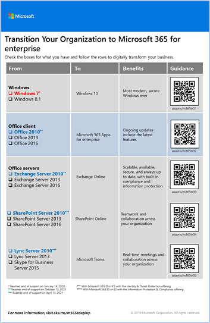

# Client and server software roadmap for Microsoft 365

Most enterprise organizations have a heterogeneous environment that includes multiple releases of operating systems, client software, and server software. Microsoft 365 for Enterprise includes the most secure versions of the key components of your IT infrastructure. It also includes productivity features that are designed to take advantage of cloud technologies.

To maximize the business value of the Microsoft 365 for Enterprise integrated suite of products, begin planning and implementing a strategy to migrate releases of:

- The Office client installed on your computers to Microsoft 365 Apps for enterprise.
- The Office servers installed on your servers to their equivalent services in Microsoft 365.
- Windows 7 and Windows 8.1 on your devices to Windows 10 Enterprise.

>[!Note]
>Support for Windows 7 ended on *January 14, 2020*. For more information, see the [end-of-support details](https://support.microsoft.com/help/4057281/windows-7-support-will-end-on-january-14-2020).
>

As you accomplish these migrations over time, your organization comes closer to the vision of the [modern workplace](https://www.microsoft.com/microsoft-365/blog/2018/04/27/making-it-simpler-with-a-modern-workplace/). This secure and integrated environment can help you unlock teamwork and creativity in your organization. Microsoft 365 for Enterprise enables and empowers you all along the way.

## Migration for Office client products

Organizations both large and small often use a combination of older versions of Office client products, such as Word, Excel, and PowerPoint. These older versions:

- Can be [updated](https://support.office.com/article/install-office-updates-2ab296f3-7f03-43a2-8e50-46de917611c5) with the latest security updates and support fixes. But the process is sometimes manual and might not scale across your organization.
- Aren't optimized to use the Microsoft cloud technologies that help you digitally transform your business.
- Don't provide the latest features.

Microsoft 365 for Enterprise includes Microsoft 365 Apps for enterprise. This version of the Office client products is available with a Microsoft 365 for Enterprise license. It's installed and updated from the Microsoft cloud. Microsoft 365 Apps for enterprise includes security updates and the latest features. For more information, see [About Microsoft 365 Apps for enterprise](/deployoffice/about-microsoft-365-apps).

### Office 2007

For versions of Office in the Office 2007 release, the end of support has already passed. For more information, see [Office 2007 end-of-support roadmap](/deployoffice/office-2007-end-support-roadmap).

Rather than upgrading your computers that run Office 2007 to Office 2010, Office 2013, or Office 2016, consider taking the following steps:

1. Get and assign a Microsoft 365 license for your users.
2. Uninstall Office 2007 on their computers.
3. Install Microsoft 365 Apps for enterprise, either individually or during an IT rollout. For more information, see [Deployment guide for Microsoft 365 Apps](/deployoffice/deployment-guide-microsoft-365-apps).

Microsoft 365 Apps for enterprise installs updates automatically. It can take advantage of cloud-based services for enhanced security and productivity.

### Office 2010

For versions of Office in the Office 2010 release, support ended on *October 13, 2020*. For more information, see [Office 2010 end-of-support roadmap](/deployoffice/office-2010-end-support-roadmap).

You might consider upgrading your computers that run Office 2010 to Office 2013 or Office 2016. However, both of those versions must be manually updated. So consider taking the following steps instead:

1. Get and assign a Microsoft 365 license for your users.
2. Uninstall Office 2010 on their computers.
3. Install Microsoft 365 Apps for enterprise, either individually or during an IT rollout. For more information, see [Deployment guide for Microsoft 365 Apps](/deployoffice/deployment-guide-microsoft-365-apps).

Microsoft 365 Apps for enterprise automatically installs both security updates and new feature updates. It can take advantage of cloud-based services in Microsoft 365 for enhanced security and productivity.

### Office 2013 and Office 2016

See the [end-of-support roadmap for Office 2013](/lifecycle/products/microsoft-office-2013). The end of support for Office 2016 hasn't yet been determined. In these versions, like Office 2010, you must still [install security updates](https://support.office.com/article/install-office-updates-2ab296f3-7f03-43a2-8e50-46de917611c5). This task might not scale well, depending on the size of your organization.

Rather than keeping your computers current with the latest security updates for Office 2013 or Office 2016, or updating your computers from Office 2013 to Office 2016, consider taking the following steps:

1. Get and assign a Microsoft 365 license for your users.
2. Uninstall Office 2013 or Office 2016 on their computers.
3. Install Microsoft 365 Apps for enterprise, either individually or during an IT rollout. For more information, see [Deployment guide for Microsoft 365 Apps](/deployoffice/deployment-guide-microsoft-365-apps).

Microsoft 365 Apps for enterprise installs both security updates and new feature updates automatically. It can take advantage of cloud-based services in Microsoft 365 for enhanced security and productivity.

## Migration for Office server products

Both large and small organizations often use a combination of older versions of the Office server products, such as Exchange Server and SharePoint Server. These older versions:

- Should be updated with the latest security updates and support fixes. In some cases, these updates are released monthly.
- Aren't optimized to use the Microsoft cloud technologies that help you digitally transform your business.
- Don't include new productivity applications, such as Microsoft Teams.
- Don't include the latest security features, such as Exchange and Defender for Office 365.

Microsoft 365 for Enterprise includes cloud-based versions of Office server services that use some of the same tools as on-premises versions of Office server software, such as web browsers and the Outlook client. These services are automatically updated for security. So your IT personnel save the time it takes to maintain and update on-premises servers. These services also offer new feature enhancements that aren't present in Office server software.

Use the following resources for information about migrating users and data for specific Microsoft 365 workloads:

- [Move mailboxes from on-premises Exchange Server to Exchange Online](/exchange/hybrid-deployment/move-mailboxes)
- [Migrate SharePoint data from SharePoint Server to SharePoint Online](/sharepointmigration/migrate-to-sharepoint-online)
- [Migrate Skype for Business Online to Microsoft Teams](/microsoftteams/migration-interop-guidance-for-teams-with-skype)

### Office 2007 server products

For server products in the Office 2007 release, the end of support has already passed. See these articles for details:

- [Exchange 2007 end-of-support roadmap](exchange-2007-end-of-support.md)
- [SharePoint Server 2007 end-of-support roadmap](sharepoint-2007-end-of-support.md)
- [Project Server 2007 end-of-support roadmap](project-server-2007-end-of-support.md)
- [Office Communications Server end-of-support roadmap](/skypeforbusiness/plan-your-deployment/upgrade)
- [PerformancePoint Server 2007 end-of-support roadmap](pps-2007-end-of-support.md)

Rather than upgrading your server products in the Office 2007 release with server products in the releases for Office 2010, Office 2013, or Office 2016, consider taking the following steps:

1. Migrate the data on your Office 2007 servers to Microsoft 365. For more information or help, hire a Microsoft partner.
2. Roll out the new functionality and work processes to your users.
3. When you no longer need the on-premises servers running Office 2007 server products, decommission them.

### Office 2010 server products

Support for [Exchange Server 2010](exchange-2010-end-of-support.md) ended on *October 13, 2020*.

The end of support for [SharePoint Server 2010](upgrade-from-sharepoint-2010.md) is *April 13, 2021*.

Rather than upgrading these server products in the Office 2010 release with server products in the releases for Office 2013 or Office 2016, consider taking the following steps:

1. Migrate the data on your Office 2010 servers to Microsoft 365. For more information, see [FastTrack for Microsoft 365](https://fasttrack.microsoft.com/microsoft365) or hire a Microsoft partner.
2. Roll out the new functionality and work processes to your users.
3. When you no longer need the on-premises servers running Office 2010 server products, decommission them.

### Office 2013 server products

For server products in the Office 2013 release, the end of support hasn't been determined. Rather than upgrading your server products in the Office 2013 release with server products in the Office 2016 release, consider taking the following steps:

1. Migrate the data on your Office 2013 servers to Microsoft 365. For more information, see [FastTrack for Microsoft 365](https://fasttrack.microsoft.com/microsoft365) or hire a Microsoft partner.
2. Roll out the new functionality and work processes to your users.
3. When you no longer need the on-premises servers running Office 2013 server products, decommission them.

### Office 2016 server products

For server products in the Office 2016 release, the end of support hasn't been determined. To take advantage of cloud-based service and enhancements to digitally transform your business, consider taking the following steps:

1. Migrate the data on your Office 2016 servers to Microsoft 365. For more information, see [FastTrack for Microsoft 365](https://fasttrack.microsoft.com/microsoft365) or hire a Microsoft partner.
2. Roll out the new functionality and work processes to your users.
3. When you no longer need the on-premises servers running Office 2016 server products, decommission them.

## Migration for Windows 7 and 8.1

Support ended for Windows 7 on *January 14, 2020*. To migrate your devices that run Windows 7 or Windows 8.1, you can do an in-place upgrade.

For additional methods, see [Windows 10 deployment scenarios](/windows/deployment/windows-10-deployment-scenarios). You can also [plan for Windows 10 deployment](/windows/deployment/planning/) on your own.

## Office 2010 clients and servers and Windows 7

Here's a visual summary of the upgrade, migration, and move-to-cloud options for Office 2010 clients and servers and Windows 7:

This one-page poster is a quick way to understand the paths you can take to manage the end of support for Office 2010 client and server products and Windows 7. The preferred paths are supported in Microsoft 365 for Enterprise.

You can [download this poster](https://github.com/MicrosoftDocs/microsoft-365-docs/raw/public/microsoft-365/downloads/Office2010Windows7EndOfSupport.pdf) and print it in letter size, legal size, or tabloid (11 x 17) size.

## Transition your entire organization

To get a better picture of how to move your entire organization to the products and services in Microsoft 365 for Enterprise, download this transition poster:

This two-page poster is a quick way to inventory your existing infrastructure. Use it to get guidance for moving to a product or service in Microsoft 365 for Enterprise. It shows Windows and Office products and other infrastructure and security elements such as device management, identity and threat protection, and information and compliance protection.

## How Microsoft migrated to Microsoft 365 for Enterprise

See how IT experts at Microsoft migrated the company to Microsoft 365 for Enterprise:

- [Deploying and updating Microsoft 365 Apps for enterprise](https://www.microsoft.com/itshowcase/Article/Content/757/Deploying-and-updating-Microsoft-Office-365-ProPlus)
- [Microsoft migrates 150,000 mailboxes to Exchange Online](https://www.microsoft.com/itshowcase/Article/Content/577/Microsoft-migrates-150000-mailboxes-to-Exchange-Online)
- [SharePoint to the cloud: Learn how Microsoft ran its own migration](https://www.microsoft.com/itshowcase/Article/Content/691/SharePoint-to-the-cloud-Learn-how-Microsoft-ran-its-own-migration)
- [Deploying Windows 10 at Microsoft as an in-place upgrade](https://www.microsoft.com/itshowcase/Article/Content/668/Deploying-Windows-10-at-Microsoft-as-an-inplace-upgrade)
- [Windows 10 deployment: Tips and tricks from Microsoft IT](https://www.microsoft.com/itshowcase/Article/Content/951/Windows-10-deployment-tips-and-tricks-from-Microsoft-IT) (video)