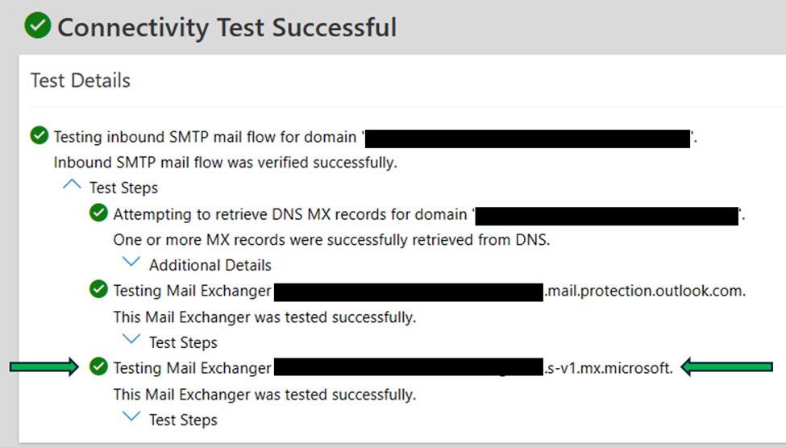

---
# Required metadata
# For more information, see https://learn.microsoft.com/en-us/help/platform/learn-editor-add-metadata
# For valid values of ms.service, ms.prod, and ms.topic, see https://learn.microsoft.com/en-us/help/platform/metadata-taxonomies

title: Configure Multi-Geo In-Region Routing (In Preview)
description: This article describes the process of configuring Multi-Geo In-Region Routing (IRR).
author:      Ian-MSFT-2019 # GitHub alias
ms.author:   iamcdo # Microsoft alias
manager: mfxiong 
ms.service: microsoft-365-enterprise
ms.topic: how-to
ms.date:     09/26/2025
ms.subservice: advanced-data-residency
---

# Configure Multi-Geo In-Region Routing (In Preview)

This article describes the process of configuring Multi-Geo In-Region Routing (IRR).

## Overview

Multi-Geo In-Region Routing (IRR) enables you to use recipient accepted domains to control inbound email routing to comply with regional data regulations. IRR ensures email is fully processed and stored within the recipient's Preferred Data Location (PDL), which enhances data sovereignty and compliance.

This article describes the steps to configure accepted domains for IRR.

## Prerequisites

- Before enabling Multi-Geo In-Region Routing, ensure that any certificate and/or IP address used in Connectors for mail sent from your on-premises infrastructure to Exchange Online is not also used for sending emails from your on-premises environment to external organizations over the Internet. Using the same certificate or IP for both scenarios can cause issues with email attribution if you enable In-Region Routing, specifically when the recipient organization is hosted on Exchange Online. Outbound Internet mail from your on-premises environment must use a different certificate and/or IP address than those referenced in any of your Connectors from your on-premises infrastructure to Exchange Online.

- Domains that use IRR must be visible in the Exchange admin center (EAC) as accepted domains. For more information configuring accepted domains, see [Manage accepted domains in Exchange Online](/exchange/mail-flow-best-practices/manage-accepted-domains/manage-accepted-domains).

- IRR is applied to users that meet the following criteria:
  - The user's primary email address is in the IRR-enabled domain.
  - The user's PDL aligns with the domain's mail flow region. This alignment ensures that the mail is processed in the same region where the email is stored.
  - The user's **PreferredDataLocation** value must be a three-letter code specified in [Microsoft 365 Multi-Geo availability](microsoft-365-multi-geo.md#microsoft-365-multi-geo-availability), because these regions support IRR.

- IRR requires the following licenses for users:
  - A Microsoft 365 Multi-Geo license.
  - A second license of any kind that grants email capabilities.

- IRR requires an MX target in `mx.microsoft`, which is Domain Name System Security Extensions (DNSSEC) enabled:
  - If your accepted domain isn't DNSSEC enabled, DNSSEC validations don't occur, but mail flow works as expected.
  - If your accepted domain is DNSSEC enabled, you benefit from the extra security of DNSSEC.

### Prerequisite: Adopt an MX target in `mx.microsoft`

To adopt an MX target in mx.microsoft, do the following steps:

1. At the DNS hosting service for your domain, update the time to live (TTL) of the existing MX record to a minimum of 30 seconds, and then wait for the previous TTL to expire before you proceed. For example, if the previous TTL was 3,600 seconds, wait one hour before you proceed to the next step.

2. In [Exchange Online PowerShell](administering-exchange-online-multi-geo.md#connect-directly-to-a-geo-location-using-exchange-online-powershell), replace \<DomainName\> with the name of the domain where you want to enable IRR, and then run the following command:

   ```powershell
   Enable-DnssecForVerifiedDomain -DomainName <DomainName>
   ```

   For example:

   ```powershell
   Enable-DnssecForVerifiedDomain -DomainName contosotest.com
   ```

   For detailed syntax and parameter information, see [Enable-DnssecForVerifiedDomain](/powershell/module/exchange/enable-dnssecforverifieddomain).

   > [!TIP]
   > This command can take a few minutes to run.

   The following example output indicates success:

   ```console
   Result       DnssecMxValue                        ErrorData
   -------      ------------------                   -------------
   Success      contosotest-com.o-v1.mx.microsoft    
   ```

3. Do one of the following steps based on your existing mail flow configuration:
   - **The existing MX record for your domain points to Microsoft 365**: Create a new MX record at the DNS hosting service for your domain with the following properties:
     - **Record type**: MX
     - **Priority**: 20
     - **Hostname**: Use the **DnssecMxValue** value from the previous step. For example, `contosotest-com.o-v1.mx.microsoft`.
     - **TTL**: A minimum of 30 seconds.

      We provide instructions to create the proof of domain ownership MX record for Microsoft 365 at many domain registrars. You can use these instructions as a starting point to create the MX record value. For more information, see [Add DNS records to connect your domain](/Microsoft-365/admin/get-help-with-domains/create-dns-records-at-any-dns-hosting-provider).

   - **The existing MX record for your domain points to a non-Microsoft service or device**: At the non-Microsoft service, change the smart host value that relays mail from the service to Microsoft 365 to the **DnssecMxValue** value (for example, `contosotest-com.o-v1.mx.microsoft`).

1. Use the **Inbound SMTP Email** test in the **Microsoft Remote Connectivity Analyzer** at <https://testconnectivity.microsoft.com/tests/O365InboundSmtp/input> to verify the IRR-related MX record is working.

      > [!TIP]
   > You might have to retry the test, depending on DNS caching.

      Successful completion of the test looks like this:

   
   
   
   
5. Change the **Priority** values of the MX records for your domain:
   - **The existing MX record from Step 1**: Change the **Priority** value to 30.
   - **The IRR MX record from Step 3 (ends with mx.microsoft)**:  Change **Priority** value to **0** (highest priority).

6. Delete any legacy MX records that contain the following values:
   - `mail.protection.outlook.com`
   - `mail.eo.outlook.com`
   - `mail.protection.outlook.de.`

7. Update the TTL for the IRR MX from Step 3 (ends with `mx.microsoft`) to **3600 seconds**.

## Enable In-Region Routing (IRR)

After you complete the [Prerequisites](#prerequisites) and the steps in Adopt an MX target, do the following steps to enable IRR for the domain:

1. [Connect to Exchange Online PowerShell](administering-exchange-online-multi-geo.md#connect-directly-to-a-geo-location-using-exchange-online-powershell) using an admin account.

2. Execute the following command:


```powershell
Set-OrganizationConfig  -InRegionRoutingEnabled $true
```

3. **Wait 30 minutes for the change in Step 2 to propagate**, then execute the following command:

      ```powershell
   Set-AcceptedDomain -Identity <Domain> -MailFlowRegion <PreferredDataLocation>
   ```

   - \<Domain\> is the accepted domain.
   - \<PreferredDataLocation\> is a valid three-letter code specified in [Microsoft 365 Multi-Geo availability](microsoft-365-multi-geo.md#microsoft-365-multi-geo-availability).

    For example:
      ```powershell
     Set-AcceptedDomain -Identity contosotest.com -MailFlowRegion GBR
   ```
   For detailed syntax and parameter information, see [Set-AcceptedDomain](/powershell/module/exchange/set-accepteddomain).

4. Wait 30 minutes after enabling IRR to allow previously cached DNS records to expire and updated routing information to propagate. Then, send an email to recipients in the domain to verify whether mail flow is working as expected.

### Potential errors

This section describes the types of error messages that are displayed if the mail flow isn't working as expected as a result of an IRR configuration failure.

> 451 4.4.62 Mail sent to the wrong Office 365 region. ATTR35. For more information go to <https://go.microsoft.com/fwlink/p/?linkid=865268>.

You get this SMTP error when mail is delivered to the wrong Microsoft 365 endpoint. If your organization is enabled for multi-geo and IRR, you shouldn't get this error if mail is delivered to a geo location [configured in your Exchange Online organization](administering-exchange-online-multi-geo.md#view-the-available-geo-locations-that-are-configured-in-your-exchange-online-organization).

> 550 5.7.64 TenantAttribution; Relay Access Denied 
 
You get this SMTP error when mail is attempted to be relayed through Microsoft 365 to a domain not hosted on Microsoft 365.

> 550 4.4.4 Mail received as unauthenticated, incoming to a recipient domain configured in a hosted tenant which has no mail-enabled subscriptions. ATTR5
 
You get this SMTP error when mail is sent to a domain hosted on Microsoft 365 but the tenant does not have a valid subscription to receive email.

#### System errors

The following SMTP errors indicate a temporary system error:

- **451 4.3.2 Temporary server error. Please try again later ATTR55**
- **451 4.4.3 Temporary server error. Please try again later ATTR55.1**

Email servers are expected to retry message delivery.
