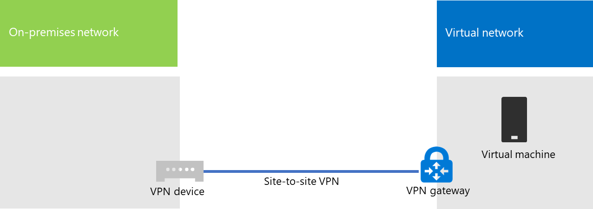
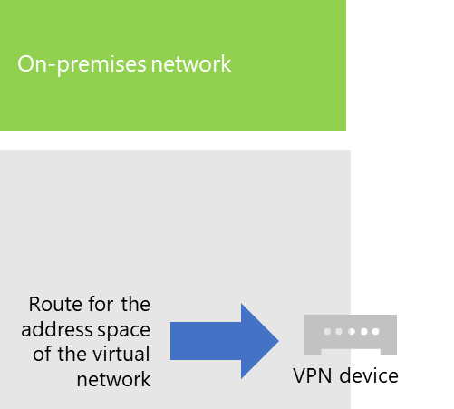
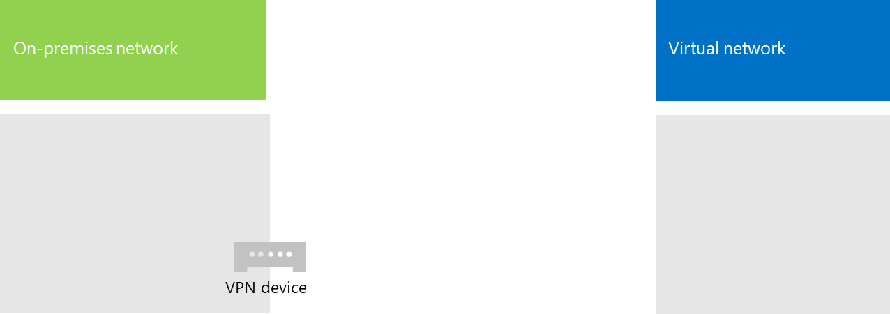
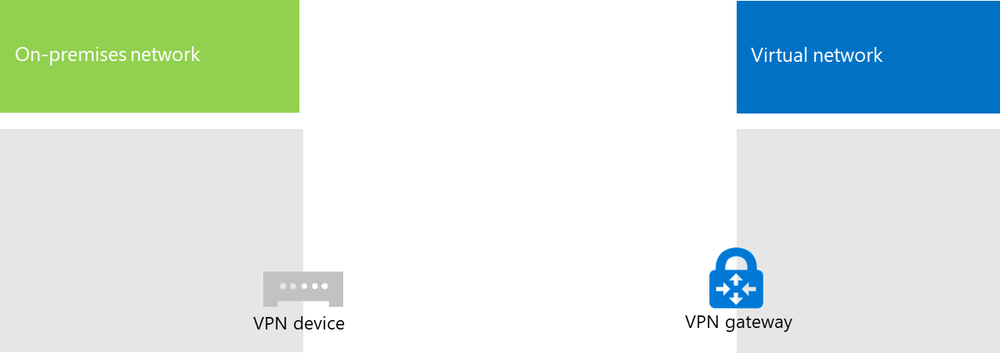
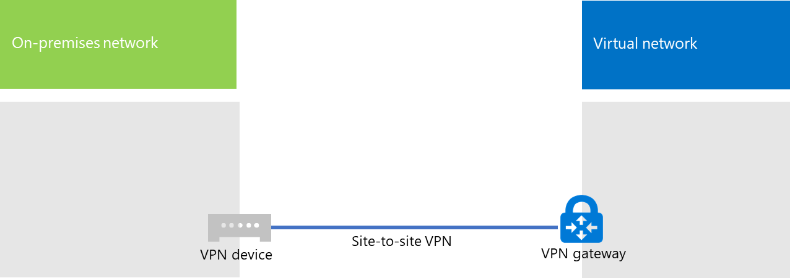

# Connect an on-premises network to a Microsoft Azure virtual network

A cross-premises Azure virtual network is connected to your on-premises network, extending your network to include subnets and virtual machines hosted in Azure infrastructure services. This connection lets computers on your on-premises network to directly access virtual machines in Azure and vice versa. 

For example, a directory synchronization server running on an Azure virtual machine needs to query your on-premises domain controllers for changes to accounts and synchronize those changes with your Microsoft 365 subscription. This article shows you how to set up a cross-premises Azure virtual network using a site-to-site virtual private network (VPN) connection that is ready to host Azure virtual machines.

## Configure a cross-premises Azure virtual network

Your virtual machines in Azure don't have to be isolated from your on-premises environment. To connect Azure virtual machines to your on-premises network resources, you must configure a cross-premises Azure virtual network. The following diagram shows the required components to deploy a cross-premises Azure virtual network with a virtual machine in Azure.
  

 
In the diagram, there are two networks connected by a site-to-site VPN connection: the on-premises network and the Azure virtual network. The site-to-site VPN connection is:

- Between two endpoints that are addressable and located on the public Internet.
- Terminated by a VPN device on the on-premises network and an Azure VPN gateway on the Azure virtual network.

The Azure virtual network hosts virtual machines. Network traffic originating from virtual machines on the Azure virtual network gets forwarded to the VPN gateway, which then forwards the traffic across the site-to-site VPN connection to the VPN device on the on-premises network. The routing infrastructure of the on-premises network then forwards the traffic to its destination.

>[!Note]
>You can also use [ExpressRoute](https://azure.microsoft.com/services/expressroute/), which is a direct connection between your organization and Microsoft's network. Traffic over ExpressRoute does not travel over the public Internet. This article does not describe the use of ExpressRoute.
>
  
To set up the VPN connection between your Azure virtual network and your on-premises network, follow these steps: 
  
1. **On-premises:** Define and create an on-premises network route for the address space of the Azure virtual network that points to your on-premises VPN device.
    
2. **Microsoft Azure:** Create an Azure virtual network with a site-to-site VPN connection. 
    
3. **On premises:** Configure your on-premises hardware or software VPN device to terminate the VPN connection, which uses Internet Protocol security (IPsec).
    
After you establish the site-to-site VPN connection, you add Azure virtual machines to the subnets of the virtual network.
  
## Plan your Azure virtual network
<a name="PlanningVirtual"></a>

### Prerequisites
<a name="Prerequisites"></a>

- An Azure subscription. For information about Azure subscriptions, go to the [How To Buy Azure page](https://azure.microsoft.com/pricing/purchase-options/).
    
- An available private IPv4 address space to assign to the virtual network and its subnets, with sufficient room for growth to accommodate the number of virtual machines needed now and in the future.
    
- An available VPN device in your on-premises network to terminate the site-to-site VPN connection that supports the requirements for IPsec. For more information, see [About VPN devices for site-to-site virtual network connections](/azure/vpn-gateway/vpn-gateway-about-vpn-devices).
    
- Changes to your routing infrastructure so that traffic routed to the address space of the Azure virtual network gets forwarded to the VPN device that hosts the site-to-site VPN connection.
    
- A web proxy that gives computers that are connected to the on-premises network and the Azure virtual network access to the Internet.
    
### Solution architecture design assumptions

The following list represents the design choices that have been made for this solution architecture. 
  
- This solution uses a single Azure virtual network with a site-to-site VPN connection. The Azure virtual network hosts a single subnet that can contain multiple virtual machines. 
    
- You can use the Routing and Remote Access Service (RRAS) in Windows Server 2016 or Windows Server 2012 to establish an IPsec site-to-site VPN connection between the on-premises network and the Azure virtual network. You can also use other options, such as Cisco or Juniper Networks VPN devices.
    
- The on-premises network might still have network services like Active Directory Domain Services (AD DS), Domain Name System (DNS), and proxy servers. Depending on your requirements, it might be beneficial to place some of these network resources in the Azure virtual network.
    
For an existing Azure virtual network with one or more subnets, determine whether there is remaining address space for an additional subnet to host your needed virtual machines, based on your requirements. If you don't have remaining address space for an additional subnet, create an additional virtual network that has its own site-to-site VPN connection.
  
### Plan the routing infrastructure changes for the Azure virtual network

You must configure your on-premises routing infrastructure to forward traffic destined for the address space of the Azure virtual network to the on-premises VPN device that is hosting the site-to-site VPN connection.
  
The exact method of updating your routing infrastructure depends on how you manage routing information, which can be:
  
- Routing table updates based on manual configuration.
    
- Routing table updates based on routing protocols, such as Routing Information Protocol (RIP) or Open Shortest Path First (OSPF).
    
Consult with your routing specialist to make sure that traffic destined for the Azure virtual network is forwarded to the on-premises VPN device.
  
### Plan for firewall rules for traffic to and from the on-premises VPN device

If your VPN device is on a perimeter network that has a firewall between the perimeter network and the Internet, you might have to configure the firewall for the following rules to allow the site-to-site VPN connection.
  
- Traffic to the VPN device (incoming from the Internet):
    
  - Destination IP address of the VPN device and IP protocol 50
    
  - Destination IP address of the VPN device and UDP destination port 500
    
  - Destination IP address of the VPN device and UDP destination port 4500
    
- Traffic from the VPN device (outgoing to the Internet):
    
  - Source IP address of the VPN device and IP protocol 50
    
  - Source IP address of the VPN device and UDP source port 500
    
  - Source IP address of the VPN device and UDP source port 4500
    
### Plan for the private IP address space of the Azure virtual network

The private IP address space of the Azure virtual network must be able to accommodate addresses used by Azure to host the virtual network and with at least one subnet that has enough addresses for your Azure virtual machines.
  
To determine the number of addresses needed for the subnet, count the number of virtual machines that you need now, estimate for future growth, and then use the following table to determine the size of the subnet.
  
|**Number of virtual machines needed**|**Number of host bits needed**|**Size of the subnet**|
|:-----|:-----|:-----|
|1-3  <br/> |3  <br/> |/29  <br/> |
|4-11  <br/> |4  <br/> |/28  <br/> |
|12-27  <br/> |5  <br/> |/27  <br/> |
|28-59  <br/> |6  <br/> |/26  <br/> |
|60-123  <br/> |7  <br/> |/25  <br/> |
   
### Planning worksheet for configuring your Azure virtual network
<a name="worksheet"> </a>

Before you create an Azure virtual network to host virtual machines, you must determine the settings needed in the following tables.
  
For the settings of the virtual network, fill in Table V.
  
 **Table V: Cross-premises virtual network configuration**
  
|**Item**|**Configuration element**|**Description**|**Value**|
|:-----|:-----|:-----|:-----|
|1.  <br/> |Virtual network name  <br/> |A name to assign to the Azure virtual network (example DirSyncNet).  <br/> | |
|2.  <br/> |Virtual network location  <br/> |The Azure datacenter that will contain the virtual network (such as West US).  <br/> |  <br/> |
|3.  <br/> |VPN device IP address  <br/> |The public IPv4 address of your VPN device's interface on the Internet. Work with your IT department to determine this address.  <br/> |  <br/> |
|4.  <br/> |Virtual network address space  <br/> |The address space (defined in a single private address prefix) for the virtual network. Work with your IT department to determine this address space. The address space should be in Classless Interdomain Routing (CIDR) format, also known as network prefix format. An example is 10.24.64.0/20.  <br/> | <br/> |
|5.  <br/> |IPsec shared key  <br/> |A 32-character random, alphanumeric string that will be used to authenticate both sides of the site-to-site VPN connection. Work with your IT or security department to determine this key value and then store it in a secure location. Alternately, see [Create a random string for an IPsec preshared key](https://social.technet.microsoft.com/wiki/contents/articles/32330.create-a-random-string-for-an-ipsec-preshared-key.aspx).  <br/> | <br/> |
   
Fill in Table S for the subnets of this solution.
  
- For the first subnet, determine a 28-bit address space (with a /28 prefix length) for the Azure gateway subnet. See [Calculating the gateway subnet address space for Azure virtual networks](/archive/blogs/solutions_advisory_board/calculating-the-gateway-subnet-address-space-for-azure-virtual-networks) for information about how to determine this address space.
    
- For the second subnet, specify a friendly name, a single IP address space based on the virtual network address space, and a descriptive purpose.
    
Work with your IT department to determine these address spaces from the virtual network address space. Both address spaces should be in CIDR format.
  
 **Table S: Subnets in the virtual network**
  
|**Item**|**Subnet name**|**Subnet address space**|**Purpose**|
|:-----|:-----|:-----|:-----|
|1.  <br/> |GatewaySubnet  <br/> |  <br/> |The subnet used by the Azure gateway.  <br/> |
|2.  <br/> |  <br/> |  <br/> |  <br/> |
   
For the on-premises DNS servers that you want the virtual machines in the virtual network to use, fill in Table D. Give each DNS server a friendly name and a single IP address. This friendly name does not need to match the host name or computer name of the DNS server. Note that two blank entries are listed, but you can add more. Work with your IT department to determine this list.
  
 **Table D: On-premises DNS servers**
  
|**Item**|**DNS server friendly name**|**DNS server IP address**|
|:-----|:-----|:-----|
|1.  <br/> |  <br/> |  <br/> |
|2.  <br/> |  <br/> |  <br/> |
   
To route packets from the Azure virtual network to your organization network across the site-to-site VPN connection, you must configure the virtual network with a local network. This local network has a list of the address spaces (in CIDR format) for all of the locations on your organization's on-premises network that the virtual machines in the virtual network must reach. This can be all of the locations on the on-premises network or a subset. The list of address spaces that define your local network must be unique and must not overlap with the address spaces used for this virtual network or your other cross-premises virtual networks.
  
For the set of local network address spaces, fill in Table L. Note that three blank entries are listed but you will typically need more. Work with your IT department to determine this list.
  
 **Table L: Address prefixes for the local network**
  
|**Item**|**Local network address space**|
|:-----|:-----|
|1.  <br/> |  <br/> |
|2.  <br/> |  <br/> |
|3.  <br/> |  <br/> |
   
## Deployment roadmap
<a name="DeploymentRoadmap"> </a>

Creating the cross-premises virtual network and adding virtual machines in Azure consists of three phases:
  
- Phase 1: Prepare your on-premises network.
    
- Phase 2: Create the cross-premises virtual network in Azure.
    
- Phase 3 (Optional): Add virtual machines.
    
### Phase 1: Prepare your on-premises network
<a name="Phase1"></a>

You must configure your on-premises network with a route that points to and ultimately delivers traffic destined for the address space of the virtual network to the router on the edge of the on-premises network. Consult with your network administrator to determine how to add the route to the routing infrastructure of your on-premises network.
  
Here is your resulting configuration.
  

  
### Phase 2: Create the cross-premises virtual network in Azure
<a name="Phase2"></a>

First, open an Azure PowerShell prompt. If you have not installed Azure PowerShell, see [Get started with Azure PowerShell](/powershell/azure/get-started-azureps).

 
Next, login to your Azure account with this command.
  
```powershell
Connect-AzAccount
```

Get your subscription name using the following command.
  
```powershell
Get-AzSubscription | Sort SubscriptionName | Select SubscriptionName
```

Set your Azure subscription with these commands. Replace everything within the quotes, including the < and > characters, with the correct subscription name.
  
```powershell
$subscrName="<subscription name>"
Select-AzSubscription -SubscriptionName $subscrName
```

Next, create a new resource group for your virtual network. To determine a unique resource group name, use this command to list your existing resource groups.
  
```powershell
Get-AzResourceGroup | Sort ResourceGroupName | Select ResourceGroupName
```

Create your new resource group with these commands.
  
```powershell
$rgName="<resource group name>"
$locName="<Table V - Item 2 - Value column>"
New-AzResourceGroup -Name $rgName -Location $locName
```

Next, you create the Azure virtual network.
  
```powershell
# Fill in the variables from previous values and from Tables V, S, and D
$rgName="<name of your new resource group>"
$locName="<Azure location of your new resource group>"
$vnetName="<Table V - Item 1 - Value column>"
$vnetAddrPrefix="<Table V - Item 4 - Value column>"
$gwSubnetPrefix="<Table S - Item 1 - Subnet address space column>"
$SubnetName="<Table S - Item 2 - Subnet name column>"
$SubnetPrefix="<Table S - Item 2 - Subnet address space column>"
$dnsServers=@( "<Table D - Item 1 - DNS server IP address column>", "<Table D - Item 2 - DNS server IP address column>" )
$locShortName=(Get-AzResourceGroup -Name $rgName).Location

# Create the Azure virtual network and a network security group that allows incoming remote desktop connections to the subnet that is hosting virtual machines
$gatewaySubnet=New-AzVirtualNetworkSubnetConfig -Name "GatewaySubnet" -AddressPrefix $gwSubnetPrefix
$vmSubnet=New-AzVirtualNetworkSubnetConfig -Name $SubnetName -AddressPrefix $SubnetPrefix
New-AzVirtualNetwork -Name $vnetName -ResourceGroupName $rgName -Location $locName -AddressPrefix $vnetAddrPrefix -Subnet $gatewaySubnet,$vmSubnet -DNSServer $dnsServers
$rule1=New-AzNetworkSecurityRuleConfig -Name "RDPTraffic" -Description "Allow RDP to all VMs on the subnet" -Access Allow -Protocol Tcp -Direction Inbound -Priority 100 -SourceAddressPrefix Internet -SourcePortRange * -DestinationAddressPrefix * -DestinationPortRange 3389
New-AzNetworkSecurityGroup -Name $SubnetName -ResourceGroupName $rgName -Location $locShortName -SecurityRules $rule1
$vnet=Get-AzVirtualNetwork -ResourceGroupName $rgName -Name $vnetName
$nsg=Get-AzNetworkSecurityGroup -Name $SubnetName -ResourceGroupName $rgName
Set-AzVirtualNetworkSubnetConfig -VirtualNetwork $vnet -Name $SubnetName -AddressPrefix $SubnetPrefix -NetworkSecurityGroup $nsg
$vnet | Set-AzVirtualNetwork
```

Here is your resulting configuration.
  

  
Next, use these commands to create the gateways for the site-to-site VPN connection.
  
```powershell
# Fill in the variables from previous values and from Tables V and L
$vnetName="<Table V - Item 1 - Value column>"
$localGatewayIP="<Table V - Item 3 - Value column>"
$localNetworkPrefix=@( <comma-separated, double-quote enclosed list of the local network address prefixes from Table L, example: "10.1.0.0/24", "10.2.0.0/24"> )
$vnetConnectionKey="<Table V - Item 5 - Value column>"
$vnet=Get-AzVirtualNetwork -Name $vnetName -ResourceGroupName $rgName
# Attach a virtual network gateway to a public IP address and the gateway subnet
$publicGatewayVipName="PublicIPAddress"
$vnetGatewayIpConfigName="PublicIPConfig"
New-AzPublicIpAddress -Name $vnetGatewayIpConfigName -ResourceGroupName $rgName -Location $locName -AllocationMethod Dynamic
$publicGatewayVip=Get-AzPublicIpAddress -Name $vnetGatewayIpConfigName -ResourceGroupName $rgName
$vnetGatewayIpConfig=New-AzVirtualNetworkGatewayIpConfig -Name $vnetGatewayIpConfigName -PublicIpAddressId $publicGatewayVip.Id -SubnetId $vnet.Subnets[0].Id
# Create the Azure gateway
$vnetGatewayName="AzureGateway"
$vnetGateway=New-AzVirtualNetworkGateway -Name $vnetGatewayName -ResourceGroupName $rgName -Location $locName -GatewayType Vpn -VpnType RouteBased -IpConfigurations $vnetGatewayIpConfig
# Create the gateway for the local network
$localGatewayName="LocalNetGateway"
$localGateway=New-AzLocalNetworkGateway -Name $localGatewayName -ResourceGroupName $rgName -Location $locName -GatewayIpAddress $localGatewayIP -AddressPrefix $localNetworkPrefix
# Create the Azure virtual network VPN connection
$vnetConnectionName="S2SConnection"
$vnetConnection=New-AzVirtualNetworkGatewayConnection -Name $vnetConnectionName -ResourceGroupName $rgName -Location $locName -ConnectionType IPsec -SharedKey $vnetConnectionKey -VirtualNetworkGateway1 $vnetGateway -LocalNetworkGateway2 $localGateway
```

Here is your resulting configuration.
  

  
Next, configure your on-premises VPN device to connect to the Azure VPN gateway. For more information, see [About VPN Devices for site-to-site Azure Virtual Network connections](/azure/vpn-gateway/vpn-gateway-about-vpn-devices).
  
To configure your VPN device, you will need the following:
  
- The public IPv4 address of the Azure VPN gateway for your virtual network. Use the **Get-AzPublicIpAddress -Name $vnetGatewayIpConfigName -ResourceGroupName $rgName** command to display this address.
    
- The IPsec pre-shared key for the site-to-site VPN connection (Table V- Item 5 - Value column).
    
Here is your resulting configuration.
  

  
### Phase 3 (Optional): Add virtual machines

Create the virtual machines you need in Azure. For more information, see [Create a Windows virtual machine with the Azure portal](https://go.microsoft.com/fwlink/p/?LinkId=393098).
  
Use the following settings:
  
- On the **Basics** tab, select the same subscription and resource group as your virtual network. You will need these later to sign in to the virtual machine. In the **Instance details** section, choose the appropriate virtual machine size. Record the administrator account user name and password in a secure location. 
    
- On the **Networking** tab, select the name of your virtual network and the subnet for hosting virtual machines (not the GatewaySubnet). Leave all other settings at their default values.
    
Verify that your virtual machine is using DNS correctly by checking your internal DNS to ensure that Address (A) records were added for you new virtual machine. To access the Internet, your Azure virtual machines must be configured to use your on-premises network's proxy server. Contact your network administrator for additional configuration steps to perform on the server.
  
Here is your resulting configuration.
  

  
## Next step
  
[Deploy Microsoft 365 Directory Synchronization in Microsoft Azure](deploy-microsoft-365-directory-synchronization-dirsync-in-microsoft-azure.md)