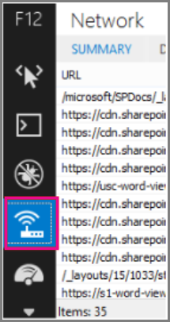
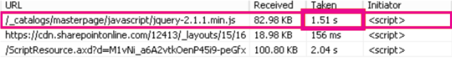
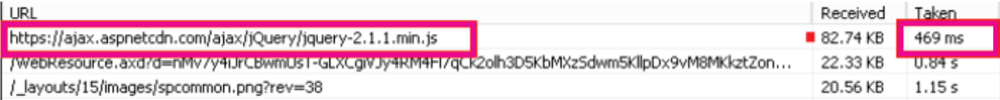

# Content Delivery Networks (CDNs)

*This article applies to Microsoft 365 Enterprise.*

CDNs help keep Microsoft 365 fast and reliable for end users. Cloud services like Microsoft 365 use CDNs to cache static assets closer to the browsers requesting them to speed up downloads and reduce perceived end user latency. The information in this article will help you learn about Content Delivery Networks (CDNs) and how they're used by Microsoft 365.

## What exactly is a CDN?

A CDN is a geographically distributed network consisting of proxy and file servers in datacenters connected by high-speed backbone networks. CDNs are used to reduce latency and load times for a specified set of files and objects in a web site or service. A CDN may have many thousands of endpoints for optimal servicing of incoming requests from any location.

CDNs are commonly used to provide faster downloads of generic content for a web site or service such as JavaScript files, icons and images, and can also provide private access to user content such as files in SharePoint document libraries, streaming media files, and custom code.

CDNs are used by most enterprise cloud services. Cloud services like Microsoft 365 have millions of customers downloading a mix of proprietary content (such as emails) and generic content (such as icons) at one time. It's more efficient to put images everyone uses, like icons, as close to the user's computer as possible. It isn't practical for every cloud service to build CDN datacenters that store this generic content in every metropolitan area, or even in every major Internet hub around the world, so some of these CDNs are shared.

## How do CDNs make services work faster?

Downloading common objects like site images and icons over and over again can take up network bandwidth that can be better used for downloading important personal content, like email or documents. Because Microsoft 365 uses an architecture that includes CDNs, the icons, scripts, and other generic content can be downloaded from servers closer to client computers, making the downloads faster. This means faster access to your personal content, which is securely stored in Microsoft 365 datacenters.

CDNs help to improve cloud service performance in several ways:

- CDNs shift part of the network and file download burden away from the cloud service, freeing up cloud service resources for serving user content and other services by reducing the need to serve requests for static assets.
- CDNs are purpose built to provide low-latency file access by implementing high performance networks and file servers, and by leveraging updated network protocols such as [HTTP/2](https://en.wikipedia.org/wiki/HTTP/2) with highly efficient compression and request multiplexing.
- CDN networks use many globally distributed endpoints to make content available as close as possible to users.

## The Microsoft 365 CDN

The built-in Microsoft 365 Content Delivery Network (CDN) allows Microsoft 365 administrators to provide better performance for their organization's SharePoint in Microsoft 365 pages by caching static assets closer to the browsers requesting them, which helps to speed up downloads and reduce latency. The Microsoft 365 CDN uses the [HTTP/2 protocol](https://en.wikipedia.org/wiki/HTTP/2) for improved compression and download speeds.

> [!NOTE]
> The Microsoft 365 CDN is only available to tenants in the **Production** (worldwide) cloud. Tenants in the US Government, China and Germany clouds do not currently support the Microsoft 365 CDN.

The Microsoft 365 CDN is composed of multiple CDNs that allow you to host static assets in multiple locations, or _origins_, and serve them from global high-speed networks. Depending on the kind of content you want to host in the Microsoft 365 CDN, you can add **public** origins, **private** origins or both.


Content in **public** origins within the Microsoft 365 CDN is accessible anonymously, and can be accessed by anyone who has URLs to hosted assets. Because access to content in public origins is anonymous, you should only use them to cache non-sensitive generic content such as JavaScript files, scripts, icons and images. The Microsoft 365 CDN is used by default for downloading generic resource assets like the Microsoft 365 client applications from a public origin.

**Private** origins within the Microsoft 365 CDN provide private access to user content such as SharePoint document libraries, sites and proprietary images. Access to content in private origins is secured with dynamically generated tokens so it can only be accessed by users with permissions to the original document library or storage location. Private origins in the Microsoft 365 CDN can only be used for SharePoint content, and you can only access assets through redirection from your SharePoint tenant.

The Microsoft 365 CDN service is included as part of your SharePoint subscription.

For more information about how to use the Microsoft 365 CDN, see [Use the Microsoft 365 content delivery network with SharePoint](use-microsoft-365-cdn-with-spo.md).

To watch a series of short videos that provide conceptual and HOWTO information about using the Microsoft 365 CDN, visit the [SharePoint Developer Patterns and Practices YouTube channel](https://aka.ms/sppnp-videos).

## Other Microsoft CDNs

Although not a part of the Microsoft 365 CDN, you can use these CDNs in your Microsoft 365 tenant for access to SharePoint development libraries, custom code and other purposes that fall outside the scope of the Microsoft 365 CDN.

### Azure CDN

>[!NOTE]
>Beginning in Q3 2020, SharePoint will begin caching videos on the Azure CDN to support improved video playback and reliability. Popular videos will be streamed from the CDN endpoint closest to the user. This data will remain within the Microsoft Purview boundary. This is a free service for all tenants and it does not require any customer action to configure.

You can use the **Azure CDN** to deploy your own CDN instance for hosting custom web parts, libraries and other resource assets, which allows you to apply access keys to your CDN storage and exert greater control over your CDN configuration. Use of the Azure CDN isn't free, and requires an Azure subscription.

For more information on how to configure an Azure CDN instance, see [Quickstart: Integrate an Azure storage account with Azure CDN](/azure/cdn/cdn-create-a-storage-account-with-cdn).

For an example of how the Azure CDN can be used to host SharePoint web parts, see [Deploy your SharePoint client-side web part to Azure CDN](/sharepoint/dev/spfx/web-parts/get-started/deploy-web-part-to-cdn).

For information about the Azure CDN PowerShell module, see [Manage Azure CDN with PowerShell](/azure/cdn/cdn-manage-powershell).

### Microsoft Ajax CDN

Microsoft's **Ajax CDN** is a read-only CDN that offers many popular development libraries including jQuery (and all of its other libraries), ASP.NET Ajax, Bootstrap, Knockout.js, and others.
  
To include these scripts in your project, simply replace any references to these publicly available libraries with references to the CDN address instead of including it in your project itself. For example, use the following code to link to jQuery:

``` html
<script src=https://ajax.aspnetcdn.com/ajax/jquery-2.1.1.js> </script>
```

For more information about how to use the Microsoft Ajax CDN, see [Microsoft Ajax CDN](/aspnet/ajax/cdn/overview).

## How does Microsoft 365 use content from a CDN?

Regardless of what CDN you configure for your Microsoft 365 tenant, the basic data retrieval process is the same.

1. Your client (a browser or Office client application) requests data from Microsoft 365.

2. Microsoft 365 either returns the data directly to your client or, if the data is part of a set of content hosted by the CDN, redirects your client to the CDN URL.

    a. If the data is already cached in a _public_ origin, your client downloads the data directly from the nearest CDN location to your client.

    b. If the data is already cached in a _private_ origin, the CDN service checks your Microsoft 365 user account's permissions on the origin. If you have permissions, SharePoint dynamically generates a custom URL composed of the path to the asset in the CDN and two access tokens, and returns the custom URL to your client. Your client then downloads the data directly from the nearest CDN location to your client using the custom URL.

3. If the data isn't cached at the CDN, the CDN node requests the data from Microsoft 365 and then caches the data for time after your client downloads the data.

The CDN figures out the closest datacenter to the user's browser and, using redirection, downloads the requested data from there. CDN redirection is quick, and can save users a lot of download time.

## How should I set up my network so that CDNs work best with Microsoft 365?

Minimizing latency between clients on your network and CDN endpoints is the key consideration for ensuring optimal performance. You can use the best practices outlined in [Managing Microsoft 365 endpoints](managing-office-365-endpoints.md) to ensure that your network configuration permits client browsers to access the CDN directly rather than routing CDN traffic through central proxies to avoid introducing unnecessary latency.

You can also read [Microsoft 365 Network Connectivity Principles](./microsoft-365-network-connectivity-principles.md) to understand the concepts behind optimizing Microsoft 365 network performance.

## Is there a list of all the CDNs that Microsoft 365 uses?

The CDNs in use by Microsoft 365 are always subject to change and in many cases there are multiple CDN partners configured in the event one is unavailable. The primary CDNs used by Microsoft 365 are:

|CDN  |Company  |Usage  |Link  |
|---------|---------|---------|---------|
|Microsoft 365 CDN     |Microsoft Azure         |Generic assets in public origins, SharePoint user content in private origins         |[Microsoft Azure CDN](/azure/frontdoor/)         |
|Azure CDN     |Microsoft         |Custom code, SharePoint Framework solutions         |[Microsoft Azure CDN](/azure/frontdoor/)         |
|Microsoft Ajax CDN (read only)     |Microsoft         |Common libraries for Ajax, jQuery, ASP.NET, Bootstrap, Knockout.js etc.         |[Microsoft Ajax CDN](/aspnet/ajax/cdn/overview)         |

## What performance gains does a CDN provide?

There are many factors involved in measuring specific differences in performance between data downloaded directly from Microsoft 365 and data downloaded from a specific CDN, such as your location relative to your tenant and to the nearest CDN endpoint, the number of assets on a page that are served by the CDN, and transient changes in network latency and bandwidth. However, a simple A/B test can help to show the difference in download time for a specific file.

The following screenshots illustrate the difference in download speed between the native file location in Microsoft 365 and the same file hosted on the [Microsoft Ajax Content Delivery Network](/aspnet/ajax/cdn/overview). These screenshots are from the **Network** tab in the Internet Explorer 11 developer tools. These screenshots show the latency on the popular library jQuery. To bring up this screen, in Internet Explorer, press **F12** and select the **Network** tab, which is symbolized with a Wi-Fi icon.
  

  
This screenshot shows the library uploaded to the master page gallery on the SharePoint site itself. The time it took to upload the library is 1.51 seconds.
  

  
The second screenshot shows the same file delivered by Microsoft's CDN. This time the latency is around 496 milliseconds. This is a large improvement and shows that a whole second is shaved off the total time to download the object.
  


## Is my data safe?

We take great care to protect the data that runs your business. Data stored in the Microsoft 365 CDN is encrypted both in transit and at rest, and access to data in the Microsoft 365 SharePoint CDN is secured by Microsoft 365 user permissions and token authorization. Requests for data in the Microsoft 365 SharePoint CDN must be referred (redirected) from your Microsoft 365 tenant or an authorization token won't be generated.

To ensure that your data remains secure, we recommend that you never store user content or other sensitive data in a public CDN. Because access to data in a public CDN is anonymous, public CDNs should only be used to host generic content such as web script files, icons, images and other non-sensitive assets.

> [!NOTE]
> 3rd party CDN providers may have privacy and compliance standards that differ from the commitments outlined by the Microsoft 365 Trust Center. Data cached through the CDN service may not conform to the Microsoft Data Processing Terms (DPT), and may be outside of the Microsoft 365 Trust Center compliance boundaries.

For in-depth information about privacy and data protection for Microsoft 365 CDN providers, visit the following:  

- Learn more about Microsoft 365 privacy and data protection at the [Microsoft Trust Center](https://www.microsoft.com/trustcenter)
- Learn more about Akamai's privacy and data protection at the [Akamai Privacy Trust Center](https://www.akamai.com/us/en/about/compliance/data-protection-at-akamai.jsp)
- Learn more about Azure privacy and data protection at the [Azure Trust Center](https://azure.microsoft.com/overview/trusted-cloud/)

## How can I secure my network with all these 3rd party services?

Using an extensive set of partner services allows Microsoft 365 to scale and meet availability requirements and enhance the user experience when using Microsoft 365. The 3rd party services Microsoft 365 leverages include both certificate revocation lists; such as crl.microsoft.com or sa.symcb.com, and CDNs; such as r3.res.outlook.com. Every CDN FQDN generated by Microsoft 365 is a custom FQDN for Microsoft 365. If you're sent to a FQDN at the request of Microsoft 365, you can be assured that the CDN provider controls the FQDN and the underlying content at that location.
  
For customers that want to segregate requests destined for a Microsoft 365 datacenter from requests that are destined for a 3rd party, we've written up guidance on [Managing Microsoft 365 endpoints](https://support.office.com/article/99cab9d4-ef59-4207-9f2b-3728eb46bf9a).

## Is there a list of all the FQDNs that leverage CDNs?

The list of FQDNs and how they leverage CDNs change over time. Refer to our published [Microsoft 365 URLs and IP address ranges](./urls-and-ip-address-ranges.md) page to get up to date on the latest FQDNs that leverage CDNs.

You can also use the [Microsoft 365 IP Address and URL Web service](microsoft-365-ip-web-service.md) to request the current Microsoft 365 URLs and IP address ranges formatted as CSV or JSON.

## Can I use my own CDN and cache content on my local network?

We're continually looking for new ways to support our customers' needs and are currently exploring the use of caching proxy solutions and other on-premises CDN solutions.

Although it isn't a part of the Microsoft 365 CDN, you can also use the **Azure CDN** for hosting custom web parts, libraries and other resource assets, which allows you to apply access keys to your CDN storage and exert greater control over your CDN configuration. Use of the Azure CDN isn't free, and requires an Azure subscription. For more information on how to configure an Azure CDN instance, see [Quickstart: Integrate an Azure storage account with Azure CDN](/azure/cdn/cdn-create-a-storage-account-with-cdn).

## I'm using Azure ExpressRoute for Microsoft 365, does that change things?

[Azure ExpressRoute for Microsoft 365](azure-expressroute.md) provides a dedicated connection to Microsoft 365 infrastructure that is segregated from the public internet. This means that clients will still need to connect over non-ExpressRoute connections to connect to CDNs and other Microsoft infrastructure that isn't explicitly included in the list of services supported by ExpressRoute. For more information about how to route specific traffic such as requests destined for CDNs, see [Implementing ExpressRoute for Microsoft 365](azure-expressroute.md).

## Can I use CDNs with SharePoint Server on-premises?

Using CDNs only makes sense in a SharePoint in Microsoft 365 context and should be avoided with SharePoint Server. This is because all of the advantages around geographic location don't hold true if the server is located on-premises or geographically close anyway. Additionally, if there's a network connection to the servers where it's hosted, then the site may be used without an Internet connection and therefore can't retrieve the CDN files. Otherwise, you should use a CDN if there's one available and stable for the library and files you need for your site.
  
## See also

[Microsoft 365 Network Connectivity Principles](./microsoft-365-network-connectivity-principles.md)

[Assessing Microsoft 365 network connectivity](assessing-network-connectivity.md)

[Managing Microsoft 365 endpoints](managing-office-365-endpoints.md)

[Microsoft 365 URLs and IP address ranges](./urls-and-ip-address-ranges.md)

[Use the Microsoft 365 content delivery network with SharePoint](use-microsoft-365-cdn-with-spo.md)

[Microsoft Trust Center](https://www.microsoft.com/trustcenter)
