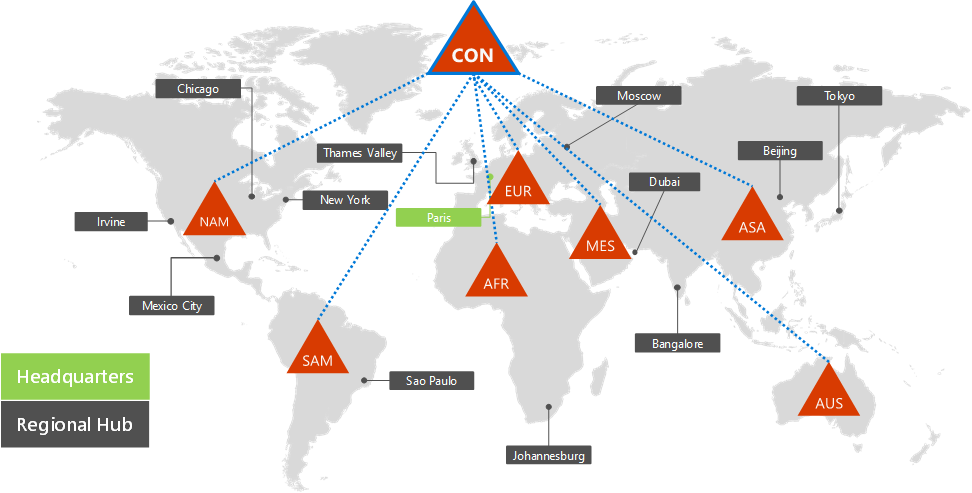
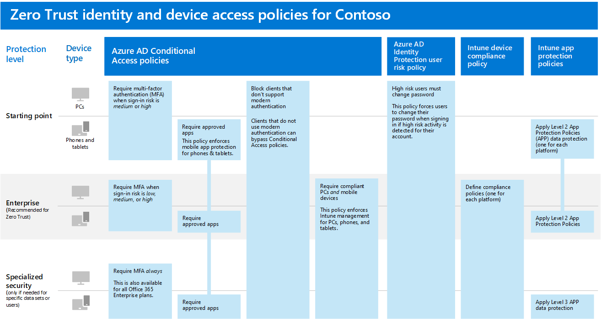

# Identity for the Contoso Corporation

Microsoft provides an Identity as a Service (IDaaS) across its cloud offerings with Azure Active Directory (Azure AD). To adopt Microsoft 365 Enterprise, Contoso's IDaaS solution had to leverage their on-premises identity provider and still include federated authentication with their existing trusted, third-party identity providers.

## Contoso's Active Directory Domain Services forest

Contoso uses a single Active Directory Domain Services (AD DS) forest for contoso.com with seven sub-domains, one for each region of the world. The headquarters, regional hub offices, and satellite offices contain domain controllers for local authentication and authorization.

Here is the Contoso forest with regional domains for the different parts of the world that contain regional hubs.

 
Contoso wanted to use the accounts and groups in the contoso.com forest for authentication and authorization for its Microsoft 365 workloads and services.

## Contoso's federated authentication infrastructure

Contoso allows:

- Customers to use their Microsoft, Facebook, or Google Mail accounts to sign in to their public web site.
- Vendors and partners to use their LinkedIn, Salesforce, or Google Mail accounts to sign in to the partner extranet.

Here is the Contoso DMZ containing a public web site, a partner extranet, and a set of Active Directory Federation Services (AD FS) servers. The DMZ is connected to the Internet that contains customers, partners, and Internet services.

 
AD FS servers in the DMZ facilitate the authentication of customer credentials by their identity providers for access to the public web site and partner credentials for access to the partner extranet.

Contoso decided to keep this infrastructure and dedicate it to customer and partner authentications. Contoso identity architects are investigating the conversion of this infrastructure to Azure AD [B2B](https://docs.microsoft.com/azure/active-directory/b2b/hybrid-organizations) and [B2C](https://docs.microsoft.com/azure/active-directory-b2c/solution-articles) solutions.

## Hybrid identity with password hash synchronization for cloud-based authentication

Contoso wanted to leverage its on-premises AD DS forest for authentication to Microsoft 365 cloud resources. It decided on password hash synchronization (PHS).

PHS synchronizes the on-premises AD DS forest with the Azure AD tenant of their Microsoft 365 Enterprise subscription, copying user and group accounts and a hashed version of user account passwords. 

To perform the ongoing directory synchronization, Contoso has deployed the Azure AD Connect tool on a server in its Paris datacenter. 

Here is the server running Azure AD Connect polling the Contoso AD DS forest for changes and then synchronizing those changes with the Azure AD tenant.

 
## Conditional Access policies for identity and device access

Contoso created a set of Azure AD and Intune [Conditional Access policies](identity-access-policies.md) for three protection levels:

- **Baseline** protections apply to all user accounts
- **Sensitive** protections apply to senior leadership and executive staff
- **Highly Regulated** protections apply to specific users in the finance, legal, and research departments that have access to highly regulated data

Here is Contoso's resulting set of identity and device Conditional Access policies.

 
## Next step

[Learn](contoso-win10.md) how Contoso is leveraging its Microsoft Endpoint Configuration Manager infrastructure to deploy and keep current Windows 10 Enterprise across its organization.

## See also

[Identity for Microsoft 365 Enterprise](identity-infrastructure.md)

[Deployment guide](deploy-microsoft-365-enterprise.md)

[Test lab guides](m365-enterprise-test-lab-guides.md)
