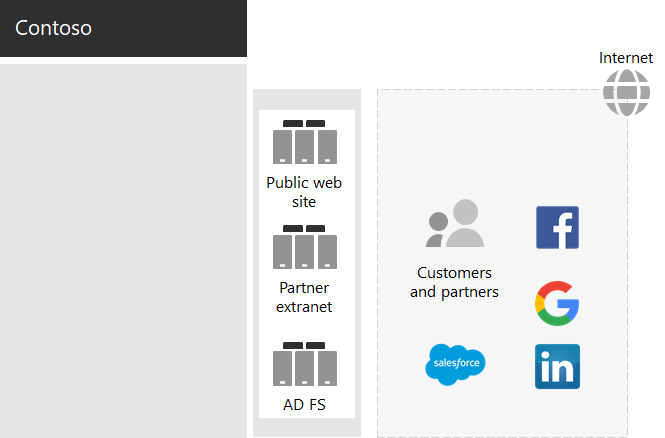
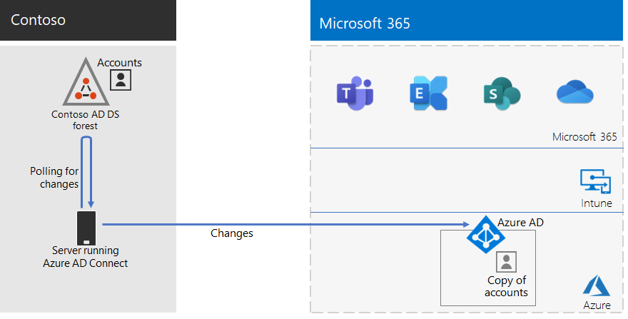

# Identity for the Contoso Corporation

Microsoft provides Identity as a Service (IDaaS) across its cloud offerings through Microsoft Entra ID. To adopt Microsoft 365 for enterprise, the Contoso IDaaS solution had to use their on-premises identity provider and include federated authentication with their existing trusted, third-party identity providers.

## The Contoso Active Directory Domain Services forest

Contoso uses a single Active Directory Domain Services (AD DS) forest for contoso\.com with seven subdomains, one for each region of the world. The headquarters, regional hub offices, and satellite offices contain domain controllers for local authentication and authorization.

Here's the Contoso forest with regional domains for the different parts of the world that contain regional hubs.

:::image type="content" alt-text="Contoso's forest and domains worldwide." source="../media/contoso-identity/contoso-identity-fig1.png" lightbox="../media/contoso-identity/contoso-identity-fig1.png":::

Contoso decided to use the accounts and groups in the contoso\.com forest for authentication and authorization for its Microsoft 365 workloads and services.

## The Contoso federated authentication infrastructure

Contoso allows:

- Customers to use their Microsoft, Facebook, or Google Mail accounts to sign in to the company's public web site.
- Vendors and partners to use their LinkedIn, Salesforce, or Google Mail accounts to sign in to the company's partner extranet.

Here's the Contoso DMZ containing a public web site, a partner extranet, and a set of Active Directory Federation Services (AD FS) servers. The DMZ is connected to the internet that contains customers, partners, and internet services.

AD FS servers in the DMZ facilitate authentication of customer credentials by their identity providers for access to the public web site and partner credentials for access to the partner extranet.

Contoso decided to keep this infrastructure and dedicate it to customer and partner authentication. Contoso identity architects are investigating the conversion of this infrastructure to Microsoft Entra [B2B](/azure/active-directory/b2b/hybrid-organizations) and [B2C](/azure/active-directory-b2c/solution-articles) solutions.

## Hybrid identity with password hash synchronization for cloud-based authentication

Contoso wanted to use its on-premises AD DS forest for authentication to Microsoft 365 cloud resources. It decided to use password hash synchronization (PHS).

PHS synchronizes the on-premises AD DS forest with the Microsoft Entra tenant of their Microsoft 365 for enterprise subscription, copying user and group accounts and a hashed version of user account passwords.

To do directory synchronization, Contoso deployed the Microsoft Entra Connect tool on a server in its Paris datacenter.

Here's the server running Microsoft Entra Connect polling the Contoso AD DS forest for changes and then synchronizing those changes with the Microsoft Entra tenant.

## Conditional Access policies for Zero Trust identity and device access

Contoso created a set of Microsoft Entra ID and Intune [Conditional Access policies](../security/office-365-security/zero-trust-identity-device-access-policies-common.md) for three protection levels:

- *Starting point* protections apply to all user accounts.
- *Enterprise* protections apply to senior leadership and executive staff.
- *Specialized security* protections apply to specific users in the finance, legal, and research departments who have access to highly regulated data.

Here's the resulting set of Contoso identity and device Conditional Access policies.

:::image type="content" alt-text="Contoso’s identity and device Conditional Access policies." source="../media/contoso-identity/contoso-identity-fig5.png" lightbox="../media/contoso-identity/contoso-identity-fig5.png":::

## Next step

Learn how Contoso uses its Microsoft Endpoint Configuration Manager infrastructure to [deploy and keep current Windows 11 Enterprise](contoso-win10.md) across its organization.

## See also

[Deploy identity for Microsoft 365](deploy-identity-solution-overview.md)

[Microsoft 365 for enterprise overview](microsoft-365-overview.md)
