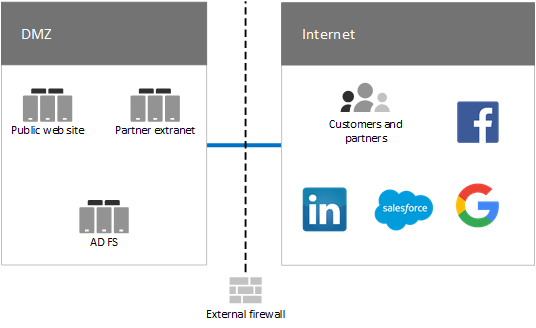
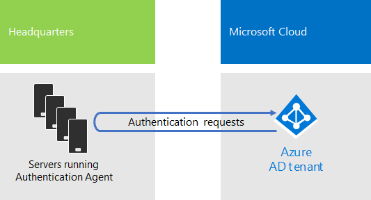
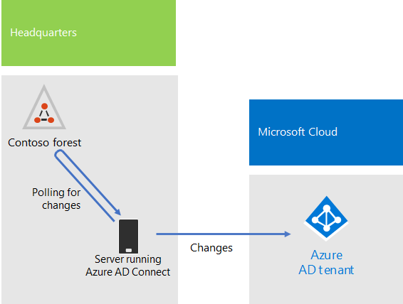
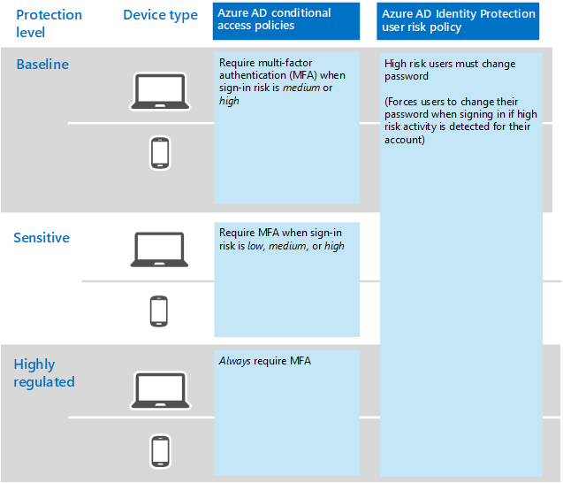

# Identity for the Contoso Corporation

**Summary:** How Contoso takes advantage of Identity as a Service (IDaaS) and provides cloud-based authentication for its employees and federated authentication for its partners and customers.

Microsoft provides an Identity as a Service (IDaaS) across its cloud offerings with Azure Active Directory (AD). To adopt Microsoft 365 Enterprise, Contoso's IDaaS solution had to leverage their on-premises identity provider and still include federated authentication with their existing trusted, third-party identity providers.

## Contoso's Windows Server AD forest

Contoso uses a single Windows Server Active Directory (AD) forest for contoso.com with seven sub-domains, one for each region of the world. The headquarters, regional hub offices, and satellite offices contain domain controllers for local authentication and authorization.

Figure 1 shows the Contoso forest with regional domains for the different parts of the world that contain regional hubs.

 
**Figure 1: Contoso's forest and domains worldwide**

Contoso wants to use the accounts and groups in the contoso.com forest for authentication and authorization for its cloud-based apps and workloads.

## Contoso's federated authentication infrastructure

Contoso allows:

- Customers to use their Microsoft, Facebook, or Google Mail accounts to sign in to their public web site.
- Vendors and partners to use their LinkedIn, Salesforce, or Google Mail accounts to sign in to the partner extranet.

Figure 2 shows the Contoso DMZ containing a public web site, a partner extranet, and a set of Active Directory Federation Services (AD FS) servers. The DMZ is connected to the Internet that contains customers, partners, and Internet services.

**Figure 2: Contoso's support for federated authentication for customers and partners**
 
AD FS servers in the DMZ authenticate customer credentials for access to the public web site and partner credentials for access to the partner extranet.

Contoso decided to keep this infrastructure and dedicate it to customer and partner authentications. Contoso identity engineers are investigating the conversion of this infrastructure to Azure AD [B2B](https://docs.microsoft.com/azure/active-directory/b2b/hybrid-organizations) and [B2C](https://docs.microsoft.com/azure/active-directory-b2c/solution-articles) solutions.

## Hybrid identity with pass-through authentication for cloud-based authentication

Contoso wanted to leverage its on-premises Windows Server AD forest for authentication to Microsoft 365 cloud resources. It decided on pass-through authentication (PTA) with password hash synchronization (PHS).

### PTA authentication

For authentication of user credentials, Contoso is using PTA. When a Contoso user accesses a cloud-based resources, the credentials it sends are passed by Azure AD to a server running an Authentication Agent in the Contoso headquarters datacenter. One of these Authentication Agent servers validates the user credentials on behalf of Azure AD.

Figure 3 shows a set of servers in the Contoso headquarters running the Authentication Agent, which process authentication requests passed to it from Azure AD. 

 
**Figure 3: Contoso's pass-through authentication infrastructure**

Contoso chose PTA to fulfill its security requirement that all authentication attempts be evaluated for immediate changes to user account states, password policies, and sign-in hours made to the on-premises Windows Server AD forest.

### PWS

PWS synchronizes the on-premises Windows Server AD forest with the Azure AD tenant of their Microsoft 365 Enterprise subscription, copying user and group accounts and a hashed version of user account passwords. Contoso decided on PWS to provide an alternate method of authentication directly with the Azure AD tenant in the event that PTA is not available.

To perform the ongoing directory synchronization, Contoso has deployed the Azure AD Connect tool on a server in its Paris datacenter. Figure 4 shows the server running Azure AD Connect polling the Contoso Windows Server AD forest for changes and then synchronizing those changes with the Azure AD tenant.

 
**Figure 4: Contoso's PWH directory synchronization infrastructure**

## Conditional access policies for identity

Contoso created a set of Azure AD [conditional access policies](identity-access-policies.md) to ensure that multi-factor authentication and password changes are enforced when Azure AD determines there is sign-in risk for an authentication request.

Figure 5 shows their resulting set of conditional access policies for identity.

 
**Figure 5: Contoso’s identity-based conditional access policies**

## Next step

[Learn](contoso-win10.md) how Contoso is leveraging its System Center Configuration Manager infrastructure to deploy and keep current Windows 10 Enterprise across its organization.

## See also

[Identity for Microsoft 365 Enterprise](identity-infrastructure.md)

[Deployment guide](deploy-microsoft-365-enterprise.md)

[Test lab guides](m365-enterprise-test-lab-guides.md)
