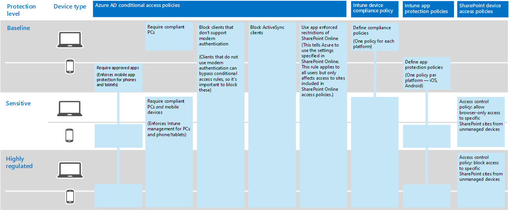

# Information protection for the Contoso Corporation

Contoso is serious about their information security and protection. For example, leakage or destruction of their intellectual property describing product designs and proprietary manufacturing techniques would place them at a competitive disadvantage.

Before moving their sensitive and most valuable digital assets to the cloud, they made sure that their on-premises information classification and protection requirements were supported and implemented in the cloud-based services of Microsoft 365 Enterprise.

## Contoso's data security classification

Contoso performed an analysis of their data and determined the following levels.

||||
|:-------|:-----|:-----|
| **Level 1: Baseline** | **Level 2: Sensitive** | **Level 3: Highly regulated** |
| Data is encrypted and available only to authenticated users.     Provided for all data stored on-premises and in cloud-based storage and workloads, such as Office 365. Data is encrypted while it resides in the service and in transit between the service and client devices.    Examples of Level 1 data are normal business communications (email) and files for administrative, sales, and support workers. | Level 1 plus strong authentication and data loss protection.     Strong authentication includes Azure Multi-Factor Authentication (MFA) with SMS validation. Data loss prevention ensures that sensitive or critical information does not travel outside the Microsoft cloud.    Examples of Level 2 data are financial and legal information and research and development data for new products. | Level 2 plus the highest levels of encryption, authentication, and auditing.      The highest levels of encryption for data at rest and in the cloud, compliant with regional regulations, combined with MFA with smart cards and granular auditing and alerting.     Examples of Level 3 data are customer and partner personally identifiable information, product engineering specifications, and proprietary manufacturing techniques.  |
||||

## Contoso's information policies
The following table lists Contoso's information policies.

|||||
|:-------|:-----|:-----|:-----|
|  | **Access** | **Data retention** | **Information protection** |
| Low business value (Level 1: Baseline) | Allow access to all  | 6 months | Use encryption. |
| Medium business value (Level 2: Sensitive) | Allow access to Contoso employees, subcontractors, and partners     Use MFA, Transport Layer Security (TLS), and Mobile Application Management (MAM). | 2 years  | Use hash values for data integrity.  |
| High business value (Level 3: Highly regulated) | Allow access to executives and leads in engineering and manufacturing.     Rights Management System (RMS) with managed network devices only.  | 7 years  | Use digital signatures for non-repudiation.  |
|||||

## Contoso’s path to information protection with Microsoft 365 Enterprise

Contoso used the following steps to prepare Microsoft 365 Enterprise for their information protection requirements:

1. Identified what information to protect

   Contoso did an extensive review of their existing digital assets located on on-premises SharePoint sites and file shares and classified each one.

2. Determined access, retention, and information protection policies for data levels

   Based on the data levels, Contoso determined detailed policy requirements, which were used to protect existing digital assets as they were moved to the cloud.

3. Created sensitivity labels and their settings for the different levels of information

   Contoso created sensitivity labels for their data levels, with their highly regulated label that includes encryption, permissions, and watermarks.

4. Created protected SharePoint sites for sensitive and highly regulated data with permissions that lock down access

   Both sensitive and highly regulated sites were configured as private team sites with additional permissions restrictions. Sensitive and highly regulated SharePoint sites were also configured with a corresponding retention label. Files stored in highly regulated SharePoint sites are protected with a sensitivity sublabel of the Highly Regulated label. For more information, see the [SharePoint sites for highly regulated data](teams-sharepoint-online-sites-highly-regulated-data.md) scenario.

5.	Moved data from on-premises SharePoint sites and file shares to their new SharePoint sites

    The files migrated to the new SharePoint sites inherited the default retention labels assigned to the site.

6.	Trained employees on how to use sensitivity labels for new documents, how to interact with Contoso IT when creating new SharePoint sites, and to always store digital assets on SharePoint sites

    Considered the hardest part of the information protection transition for the cloud, Contoso IT and management needed to change the bad information storage habits of the organization’s employees to always label and store their digital assets in the cloud, refrain from using on-premises file shares, and never use third-party cloud storage services or USB drives.

## Conditional Access policies for information protection

In conjunction with their identity and mobile device management infrastructure and as part of their rollout of Exchange Online and SharePoint, Contoso configured the following set of Conditional Access policies and applied them to the appropriate groups:

- [Managed and unmanaged application access on devices policies](identity-access-policies.md)
- [Exchange Online access policies](secure-email-recommended-policies.md)
- [SharePoint access policies](sharepoint-file-access-policies.md)

Here is Contoso's resulting set of policies for information protection.

>[!Note]
>Contoso also configured additional Conditional Access policies for identity and sign-in. See [Identity for the Contoso Corporation](contoso-identity.md#conditional-access-policies-for-identity-and-device-access).
>

These policies ensure that:

- Apps are allowed and the actions they can take with your organization data are defined by app protection policies.
- PCs and mobile devices must be compliant.
- Exchange Online uses Office 365 message encryption for Exchange Online.
- SharePoint uses app enforced restrictions.
- SharePoint uses access control policies for browser-only access and to block access for unmanaged devices.

## Mapping Microsoft 365 Enterprise features to Contoso's data levels

The following table maps Contoso's data levels to information protection features in Microsoft 365 Enterprise.

|||||
|:-------|:-----|:-----|:-----|
| | **Office 365** | **Windows 10 and Office 365 ProPlus** | **EMS** |
| Level 1: Baseline  | SharePoint and Exchange Online Conditional Access policies   Permissions on SharePoint sites | Sensitivity labels   BitLocker   Windows Information Protection | Device Conditional Access policies and Mobile Application Management policies |
| Level 2: Sensitive | Level 1 plus:     Sensitivity labels   Office 365 retention labels on SharePoint sites   Office 365 Data Loss Prevention for SharePoint and Exchange Online   Isolated SharePoint sites  | Level 1 plus:     Sensitivity labels on digital assets  | Level 1 |
| Level 3: Highly regulated | Level 2 plus:    Bring Your Own Key (BYOK) encryption and protection for trade secret information   Azure Key Vault for line of business applications that interact with Office 365 services | Level 2 | Level 1 |
|||||

Here is Contoso's resulting information protection configuration.

## Next step

[See](contoso-security-summary.md) how Contoso has used the security features across Microsoft 365 Enterprise for identity and access management, threat protection, information protection, and security management.

## See also

[Information protection for Microsoft 365 Enterprise](infoprotect-infrastructure.md)

[Deployment guide](deploy-microsoft-365-enterprise.md)

[Test lab guides](m365-enterprise-test-lab-guides.md)

