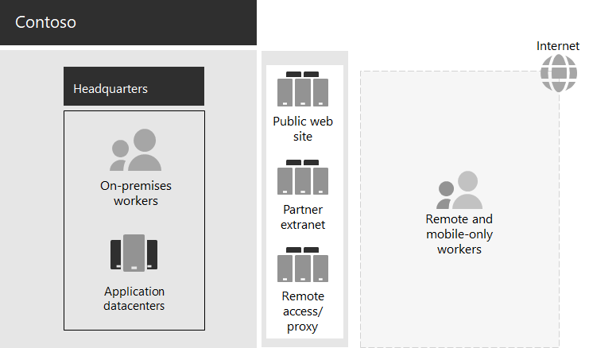

# Contoso IT infrastructure and business needs

Contoso is transitioning from an on-premises, centralized IT infrastructure to a cloud-inclusive setup that incorporates cloud-based personal productivity workloads and applications.

## Existing Contoso IT infrastructure

Contoso uses a mostly centralized on-premises IT infrastructure, with application datacenters in the Paris headquarters.

Here is the headquarters office with application datacenters, a DMZ, and the internet.

The on-premises application datacenters host: 

- Custom line-of-business applications that use SQL Server and other Linux databases.
- A set of legacy SharePoint servers.
- Organization and team-level servers for file storage.

Additionally, each regional hub office supports a set of servers with a similar set of applications. These servers are under the control of regional IT departments.

Searchability across the applications and data of these separate multi-geographical datacenters continues to be a challenge.

In the Contoso headquarters DMZ, different sets of servers provide:

- Hosting for the Contoso public web site, from which customers can order products, parts, supplies, and service.
- Hosting for the Contoso partner extranet for partner communication and collaboration.
- Virtual private network (VPN)-based remote access to the Contoso intranet and web proxying for workers in the Paris headquarters.

## Contoso business needs

Contoso business needs fall into five main categories:

**Productivity**

- Make collaboration easier

  Replace email and file share-based collaboration with an online model that allows real-time changes on documents, easier online meetings, and captured conversation threads.
- Improve productivity for remote and mobile workers

  With many employees working from home or in the field, replace the bottlenecked VPN solution with performant access to Contoso data and resources in the cloud.
- Increase creativity and innovation

  Take advantage of the latest visual learning and idea development methods, including inking and 3D visualization.

**Security**

- Identity and access management

  Enforce multifactor and other forms of authentication and protect user and administrator account credentials.

- Threat protection

  Protect against external security threats, including email and operating system-based malware.

- Information protection

  Lock down access to and encrypt high-value digital assets, such as customer data, design and manufacturing specifications, and employee information.

- Security management

  Monitor security posture and detect and respond to threats in real time.

**Remote and mobile access and business partners**

- Improve security for remote and mobile workers

  Implement bring your own device (BYOD) and company-owned device management to ensure secured access, correct application behavior, and company data protection.

- Reduce remote access infrastructure for employees

  Reduce maintenance and support costs and improve performance for remote access solution by moving commonly accessed resources to the cloud.

- Provide better connectivity and lower overhead for business-to-susiness (B2B) transactions

  Replace an aging and expensive partner extranet with a cloud-based solution that uses federated authentication.

**Compliance**

- Adhere to regional regulatory requirements

  Ensure compliance with industry and regional regulations for data storage, encryption, data privacy, and personal data regulations, such as the General Data Protection Regulation (GDPR) for the Europe Union.

**Management**

- Lower IT overhead for managing software running on client PCs and devices

  Automate installation of updates to the Windows operating system and Microsoft 365 Apps for enterprise across the organization.

## Mapping Contoso business needs to Microsoft 365 for enterprise

The Contoso IT department determined the following mapping of business needs to Microsoft 365 E5 features prior to deployment:

| Category | Business need | Microsoft 365 for enterprise products or features |
|:-------|:-----|:-----|
| Productivity |  |  |
|  | Make collaboration easier | Microsoft Teams, SharePoint, OneDrive |
|  | Improve productivity for remote and mobile workers | Microsoft 365 workloads and cloud-based data |
|  | Increase creativity and innovation | Windows Ink, Cortana at Work, PowerPoint |
| Security |  |  |
|  | Identity & access management | Dedicated global administrator accounts with Azure Multi-Factor Authentication (MFA) and Azure AD Privileged Identity Management (PIM)   MFA for all user accounts   Conditional Access   Windows Hello   Windows Credential Guard |
|  | Threat protection | Advanced Threat Analytics   Windows Defender   Defender for Office 365   Microsoft Defender for Office 365   Microsoft 365 threat investigation and response   |
|  | Information protection | Azure Information Protection   Data Loss Prevention (DLP)   Windows Information Protection (WIP)   Microsoft Cloud App Security   Microsoft Intune |
|  | Security management | Azure Defender    Windows Defender Security Center |
| Remote and mobile access and business partners |  |  |
|  | Better security for remote and mobile workers | Microsoft Intune |
|  | Reduce remote access infrastructure for employees | Microsoft 365 workloads and cloud-based data |
|  | Improve connectivity and lower overhead for B2B transactions | Federated authentication and cloud-based resources |
| Compliance |  |  |
|  | Adhere to regional regulatory requirements | GDPR features in Microsoft 365 |
| Management |  |  |
|  | Lower IT overhead for installing client updates | Windows 10 Enterprise updates   Microsoft 365 Apps for enterprise updates |
||||

## Next step

Learn about the Contoso Corporation [on-premises network](contoso-networking.md) and how it was optimized for access and latency to Microsoft 365 cloud-based resources.

## See also

[Microsoft 365 for enterprise overview](microsoft-365-overview.md)

[Test lab guides](m365-enterprise-test-lab-guides.md)
