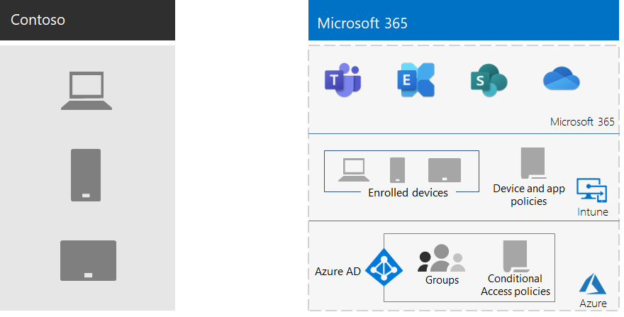

# Mobile device management for Contoso

Microsoft 365 for enterprise includes Intune and a set of Azure services that support mobile device and application management and security.

Contoso has many mobile-enabled employees. Some have offices in Contoso locations, and some have no offices. Contoso needed a way to enable employee productivity but keep the devices, the Contoso data stored on those devices, and application behavior secure.

## Plan

Contoso identified the following Intune use cases of mobile device management for Microsoft 365 for enterprise:

- Protect Exchange Online email and data so it can be safely accessed by mobile devices.
- Implement a bring-your-own-device (BYOD) program for Contoso employees.
- Issue organization-owned phones and limited-use shared tablets to Contoso employees.

Contoso doesn't use Intune to:

- Allow employees to securely access Microsoft 365 from an unmanaged public kiosk.
- Protect on-premises email and data so it can be safely accessed by mobile devices, because there are no on-premises Microsoft Exchange servers.

## Deploy

This is how Contoso set up their mobile device management infrastructure:

- Set Intune as the Mobile Device Management (MDM) authority, and use Intune on Azure to administer content and manage the devices
- Created Microsoft Entra groups for devices for enrollment and Intune settings and device-based Conditional Access policies

  For more information, see [Contoso Conditional Access policies](contoso-identity.md#conditional-access-policies-for-zero-trust-identity-and-device-access).

- Enabled the Apple device platform to support employees with iPads, iMacs, and iPhones, and corporate-owned iPhones
- Created Contoso-specific terms and conditions policies, which are seen during the installation of the Company Portal for Contoso on mobile devices
- For devices that aren't enrolled, implemented a set of Mobile Application Management (MAM) policies to require authentication for access to Microsoft 365 services
- Created Intune policies that enforce:
  - Allowed apps.
  - Device encryption to help prevent unauthorized access.
  - A six-digit PIN or password.
  - An inactivity-timeout period.
  - Antivirus and malware protection, and signature updates with Windows Defender on Windows 11 devices.
  - Automatic updates on Windows 11 devices that include the latest security updates.
  - Pushing certificates to managed devices.
  - A clear separation of business and personal data. Users or admins can selectively wipe corporate data from the device, while leaving personal data such as pictures, personal email accounts, and personal files untouched.

Contoso enrolled deployed PCs and company-owned smartphones and tablets by adding them to the appropriate Intune device groups. They also established a BYOD program for employees to enroll their personal devices. Enrolled devices receive Intune policies, which result in managed and secured devices and their applications. Devices that aren't enrolled have Mobile Application Management (MAM) policies that specify allowed applications.

Here is the Contoso mobile device management deployment architecture.

## Next step

Learn how Contoso uses the [information protection capabilities](contoso-info-protect.md) of Microsoft 365 for enterprise to classify, identify, and protect crucial digital assets across its organization.

## See also

[Device management for Microsoft 365](device-management-roadmap-microsoft-365.md)

[Microsoft 365 for enterprise overview](microsoft-365-overview.md)
