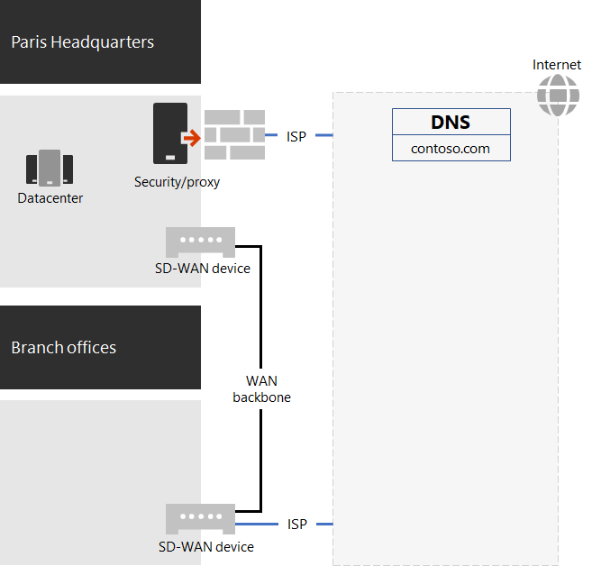

# Networking for the Contoso Corporation

To adopt a cloud-inclusive infrastructure, Contoso devised a fundamental shift in how network traffic to cloud services travels. Instead of an internal hub-and-spoke model that focuses network connectivity and traffic for the next level of the office hierarchy, they mapped user locations to local internet egress and local connections to the closest Microsoft 365 network location on the internet.

## Networking infrastructure

These are the network elements that link Contoso offices across the globe:

- Multiprotocol Label Switching (MPLS) WAN network

  An MPLS WAN network connects the Paris headquarters to regional offices and regional offices to satellite offices in a spoke-and-hub configuration. The network enables users to access on-premises servers that make up line-of-business applications in the Paris headquarters. It also routes any generic internet traffic to the Paris office, where network security devices scrub the requests. Within each office, routers deliver traffic to wired hosts or wireless access points on subnets, which use the private IP address space.

- Local direct internet access for Microsoft 365 traffic

  Each office has a software-defined WAN (SD-WAN) device that has one or more local internet ISP network circuits with its own internet connectivity through a proxy server. This is typically implemented as a WAN link to a local ISP that also provides public IP addresses and a local DNS server.

- Internet presence

  Contoso owns the contoso\.com public domain name. The Contoso public web site for ordering products is a set of servers in an internet-connected datacenter in the Paris campus. Contoso uses a /24 public IP address range on the internet.

Figure 1 shows the Contoso networking infrastructure and its connections to the internet.

 
**Figure 1: The Contoso network**

## Use of SD-WAN for optimal network connectivity to Microsoft

Contoso followed [Microsoft 365 network connectivity principles](microsoft-365-network-connectivity-principles.md) to:

- Identify and differentiate Microsoft 365 network traffic
- Egress network connections locally
- Avoid network hairpins
- Bypass duplicate network security devices

There are three categories of network traffic for Microsoft 365: *Optimize*, *Allow*, and *Default*. Optimize and Allow traffic is trusted network traffic that's encrypted and secured at the endpoints and is destined for the Microsoft 365 network.

Contoso decided to:

- Use direct internet egress for Optimize and Allow category traffic and to forward all Default category traffic to the Paris-based central internet connection.

- Deploy SD-WAN devices at each office as a simple way to follow these principles and achieve optimal network performance for Microsoft 365 cloud-based services.

  The SD-WAN devices have a LAN port for the local office network and multiple WAN ports. One WAN port connects to their MPLS network. Another connects to a local ISP circuit. The SD-WAN device routes Optimize and Allow category network traffic over the ISP link.

## The Contoso line-of-business app infrastructure

Contoso architected its line-of-business application and server intranet infrastructure for the following:

- Satellite offices use local caching servers to store frequently accessed documents and internal web sites.
- Regional hubs use regional application servers for the regional and satellite offices. These servers synchronize with servers in the Paris headquarters.
- The Paris campus datacenters contain centralized application servers that serve the entire organization.

Figure 2 shows the percentage of network traffic capacity used when accessing servers across the Contoso intranet.

 
**Figure 2: The Contoso infrastructure for internal applications**

For the satellite or regional hub offices, 60 percent of the resources needed by employees can be served by satellite and regional hub office servers. The additional 40 percent of resource requests must go over the WAN link to the Paris campus.

## Network analysis and preparation for Microsoft 365 for enterprise

Successful adoption of Microsoft 365 for enterprise services by Contoso users depends on highly available and performant connectivity to the internet or directly to Microsoft cloud services. Contoso took these steps to plan and implement optimized connectivity to Microsoft 365 for enterprise cloud services:

1. Create a company WAN network diagram to aid with planning

   To start their network planning, Contoso created a diagram showing their office locations, existing network connectivity, existing network perimeter devices, and classes of service that are managed on the network. They used this diagram for each subsequent step in the planning and implementation of networking connectivity.

2. Create a plan for Microsoft 365 for enterprise network connectivity

   Contoso used the [Microsoft 365 network connectivity principles](microsoft-365-network-connectivity-principles.md) and sample reference network architectures to identify SD-WAN as their preferred topology for Microsoft 365 connectivity.

3. Analyze internet-connection utilization and MPLS-WAN bandwidth at each office, and increase bandwidth as needed

   Each office's current usage was analyzed, and circuits were increased so that predicted Microsoft 365 cloud-based traffic would operate with an average of 20-percent unused capacity.

4. Optimize performance to Microsoft network services

   Contoso determined the set of Office 365, Intune, and Azure endpoints and configured firewalls, security devices, and other systems in the internet path for optimal performance. Endpoints for Office 365 Optimize and Allow category traffic were configured into the SD-WAN devices for routing over the ISP circuit.

5. Configure internal DNS

   DNS is required to be functional and to be looked up locally for Microsoft 365 traffic.

6. Validate network endpoint and port connectivity

   Contoso ran Microsoft network connectivity test tools to validate connectivity for Microsoft 365 for enterprise cloud services.

7. Optimize employee computers for network connectivity

   Individual computers were checked to ensure that the latest operating system updates were installed and that endpoint security monitoring was active on all clients.

## Next step

Learn how Contoso is [leveraging its on-premises Active Directory Domain Services in the cloud](contoso-identity.md) for employees and federating authentication for customers and business partners.

## See also

[Networking roadmap for Microsoft 365](networking-roadmap-microsoft-365.md)

[Microsoft 365 network connectivity principles](microsoft-365-network-connectivity-principles.md)

[Microsoft 365 for enterprise overview](microsoft-365-overview.md)
