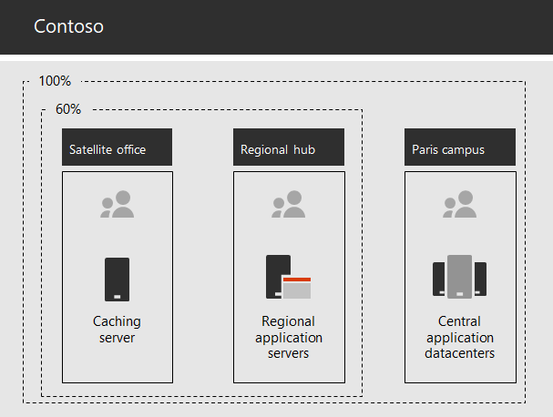

# Networking for the Contoso Corporation

**Summary:** Understand the Contoso networking infrastructure and how it can use SD WAN technology for optimal performance network connectivity to Microsoft 365 Enterprise cloud-based SaaS services.

To adopt a cloud-inclusive infrastructure, Contoso's network engineers realized the fundamental shift in the way that network traffic to cloud-based services travels. Instead of a hub and spoke model that focusses network connectivity on the head office, they are working to map user locations to local egress and nearby Microsoft network connectivity.

## Contoso's networking infrastructure

Elements of Contoso's network that links their offices across the globe are the following:

- MPLS WAN network

  An MPLS WAN network connects the Paris headquarters to regional offices and regional offices to satellite offices in a spoke and hub configuration. This is for users to access on-premises servers that make up line of business applications in the Paris office, it also routes any generic Internet traffic to the Paris office where network security devices scrub the requests. Within each office, routers deliver traffic to hosts or wireless access points on subnets, which use the private IP address space.

- Local direct Internet access for Office 365

  Each office has an SD WAN device with one of more local Internet ISP network circuits. its own Internet connectivity via a proxy server. This is typically implemented as a WAN link to a local ISP that also provides public IP addresses and local DNS server IP addresses for the proxy server.

- New Line of Business applications

  Contoso is in the process of building some new line of business applications on Azure. The office where developers are located uses VPN to the Microsoft network for connectivity to their Azure resources.

- Internet presence

  Contoso owns the contoso.com public domain name. The Contoso public web site for ordering products is a set of servers in an Internet-connected datacenter in the Paris campus. Contoso uses a /24 public IP address range on the Internet.

## Use of SD WAN for optimal network connectivity to Microsoft

Contoso follows Office 365 network connectivity principles which are:

1. Identify and differentiate Office 365 network traffic
2. Egress network connections locally
3. Avoid network hairpins
4. Bypass duplicate network security devices
 
Office 365 provides identification of network traffic in three categories. Contoso has decided to use direct internet egress for Optimize and Allow category Office 365 network traffic and to forward all Default category Office 365 network traffic to the Paris based central network security equipment.

They decided to deploy SD WAN devices at each of their office locations as a simple way to follow these principles and achieve optimal network performance for Office 365.

The SD WAN have a LAN port for the local office network, and multiple WAN ports. One WAN port will connect to their MPLS network and one or two other WAN ports will connect to local ISP circuits. The SD WAN device routes Office 365 for Optimize and Allow network endpoints to the ISP circuits. This represents trusted network traffic that is encrypted and secured at the endpoints, and it is destined for Microsoft datacenters.

In addition, Contoso uses their SD WAN connected local ISP circuits for VPN connections to Azure resources.

## Contoso's line of business app infrastructure

Contoso has architected its line of business application and server infrastructure for the following:

- Satellite offices use local caching servers to store frequently accessed documents and internal web sites.
- Regional hubs use regional application servers for the regional and satellite offices. These servers synchronize with servers in the Paris headquarters.
- The Paris campus has the datacenters that contain the centralized application servers that serve the entire organization.

Figure 1 shows the percentage of network traffic when accessing servers across Contoso’s intranet.

**Figure 1: Contoso's infrastructure for internal applications**
 
For users in satellite or regional hub offices, 60% of the resources needed by employees can be served by satellite and regional hub office servers. The additional 40% of resource requests must go over the WAN link to the Paris campus.

## Contoso's network analysis and preparation for their network for Microsoft 365 Enterprise 

Successful adoption of Microsoft 365 Enterprise services by users depended on highly available and performant connectivity to the Internet, or directly to Microsoft cloud services. Contoso took a number of steps to plan for onboarding to Microsoft 365 SaaS cloud services.

1. Created a company WAN network diagram to aid with planning
 
   Contoso started their network planning by creating a diagram showing their Office locations, the existing network connectivity, their existing network perimeter devices and classes of service that are managed on the network. They will use this diagram for each subsequent step in the onboarding work.

2. Create plan for Microsoft 365 Enterprise network connectivity

   Contoso used the Office 365 network connectivity principles and provided reference network architectures to select SD WAN as their preferred topology for Office 365 connectivity.

3. Analyzed Internet connection utilization and MPLS WAN bandwidth at each office and increased bandwidth as needed

   Each office was analyzed for the current usage and circuits were increased so that predicted network traffic with Office 365 would be operating with 20% of free headroom.

4. Optimized performance to Microsoft network services

   Contoso determined the set of Office 365, Intune, and Azure endpoints and configured firewalls, security devices, and other systems in the Internet path for optimal performance. Office 365 Optimize and Allow network endpoints were configured into the SD WAN devices for direct Internet access.

5. Configured internal DNS

   DNS is required to be functional and to be looked up locally for Office 365.

6. Validated network endpoint and port connectivity

   Contoso also ran network connectivity test tools provided by Microsoft to validate connectivity for Microsoft 365 Enterprise.

7. Optimized employee computers for network connectivity 

   Individual computers were checked to ensure that the latest operating system updates were installed and that endpoint security monitoring is active on all clients.

## Next step

[Learn](contoso-identity.md) how Contoso is leveraging its on-premises identity provider in the cloud for employees and federating authentication for customers and business partners.

## See also

[Networking for Microsoft 365 Enterprise](networking-infrastructure.md)

[Deployment guide](deploy-microsoft-365-enterprise.md)

[Test lab guides](m365-enterprise-test-lab-guides.md)
