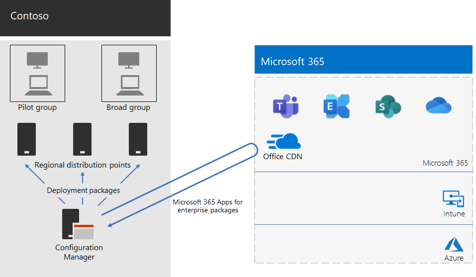

# Microsoft 365 Apps for enterprise deployment for Contoso

Contoso upgraded their PCs to Windows 11 Enterprise and Microsoft 365 Apps for enterprise to enable more effective collaboration, better security, and a more modern desktop experience. After they assessed their infrastructure and business needs, Contoso identified these key requirements for the deployment:

- All PCs should run Microsoft 365 Apps for enterprise.
- Deployment should use existing management tools and infrastructure when possible.
- Deployment must support multiple languages and existing architectures on users' devices.
- PCs should stay up-to-date and secure with minimal IT administrative costs and minimal impact to users.

## Deployment tools

Based on their requirements, Contoso chose to deploy Windows 11 Enterprise and Microsoft 365 Apps for enterprise through Configuration Manager (Current Branch). Configuration Manager scales for large environments and provides extensive control over installation, updates, and settings. It also has built-in features to make it easier and more efficient to deploy and manage Office, including:

- Peer cache, which can help with limited network capacity when deploying to devices in remote locations.
- The Office Client Management dashboard, which makes it easy to deploy Office and monitor updates and gives administrators access to the latest deployment and management features.
- Intelligent language pack deployment, including automatically deploying the same language as the operating system.
- A fully supported and easy-to-use method of removing existing versions of Office from a client during deployment.

In addition to Configuration Manager, Contoso used the [Readiness Toolkit for Office Add-ins and VBA](/deployoffice/readiness-toolkit-application-compatibility-microsoft-365-apps), a free tool from Microsoft, to assess compatibility issues with their Office macros and add-ins.

## Managing deployment and updates

Microsoft 365 Apps for enterprise has a new release model: Office as a service. The service model makes it easy to stay up to date with new features. But it often requires IT departments to change how they deploy and test new releases. To minimize compatibility issues and to ensure their computers stay up to date, Contoso deployed Windows and Office in two stages:

- First, they deployed Microsoft 365 Apps for enterprise to a small set of representative devices across the organization. This pilot group was used to test apps, add-ins, and hardware with Microsoft 365 Apps for enterprise.
- Four months later, after addressing all critical issues with apps, add-ins, and hardware in the pilot group, Contoso deployed Microsoft 365 Apps for enterprise to the rest of the devices in the organization (the broad group).

Instead of managing updates to Office by using Configuration Manager, Contoso enabled automatic updates from the cloud. Cloud-based updates reduce administrative overhead while ensuring that devices stay up to date.

Contoso followed the same two-stage approach for feature updates as they used for deploying Office: Devices in the pilot group received feature updates four months earlier than devices in the rest of the organization (the broad group). To enable this for Office, Contoso used two recommended [update channels](/DeployOffice/overview-update-channels):

- Semi-Annual Enterprise Channel (Preview) for updates to the pilot group
- Semi-Annual Enterprise Channel for updates to the broad group

Because the Semi-Annual Enterprise Channel (Preview) releases a version of Microsoft 365 Apps for enterprise four months earlier than the Semi-Annual Enterprise Channel, Contoso has time to validate the updates without having to manage them.

## Deployment process

To complete the deployment of Office, Contoso implemented the following process, which includes best practice recommendations from Microsoft:

1. Before deployment, Contoso used the Readiness Toolkit for Office Add-in and VBA to test their apps and Office Add-ins to assess their compatibility with Microsoft 365 Apps for enterprise.
1. In Configuration Manager, they enabled peer cache on their client devices, which helps with limited network capacity when deploying to client devices in remote locations.
1. Contoso defined two deployment groups as device collections in Configuration Manager: a pilot group and a broad group. The pilot group, which included a small set of representative devices across the organization, was used for additional testing of apps, add-ins, and hardware with Windows 11 Enterprise and Microsoft 365 Apps for enterprise.
1. They created deployment packages for Office by using the Office Client Management dashboard and the Office 365 Installer wizard, which are both part of the Configuration Manager console. They built two Microsoft 365 Apps for enterprise packages, one for the pilot group on the Semi-Annual Enterprise Channel (Preview) and one for the broad group on the Semi-Annual Enterprise Channel.
1. Each Office package included English, French, and German Language packs. If a device required a language that wasn't included in the Office package, that language pack was automatically downloaded from the Office Content Delivery Network (CDN).
1. They used the built-in feature in the Office package to automatically remove all existing MSI versions of Office before installing Microsoft 365 Apps for enterprise.
1. In Configuration Manager, they deployed the Windows and Office packages to distribution points across their network. Then they ran the Configuration Manager deployment task sequences to deploy the pilot Microsoft 365 Apps for enterprise package to the pilot group.
1. After they addressed compatibility issues with the pilot group, Contoso ran the task sequences to deploy the Microsoft 365 Apps for enterprise package to the broad group.

Because Contoso chose to automatically update devices from the cloud, there was no need to manage the process in Configuration Manager. Their devices are automatically updated directly from the cloud-based on the update channel that was defined in the initial deployment.

Here is the Contoso Microsoft 365 Apps for enterprise installation and ongoing updates deployment architecture.

## Next step

Learn how Contoso is [using Microsoft Intune](contoso-mdm.md) in Microsoft 365 for enterprise to manage its devices and the apps that they run across the organization.

## See also

[Microsoft 365 Apps for enterprise](/deployoffice/deployment-guide-microsoft-365-apps)

[Microsoft 365 for enterprise overview](microsoft-365-overview.md)
