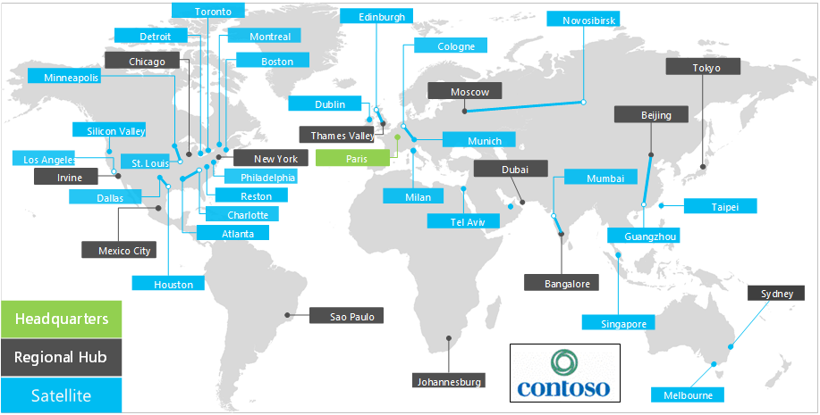

# Overview of Contoso Corporation

The Contoso Corporation is a multinational business with its headquarters in Paris. The company is a manufacturing, sales, and support organization with more than 100,000 products.

## Contoso around the world

Figure 1 shows the headquarters office in Paris and regional hub and satellite offices on various continents.

**Figure 1: Contoso offices around the world**

Contoso has three tiers of offices:

- Headquarters

  Contoso headquarters is a corporate campus on the outskirts of Paris with dozens of buildings for administrative, engineering, and manufacturing facilities. All the Contoso datacenters and its internet presence are housed in the Paris headquarters.

  The headquarters has 25,000 workers.

- Regional hubs

  Hub offices serve a specific region of the world with 60-percent sales and support staff. Each regional hub is connected to the Paris headquarters through a high-bandwidth WAN link.

  The regional hubs have an average of 2,000 workers.

- Satellite offices

  Satellite offices contain 80-percent sales and support staff. They provide an on-site presence for Contoso customers in key cities or subregions. Each satellite office is connected to a regional hub through a high-bandwidth WAN link.

  The satellite offices have an average of 250 workers.

About 25 percent of the Contoso workforce is mobile-only. The regional hubs and satellite offices have a higher percentage of these workers. Providing better support for mobile-only workers is an important business goal for Contoso.

## Design considerations for Microsoft 365 for enterprise

The Contoso IT architects identified the following design-requirement factors for deploying Microsoft 365 for enterprise:

- Multiple geographic locations with local regulations and compliance requirements
- A central intranet datacenter in the headquarters office and regional application servers that host internal line-of-business applications
- An existing Microsoft Endpoint Configuration Manager infrastructure
- A mix of client computing devices that run Windows, Mac, and Linux
- A mix of personal and company-owned mobile devices, including iOS (iPhone and iPad) and Android smart phones and tablets
- Many remote and mobile workers
- Many business partners
- A large amount of customer and other confidential personal information to manage and secure
- A large amount of high-value intellectual property in the form of design specifications for products and manufacturing trade secrets

## Next step

Learn about the Contoso Corporation [on-premises IT infrastructure](contoso-infra-needs.md) and how the company's business needs are addressed with Microsoft 365 for enterprise.

## See also

[Microsoft 365 for enterprise overview](microsoft-365-overview.md)
