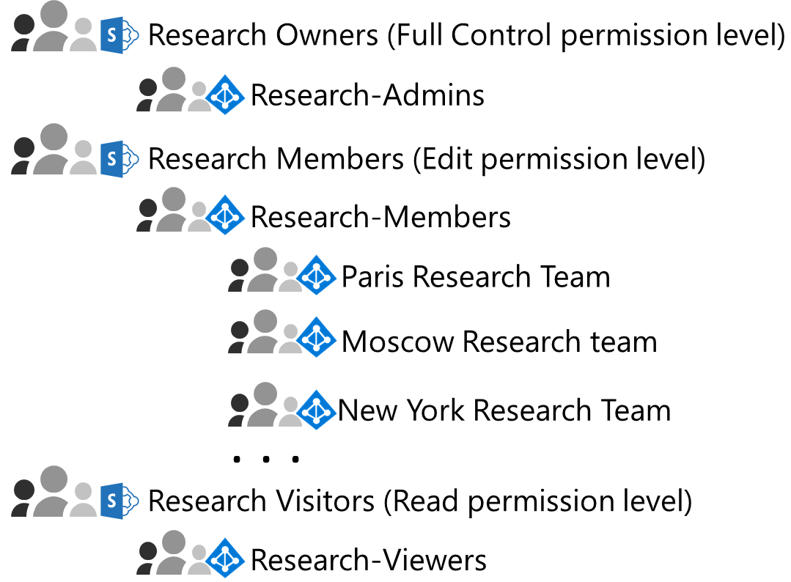
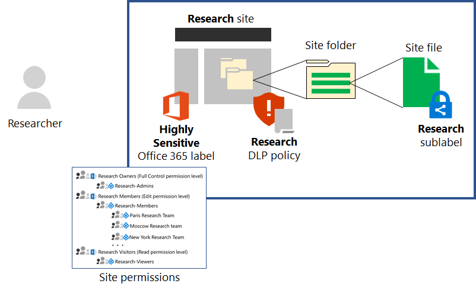

# SharePoint Online site for highly confidential digital assets of the Contoso Corporation

 **Summary:** How Contoso implemented a SharePoint Online site for highly regulated data for easier collaboration between its research teams.
  
Contoso's most valuable assets are its intellectual property in the form of trade secrets, such as proprietary manufacturing techniques, and design specifications for products that are in development. These assets are in digital form, originally stored as files on a SharePoint Server 2016 site. When Contoso deployed Microsoft 365 Enterprise, they wanted to transition their on-premises digital assets to the cloud for easier access and more open collaboration across research teams in Paris, Moscow, New York, Beijing, and Bangalore. 
  
However, due to their sensitive nature, access to these files must be:

- Restricted to the set of people who are allowed to view or change them, with ongoing permissions for the site administered only by SharePoint admins. 
- Protected with Data Loss Prevention (DLP) to prevent users from distributing them outside the site.
- Encrypted and protected with access control lists to prevent unauthorized users from accessing their contents, even if they are distributed outside the site.

Security and SharePoint administrators in Contoso's IT department decided to use a [SharePoint Online site for highly regulated data](teams-sharepoint-online-sites-highly-regulated-data.md).
  
Contoso used these steps to create and secure a SharePoint Online team sites for their research teams.

## Step 1: Reviewed and verified the members of research team groups

Contoso IT admins performed a review of the set of security groups for their research teams. They removed anyone who was not a researcher or did not need access to research assets. 

They also and created these new security groups:

- **Research-Admins**  The set of SharePoint admins that have full control over the site, including the ability to modify permissions.
- **Research-Members**  The set of security groups for the research teams around the world.
- **Research-Viewers**  The set of management users, such as executives in the research organization, that can only view the assets on the site.

## Step 2: Created an isolated SharePoint Online team site 

Contoso SharePoint admins first created a new team site named **Research**. They then configured:

- The Full Control permission level to use the Research Owners SharePoint group, which has the **Research-Admins** security group as a member
- The Edit permission level to use the Research Members SharePoint group, which has the **Research Members** security group as a member
- The Read permission level to use the Research Visitors SharePoint group, which has the **Research-Viewers** security group as a member

Here are the resulting SharePoint permission levels, SharePoint groups, and their members.

Next, they configured additional restrictions for the site.

For the configuration details, see [Deploy an isolated SharePoint Online team site](https://docs.microsoft.com/office365/enterprise/deploy-an-isolated-sharepoint-online-team-site).

## Step 3: Configured the site for a restrictive DLP policy

First, Contoso admins applied the **Highly Confidential** Office 365 retention label to the **Research** site.

Next, they created a new Office 365 DLP policy named **Research** that:

- Uses the **Highly Confidential** Office 365 retention label. 
- Is applied to the **Research** site.
- Blocks users when they attempt to share a digital asset on the **Research** site outside of Contoso.

For the configuration details, see [Protect SharePoint Online files with retention labels and DLP](https://docs.microsoft.com/office365/enterprise/protect-sharepoint-online-files-with-office-365-labels-and-dlp).

## Step 4: Created an Azure Information Protection sub-label for the site

Contoso admins created a new Azure Information Protection sub-label named **Research** of the default **Highly Confidential** label in a scoped policy that:

- Requires encryption.
- Allows full access by members of the **Research-Members** security group.
- Allows read access by members of the **Research-Viewers** security group.

Next, they deployed the Azure Information Protection client to the devices of research team members.

For the configuration details, see [Protect SharePoint Online files with Azure Information Protection](https://docs.microsoft.com/office365/enterprise/protect-sharepoint-online-files-with-azure-information-protection). 

Here is the resulting configuration of the **Research** site for highly confidential assets.

Files in folders of the **Research** site are protected by:

- The **Research** Azure Information Protection sublabel, which applies encryption and permssions to each file that travel with the file when it is moved or copied from the **Research** site.
- The **Research** DLP policy, which uses the **Highly Sensitive** retention label and settings that prevent the file from being shared with external users.
- The set of site permissions, which only allow access to members of the **Research-Members** and **Research-Viewers** security groups and administration by members of the **Research-Admins** security group.

## Step 5: Migrated the on-premises SharePoint research data

Contoso admins moved all of the on-premises research files in the on-premises SharePoint Server 2016 site to folders in the new **Research** SharePoint Online site.

## Step 6: Trained their users 

Contoso security staff trained the research teams in a mandatory course that stepped them through:

- How to access the new **Research** SharePoint Online site and its existing files.
- How to create new files on the site and upload new files stored locally.
- A demonstration of how the DLP policy blocks files from being shared externally.
- How to use the Azure Information Protection client to label research files with the **Research** sub-label.
- A demonstration of how the **Research** sub-label protects a file even when it is leaked from the site.

The end result is a secure environment in which the researchers can collaborate across the organization in a secure environment. 

If a research document with the **Research** sub-label is leaked from the **Research** site, it is encrypted and accessible only to members of the **Research-Members** and **Research-Viewers** security groups with valid credentials.

## Next step

[Deploy](deploy-microsoft-365-enterprise.md) Microsoft 365 Enterprise in your organization.

