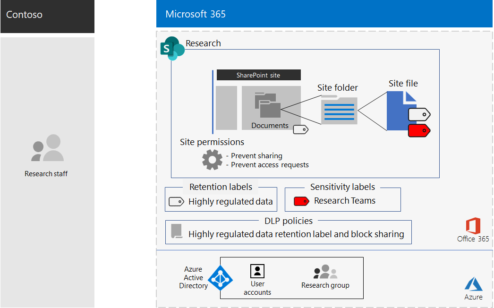

# SharePoint site for highly confidential digital assets of the Contoso Corporation

Contoso's most valuable assets are its intellectual property in the form of trade secrets, such as proprietary manufacturing techniques, and design specifications for products that are in development. These assets were in digital form, originally stored as files on a SharePoint Server 2016 site. When Contoso deployed Microsoft 365 Enterprise, they wanted to transition their on-premises digital assets to the cloud for easier access and more open collaboration across research teams in Paris, Moscow, New York, Beijing, and Bangalore. 
  
However, due to their sensitive nature, access to these files must be:

- Restricted to the set of people who are allowed access them. 
- Protected with a Data Loss Prevention (DLP) policy to prevent users from distributing them outside the site.
- Encrypted and protected with permissions to prevent unauthorized users from accessing their contents, even if they are distributed outside the site.

Security and SharePoint administrators in Contoso's IT department decided to use a [SharePoint site for highly regulated data](teams-sharepoint-online-sites-highly-regulated-data.md).
  
Contoso used these steps to create and secure a SharePoint team sites for their research teams.

## Step 1: Created a private SharePoint team site

To protect access to the SharePoint site, Contoso IT configured the [recommended SharePoint access policies](sharepoint-file-access-policies.md).

Next, Contoso IT admins compiled a list of the user accounts for the researchers in their Paris, Moscow, New York, Beijing, and Bangalore offices. 

Next, a Contoso IT admin created a new private team site named **Research** and added all of the user accounts for its researchers.

Then they configured additional permission settings for the site to prevent researchers from sharing access to the site and to prevent non-researchers from requesting access to the site.

## Step 2: Configured the site for a restrictive DLP policy

First, Contoso admins applied the existing **Highly Confidential** Office 365 retention label to the Documents folder of the **Research** site.

Next, they created a new Office 365 DLP policy named **Research** that:

- Uses the **Highly Confidential** Office 365 retention label. 
- Blocks users when they attempt to share a digital asset on the **Research** site outside of Contoso.

For the configuration details, see [Protect SharePoint files with retention labels and DLP](https://docs.microsoft.com/office365/enterprise/protect-sharepoint-online-files-with-office-365-labels-and-dlp).

## Step 3: Created an Office 365 sensitivity sublabel for the site

Contoso admins created a new Office 365 sensitivity sublabel named **Research Teams** of the **Highly Confidential** label that:

- Requires encryption.
- Allows Co-Author permissions for the **Research** Office 365 group
- Applies to the **Research** Office 365 group

Here is the resulting configuration of the **Research** team site for highly confidential assets.

Files in folders of the **Research** site are protected by:

- The site permissions, which only allow access to members of the **Research** Office 365 group.
- The **Research** DLP policy, which uses the **Highly Confidential** retention label and settings that prevent the file from being shared with external users.
- The **Research Teams** sensitivity sublabel, with encryption and permissions that travel with the file if it is moved or copied from the **Research** site.

Here is an example of a file stored in the **Research** site with the **Research Teams** sensitivity sublabel assigned.

## Step 4: Migrated the on-premises SharePoint research data

Contoso admins moved all of the on-premises research files in the on-premises SharePoint Server 2016 site to folders in the new **Research** SharePoint site.

## Step 5: Trained their researchers

Contoso security staff trained the members of the **Research** Office 365 group in a mandatory course that stepped them through:

- How to access the new **Research** site and its existing files.
- How to create new files on the site and upload new files stored locally.
- A demonstration of how the **Research** DLP policy blocks files from being shared externally.
- How to label files with the **Research Teams** sensitivity sublabel.
- A demonstration of how the **Research Teams** sub-label protects a file even when it is leaked from the site.

The end result is a secure environment in which the researchers can collaborate across Contoso in a secure environment on files containing research information. 

If a research document with the **Research Teams** sublabel leaves the **Research** site, it is encrypted and accessible only to members of the **Research** Office 365 group with valid user account credentials.

## Next step

[Deploy](deploy-microsoft-365-enterprise.md) Microsoft 365 Enterprise in your organization.

## See also

[Microsoft 365 Productivity Library](https://aka.ms/productivitylibrary) (https://aka.ms/productivitylibrary)
