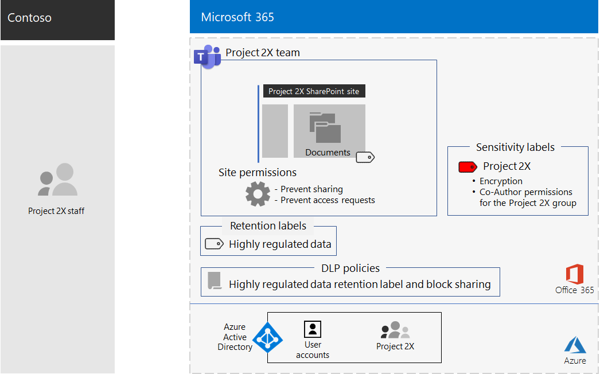

# Team for a top-secret project of the Contoso Corporation

After an executive offsite, Contoso’s CEO ordered the development of a new suite of products and services that could double Contoso’s profits in the next five years. The top-secret project to develop the business, engineering, and market plan was named **Project 2X** and key staff across the company were recruited. 

The timelines for research and development were tight, which meant that collaboration had to be efficient and provide for secure meetings, ongoing conversations, and file storage.

The resulting deliverables for Project 2X were business plans, product and engineering specifications, and marketing materials and schedules in the form of Word, Excel, and PowerPoint files. 

Due to their sensitive nature, access to these files were:

- Restricted to Project 2X team members.
- Protected with a Data Loss Prevention (DLP) policy to prevent Project 2X team members from sharing them outside the team.
- Encrypted and protected with permissions to allow access only to Project 2X team members, even if the files were distributed outside of Contoso.

Contoso IT staff used a [team for highly-regulated data](secure-teams-highly-regulated-data-scenario.md) for Project 2X and these steps.

## Step 1: Created a private team and locked down the underlying SharePoint site

To protect access to the underlying SharePoint site for the team, Contoso IT administrators configured the [recommended SharePoint access policies](sharepoint-file-access-policies.md).

Next, a Contoso IT administrator created a new private team named Project 2X and added the user accounts of Project 2X staff as members.

Next, they configured additional permission settings for the site to prevent Project 2X from sharing access to the site and to prevent other from requesting access to the site.

For the configuration details, see [SharePoint settings for a highly regulated team](https://docs.microsoft.com/microsoft-365/security/office-365-security/deploy-teams-three-tiers#highly-confidential-teams).

## Step 2: Configured a DLP policy and the underlying site for a retention label 

First, Contoso admins applied the existing **Highly Confidential** Office 365 retention label to the **Documents** section of the underlying SharePoint site of the Project 2X team.

Next, they created a new Office 365 DLP policy named **Project 2X** that:

- Uses the Highly Confidential Office 365 retention label.
- Blocks users when they attempt to share a file in the Project 2X team outside of Contoso.

For the configuration details, see [Protect files in teams with retention labels and DLP](https://docs.microsoft.com/microsoft-365/security/office-365-security/deploy-teams-retention-dlp).

## Step 3: Created an Office 365 sensitivity label for the Project 2X team

Contoso admins created a new Office 365 sensitivity label named **Project 2X** that:

- Requires encryption.
- Allows Co-Author permissions for the Project 2X Office 365 group.

Here is the resulting configuration of the Project 2X team.

 
Files in the Documents section of the underlying Project 2X SharePoint site were protected by:

- The site permissions, which only allow access to members of the Project 2X Office 365 group.
- The  Highly Confidential retention label, which is automatically assigned to new files.
- A DLP policy that uses the Highly Confidential retention label and settings that block the file from being shared with external users.
- The Project 2X sensitivity label, with encryption and permissions that travel with the file if it is moved or copied from the site.

Here is an example of a file stored in the underlying Project 2X site with the Highly Regulated retention label and the Project 2X sensitivity label assigned.

 
## Step 4: Trained Project 2X team members

Contoso security staff trained the Project 2X team members in a mandatory course that stepped them through:

- How to access the new Project 2X team, use meetings and chats, and how to collaborate on team files.
- How to create new files in the team and upload new files created locally.
- A demonstration of how the DLP policy blocks files from being shared externally.
- How to label files with the Project 2X sensitivity label.
- A demonstration of how the Project 2X  label protects a file even when it leaves the team.

The end result was a secure environment in which Project 2X team members collaborated in a secure environment for chats, meetings, and files.

In a couple of instances, Project 2X team members downloaded files protected by the Project 2X label to a local drive for offline work. 
However, after being prompted for credentials when opening them, they realized their mistake and deleted them.

Because of the collaboration environment of Teams and the security features of Microsoft 365, the details of Project 2X were kept secret for the duration of the project. Contoso announced its plans and is in the process of rolling out the new products and services to the delight of its customers and investors and the chagrin of its competitors.

## Next step

[Deploy](deploy-microsoft-365-enterprise.md) Microsoft 365 Enterprise in your organization.

## See also

[Microsoft 365 Productivity Library](https://aka.ms/productivitylibrary) (https://aka.ms/productivitylibrary)
