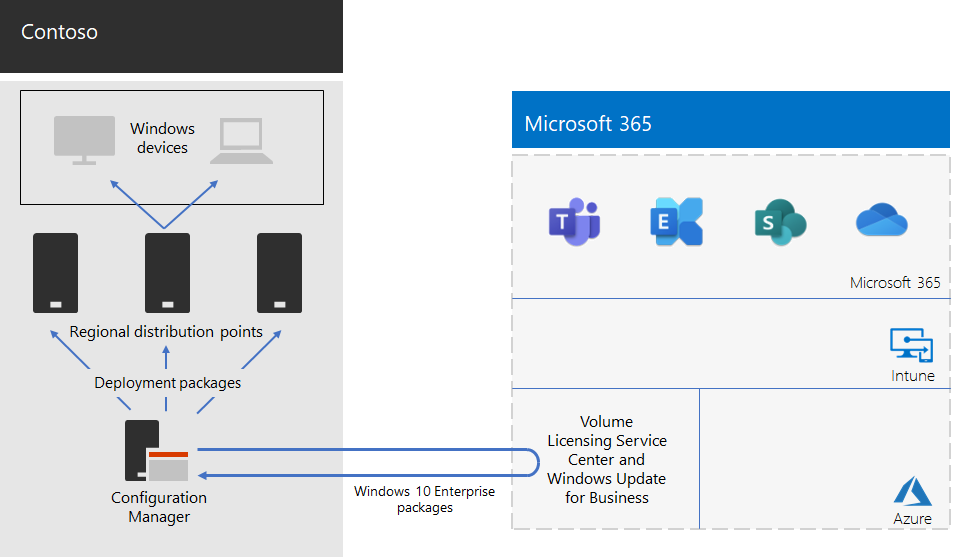

# Windows 11 Enterprise deployment for Contoso

Prior to the wide rollout of Microsoft 365 for enterprise, Contoso had Windows-compatible PCs and devices running a mixture of Windows 8.1 (10%), Windows 10 (65%), and Windows 11 (25%). Contoso wanted to upgrade their PCs for Windows 11 Enterprise take advantage of advanced security and lowered IT overhead from automated deployments of updates.

After assessing their infrastructure and business needs, Contoso identified these key requirements for the deployment:

- As many PCs and devices as possible should run Windows 11 Enterprise
- Rollout of the in-place upgrades leverages existing Configuration Manager infrastructure
- Control over which versions of Windows 11 Enterprise to deploy and updates are done through rings
- PCs and devices should stay up to date with minimal IT administrative costs and with minimal impact to end-users

Up to date is defined as the supported version of Windows 11 Enterprise that meets Contoso’s business needs, which can be different from having all Windows-compatible PCs running the latest version of Windows 11 Enterprise.

## Deployment tools

Prior to and during in-place upgrades of Windows 11 Enterprise, Contoso used the following solutions of Windows Analytics:

- Upgrade Readiness  

  Collects system, application, and driver data for analysis, and then identifies compatibility issues that can block an upgrade and suggested fixes the issues are known to Microsoft.

- Update Compliance  

  Shows you the state of your devices with respect to the Windows updates so that you can ensure that they are on the most current updates as appropriate.

- Device Health  

  Identifies devices that crash frequently, and therefore might need to be rebuilt or replaced and device drivers that are causing device crashes, with suggestions of alternative versions of those drivers that might reduce the number of crashes. Provides notification of Windows Information Protection misconfigurations that send prompts to end users.

Contoso has an existing Configuration Manager (Current Branch) infrastructure. Configuration Manager scales for large environments and provides extensive control over installation, updates, and settings. It also has built-in features to make it easier and more efficient to deploy and manage Windows 11 Enterprise.

## Planning process

Contoso used the Upgrade Readiness in Windows Analytics to determine the set of installed apps and their compatibility with Windows 11 Enterprise.

## Deployment process

To complete the in-place upgrade deployment of Windows 11 Enterprise, Contoso implemented the following process, which includes best practice recommendations from Microsoft:

1. Enabled peer cache for Configuration Manager.
2. Created customized Windows packages based on images from the Volume Licensing Service Center.
3. Used Configuration Manager to deploy the Windows packages to distribution points across their network and deployed builds to the three validation and deployment staging groups.
4. Performed assessment of success for PCs and devices in the three validation and deployment staging rings using the Device Health and Update Compliance solutions of Windows Analytics.
5. Based on the Windows Analytics information, Contoso determined the version of Windows 11 Enterprise to deploy to the broad deployment group.
6. Ran the Configuration Manager deployment task sequences to deploy the selected Windows package to the broad deployment group.
7. Monitored PCs and devices in the broad deployment group using the Device Health and Update Compliance solutions to address issues.

Here is Contoso’s in-place upgrade and ongoing updates deployment architecture.

This infrastructure consists of:

- Configuration Manager, which:
  - Obtains images for Windows 11 Enterprise packages from the Microsoft Volume Licensing Center in the Microsoft Network.
  - Is the central administration point for deployment packages.
- Regional distribution points that are typically located in Contoso’s regional hub offices.
- Windows PCs and devices in various locations that receive and install the deployment packages for the in-place upgrade or ongoing updates based on group membership.

## Next step

Learn how Contoso is leveraging its Configuration Manager infrastructure to [deploy and keep current Microsoft 365 Apps for enterprise](contoso-o365pp.md) across its organization.

## See also

[Windows 11 Enterprise](/windows/deployment/)

[Microsoft 365 for enterprise overview](microsoft-365-overview.md)
