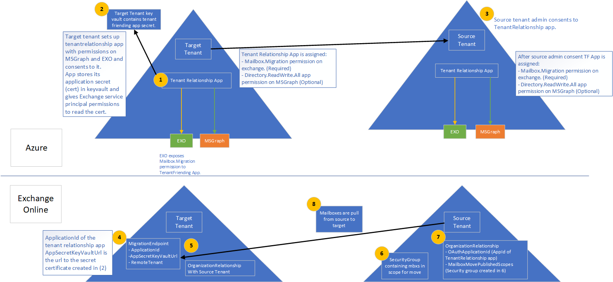

# Cross-tenant mailbox migration (preview)

Previously, when an Exchange Online tenant needed to move mailboxes to another tenant in the same Exchange Online service, they would have to completely offboard them to on-premises and then onboard them to a new tenant. With the new cross-tenant mailbox migration feature, tenant administrators in both source and target tenants can move mailboxes between the tenants with minimal infrastructure dependencies in their on-premises systems. This removes the need to off-board and onboard mailboxes.

Commonly, during mergers or divestitures, you need the ability to move users and content into a new tenant. When the target tenant administrator executes the move, it’s called a Pull move, similar to on-premises to cloud onboarding migrations.

Cross-tenant Exchange mailbox moves are fully self-serviced by tenant administrators, using well known interfaces that can be scripted into the larger workflows needed to transition users to their new organization. Administrators can use the `New-MigrationBatch` cmdlet, available through the Move Mailboxes management role, to execute cross-tenant moves. The move process includes tenant authorization checks during mailbox synchronization and finalization.

Users migrating must be present in the target tenant Exchange Online system as MailUsers, marked with specific attributes to enable the cross-tenant moves. The system will fail moves for users that are not properly set up in the target tenant.

When the moves are complete, the source system mailbox is converted to MailUser and the targetAddress (shown as ExternalEmailAddress in Exchange) is stamped with the routing address to the destination tenant. This process leaves the legacy MailUser in the source tenant, and allows for a period of co-existence and mail routing. When business processes allow, the source tenant may remove the source MailUser or convert them to a mail contact.

Cross-tenant Exchange mailbox migrations are supported for tenants in hybrid or cloud only, or any combination of the two.

This article describes the process for cross-tenant mailbox moves and provides guidance on how to prepare source and target tenants for the content move.

## Preparing source and target tenants

The Cross-tenant Exchange mailbox migration feature requires authorization and scoping for cross-tenant migrations. Using the Azure Enterprise application and Key Vault storage solutions, tenant admins are now empowered to manage both authorization and scoping of Exchange Online mailbox migrations from one tenant to another. Cross-tenant mailbox moves supports an invitation and consent model to establish an Azure Active Directory (Azure AD) application used for authentication between a tenant pair. Additional components such as an organization relationship and a migration endpoint are also required.

This section does not include the specific steps required to prepare the MailUser user objects in the target directory, nor does it include the sample command to submit a migration batch. Please see [Prepare target user objects for migration](#prepare-target-user-objects-for-migration) for this information.

## Prerequisites

The cross-tenant mailbox move feature requires [Azure Key Vault](/azure/key-vault/basic-concepts) to establish a tenant pair-specific Azure application to securely store and access the certificate/secret used to authenticate and authorize mailbox migration from one tenant to the other, removing any requirements to share certificates/secrets between tenants.

Before starting, be sure you have the necessary permissions to run the deployment scripts in order to configure Azure Key Vault, Move Mailbox application, EXO Migration Endpoint, and the EXO Organization Relationship. Typically, **Azure AD DC admin**, or **Global admin**  has permission to perform all configuration steps.

Additionally, mail-enabled security groups in the source tenant are required prior to running setup. These groups are used to scope the list of mailboxes that can move from source (or sometimes referred to as resource) tenant to the target tenant. This allows the source tenant admin to restrict or scope the specific set of mailboxes that need to be moved, preventing unintended users from being migrated. Nested groups are not supported.

You will also need to communicate with your trusted partner company (with whom you will be moving mailboxes) to obtain their Microsoft 365 tenant ID. This tenant ID is used in the Organization Relationship `DomainName` field.

To obtain the tenant ID of a subscription, sign in to the <a href="https://go.microsoft.com/fwlink/p/?linkid=2024339" target="_blank">Microsoft 365 admin center</a> and go to [https://aad.portal.azure.com/#blade/Microsoft_AAD_IAM/ActiveDirectoryMenuBlade/Properties](https://aad.portal.azure.com/#blade/Microsoft_AAD_IAM/ActiveDirectoryMenuBlade/Properties). Click the copy icon for the Tenant ID property to copy it to the clipboard.

Here is how the process works.

:::image type="content" source="../media/tenant-to-tenant-mailbox-move/prepare-tenants-flow.png" alt-text="Tenant preparation for mailbox migration.":::

[See a larger version of this image](https://github.com/MicrosoftDocs/microsoft-365-docs/raw/public/microsoft-365/media/tenant-to-tenant-mailbox-move/prepare-tenants-flow.png).

<!--
[](https://github.com/MicrosoftDocs/microsoft-365-docs/raw/public/microsoft-365/media/tenant-to-tenant-mailbox-move/prepare-tenants-flow.png)
-->

### Prepare tenants

At a high level, the following configuration actions take place when executing the setup scripts.

Prepare the target tenant:

1. If an existing Azure Resource Group is not provided, a new one is created (SCRIPT).
2. If an existing Key Vault is not provided, a new one is created (SCRIPT).
3. A new Access Policy is created for the Office 365 Exchange Online Mailbox Migration application (SCRIPT).
4. A new certificate is created (or existing one, if specified) to hold the secret to the Migration application (SCRIPT).
5. A new Azure AD application is created (SCRIPT).
6. The certificate/secret is uploaded to the migration application (SCRIPT).
7. Mailbox migration permissions are assigned to the application (SCRIPT).
8. The deployment script pauses until target admin consents to their own application (SCRIPT).
9. The target tenant admin consents to the permissions given to the application (MANUAL).
10. An organization relationship is created to the target tenant (SCRIPT).
11. A migration endpoint is created to pull mailboxes to the target tenant (SCRIPT).

Prepare the source tenant:

1. The source tenant admin accepts consent to Mailbox Migration application invitation from the Target tenant (MANUAL).
2. The source tenant admin creates a mail-enabled security group in their tenant to contain the list of mailboxes allowed to be moved by the migration application (MANUAL).
3. An organization relationship is created to the target tenant specifying the mailbox migration application should be used for OAuth verification to accept the move request (SCRIPT).

#### Step-by-step instructions for the target tenant admin

1. Download the SetupCrossTenantRelationshipForTargetTenant.ps1 script for the target tenant setup from the [GitHub repository](https://github.com/microsoft/cross-tenant/releases/tag/Preview).
2. Save the script (SetupCrossTenantRelationshipForTargetTenant.ps1) to the computer from which you will be executing the script.
3. Create a Remote PowerShell connection to the Exchange Online target tenant. Again, make sure you have the necessary permissions to run the deployment scripts in order to configure the Azure Key Vault storage and certificate, Move Mailbox application, EXO Migration Endpoint, and the EXO Organization Relationship.
4. Change the file folder directory to the script location or verify the script is currently saved to the location currently in your Remote PowerShell session.
5. Run the script with the following parameters and values.

   |Parameter|Value|Required or Optional
   |---|---|---|
   |-TargetTenantDomain|Target tenant domain, such as fabrikam\.onmicrosoft.com.|Required|
   |-ResourceTenantDomain|Source tenant domain, such as contoso\.onmicrosoft.com.|Required|
   |-ResourceTenantAdminEmail|Source tenant admin’s email address. This is the source tenant admin who will be consenting to the use of the mailbox migration application sent from the target admin. This is the admin who will receive the email invite for the application.|Required|
   |-ResourceTenantId|Source tenant organization ID (GUID).|Required|
   |-SubscriptionId|The Azure subscription to use for creating resources.|Required|
   |-ResourceGroup|Azure resource group name that contains or will contain the Key Vault.|Required|
   |-KeyVaultName|Azure Key Vault instance that will store your mailbox migration application certificate/secret.|Required|
   |-CertificateName|Certificate name when generating or searching for certificate in key vault.|Required|
   |-CertificateSubject|Azure Key Vault certificate subject name, such as CN=contoso_fabrikam.|Required|
   |-AzureResourceLocation|The location of the Azure resource group and key vault.|Required|
   |-ExistingApplicationId|Mail migration application to use if one was already created.|Optional|
   |-AzureAppPermissions|The permissions required to be given to the mailbox migration application, such as Exchange or MSGraph (Exchange for moving mailboxes, MSGraph for using this application to send a consent link invitation to resource tenant).|Required|
   |-UseAppAndCertGeneratedForSendingInvitation|Parameter for using the application created for migration to be used for sending consent link invitation to source tenant admin. If not present this will prompt for the target admin’s credentials to connect to Azure invitation manager and send the invitation as target admin.|Optional|
   |-KeyVaultAuditStorageAccountName|The storage account where Key Vault’s audit logs would be stored.|Optional|
   |-KeyVaultAuditStorageResourceGroup|The resource group that contains the storage account for storing Key Vault audit logs.|Optional|
   ||||

    > [!NOTE]
    > Please ensure you have installed the Azure AD PowerShell module prior to running the scripts. Please refer to [here](/powershell/azure/install-az-ps) for installation steps

6. The script will pause and ask you to accept or consent to the Exchange mailbox migration application that was created during this process. Here is an example.

    ```powershell
    PS C:\PowerShell\> # Note: the below User.Invite.All permission is optional, and will only be used to retrieve access token to send invitation email to source tenant
    PS C:\PowerShell\> .\SetupCrossTenantRelationshipForTargetTenant.ps1 -ResourceTenantDomain contoso.onmicrosoft.com -ResourceTenantAdminEmail admin@contoso.onmicrosoft.com -TargetTenantDomain fabrikam.onmicrosoft.com -ResourceTenantId ksagjid39-ede2-4d2c-98ae-874709325b00 -SubscriptionId e4ssd05d-a327-49ss-849a-sd0932439023 -ResourceGroup "Cross-TenantMoves" -KeyVaultName "Cross-TenantMovesVault" -CertificateName "Contoso-Fabrikam-cert" -CertificateSubject "CN=Contoso_Fabrikam" -AzureResourceLocation "Brazil Southeast" -AzureAppPermissions Exchange, MSGraph -UseAppAndCertGeneratedForSendingInvitation -KeyVaultAuditStorageAccountName "t2tstorageaccount" -KeyVaultAuditStorageResourceGroup "Demo"

    cmdlet Get-Credential at command pipeline position 1
    Supply values for the following parameters:
    Credential
    Setting up key vault in the fabrikam.onmicrosoft.com tenant

    Name                                     Account                                 SubscriptionName                        Environment                             TenantId
        ----                                     -------                                 ----------------                        -----------                             --------
    Pay-As-You-Go (ewe23423-a3327-34232-343... Admin@fabrikam... Pay-As-You-Go                           AzureCloud                              dsad938432-dd8e-s9034-bf9a-83984293n43
    Auditing setup successfully for Cross-TenantMovesVault
    Exchange application given access to KeyVault Cross-TenantMovesVault
    Application fabrikam_Friends_contoso_2520 created successfully in fabrikam.onmicrosoft.com tenant with following permissions. MSGraph - User.Invite.All. Exchange - Mailbox.Migration
    Admin consent URI for fabrikam.onmicrosoft.com tenant admin is -
    https://login.microsoftonline.com/fabrikam.onmicrosoft.com/adminconsent?client_id=6fea6ere-0dwe-404d-ad35-c71a15cers5c&redirect_uri=https://office.com
    Admin consent URI for contoso.onmicrosoft.com tenant admin is -
    https://login.microsoftonline.com/contoso.onmicrosoft.com/adminconsent?client_id=6fea6ssd-0753-404d-wer5-c71a154d675c&redirect_uri=https://office.com
    Application details to be registered in organization relationship: ApplicationId: [ 6fes8en4-sjo3-406d-ad35-sldkfjiew993 ]. KeyVault secret Id: [ https://cross-tenantmovesvault.vault.azure.net:443/certificates/Contoso-Fabrikam-cert/ksdfj843nt8476h84c288c5a3fb8ec5fdb08 ]. These values are available in variables $AppId and $CertificateId respectively
    Please consent to the application for fabrikam.onmicrosoft.com before sending invitation to admin@contoso.onmicrosoft.com:
    ```

7. A URL will be displayed in the Remote PowerShell session. Copy the link provided for your tenant consent and paste it into a Web browser.

8. Sign in with your **Azure AD DC admin**, or **Global admin** credentials. When the following screen is presented, select **Accept**.

    :::image type="content" source="../media/tenant-to-tenant-mailbox-move/permissions-requested-dialog.png" alt-text="Accept permissions dialog box.":::

9. Switch back to the Remote PowerShell session and hit Enter to proceed.

10. The script will configure the remaining setup objects. Here is an example.

    ```powershell
    Successfully sent invitation to admin@contoso.onmicrosoft.com
    Setting up exchange components on target tenant: fabrikam.onmicrosoft.com
    MigrationEndpoint created in fabrikam.onmicrosoft.com for target contoso.onmicrosoft.com
    Exchange setup complete. Migration endpoint details are available in $MigrationEndpoint variable
    ```

The target admin setup is now complete!

#### Step-by-step instructions for the source tenant admin

1. Sign in with your Global Admin credentials. Sign in to your mailbox as the -ResourceTenantAdminEmail specified by the target admin during their setup.  Find the email invitation from the target tenant, and then select the **Get Started** button.

    :::image type="content" source="../media/tenant-to-tenant-mailbox-move/invited-by-target-tenant.png" alt-text="You've been invited dialog box":::

2. Select **Accept** to accept the invitation.

    :::image type="content" source="../media/tenant-to-tenant-mailbox-move/permissions-requested-accept.png" alt-text="Dialog box to accept permissions.":::

   > [!NOTE]
   > If you do not get this email or cannot find it, the target tenant admin was provided a direct URL that can be given to you to accept the invitation. The URL should in the in the transcript of the target tenant admin's Remote PowerShell session.

3. In either the Microsoft 365 admin center or a Remote PowerShell session, create one or more mail-enabled security groups to control the list of mailboxes allowed by the target tenant to pull (move) from the source tenant to the target tenant. You do not need to populate this group in advance, but at least one group must be provided to run the setup steps (script). Nest groups are not supported.

4. Download the SetupCrossTenantRelationshipForResourceTenant.ps1 script for the source tenant setup from the GitHub repository here: [https://github.com/microsoft/cross-tenant/releases/tag/Preview](https://github.com/microsoft/cross-tenant/releases/tag/Preview).

5. Create a Remote PowerShell connection to the source tenant with your Exchange Administrator permissions. **Azure AD DC admin**, or **Global admin** permissions are not required to configure the source tenant, only the target tenant because of the Azure application creation process.

6. Change directory to the script location or verify that the script is currently saved to the location currently in your Remote PowerShell session.

7. Run the script with the following required parameters and values.

   |Parameter|Value|
   |---|---|
   |-SourceMailboxMovePublishedScopes|Mail-enabled security group created by source tenant for the identities/mailboxes that are in scope for migration.|
   |-ResourceTenantDomain|Source tenant domain name, such as contoso\.onmicrosoft.com.|
   |-ApplicationId|Azure application ID (GUID) of the application used for migration. Application ID available via your Azure portal (Azure AD, Enterprise Applications, app name, application ID) or included in your invitation email.|
   |-TargetTenantDomain|Target tenant domain name, such as fabrikam\.onmicrosoft.com.|
   |-TargetTenantId|Tenant ID of the target tenant. For example, the Azure AD tenant ID of contoso\.onmicrosoft.com tenant.|
   |||

    Here is an example.

    ```powershell
    SetupCrossTenantRelationshipForResourceTenant.ps1 -SourceMailboxMovePublishedScopes "MigScope","MyGroup" -ResourceTenantDomain contoso.onmicrosoft.com -TargetTenantDomain fabrikam.onmicrosoft.com -ApplicationId sdf5e87sa-0753-dd88-ad35-c71a15cs8e44c -TargetTenantId 4sdkfo933-3904-sd93-bf9a-sdi39402834
    Exchange setup complete.
    ```

The source admin setup is now complete!

### Verify setup

Verify that the organization relationships in both source and target tenants and migration endpoint in the target were created successfully.

#### Target tenant

##### Organization relationship

Verify that the organization relationship object was created and configured with this command.

```powershell
Get-OrganizationRelationship <source tenant organization name> | fl name, DomainNames, MailboxMoveEnabled, MailboxMoveCapability
```
Here is an example:

```powershell
PS C:\PowerShell\> Get-OrganizationRelationship fabrikam_contoso_1178 | fl name, DomainNames, MailboxMoveEnabled, MailboxMoveCapability

Name                  : fabrikam_contoso_1123
DomainNames           : {sd0933me9f-9304-s903-s093-s093mfi903m4}
MailboxMoveEnabled    : True
MailboxMoveCapability : Inbound
```

##### Migration endpoint

Verify that the migration endpoint object was created and configured with this command.

```powershell
Get-MigrationEndpoint "<fabrikam_contoso_1123> | fl Identity, RemoteTenant, ApplicationId, AppSecretKeyVaultUrl
```

Here is an example.

```powershell
PS C:\PowerShell\> Get-MigrationEndpoint fabrikam_contoso_1123 | fl Identity, RemoteTenant, ApplicationId, AppSecretKeyVaultUrl


Identity             : fabrikam_contoso_1123
RemoteTenant         : contoso.onmicrosoft.com
ApplicationId        : s93mf93-das9-dq24-dq234-dada9033904m
AppSecretKeyVaultUrl : https://cross-tenantmyvaultformoves.vault.azure.net:443/certificates/Contoso-Fabrikam-cert/ae79348mx94384c288c5a3dfsioepw308
```

#### Source tenant

##### Organization relationship

Verify that the organization relationship object was created and configured with this command.

```powershell
Get-OrganizationRelationship | fl name, MailboxMoveEnabled, MailboxMoveCapability, MailboxMovePublishedScopes, OAuthApplicationId
```

Here is an example.

```powershell
PS C:\PowerShell\> Get-OrganizationRelationship | fl name, MailboxMoveEnabled, MailboxMoveCapability, MailboxMovePublishedScopes, OAuthApplicationId


Name                       : fabrikam_contoso_001
MailboxMoveEnabled         : True
MailboxMoveCapability      : RemoteOutbound
MailboxMovePublishedScopes : {MigScope}
OAuthApplicationId         : sd9890342-3243-3242-fe3w2-fsdade93m0
```

#### Verify Setup Script

If you receive any errors during the configuration of the source or target tenants, you can run the VerifySetup.ps1 script located [on GitHub](https://github.com/microsoft/cross-tenant/releases/tag/Preview) and review the output.

Here's an example of running VerifySetup.ps1 on the target tenant:

```powershell
VerifySetup.ps1 -PartnerTenantId <SourceTenantId> -ApplicationId <AADApplicationId> -ApplicationKeyVaultUrl <appKeyVaultUrl> -PartnerTenantDomain <PartnerTenantDomain> -Verbose
```

Here's an example of VerifySetup.ps1 on the source tenant:

```powershell
VerifySetup.ps1 -PartnerTenantId <TargetTenantId> -ApplicationId <AADApplicationId>
```

### Move mailboxes back to the original source

If a mailbox move back to the original source tenant is required, the same set of steps and scripts will need to be run in both new source and new target tenants. The existing Organization Relationship object will be updated or appended, not recreated.

## Prepare target user objects for migration

Users migrating must be present in the target tenant and Exchange Online system (as MailUsers) marked with specific attributes to enable the cross-tenant moves. The system will fail moves for users that are not properly set up in the target tenant. The following section details the MailUser object requirements for the target tenant.

### Prerequisites

You must ensure the following objects and attributes are set in the target organization.

1. For any mailbox moving from a source organization, you must provision a MailUser object in the Target organization:

   - The Target MailUser must have these attributes from the source mailbox or assigned with the new User object:
      - ExchangeGUID (direct flow from source to target) – The mailbox GUID must match. The move process will not proceed if this is not present on target object.
      - ArchiveGUID (direct flow from source to target) – The archive GUID must match. The move process will not proceed if this is not present on the target object. (This is only required if the source mailbox is Archive enabled).
      - LegacyExchangeDN (flow as proxyAddress, “x500:\<LegacyExchangeDN>”) – The LegacyExchangeDN must be present on target MailUser as x500: proxyAddress. In addition, you also need to copy all x500 addresses from the source mailbox to the target mail user. The move processes will not proceed if these are not present on the target object. 
      - UserPrincipalName – UPN will align to the user’s NEW identity or target company (for example, user@northwindtraders.onmicrosoft.com).
      - Primary SMTPAddress – Primary SMTP address will align to the user’s NEW company (for example, user@northwind.com).
      - TargetAddress/ExternalEmailAddress – MailUser will reference the user’s current mailbox hosted in source tenant (for example user@contoso.onmicrosoft.com). When assigning this value, verify that you have/are also assigning PrimarySMTPAddress or this value will set the PrimarySMTPAddress which will cause move failures.
      - You cannot add legacy smtp proxy addresses from source mailbox to target MailUser. For example, you cannot maintain contoso.com on the MEU in fabrikam.onmicrosoft.com tenant objects). Domains are associated with one Azure AD or Exchange Online tenant only.

     Example **target** MailUser object:

     |Attribute|Value|
     |---|---|
     |Alias|LaraN|
     |RecipientType|MailUser|
     |RecipientTypeDetails|MailUser|
     |UserPrincipalName|LaraN@northwintraders.onmicrosoft.com|
     |PrimarySmtpAddress|Lara.Newton@northwind.com|
     |ExternalEmailAddress|SMTP:LaraN@contoso.onmicrosoft.com|
     |ExchangeGuid|1ec059c7-8396-4d0b-af4e-d6bd4c12a8d8|
     |LegacyExchangeDN|/o=First Organization/ou=Exchange Administrative Group|
     ||(FYDIBOHF23SPDLT)/cn=Recipients/cn=74e5385fce4b46d19006876949855035Lara|
     |EmailAddresses|x500:/o=First Organization/ou=Exchange Administrative Group (FYDIBOHF23SPDLT)/cn=Recipients/cn=d11ec1a2cacd4f81858c8190|
     ||7273f1f9-Lara|
     ||smtp:LaraN@northwindtraders.onmicrosoft.com|
     ||SMTP:Lara.Newton@northwind.com|
     |||

     Example **source** Mailbox object:

     |Attribute|Value|
     |---|---|
     |Alias|LaraN|
     |RecipientType|UserMailbox|
     |RecipientTypeDetails|UserMailbox|
     |UserPrincipalName|LaraN@contoso.onmicrosoft.com|
     |PrimarySmtpAddress|Lara.Newton@contoso.com|
     |ExchangeGuid|1ec059c7-8396-4d0b-af4e-d6bd4c12a8d8|
     |LegacyExchangeDN|/o=First Organization/ou=Exchange Administrative Group|
     ||(FYDIBOHF23SPDLT)/cn=Recipients/cn=d11ec1a2cacd4f81858c81907273f1f9Lara|
     |EmailAddresses|smtp:LaraN@contoso.onmicrosoft.com
     ||SMTP:Lara.Newton@contoso.com|
     |||

   - Additional attributes may be included in Exchange hybrid write back already. If not, they should be included.
   - msExchBlockedSendersHash – Writes back online safe and blocked sender data from clients to on-premises Active Directory.
   - msExchSafeRecipientsHash – Writes back online safe and blocked sender data from clients to on-premises Active Directory.
   - msExchSafeSendersHash – Writes back online safe and blocked sender data from clients to on-premises Active Directory.

2. If the source mailbox is on LitigationHold and the source mailbox Recoverable Items size is greater than our database default (30 GB), moves will not proceed since the target quota is less than the source mailbox size. You can update the target MailUser object to transition the ELC mailbox flags from the source environment to the target, which triggers the target system to expand the quota of the MailUser to 100 GB, thus allowing the move to the target. These instructions will work only for hybrid identity running Azure AD Connect, as the commands to stamp the ELC flags are not exposed to tenant administrators.

    > [!NOTE]
    > SAMPLE – AS IS, NO WARRANTY
    >
    > This script assumes a connection to both source mailbox (to get source values) and the target on-premises Active Directory (to stamp the ADUser object). If source has litigation or single item recovery enabled, set this on the destination account.  This will increase the dumpster size of destination account to 100 GB.

    ```powershell
    $ELCValue = 0
    if ($source.LitigationHoldEnabled) {$ELCValue = $ELCValue + 8} if ($source.SingleItemRecoveryEnabled) {$ELCValue = $ELCValue + 16} if ($ELCValue -gt 0) {Set-ADUser -Server $domainController -Identity $destination.SamAccountName -Replace @{msExchELCMailboxFlags=$ELCValue}}
    ```

3. Non-hybrid target tenants can modify the quota on the Recoverable Items folder for the MailUsers prior to migration by running the following command to enable Litigation Hold on the MailUser object and increasing the quota to 100 GB: `Set-MailUser -EnableLitigationHoldForMigration`. Note this will not work for tenants in hybrid.

4. Users in the target organization must be licensed with appropriate Exchange Online subscriptions applicable for the organization. You may apply a license in advance of a mailbox move but ONLY once the target MailUser is properly set up with ExchangeGUID and proxy addresses. Applying a license before the ExchangeGUID is applied will result in a new mailbox provisioned in target organization.

    > [!NOTE]
    > When you apply a license on a Mailbox or MailUser object, all SMTP type proxyAddresses are scrubbed to ensure only verified domains are included in the Exchange EmailAddresses array.

5. You must ensure that the target MailUser has no previous ExchangeGuid that does not match the Source ExchangeGuid. This might occur if the target MEU was previously licensed for Exchange Online and provisioned a mailbox. If the target MailUser was previously licensed for or had an ExchangeGuid that does not match the Source ExchangeGuid, you need to perform a cleanup of the cloud MEU. For these cloud MEUs, you can run `Set-User <identity> -PermanentlyClearPreviousMailboxInfo`.

    > [!CAUTION]
    > This process is irreversible. If the object has a softDeleted mailbox, it cannot be restored after this point. Once cleared, however, you can sync the correct ExchangeGuid to the target object and MRS will connect the source mailbox to the newly created target mailbox. (Reference EHLO blog on the new parameter.)

    Find objects that were previously mailboxes using this command.

    ```powershell
    Get-User <identity> | select Name, *recipient* | ft -AutoSize
    ```

    Here is an example.

    ```powershell
    PS demo> get-user John@northwindtraders.com |select name, *recipient*| ft -AutoSize

    Name       PreviousRecipientTypeDetails     RecipientType RecipientTypeDetails
    ----       ---------------------------- ------------- --------------------
    John       UserMailbox                  MailUser      MailUser
    ```

    Clear the soft-deleted mailbox using this command.

    ```powershell
    Set-User <identity> -PermanentlyClearPreviousMailboxInfo
    ```

    Here is an example.

    ```powershell
    PS demo> Set-User John@northwindtraders.com -PermanentlyClearPreviousMailboxInfo Confirm
    Are you sure you want to perform this action?
    Delete all existing information about user “John@northwindtraders.com"?. This operation will clear existing values from Previous home MDB and Previous Mailbox GUID of the user. After deletion, reconnecting to the previous mailbox that existed in the cloud will not be possible and any content it had will be unrecoverable PERMANENTLY.
    Do you want to continue?
    [Y] Yes  [A] Yes to All  [N] No  [L] No to All  [?] Help (default is "Y"): Y
    ```

## Perform mailbox migrations

Cross-tenant Exchange mailbox migrations are submitted as migration batches initiated from the target tenant. This is similar to the way that on-boarding migration batches work when migrating from Exchange on-premises to Microsoft 365.

### Create Migration batches

Here is an example migration batch cmdlet for kicking off moves.

```powershell
New-MigrationBatch -Name T2Tbatch-testforignitedemo -SourceEndpoint target_source_7977 -CSVData ([System.IO.File]::ReadAllBytes('users.csv')) -Autostart -TargetDeliveryDomain targetformoves.onmicrosoft.com -AutoComplete

Identity                   Status  Type               TotalCount
--------                   ------  ----               ----------
T2Tbatch-testforignitedemo Syncing ExchangeRemoteMove 1

```

> [!NOTE]
> The email address in the CSV file must be the one specified in the target tenant, not the source tenant.

Migration batch submission is also supported from the new Exchange Admin Center when selecting the cross-tenant option.

#### Update on-premises MailUsers

Once the mailbox moves from source to target, you should ensure that the on-premises mail users, both Source and target, are updated with the new targetAddress. In the examples, the targetDeliveryDomain used in the move is **contoso.onmicrosoft.com**. Update the mail users with this targetAddress.

## Frequently asked questions

**Do we need to update RemoteMailboxes in source on-premises after the move?**

Yes, you should update the targetAddress (RemoteRoutingAddress/ExternalEmailAddress) of the source on-premises users when the source tenant mailbox moves to target tenant.  While mail routing can follow the referrals across multiple mail users with different targetAddresses, Free/Busy lookups for mail users MUST target the location of the mailbox user. Free/Busy lookups will not chase multiple redirects.

**Do Teams meetings migrate cross-tenant?**

The meetings will move however the Teams meeting URL does not update when items migrate cross-tenant. Since the URL will be invalid in the target tenant you will need to remove and recreate the Teams meetings.

**Does the Teams chat folder content migrate cross-tenant?**

No, the Teams chat folder content does not migrate cross-tenant.

**How can I see just moves that are cross-tenant moves, not my onboarding and off-boarding moves?**

Use the `-flags` parameter. Here is an example.

```powershell
Get-MoveRequest -Flags "CrossTenant"
```

**Can you provide example scripts for copying attributes used in testing?**

> [!NOTE]
> SAMPLE – AS IS, NO WARRANTY<br/>This script assumes a connection to both source mailbox (to get source values) and the target on-premises Active Directory Domain Services (to stamp the ADUser object). If source has litigation or single item recovery enabled, set this on the destination account.  This will increase the dumpster size of destination account to 100 GB.

```powershell
#Dumps out the test mailboxes from SourceTenant
#Note, the filter applied on Get-Mailbox is for an attribute set on CustomAttribute1 = "ProjectKermit"
#These are the ‘target’ users to be moved to the Northwind org tenant #################################################################
$outFileUsers = "$home\desktop\userstomigrate.txt"
$outFileUsersXML = "$home\desktop\userstomigrate.xml"
#output the test objects
Get-Mailbox -Filter "CustomAttribute1 -like 'ProjectKermit'" -ResultSize Unlimited | Select-Object -ExpandProperty Alias | Out-File $outFileUsers
$mailboxes = Get-Content $outFileUsers
$mailboxes | ForEach-Object {Get-Mailbox $_} | Select-Object PrimarySMTPAddress,Alias,SamAccountName,FirstName,LastName,DisplayName,Name,ExchangeGuid,ArchiveGuid,LegacyExchangeDn,EmailAddresses | Export-Clixml $outFileUsersXML

#################################################################
#Copy the file $outfile to the desktop of the target on-premises
#then run the below to create MEU in Target
#################################################################
$mailboxes = Import-Clixml $home\desktop\userstomigrate.xml

foreach ($m in $mailboxes) {
    $organization = "@contoso.onmicrosoft.com"
    $mosi = $m.Alias+$organization
    $Password = [System.Web.Security.Membership]::GeneratePassword(16,4) | ConvertTo-SecureString -AsPlainText -Force
    $x500 = "x500:" +$m.LegacyExchangeDn
    $tmpUser = New-MailUser -MicrosoftOnlineServicesID $mosi -PrimarySmtpAddress $mosi -ExternalEmailAddress $m.PrimarySmtpAddress -FirstName $m.FirstName -LastName $m.LastName -Name $m.Name -DisplayName $m.DisplayName -Alias $m.Alias -Password $Password
    $tmpUser | Set-MailUser -EmailAddresses @{add=$x500} -ExchangeGuid $m.ExchangeGuid -ArchiveGuid $m.ArchiveGuid -CustomAttribute1 "ProjectKermit"
    $tmpx500 = $m.EmailAddresses | ?{$_ -match "x500"}
    $tmpx500 | %{Set-MailUser $m.Alias -EmailAddresses @{add="$_"}}
    }

#################################################################
# On AADSync machine, run AADSync
#################################################################
Start-ADSyncSyncCycle

#AADSync and FWDSync will create the target MEUs in the Target tenant
```

**How do we access Outlook on Day 1 after the use mailbox is moved?**

Since only one tenant can own a domain, the former primary SMTPAddress will not be associated to the user in the target tenant when the mailbox move completes; only those domains associated with the new tenant. Outlook uses the users new UPN to authenticate to the service and the Outlook profile expects to find the legacy primary SMTPAddress to match the mailbox in the target system. Since the legacy address is not in the target System the outlook profile will not connect to find the newly moved mailbox.

For this initial deployment, users will need to rebuild their profile with their new UPN, primary SMTP address and re-sync OST content.

> [!NOTE]
> Plan accordingly as you batch your users for completion. You need to account for network utilization and capacity when Outlook client profiles are created and subsequent OST and OAB files are downloaded to clients.

**What Exchange RBAC roles do I need to be member of to set up or complete a cross-tenant move?**

There a matrix of roles based on assumption of delegated duties when executing a mailbox move. Currently, two roles are required:

- The first role is for a one-time setup task that establishes the authorization of moving content into or out of your tenant/organizational boundary. As moving data out of your organizational control is a critical concern for all companies, we opted with the highest assigned role of Organization Administrator (OrgAdmin). This role must alter or setup a new OrganizationRelationship that defines the -MailboxMoveCapability with the remote organization. Only the OrgAdmin can alter the MailboxMoveCapability setting, while other attributes on the OrganizationRelationhip can be managed by the Federated Sharing administrator.

- The role of executing the actual move commands can be delegated to a lower-level function. The role of Move Mailboxes is assigned the capability of moving mailboxes in or out of the organization by using the `-RemoteTenant` parameter.

**How do we target which SMTP address is selected for targetAddress (TargetDeliveryDomain) on the converted mailbox (to MailUser conversion)?**

Exchange mailbox moves using MRS craft the targetAddress on the original source mailbox when converting to a MailUser by matching an email address (proxyAddress) on the target object. The process takes the -TargetDeliveryDomain value passed into the move command, then checks for a matching proxy for that domain on the target side. When we find a match, the matching proxyAddress is used to set the ExternalEmailAddress (targetAddress) on the converted mailbox (now MailUser) object.

**How do mailbox permissions transition?**

Mailbox permissions include Send on Behalf of and Mailbox Access:

- Send On Behalf Of (AD:publicDelegates) stores the DN of recipients with access to a user’s mailbox as a delegate. This value is stored in Active Directory and currently does not move as part of the mailbox transition. If the source mailbox has publicDelegates set, you will need to restamp the publicDelegates on the target Mailbox once the MEU to Mailbox conversion completes in the target environment by running `Set-Mailbox <principle> -GrantSendOnBehalfTo <delegate>`.

- Mailbox Permissions that are stored in the mailbox will move with the mailbox when both the principal and the delegate are moved to the target system. For example, the user TestUser_7 is granted FullAccess to the mailbox TestUser_8 in the tenant SourceCompany.onmicrosoft.com. After the mailbox move completes to TargetCompany.onmicrosoft.com, the same permissions are set up in the target directory. Examples using *Get-MailboxPermission* for TestUser_7 in both source and target tenants are shown below. Exchange cmdlets are prefixed with source and target accordingly.

Here's an example of the output of the mailbox permission before a move.

```powershell
PS C:\PowerShell\> Get-SourceMailboxPermission testuser_7 |ft -AutoSize User, AccessRights, IsInherited, Deny
User                                             AccessRights                                                            IsInherited Deny
----                                             ------------                                                            ----------- ----
NT AUTHORITY\SELF                                {FullAccess, ReadPermission}                                            False       False
TestUser_8@SourceCompany.onmicrosoft.com         {FullAccess}                                                            False       False....
```

Here's an example of the output of the mailbox permission after the move.

```powershell
PS C:\PowerShell\> Get-TargetMailboxPermission testuser_7 | ft -AutoSize User, AccessRights, IsInherited, Deny
User                                             AccessRights                                                            IsInherited Deny
----                                             ------------                                                            ----------- ----
NT AUTHORITY\SELF                                {FullAccess, ReadPermission}                                            False       FalseTestUser_8@TargetCompany.onmicrosoft.com         {FullAccess}                                                            False       False
```

> [!NOTE]
> Cross-tenant mailbox and calendar permissions are NOT supported. You must organize principals and delegates into consolidated move batches so that these connected mailboxes are transitioned at the same time from the source tenant.

**What X500 proxy should be added to the target MailUser proxy addresses to enable migration?**

The cross-tenant mailbox migration requires that the LegacyExchangeDN value of the source mailbox object to be stamped as an x500 email address on the target MailUser object.

Example:

```powershell
LegacyExchangeDN value on source mailbox is:
/o=First Organization/ou=Exchange Administrative Group(FYDIBOHF23SPDLT)/cn=Recipients/cn=d11ec1a2cacd4f81858c81907273f1f9Lara

so the x500 email address to be added to target MailUser object would be:
x500:/o=First Organization/ou=Exchange Administrative Group (FYDIBOHF23SPDLT)/cn=Recipients/cn=d11ec1a2cacd4f81858c81907273f1f9-Lara
```

> [!NOTE]
> In addition to this X500 proxy, you will need to copy all X500 proxies from the mailbox in the source to the mailbox in the target.

**Where do I start troubleshooting if moves do not work?**

Start by running the VerifySetup.ps1 script located [on GitHub](https://github.com/microsoft/cross-tenant/releases/tag/Preview) and review the output.

Here's an example of running VerifySetup.ps1 on the target tenant:

```powershell
VerifySetup.ps1 -PartnerTenantId <SourceTenantId> -ApplicationId <AADApplicationId> -ApplicationKeyVaultUrl <appKeyVaultUrl> -PartnerTenantDomain <PartnerTenantDomain> -Verbose
```

Here's an eExample of running VerifySetup.ps1 on the source tenant:

```powershell
VerifySetup.ps1 -PartnerTenantId <TargetTenantId> -ApplicationId <AADApplicationId>
```

**Can the source and target tenant utilize the same domain name?**

No. The source and target tenant domain names must be unique. For example, a source domain of contoso.com and the target domain of fourthcoffee.com.

**Will shared mailboxes move and still work?**

Yes, however we only keep the store permissions as described in these articles:

- [Microsoft Docs | Manage permissions for recipients in Exchange Online](/exchange/recipients-in-exchange-online/manage-permissions-for-recipients)

- [Microsoft Support | How to grant Exchange and Outlook mailbox permissions in Office 365 dedicated](https://support.microsoft.com/topic/how-to-grant-exchange-and-outlook-mailbox-permissions-in-office-365-dedicated-bac01b2c-08ff-2eac-e1c8-6dd01cf77287)

**Is Azure Key Vault required and when are transactions made?**

Yes, an Azure subscription is required to use Key Vault to store the certificate to authorize migration. Unlike onboarding migrations which use username & password to authenticate to the source, cross-tenant mailbox migrations use OAuth and this certificate as the secret/credential. Access to the Key Vault must be maintained throughout all mailbox migrations as it is accessed once at the beginning and once end of migration, as well as once every 24 hours during incremental sync times. You can review AKV costing details [here](https://azure.microsoft.com/pricing/details/key-vault/).

**Do you have any recommendations for batches?**

Do not exceed 2000 mailboxes per batch. We strongly recommend submitting batches two weeks prior to the cut-over date as there is no impact to the end users during sync. If you need guidance for mailboxes quantities over 50,000 you can reach out to the Engineering Feedback Distribution List at crosstenantmigrationpreview@service.microsoft.com.

**What if I use Service encryption with Customer Key?**

The mailbox will be decrypted prior to moving. Ensure Customer Key is configured in the target tenant if it is still required. See [here](../compliance/customer-key-overview.md) for more information.

**What is the estimated migration time?**

To help you plan your migration, the table present [here](/exchange/mailbox-migration/office-365-migration-best-practices#estimated-migration-times) shows the guidelines about when to expect bulk mailbox migrations or individual migrations to complete. These estimates are based on a data analysis of previous customer migrations. Because every environment is unique, your exact migration velocity may vary.

Do remember that this feature is currently in preview and the SLA and any applicable Service Levels do not apply to any performance or availability issues during the preview status of this feature.

## Known issues

- **Issue: Auto Expanded archives cannot be migrated.** The cross-tenant migration feature support migrations of the primary mailbox and archive mailbox for a specific user. If the user in the source however has an auto expanded archive – meaning more than one archive mailbox, the feature is unable to migrate the additional archives and should fail.

- **Issue: Cloud MailUsers with non-owned smtp proxyAddress block MRS moves background.** When creating target tenant MailUser objects, you must ensure that all SMTP proxy addresses belong to the target tenant organization. If an SMTP proxyAddress exists on the target mail user that does not belong to the local tenant, the conversion of the MailUser to Mailbox is prevented. This is due to our assurance that mailbox objects can only send mail from domains for which the tenant is authoritative (domains claimed by the tenant):

  - When you sync users from on-premises using Azure AD Connect, you provision on-premises MailUser objects with ExternalEmailAddress pointing to the source tenant where the mailbox exists (laran@contoso.onmicrosoft.com) and you stamp the PrimarySMTPAddress as a domain that resides in the target tenant (Lara.Newton@northwind.com). These values sync down to the tenant and an appropriate mail user is provisioned and ready for migration. An example object is shown here.

    ```powershell
    target/AADSynced user] PS C> Get-MailUser laran | select ExternalEmailAddress, EmailAddresses
    ExternalEmailAddress               EmailAddresses
    --------------------               --------------
    SMTP:laran@contoso.onmicrosoft.com {SMTP:lara.newton@northwind.com}
    ```

   > [!NOTE]
   > The *contoso.onmicrosoft.com* address is *not* present in the EmailAddresses / proxyAddresses array.

- **Issue: MailUser objects with “external” primary SMTP addresses are modified / reset to “internal” company claimed domains**

  MailUser objects are pointers to non-local mailboxes. In the case for cross-tenant mailbox migrations, we use MailUser objects to represent either the source mailbox (from the target organization’s perspective) or target mailbox (from the source organization’s perspective). The MailUsers will have an ExternalEmailAddress (targetAddress) that points to the smtp address of the actual mailbox (ProxyTest@fabrikam.onmicrosoft.com) and primarySMTP address that represents the displayed SMTP address of the mailbox user in the directory. Some organizations choose to display the primary SMTP address as an external SMTP address, not as an address owned/verified by the local tenant (such as fabrikam.com rather than as contoso.com).  However, once an Exchange service plan object is applied to the MailUser via licensing operations, the primary SMTP address is modified to show as a domain verified by the local organization (contoso.com). There are two potential reasons:

  - When any Exchange service plan is applied to a MailUser, the Azure AD process starts to enforce proxy scrubbing to ensure that the local organization is not able to send mail out, spoof, or mail from another tenant. Any SMTP address on a recipient object with these service plans will be removed if the address is not verified by the local organization. As is the case in the example, the Fabikam.com domain is NOT verified by the contoso.onmicrosoft.com tenant, so the scrubbing removes that fabrikam.com domain. If you wish to persist these external domain on MailUser, either before the migration or after migration, you need to alter your migration processes to strip licenses after the move completes or before the move to ensure that the users have the expected external branding applied. You will need to ensure that the mailbox object is properly licensed to not affect mail service.<br/><br/>An example script to remove the service plans on a MailUser in the Contoso.onmicrosoft.com tenant is shown here.

    ```powershell
    $LO = New-MsolLicenseOptions -AccountSkuId "contoso:ENTERPRISEPREMIUM" DisabledPlans
    "LOCKBOX_ENTERPRISE","EXCHANGE_S_ENTERPRISE","INFORMATION_BARRIERS","MIP_S_CLP2","
    MIP_S_CLP1","MYANALYTICS_P2","EXCHANGE_ANALYTICS","EQUIVIO_ANALYTICS","THREAT_INTE
    LLIGENCE","PAM_ENTERPRISE","PREMIUM_ENCRYPTION"
    Set-MsolUserLicense -UserPrincipalName proxytest@contoso.com LicenseOptions $lo
    ```

       Results in the set of ServicePlans assigned are shown here.

    ```powershell
    (Get-MsolUser -UserPrincipalName proxytest@contoso.com).licenses |select
    -ExpandProperty servicestatus |sort ProvisioningStatus -Descending
    ServicePlan           ProvisioningStatus
    -----------           ------------------
    ATP_ENTERPRISE        PendingProvisioning
    MICROSOFT_SEARCH      PendingProvisioning
    INTUNE_O365           PendingActivation
    PAM_ENTERPRISE        Disabled
    EXCHANGE_ANALYTICS    Disabled
    EQUIVIO_ANALYTICS     Disabled
    THREAT_INTELLIGENCE   Disabled
    LOCKBOX_ENTERPRISE    Disabled
    PREMIUM_ENCRYPTION    Disabled
    EXCHANGE_S_ENTERPRISE Disabled
    INFORMATION_BARRIERS  Disabled
    MYANALYTICS_P2        Disabled
    MIP_S_CLP1            Disabled
    MIP_S_CLP2            Disabled
    ADALLOM_S_O365        PendingInput
    RMS_S_ENTERPRISE      Success
    YAMMER_ENTERPRISE     Success
    PROJECTWORKMANAGEMENT Success
    BI_AZURE_P2           Success
    WHITEBOARD_PLAN3      Success
    SHAREPOINTENTERPRISE  Success
    SHAREPOINTWAC         Success
    KAIZALA_STANDALONE    Success
    OFFICESUBSCRIPTION    Success
    MCOSTANDARD           Success
    Deskless              Success
    STREAM_O365_E5        Success
    FLOW_O365_P3          Success
    POWERAPPS_O365_P3     Success
    TEAMS1                Success
    MCOEV                 Success
    MCOMEETADV            Success
    BPOS_S_TODO_3         Success
    FORMS_PLAN_E5         Success
    SWAY                  Success
    ```

    The user’s PrimarySMTPAddress is no longer scrubbed. The fabrikam.com domain is not owned by the contoso.onmicrosoft.com tenant and will persist as the primary SMTP address shown in the directory.

    Here is an example.

    ```powershell
    get-recipient proxytest | ft -a userprin*, primary*, external*
    PrimarySmtpAddress        ExternalDirectoryObjectId               ExternalEmailAddress
    ------------------        -------------------------               --------------------
    proxytest@fabrikam.com    e2513482-1d5b-4066-936a-cbc7f8f6f817    SMTP:proxytest@fabrikam.com
    ```

    - When msExchRemoteRecipientType is set to 8 (DeprovisionMailbox), for on-premises MailUsers that are migrated to the target tenant, the proxy scrubbing logic in Azure will remove nonowned domains and reset the primarySMTP to an owned domain. By clearing msExchRemoteRecipientType in the on-premises MailUser, the proxy scrub logic no longer applies.

      Below is the full set of possible Service Plans that include Exchange Online.

      |Name|
      |---|
      |Advanced eDiscovery Storage (500GB)|
      |Customer Lockbox|
      |Data Loss Prevention|
      |Exchange Enterprise CAL Services (EOP, DLP)|
      |Exchange Essentials|
      |Exchange Foundation|
      |Exchange Online (P1)|
      |Exchange Online (Plan 1)|
      |Exchange Online (Plan 2)|
      |Exchange Online Archiving for Exchange Online|
      |Exchange Online Archiving for Exchange Server|
      |Exchange Online Inactive User Add-on|
      |Exchange Online Kiosk|
      |Exchange Online Multi-Geo|
      |Exchange Online Plan 1|
      |Exchange Online POP|
      |Exchange Online Protection|
      |Information Barriers|
      |Information Protection for Office 365 - Premium|
      |Information Protection for Office 365 - Standard|
      |Insights by MyAnalytics|
      |Microsoft 365 Advanced Auditing|
      |Microsoft Bookings|
      |Microsoft Business Center|
      |Microsoft MyAnalytics (Full)|
      |Office 365 Advanced eDiscovery|
      |Microsoft Defender for Office 365 (Plan 1)|
      |Microsoft Defender for Office 365 (Plan 2)|
      |Office 365 Privileged Access Management|
      |Premium Encryption in Office 365|
      ||
