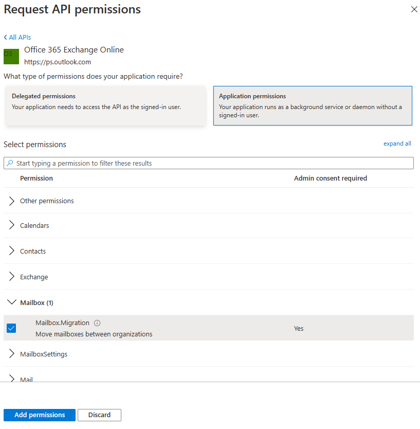

# Cross-tenant mailbox migration

During mergers or divestitures, you might need the ability to move your users' Exchange Online mailboxes into a new tenant. Cross-tenant mailbox migration allows tenant administrators to use well-known interfaces like Exchange Online PowerShell and MRS to transition users to their new organization.

Administrators can use the **New-MigrationBatch** cmdlet, available through the _Move Mailboxes_ management role, to execute cross-tenant moves.

Users migrating must be present in the target tenant Exchange Online system as a _MailUser_, marked with specific attributes to enable the cross-tenant moves. The system fails to move users that aren't properly set up in the target tenant.

After the moves are complete, the source user mailbox is converted to a `MailUser`, and the `targetAddress` (shown as _ExternalEmailAddress_ in Exchange) is stamped with the routing address to the destination tenant. This process leaves the legacy `MailUser` in the source tenant and allows for coexistence and mail routing. When business processes allow, the source tenant can remove the source MailUser or convert them to a mail contact.

Cross-tenant Exchange mailbox migrations are supported for tenants in hybrid or cloud only, or a combination of the two.

This article describes the process for cross-tenant mailbox moves and provides guidance on how to prepare source and target tenants for the Exchange Online mailbox content moves.

> [!IMPORTANT]
> Mailboxes that are on any type of hold aren't migrated, and the move for those mailboxes is blocked.

When a mailbox is migrated cross-tenant with this feature, only user-visible content in the mailbox (email, contacts, calendar, tasks, and notes) is migrated to the target (destination tenant). After a successful migration, the source mailbox is deleted. This deletion means that after migration, under no circumstances is the source mailbox available, discoverable, or accessible in the source tenant.

> [!NOTE]
> If you are interested in previewing our new feature **Domain Sharing for email** alongside your cross-tenant mailbox migrations, complete the form at [aka.ms/domainsharingpreview](https://aka.ms/domainsharingpreview). The **Domain sharing for email** feature enables users in separate Microsoft 365 tenants to send and receive email using addresses from the same custom domain. The feature is intended to solve scenarios where users in separate tenants need to represent a common corporate brand in their email addresses. The current preview supports sharing domains indefinitely and shared domains during cross-tenant mailbox migration coexistence.

## Licensing

> [!IMPORTANT]
> As of Nov. 2022, **Cross Tenant User Data Migration** is available as an add-on to the following Microsoft 365 subscription plans for Enterprise Agreement customers, and is required for cross-tenant migrations. User licenses are per migration (one-time fee) and can be assigned either on the source or target user object. This license also covers [OneDrive for Business migration](/microsoft-365/enterprise/cross-tenant-onedrive-migration). Contact your Microsoft account team for details.
>
> The Cross Tenant User Data Migration add-on is available as a separate purchase for Microsoft 365 Business Basic, Standard, and Premium; Microsoft 365 F1/F3/E3/E5/; Office 365 F3/E1/E3/E5; Exchange Online; SharePoint Online; and OneDrive for Business.

> [!WARNING]
> You must have purchased, or verified that you can purchase, cross-tenant user data migration licenses prior to the next steps. Migrations fail if this step hasn't been completed. Microsoft doesn't offer exceptions for this licensing requirement.

## Preparing source and target tenants

### Prerequisites for source and target tenants

Before starting, ensure that you have the necessary permissions to configure the Move Mailbox application in Azure, EXO Migration Endpoint, and the EXO Organization Relationship.

Additionally, at least one mail-enabled security group in the source tenant is required. These groups are used to scope the list of mailboxes that can move from source tenant (or sometimes referred to as resource) to the target tenant. This scoping allows the source tenant administrator to restrict or scope the specific set of mailboxes that need to be moved, preventing unintended users from being migrated. Nested groups aren't supported.

You also need to communicate with your trusted partner company (with whom you'll be moving mailboxes) to obtain their Microsoft 365 tenant ID. This tenant ID is used in the **Organization Relationship DomainName** field.

To obtain the tenant ID of a subscription, sign in to the [Microsoft 365 admin center](https://go.microsoft.com/fwlink/p/?linkid=2024339) and go to [https://aad.portal.azure.com/\#blade/Microsoft_AAD_IAM/ActiveDirectoryMenuBlade/Properties](https://aad.portal.azure.com/#blade/Microsoft_AAD_IAM/ActiveDirectoryMenuBlade/Properties). Select the **copy** icon for the **Tenant ID** property to copy it to the clipboard.

All users in both the source and target organizations must be licensed with the appropriate Exchange Online subscriptions. Also, ensure that you apply Cross Tenant User Data Migration licenses to all users who will be migrated to the target side.

### Configuration steps to enable your tenants for cross-tenant mailbox migrations

> [!NOTE]
> You must configure the target (destination) first. To complete these steps, you aren't required to have or know the tenant administrator credentials for both the source and target tenant. Steps can be performed individually for each tenant by different administrators.

### Prepare the target (destination) tenant by creating the migration application and secret

1. Sign in to your Azure AD portal (<https://portal.azure.com>) with your target tenant administrator credentials.

   

2. Under **Manage Azure Active Directory**, select **View**.

   

3. In the navigation pane, select **App registrations**.

4. Select **New registration**.

   

5. On the **Register an application** page, under **Supported account types**, select **Accounts in any organizational directory (Any Azure AD directory - Multi-tenant)**. Then, under **Redirect URI (optional)**, select **Web**, and then type `https://office.com`. Then, select **Register**.

   

   On the top-right corner of the page, see the notification dialog box that states the app was successfully created.

6. Go back to the Home page, go to **Azure Active Directory**, and then select **App registrations**.

7. Under **Owned applications**, find the app you created, and then select it.

8. Under **Essentials**, copy the **Application (client) ID**. You'll need this information later to create a URL for the target tenant.

9. In the navigation pane, select **API permissions** to view permissions assigned to your app.

10. By default, **User.Read** permissions are assigned to the app you created, but these permissions aren't required for mailbox migrations. You can remove those permissions.

    

11. To add permission for mailbox migration, select **Add a permission**.

12. In the **Request API permissions** window, select **APIs my organization uses**, search for `Office 365 Exchange Online`, and then select it.

    

13. Select **Application permissions**.

14. Under **Select permissions**, expand **Mailbox**, and check the **Mailbox.Migration** checkbox, and then select **Add permissions** at the bottom on the screen.

    

15. Now select **Certificates & secrets** in the navigation pane for your application.

16. Under **Client secrets**, select **New client secret**.

    

17. In the **Add a client secret** window, type a description, and then configure your expiration settings.

   > [!NOTE]
   > The password is used when creating your migration endpoint. It's extremely important that you copy this password to your clipboard and/or to a secure/secret password safe location. The secret creation stage is the only time during which you can see this password! If you do somehow lose it or need to reset it, you can sign back into the Azure portal, go to **App registrations**, find your migration app, select **Secrets & certificates**, and then create a new secret for your app.

Now that you've successfully created the migration application and secret, the next step is to consent to the application. 

### Grant consent to the application

1. In the Azure Active Directory landing page, select **Enterprise applications** in the navigation pane; then find your migration app you created, select it, and then select **Permissions**.

2. Select **Grant admin consent for [your tenant]**. A new browser window opens.

3. Select **Accept**.

4. Go back to your portal window and select **Refresh** to confirm your acceptance.

5. Formulate the URL to send to your trusted partner (source tenant administrator) so that they can also accept the application to enable mailbox migration.

   Here's an example of the URL to provide to them:

   `https://login.microsoftonline.com/contoso.onmicrosoft.com/adminconsent?client_id=[application_id_of_the_app_you_just_created]&redirect_uri=https://office.com`

   > [!NOTE]
   > You'll need the application ID of the mailbox migration app you just created.
   > You'll need to replace contoso.onmicrosoft.com in the above example with your source tenant's correct onmicrosoft.com name.
   > You'll also need to replace [application_id_of_the_app_you_just_created] with the application ID of the mailbox migration app you just created.

### Prepare the target tenant by creating the Exchange Online migration endpoint and organization relationship

1. [Connect to Exchange Online PowerShell](/powershell/exchange/connect-to-exchange-online-powershell) in the target Exchange Online tenant.

2. Create a new migration endpoint for Cross-tenant mailbox moves.

   > [!NOTE]
   > You'll need the application ID of the mailbox migration app you just created and the password (secret) you configured in [Prepare the target (destination) tenant by creating the migration application and secret](#prepare-the-target-destination-tenant-by-creating-the-migration-application-and-secret). Depending on the Microsoft 365 cloud instance you use, your endpoint may be different. See the [Microsoft 365 endpoints](/microsoft-365/enterprise/microsoft-365-endpoints) page; select the correct instance for your tenant; then review the Exchange Online _Optimize/Required_ address, and replace as appropriate.

   ```PowerShell
   # Enable customization if tenant is dehydrated
   $dehydrated=Get-OrganizationConfig | select isdehydrated
   if ($dehydrated.isdehydrated -eq $true) {Enable-OrganizationCustomization}
   $AppId = "[Guid copied from the migrations app]"
   $Credential = New-Object -TypeName System.Management.Automation.PSCredential -ArgumentList $AppId, (ConvertTo-SecureString -String "[this is your secret password you saved in the 
   previous steps]" -AsPlainText -Force)
   New-MigrationEndpoint -RemoteServer outlook.office.com -RemoteTenant "contoso.onmicrosoft.com" -Credentials $Credential -ExchangeRemoteMove:$true -Name "[the name of your migration 
   endpoint]" -ApplicationId $AppId
   ```

3. Create a new organization relationship object or edit your existing organization relationship object to your source tenant.

   ```PowerShell
   $sourceTenantId="[tenant id of your trusted partner, where the source mailboxes are]"
   $orgrels=Get-OrganizationRelationship
   $existingOrgRel = $orgrels | ?{$_.DomainNames -like $sourceTenantId}
   If ($null -ne $existingOrgRel)
   {
       Set-OrganizationRelationship $existingOrgRel.Name -Enabled:$true -MailboxMoveEnabled:$true -MailboxMoveCapability Inbound
   }
   If ($null -eq $existingOrgRel)
   {
       New-OrganizationRelationship "[name of the new organization relationship]" -Enabled:$true -MailboxMoveEnabled:$true -MailboxMoveCapability Inbound -DomainNames $sourceTenantId
   }
   ```

### Prepare the source (current mailbox location) tenant by accepting the migration application and configuring the organization relationship

1. Using your browser, go to the URL link provided by your trusted partner to consent to the mailbox migration application. The URL should look like this:

   `https://login.microsoftonline.com/contoso.onmicrosoft.com/adminconsent?client_id=[application_id_of_the_app_you_just_created]&redirect_uri=https://office.com`

   > [!NOTE]
   > You'll need the application ID of the mailbox migration app you just created. You will need to replace `contoso.onmicrosoft.com` in the previous example with your source tenant's `onmicrosoft.com` URL. You'll also need to replace [application_id_of_the_app_you_just_created] with the application ID of the mailbox migration app you just created.

2. Accept the application when the pop up appears. You can also sign in to your Azure Active Directory portal and find the application under **Enterprise applications**.

3. [Connect to Exchange Online PowerShell](/powershell/exchange/connect-to-exchange-online-powershell) on the source Exchange Online tenant.

4. Create a new organization relationship object or edit your existing organization relationship object to your target (destination) tenant in Exchange Online PowerShell:

   ```PowerShell
   $targetTenantId="[tenant id of your trusted partner, where the mailboxes are being moved to]"
   $appId="[application id of the mailbox migration app you consented to]"
   $scope="[name of the mail enabled security group that contains the list of users who are allowed to migrate]"
   New-DistributionGroup -Type Security -Name $scope
   $orgrels=Get-OrganizationRelationship
   $existingOrgRel = $orgrels | ?{$_.DomainNames -like $targetTenantId}
   If ($null -ne $existingOrgRel)
   {
       Set-OrganizationRelationship $existingOrgRel.Name -Enabled:$true -MailboxMoveEnabled:$true -MailboxMoveCapability RemoteOutbound -OAuthApplicationId $appId - MailboxMovePublishedScopes $scope
   }
   If ($null -eq $existingOrgRel)
   {
       New-OrganizationRelationship "[name of your organization relationship]" -Enabled:$true -MailboxMoveEnabled:$true -MailboxMoveCapability RemoteOutbound -DomainNames $targetTenantId 
   -OAuthApplicationId $appId -MailboxMovePublishedScopes $scope
   }
   ```

> [!NOTE]
> The tenant ID that you enter as the \$sourceTenantId and \$targetTenantId is the GUID and not the tenant domain name. For an example of a tenant ID and information about finding your tenant ID, see [Find your Microsoft 365 tenant ID](/onedrive/find-your-office-365-tenant-id).

## Prepare target user objects for migration

Users migrating must be present in the target tenant and Exchange Online system (as a MailUser) marked with specific attributes to enable the Cross-tenant moves. The system will fail to move users that aren't properly set up in the target tenant. The [Prerequisites for target user objects](#prerequisites-for-target-user-objects) section details the MailUser object requirements for the target tenant.

### Prerequisites for target user objects

Ensure the following objects and attributes are set in the target organization:

> [!TIP]
> Microsoft is developing a feature to provide a secure automated method to set many of the attributes (specified below, in this section). This feature, named Cross-Tenant Identity Mapping, is currently looking for customers willing to participate in a small private preview. For more information about this pre-release feature and how it can simplify your Cross-tenant migration processes, see [Cross-Tenant Identity Mapping](cross-tenant-identity-mapping.md).

For any mailbox moving from a source organization, you must provision a MailUser object in the Target organization:

   1. The Target MailUser must have these attributes from the source mailbox or assigned with the new User object:

      1. ExchangeGUID (direct flow from source to target): The mailbox GUID must match. The move process won't proceed if this attribute isn't present on target object.
      2. ArchiveGUID (direct flow from source to target): The archive GUID must match. The move process won't proceed if this attribute isn't present on the target object. (This attribute is only required if the source mailbox is Archive enabled).
      3. LegacyExchangeDN (flow as proxyAddress, "x500:\<LegacyExchangeDN\>"): The LegacyExchangeDN must be present on target MailUser as x500: proxyAddress. **In addition, you also need to copy all x500 addresses from the source mailbox to the target mail user.** The move processes won't proceed if these x500 addresses aren't present on the target object. Also, this step is important for enabling reply ability for emails that are sent before migration. The sender/recipient address in each email item and the auto-complete cache in Microsoft Outlook and in Microsoft Outlook Web App (OWA) use the value of the LegacyExchangeDN attribute. If a user can't be located using the LegacyExchangeDN value, the delivery of email messages may fail with a 5.1.1 NDR.
      4. UserPrincipalName: UPN will align to the user's NEW identity or target company (for example, user@northwindtraders.onmicrosoft.com).
      5. Primary SMTPAddress: Primary SMTP address will align to the user's NEW company (for example, user@northwindtraders.com).
      6. TargetAddress/ExternalEmailAddress: MailUser will reference the user's current mailbox hosted in source tenant (for example user@contoso.onmicrosoft.com). When this value is being assigned, verify that you have/are also assigning PrimarySMTPAddress; else, this value will set the PrimarySMTPAddress, which will cause move failures.
      7. You can't add legacy smtp proxy addresses from source mailbox to target MailUser. For example, you can't maintain contoso.com on the MEU in northwindtraders.onmicrosoft.com tenant objects. Domains are associated with one Azure AD or Exchange Online tenant only.

         Example **target** MailUser object:

      | Attribute            | Value                                                                                                                                |
      | -------------------- | ------------------------------------------------------------------------------------------------------------------------------------ |
      | Alias                | LaraN                                                                                                                                |
      | RecipientType        | MailUser                                                                                                                             |
      | RecipientTypeDetails | MailUser                                                                                                                             |
      | UserPrincipalName    | LaraN@northwintraders.onmicrosoft.com                                                                                                |
      | PrimarySmtpAddress   | Lara.Newton@northwindtraders.com                                                                                                     |
      | ExternalEmailAddress | SMTP:LaraN@contoso.onmicrosoft.com                                                                                                   |
      | ExchangeGUID         | 1ec059c7-8396-4d0b-af4e-d6bd4c12a8d8                                                                                                 |
      | LegacyExchangeDN     | /o=First Organization/ou=Exchange Administrative Group (FYDIBOHF23SPDLT)/cn=Recipients/cn=74e5385fce4b46d19006876949855035-Lara      |
      | EmailAddresses       | x500:/o=First Organization/ou=Exchange Administrative Group (FYDIBOHF23SPDLT)/cn=Recipients/cn=d11ec1a2cacd4f81858c81907273f1f9-Lara |
      |                      | smtp:LaraN@northwindtraders.onmicrosoft.com                                                                                          |
      |                      | SMTP:Lara.Newton@northwindtraders.com                                                                                                |
      |                      | X500:/o=ExchangeLabs/ou=Exchange Administrative Group (FYDIBOHF23SPDLT)/cn=Recipients/cn=f161af74128f460fba5c0c23984b3d6c-Lara       |

         Example **source** Mailbox object:

      | Attribute            | Value                                                                                                                          |
      | -------------------- | ------------------------------------------------------------------------------------------------------------------------------ |
      | Alias                | LaraN                                                                                                                          |
      | RecipientType        | UserMailbox                                                                                                                    |
      | RecipientTypeDetails | UserMailbox                                                                                                                    |
      | UserPrincipalName    | LaraN@contoso.onmicrosoft.com                                                                                                  |
      | PrimarySmtpAddress   | Lara.Newton@contoso.com                                                                                                        |
      | ExchangeGUID         | 1ec059c7-8396-4d0b-af4e-d6bd4c12a8d8                                                                                           |
      | LegacyExchangeDN     | /o=First Organization/ou=Exchange Administrative Group (FYDIBOHF23SPDLT)/cn=Recipients/cn=d11ec1a2cacd4f81858c81907273f1f9-Lara|
      | EmailAddresses       | smtp:LaraN@contoso.onmicrosoft.com                                                                                             |
      |                      | SMTP:Lara.Newton@contoso.com                                                                                                   |
      |                      | X500:/o=ExchangeLabs/ou=Exchange Administrative Group (FYDIBOHF23SPDLT)/cn=Recipients/cn=f161af74128f460fba5c0c23984b3d6c-Lara |

7. Other attributes may be included in Exchange hybrid write-back already. If not, they should be included.

   1. `msExchBlockedSendersHash` – Writes back online safe and blocked sender data from clients to on-premises Active Directory.
   2. `msExchSafeRecipientsHash` – Writes back online safe and blocked sender data from clients to on-premises Active Directory.
   3. `msExchSafeSendersHash` – Writes back online safe and blocked sender data from clients to on-premises Active Directory.

   Users in the target organization must be licensed with appropriate Exchange Online subscriptions applicable for the organization. You may apply a license in advance of a mailbox move but ONLY once the target MailUser is properly set up with ExchangeGUID and proxy addresses. Applying a license before the ExchangeGUID is applied will result in a new mailbox provisioned in target organization. You must also apply a Cross Tenant User Data Migration license; else, you may see a transient error reading **needs approval**, which will report a warning in the move report that a license hasn't been applied to the target user.

   > [!NOTE]
   > When you apply a license on a Mailbox or MailUser object, all SMTP type proxyAddresses are scrubbed to ensure only verified domains are included in the Exchange EmailAddresses array.

8. You must ensure that the target MailUser has no previous ExchangeGUID that doesn't match the Source ExchangeGUID. This mismatch might occur if the target MEU was previously licensed for Exchange Online and provisioned a mailbox. If the target MailUser was previously licensed for or had an ExchangeGUID that doesn't match the Source ExchangeGUID, you need to perform a cleanup of the cloud MEU. For these cloud MEUs, you can run `Set-User <identity> -PermanentlyClearPreviousMailboxInfo`.

> [!CAUTION]
> This process is irreversible. If the object has a softDeleted mailbox, it can't be restored after this point. Once cleared, however, you can synchronize the correct ExchangeGUID to the target object, and MRS will connect the source mailbox to the newly created target mailbox. (Reference EHLO blog on the new parameter.)

Find objects that were previously mailboxes using the following command:

```PowerShell
Get-User <identity> | select Name, *recipient* | Format-Table -AutoSize
```

Here's an example:

```PowerShell
Get-User John@northwindtraders.com |select name, *recipient*| Format-Table -AutoSize

Name       PreviousRecipientTypeDetails     RecipientType RecipientTypeDetails
----       ---------------------------- ------------- --------------------
John       UserMailbox                  MailUser      MailUser
```

Clear the soft-deleted mailbox using the following command:

```PowerShell
Set-User <identity> -PermanentlyClearPreviousMailboxInfo
```

Here's an example:

```PowerShell
Set-User John@northwindtraders.com -PermanentlyClearPreviousMailboxInfo -Confirm

Are you sure you want to perform this action?
Delete all existing information about user "John@northwindtraders.com"?. This operation will clear existing values from Previous home MDB and Previous Mailbox GUID of the user. After deletion, reconnecting to the previous mailbox that existed in the cloud will not be possible and any content it had will be unrecoverable PERMANENTLY.
Do you want to continue?
[Y] Yes  [A] Yes to All  [N] No  [L] No to All  [?] Help (default is "Y"): Y
```

### How do I know this worked?

You can verify Cross-tenant mailbox migration configuration by running the [Test-MigrationServerAvailability](/powershell/module/exchange/Test-MigrationServerAvailability) cmdlet against the Cross-tenant migration endpoint that you created on your target tenant. Run the following cmdlet from target tenant:

```PowerShell
Test-MigrationServerAvailability -EndPoint "[the name of your migration endpoint]" -TestMailbox "[Primary SMTP of MailUser object in target tenant]"
```

> [!NOTE]
> Additionally, you may want to take advantage of the [Cross-tenant mailbox migration validation script](https://aka.ms/crosstenantmailboxmigrationvalidationscript), which will allow you to validate the organizations being correctly setup between them, and the objects you are planning to migrate from one tenant to another. The script will help identify any discrepancies that may be present on all objects at once, and as a result, it will reduce the time spent on the initial phase.

### Move mailboxes back to the original source

If a mailbox is required to move back to the original source tenant, the same set of steps and scripts must be run in both new source and new target tenants, with some variance.

Do not run the sample scripts provided to create the OrganizationRelationship.

Update the following values in the existing OrganizationRelationship created in each tenant:

- MailboxMovesCapability should have Inbound, RemoteOutbound as the capabilities in both source and target tenants.
- In the new source tenant, update the OAuthApplicationId value with the value from the newly created application in the new source tenant.
- In the new new source tenant, update the MailboxMovePublishedScopes value with the newly created security group in the new source tenant.

### Perform mailbox migrations

Cross-tenant Exchange mailbox migrations are initiated from the target tenant as migration batches. This process is similar to the way on-boarding migration batches work when migrating from Exchange on-premises to Microsoft 365.

### Create Migration batches

Here's an example command for initiating a batch migration:

```PowerShell
New-MigrationBatch -Name T2Tbatch -SourceEndpoint target_source_7977 -CSVData ([System.IO.File]::ReadAllBytes('users.csv')) -Autostart -TargetDeliveryDomain northwindtraders.onmicrosoft.com

Identity                   Status  Type               TotalCount
--------                   ------  ----               ----------
T2Tbatch                   Syncing ExchangeRemoteMove 1
```

> [!NOTE]
> The email address in the CSV file must be the one specified in the target tenant (for example, userA@northwindtraders.onmicrosoft.com), not the one in the source tenant.
> [For more information on the cmdlet click here](/powershell/module/exchange/new-migrationbatch)
> [For some example CSV file info click here](/exchange/csv-files-for-mailbox-migration-exchange-2013-help)

A minimal example of a CSV file is:

```csv
EmailAddress
userA@northwindtraders.onmicrosoft.com
userB@northwindtraders.onmicrosoft.com
userC@northwindtraders.onmicrosoft.com
```

Migration batch submission is also supported from the new [Exchange admin center](https://go.microsoft.com/fwlink/p/?linkid=2059104) when selecting the cross-tenant option.

### Update on-premises MailUsers

Once the mailbox moves from source to target, you should ensure that the on-premises mail users, in both the source and target, are updated with the new targetAddress. In the examples, the targetDeliveryDomain used in the move is **northwindtraders.onmicrosoft.com**. Update the mail users with this targetAddress.

### Remove endpoints and organization relationships after migration

Use the [Remove-MigrationEndpoint](/PowerShell/module/exchange/remove-migrationendpoint) cmdlet to remove existing migration endpoints for source or destination servers after the migration is complete.

Use the [Remove-OrganizationRelationship](/exchange/sharing/organization-relationships/remove-an-organization-relationship\#use-exchange-online-PowerShell-to-remove-an-organization-relationship) cmdlet to remove existing organization relationships for source or destination servers after the migration is complete.

## Frequently asked questions

### Do I need to update RemoteMailboxes in the source on-premises tenant after the move?

#### Source Exchange Organization

You should update the targetAddress (RemoteRoutingAddress/ExternalEmailAddress) of each source on-premises user when the source tenant mailbox moves to the target tenant. While mail routing can follow the referrals across multiple mail users with different targetAddresses, Free/Busy lookups for mail users **must** target the location of the mailbox user.

#### Target Exchange Organization

After migration is complete in a hybrid organization, run the following PowerShell command if you want your users to have remote mailboxes on-premises: 

```PowerShell
Get-MailUser -Identity <Migrate Mail User> | Enable-RemoteMailbox
```

### Do Teams meetings migrate cross-tenant?

While Teams meetings are moved, the meeting URL isn't updated when items migrate cross-tenant. Since the URL will be invalid in the target tenant, you must remove and recreate Teams meetings.

### What content is migrated cross-tenant?

When a mailbox is migrated cross-tenant with this feature, only user-visible content in the mailbox, also known as Top of Information Store (email, contacts, calendar, tasks, and notes), and the Recoverable Items folders Deletions, Versions, and Purges are migrated.

### Do items in the Outbox get migrated cross-tenant?

Items in the Outbox aren't migrated cross-tenant as this folder is a client-based folder specific to the Outlook client. Items in the Outbox are stored locally, and not synced to the cloud.

### Does the Teams chat folder content migrate cross-tenant?

No, the Teams chat folder content doesn't migrate cross-tenant. However, once the mailbox has been migrated cross-tenant, the Teams chat folder content will be available for source tenant administrator to search and export, using a content search.

### How can I see just moves that are cross-tenant moves, not my onboarding and off-boarding moves?

Use the _Flags_ parameter:

```PowerShell
Get-MoveRequest -Flags "CrossTenant"
```

### Can you provide example scripts for copying attributes used in testing?

> [!NOTE]
> SAMPLE – AS IS, NO WARRANTY This script assumes a connection to both source mailbox (to get source values) and the target on-premises Active Directory Domain Services (to stamp the ADUser object).

```PowerShell
# This will export users from the source tenant with the CustomAttribute1 = "Cross-Tenant-Project"
# These are the 'target' users to be moved to the northwindtraders tenant
$outFileUsers = "$home\desktop\UsersToMigrate.txt"
$outFileUsersXML = "$home\desktop\UsersToMigrate.xml"
Get-Mailbox -Filter "CustomAttribute1 -like 'Cross-Tenant-Project'" -ResultSize Unlimited | Select-Object -ExpandProperty  Alias | Out-File $outFileUsers
$mailboxes = Get-Content $outFileUsers
$mailboxes | ForEach-Object {Get-Mailbox $_} | Select-Object PrimarySMTPAddress,Alias,SamAccountName,FirstName,LastName,DisplayName,Name,ExchangeGuid,ArchiveGuid,LegacyExchangeDn,EmailAddresses | Export-Clixml $outFileUsersXML
```

```PowerShell
# Copy the file $outfile to the desktop of the target on-premises then run the below to create MEU in Target
$symbols = '!@#$%^&*'.ToCharArray()
$characterList = @([char[]]([char]'a'..[char]'z'), [char[]]([char]'A'..[char]'Z'), [char[]]([char]'0'..[char]'9') + $symbols)

function GeneratePassword {
    param(
        [ValidateRange(12, 256)]
        [int]
        $length = 16
    )

    do {
        $password = -join (0..$length | ForEach-Object { $characterList | Get-Random })
        [int]$hasLowerChar = $password -cmatch '[a-z]'
        [int]$hasUpperChar = $password -cmatch '[A-Z]'
        [int]$hasDigit = $password -match '[0-9]'
        [int]$hasSymbol = $password.IndexOfAny($symbols) -ne -1

    }
    until (($hasLowerChar + $hasUpperChar + $hasDigit + $hasSymbol) -ge 3)

    $password | ConvertTo-SecureString -AsPlainText
}

$mailboxes = Import-Clixml $home\desktop\UsersToMigrate.xml
foreach ($m in $mailboxes) {
    $organization = "@contoso.onmicrosoft.com"
    $mosi = $m.Alias + $organization
    $Password = GeneratePassword
    $x500 = "x500:" + $m.LegacyExchangeDn
    $tmpUser = New-MailUser -MicrosoftOnlineServicesID $mosi -PrimarySmtpAddress $mosi -ExternalEmailAddress $m.PrimarySmtpAddress -FirstName $m.FirstName -LastName $m.LastName -Name $m.Name -DisplayName $m.DisplayName -Alias $m.Alias -Password $Password
    $tmpUser | Set-MailUser -EmailAddresses @{add = $x500 } -ExchangeGuid $m.ExchangeGuid -ArchiveGuid $m.ArchiveGuid -CustomAttribute1 "Cross-Tenant-Project"
    $tmpx500 = $m.EmailAddresses | Where-Object { $_ -match "x500" }
    $tmpx500 | ForEach-Object { Set-MailUser $m.Alias -EmailAddresses @{add = "$_" } }
}

# Now synchronize the changes from On-Premises to Azure and Exchange Online in the target tenant
# This action should create the target mail enabled users (MEUs) in the Target tenant
Start-ADSyncSyncCycle
```

### How do we access Outlook on Day 1 after the user mailbox is moved?

Since only one tenant can own a domain, the former primary SMTPAddress won't be associated to the user in the target tenant when the mailbox move completes; only those domains associated with the new tenant. Outlook uses the user's new UPN to authenticate to the service, and the Outlook profile expects to find the legacy primary SMTPAddress to match the mailbox in the target system. Since the legacy address isn't in the target system, the outlook profile won't connect to find the newly moved mailbox.

For this initial deployment, users will need to rebuild their profile with their new UPN, primary SMTP address and resync OST content.

> [!NOTE]
> Plan accordingly as you batch your users for completion. You need to account for network utilization and capacity when Outlook client profiles are created and subsequent OST and OAB files are downloaded to clients.

### What Exchange RBAC roles do I need to be member of to set up or complete a cross-tenant move?

There's a matrix of roles based on assumption of delegated duties when executing a mailbox move. Currently, two roles are required:

- The first role is for a one-time setup task that establishes the authorization of moving content into or out of your tenant/organizational boundary. As moving data out of your organizational control is a critical concern for all companies, we opted for the highest assigned role of **Organization Administrator**. This role must alter or set up a new OrganizationRelationship that defines the `-MailboxMoveCapability` setting with the remote organization. Only the organization administrator can alter the `-MailboxMoveCapability` setting, while other attributes on the OrganizationRelationship can be managed by the Federated Sharing administrator.
- The role of executing the actual move commands can be delegated to a lower-level function. The role of **Move Mailboxes** is assigned to the capability of moving mailboxes in or out of the organization.

### How do we target which SMTP address is selected for targetAddress (TargetDeliveryDomain) on the converted mailbox (to MailUser conversion)?

Exchange mailbox moves using MRS craft the targetAddress on the original source mailbox when converting to a MailUser by matching an email address (proxyAddress) on the target object. The process takes the `-TargetDeliveryDomain` value passed into the command, then checks for a matching proxy for that domain on the target side. When we find a match, the matching proxyAddress is used to set the ExternalEmailAddress (targetAddress) on the converted mailbox (now MailUser) object.

### How does mail flow work after migration?

Cross-Tenant mail flow after migration works similar to Exchange Hybrid mail flow. Each migrated mailbox needs the source MailUser with the correct target address to forward incoming mail from source tenant to mailboxes in target tenant. Transport rules, security and compliance features will run as configured in each tenant that the mail flows through. So, for inbound mail, features like anti-spam, anti-malware, quarantine, transport rules and journaling rules will run in the source tenant first, then in the target tenant.

### How do mailbox permissions transition?

Mailbox permissions include Send on Behalf of and Mailbox Access:

- Send On Behalf Of (AD:publicDelegates) stores the DN of recipients with access to a user's mailbox as a delegate. This value is stored in the Active Directory and currently doesn't move as part of the mailbox transition. If the source mailbox has publicDelegates set, you'll need to restamp the publicDelegates on the target Mailbox once the MEU to Mailbox conversion completes in the target environment by running `Set-Mailbox <principle> -GrantSendOnBehalfTo <delegate>`.
- Mailbox Permissions that are stored in the mailbox will move with the mailbox when both the principal and the delegate are moved to the target system. For example, the user TestUser*7 is granted FullAccess to the mailbox TestUser_8 in the tenant SourceCompany.onmicrosoft.com. After the mailbox moves complete to TargetCompany.onmicrosoft.com, the same permissions are set up in the target directory. Examples using \_Get-MailboxPermission* for TestUser_7 in both source and target tenants are shown below. Exchange cmdlets are prefixed with source and target accordingly.

Here's an example of the output of the mailbox permission before a move from the source side:

```PowerShell
Get-MailboxPermission TestUser_7 | Format-Table -AutoSize User, AccessRights, is Inherited, Deny

User                                             AccessRights                         IsInherited Deny
----                                             ------------                         ----------- ----
NT AUTHORITY\SELF                                {FullAccess, ReadPermission}         False       False
TestUser_8@contoso.onmicrosoft.com               {FullAccess}                         False       False
```

Here's an example of the output of the mailbox permission after the move from the target side:

```PowerShell
Get-MailboxPermission TestUser_7 | Format-Table -AutoSize User, AccessRights, IsInherited, Deny

User                                             AccessRights                         IsInherited Deny
----                                             ------------                         ----------- ----
NT AUTHORITY\SELF                                {FullAccess, ReadPermission}         False       False
TestUser_8@northwindtraders.onmicrosoft.com      {FullAccess}                         False       False
```

> [!NOTE]
> Cross-tenant mailbox and calendar permissions aren't supported. You must organize principals and delegates into consolidated move batches so that these connected mailboxes are transitioned at the same time from the source tenant.

### What X500 proxy should be added to the target MailUser proxy addresses to enable migration?

The cross-tenant mailbox migration requires that the LegacyExchangeDN value of the source mailbox object be stamped as an x500 email address on the target MailUser object.

Example:

```PowerShell
LegacyExchangeDN value on source mailbox is:
/o=First Organization/ou=Exchange Administrative Group(FYDIBOHF23SPDLT)/cn=Recipients/cn=d11ec1a2cacd4f81858c81907273f1f9Lara

so, the x500 email address to be added to target MailUser object would be:
x500:/o=First Organization/ou=Exchange Administrative Group (FYDIBOHF23SPDLT)/cn=Recipients/cn=d11ec1a2cacd4f81858c81907273f1f9-Lara
```

> [!NOTE]
> In addition to this X500 proxy, you will need to copy all X500 proxies from the mailbox in the source to the mailbox in the target.
> While rare, you could also run across an X400 proxy address on a mailbox, while not a requirement for the move to complete, it is recommended that you also stamp this address on the target mail user object.


### Can the source and target tenants utilize the same domain name?

No, the source tenant and target tenant domain names must be unique, for example, a source domain of contoso.com and the target domain of northwindtraders.com.

### Will shared mailboxes move and still work?

Yes. However, we only keep the store permissions as described in these articles:

- [Manage permissions for recipients in Exchange Online](/exchange/recipients-in-exchange-online/manage-permissions-for-recipients)
- [How to grant Exchange and Outlook mailbox permissions in Office 365 dedicated](https://support.microsoft.com/topic/how-to-grant-exchange-and-outlook-mailbox-permissions-in-office-365-dedicated-bac01b2c-08ff-2eac-e1c8-6dd01cf77287)

### Do you have any recommendations for batches?

Don't exceed 2,000 mailboxes per batch. We strongly recommend submitting batches two weeks prior to the cut-over date as there's no impact on the end users during synchronization. If you need guidance for mailboxes quantities over 50,000, you can reach out to the Engineering Feedback Distribution List at crosstenantmigrationpreview@service.microsoft.com.

### What if I use Service encryption with Microsoft Purview Customer Key?

The mailbox is decrypted prior to moving. Ensure Customer Key is configured in the target tenant if it's still required. For more information, see [here](/microsoft-365/compliance/customer-key-overview).

### What is the estimated migration time?

To help you plan your migration, the table present [here](/exchange/mailbox-migration/office-365-migration-best-practices#estimated-migration-times) shows the guidelines about when to expect bulk mailbox migrations or individual migrations to complete. These estimates are based on a data analysis of previous customer migrations. As every environment is unique, your exact migration velocity can vary.

### Protecting documents in the source tenant consumable by users in the destination tenant.\*\*

Cross-tenant migration only migrates mailbox data and nothing else. There are multiple other options, which are documented in the following blog post that may help: 

<https://techcommunity.microsoft.com/t5/security-compliance-and-identity/mergers-and-spinoffs/ba-p/910455>

### Can I have the same labels in the destination tenant as you had in the source tenant, either as the only set of labels or an additional set of labels for the migrated users depending on alignment between the organizations.\*\*

Because cross-tenant migrations don't export labels and there's no way to share labels between tenants, you can only achieve this objective by recreating the labels in the destination tenant.

### Do you support moving Microsoft 365 Groups?

Currently the cross-tenant mailbox migrations feature doesn't support the migration of Microsoft 365 Groups.

### Can a source tenant admin perform an eDiscovery search against a mailbox after the mailbox has been migrated to the new/target tenant?

No, after a cross-tenant mailbox migration, eDiscovery against the migrated user's mailbox in the source doesn't work. This eDiscovery failure is because there's no longer a mailbox in the source to search for as the mailbox has been migrated to the target tenant and now belongs to the target tenant. eDiscovery after mailbox migration can only be done in the target tenant (where the mailbox now exists). If a copy of the source mailbox needs to persist in the source tenant after migration, the administrator in the source tenant can copy the contents to an alternate mailbox pre-migration for future eDiscovery operations against the data.

### At which point will the destination MailUser be converted to a destination mailbox and the source mailbox converted to a source MailUser?

These conversions happen automatically during the migration process. No manual steps are necessary.

### At which step should I assign the Exchange Online license to destination MailUsers?

This license assignation can be done before the migration is complete, but you shouldn't assign a license prior to stamping the _ExchangeGUID_ attribute; else, the conversion of MailUser object to mailbox will fail and a new mailbox will be created instead. To mitigate this risk, it's best to wait until the migration is complete and assign licenses during the 30-day grace period.

### Can I use Azure AD Connect to sync users to the new tenant if I'm keeping the on-premises Active Directory?

Yes. It's possible to have two instances of Azure AD Connect synchronize to different tenants. However, there are some things you need to be aware of:

- Preprovisioning the user's accounts with the script provided in this article shouldn't be done. Instead, a selective OU sync of the users in scope for the migration can be performed to populate the target tenant. You'll receive a warning about the UPN not matching during Azure AD Connect configuration.
- Depending on your current state of hybrid Exchange, you need to verify that the on-premises directory objects have the required attributes (such as msExchMailboxGUID and proxyAddresses) populated correctly before attempting to sync to another tenant; else you'll run into issues with double mailboxes and migration failures.
- You must take some extra steps to manage UPN transitioning, changing it on-premises once the migration has been completed for a user unless you're also moving the custom domain during a cut-over migration.

### Do auto-expanded archive mailboxes move?

**Issue: Auto Expanded archives cannot be migrated.** Yes, if the user in source has auto-expanding archives enabled and has additional auxiliary archives, cross-tenant mailbox migration will work. We support moving users that have no more than 12 auxiliary archive mailboxes. Additionally, users with large primary, large main archive, and large auxiliary archive mailboxes will require extra time to synchronize and should be submitted well in advance of the cut-over date. If the source mailbox is expanded during the mailbox migration process, the migration will fail as a new auxiliary archive will be created in the source, but not in the target. In this case, you'll need to remove the user from the batch and resubmit them.

### Can I perform a cross cloud tenant to tenant migration?

Cross cloud tenant to tenant migration is not supported. An example scenario would be moving from Office 365 Worldwide to Office 365 Government Cloud.

### Are voicemails migrated cross tenant?

Yes, voicemails are migrated cross tenant.

- Received voicemails in email as attachments are available in the target mailbox.
- Received voicemails are available in Teams if you call voicemail and listen to saved messages. (VMs received in source are available as saved messages)
- Received voicemails are not available in Teams client UI in target post migration.
- The voicemail greeting is also migrated to the target.

### Are mailbox signatures migrated cross tenant?

Mailbox signatures are not migrated cross tenant and must be recreated.

## Known issues

- Post-migration Teams functionality in the source tenant will be limited. After the mailbox is migrated to the target tenant, Teams in the source tenant no longer has access to the user's mailbox. If a user signs in to Teams with the source tenant credential, there's a loss of functionality such as the inability to update their profile picture, no calendar application, and an inability to search and join public teams.

- Cloud MailUsers with non-owned smtp proxyAddress block MRS moves. When creating target tenant MailUser objects, you must ensure that all SMTP proxy addresses belong to the target tenant organization. If an SMTP proxyAddress exists on the target mail user that doesn't belong to the local tenant, the conversion of the MailUser to a mailbox is prevented. This prevention is due to our assurance that mailbox objects can only send mail from domains for which the tenant is authoritative (domains claimed by the tenant).

- If you synchronize users from on-premises using Azure AD Connect in the target tenant, then you can provision on-premises MailUser objects with ExternalEmailAddress pointing to the source tenant where the mailbox exists (LaraN@contoso.onmicrosoft.com), and you stamp the PrimarySMTPAddress as a domain that resides in the target tenant (Lara.Newton@northwindtraders.com). These values synchronize down to the tenant and an appropriate mail user is provisioned and is ready for migration. An example object is shown here.

```PowerShell
Get-MailUser LaraN | select ExternalEmailAddress, EmailAddresses

ExternalEmailAddress               EmailAddresses
--------------------               --------------
SMTP:LaraN@contoso.onmicrosoft.com {SMTP:lara.newton@northwindtraders.com}
```

> [!NOTE]
> The _contoso.onmicrosoft.com_ address is _not_ present in the EmailAddresses/proxyAddresses array.

- MailUser objects with "external" primary SMTP addresses are modified/reset to "internal" company-claimed domains.

  MailUser objects are pointers to non-local mailboxes. In the case for cross-tenant mailbox migrations, we use MailUser objects to represent either the source mailbox (from the target organization's perspective) or target mailbox (from the source organization's perspective). The MailUsers will have an ExternalEmailAddress (targetAddress) that points to the smtp address of the actual mailbox (ProxyTest@northwindtraders.onmicrosoft.com) and primarySMTP address that represents the displayed SMTP address of the mailbox user in the directory. Some organizations choose to display the primary SMTP address as an external SMTP address, not as an address owned/verified by the local tenant (for example, as northwindtraders.com rather than as contoso.com). However, once an Exchange service plan object is applied to the MailUser via licensing operations, the primary SMTP address is modified to show as a domain verified by the local organization (contoso.com). There are two potential reasons:

- When any Exchange service plan is applied to a MailUser, the Azure AD process starts to enforce proxy scrubbing to ensure that the local organization isn't able to send out mail, spoof, or mail from another tenant. Any SMTP address on a recipient object with these service plans will be removed if the address isn't verified by the local organization. As is the case in the example, the northwindtraders.com domain isn't verified by the contoso.onmicrosoft.com tenant; therefore, the scrubbing removes that northwindtraders.com domain. If you wish to persist these external domains on MailUser, either before or after the migration, you need to alter your migration processes to strip licenses after the move completes or before the move to ensure that the users have the expected external branding applied. You'll need to ensure that the mailbox object is properly licensed to not affect mail service. An example script to remove the service plans on a MailUser in the contoso.onmicrosoft.com tenant is shown here.

```PowerShell
$LO = New-MsolLicenseOptions -AccountSkuId "contoso:ENTERPRISEPREMIUM" DisabledPlans "LOCKBOX_ENTERPRISE","EXCHANGE_S_ENTERPRISE","INFORMATION_BARRIERS","MIP_S_CLP2","MIP_S_CLP1","MYANALYTICS_P2","EXCHANGE_ANALYTICS","EQUIVIO_ANALYTICS","THREAT_INTELLIGENCE","PAM_ENTERPRISE","PREMIUM_ENCRYPTION"
Set-MsolUserLicense -UserPrincipalName ProxyTest@contoso.com LicenseOptions $lo
```

Results in the set of ServicePlans assigned are shown here:

```PowerShell
(Get-MsolUser -UserPrincipalName ProxyTest@contoso.com).licenses | Select-Object -ExpandProperty ServiceStatus |sort ProvisioningStatus -Descending

ServicePlan           ProvisioningStatus
-----------           ------------------
ATP_ENTERPRISE        PendingProvisioning
MICROSOFT_SEARCH      PendingProvisioning
INTUNE_O365           PendingActivation
PAM_ENTERPRISE        Disabled
EXCHANGE_ANALYTICS    Disabled
EQUIVIO_ANALYTICS     Disabled
THREAT_INTELLIGENCE   Disabled
LOCKBOX_ENTERPRISE    Disabled
PREMIUM_ENCRYPTION    Disabled
EXCHANGE_S_ENTERPRISE Disabled
INFORMATION_BARRIERS  Disabled
MYANALYTICS_P2        Disabled
MIP_S_CLP1            Disabled
MIP_S_CLP2            Disabled
ADALLOM_S_O365        PendingInput
RMS_S_ENTERPRISE      Success
YAMMER_ENTERPRISE     Success
PROJECTWORKMANAGEMENT Success
BI_AZURE_P2           Success
WHITEBOARD_PLAN3      Success
SHAREPOINTENTERPRISE  Success
SHAREPOINTWAC         Success
KAIZALA_STANDALONE    Success
OFFICESUBSCRIPTION    Success
MCOSTANDARD           Success
Deskless              Success
STREAM_O365_E5        Success
FLOW_O365_P3          Success
POWERAPPS_O365_P3     Success
TEAMS1                Success
MCOEV                 Success
MCOMEETADV            Success
BPOS_S_TODO_3         Success
FORMS_PLAN_E5         Success
SWAY                  Success
```

The user's PrimarySMTPAddress is no longer scrubbed. The northwindtraders.com domain isn't owned by the contoso.onmicrosoft.com tenant and will persist as the primary SMTP address shown in the directory.

Here's an example:

```PowerShell
Get-Recipient ProxyTest | Format-Table -AutoSize UserPrincipalName, PrimarySmtpAddress, ExternalEmailAddress, ExternalDirectoryObjectId
UserPrincipalName               PrimarySmtpAddress              ExternalEmailAddress                 ExternalDirectoryObjectId
-----------------               ------------------              --------------------                 -------------------------
ProxyTest@contoso.com          ProxyTest@contoso.com          SMTP:ProxyTest@contoso.com          e2513482-1d5b-4066-936a-cbc7f8f6f817
```

When `msExchRemoteRecipientType` is set to 8 (DeprovisionMailbox), for on-premises MailUsers that are migrated to the target tenant, the proxy scrubbing logic in Azure removes non-owned domains and reset the primarySMTP to an owned domain. With the msExchRemoteRecipientType in the on-premises MailUser being cleared, the proxy scrub logic no longer applies.

Below is the full set of current service plans that include Exchange Online:

| Name                                             |
| ------------------------------------------------ |
| eDiscovery (Premium) Storage (500 GB)            |
| Customer Lockbox                                 |
| Data Loss Prevention                             |
| Exchange Enterprise CAL Services (EOP, DLP)      |
| Exchange Essentials                              |
| Exchange Foundation                              |
| Exchange Online (P1)                             |
| Exchange Online (Plan 1)                         |
| Exchange Online (Plan 2)                         |
| Exchange Online Archiving for Exchange Online    |
| Exchange Online Archiving for Exchange Server    |
| Exchange Online Inactive User Add-on             |
| Exchange Online Kiosk                            |
| Exchange Online Multi-Geo                        |
| Exchange Online Plan 1                           |
| Exchange Online POP                              |
| Exchange Online Protection                       |
| Graph Connectors Search with Index               |
| Information Barriers                             |
| Information Protection for Office 365 - Premium  |
| Information Protection for Office 365 - Standard |
| Insights by MyAnalytics                          |
| Microsoft Information Governance                 |
| Microsoft Purview Audit (Premium)                |
| Microsoft Bookings                               |
| Microsoft Business Center                        |
| Microsoft Data Investigations                    |
| Microsoft MyAnalytics (Full)                     |
| Microsoft Communications Compliance              |
| Microsoft Communications DLP                     |
| Microsoft Customer Key                           |
| Microsoft 365 Advanced Auditing                  |
| Microsoft Records Management                     |
| Office 365 eDiscovery (Premium)                  |
| Office 365 Advanced eDiscovery                   |
| Microsoft Defender for Office 365 (Plan 1)       |
| Microsoft Defender for Office 365 (Plan 2)       |
| Office 365 Privileged Access Management          |
| Premium Encryption in Office 365                 |
