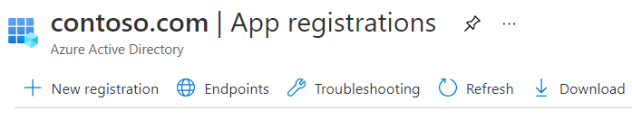
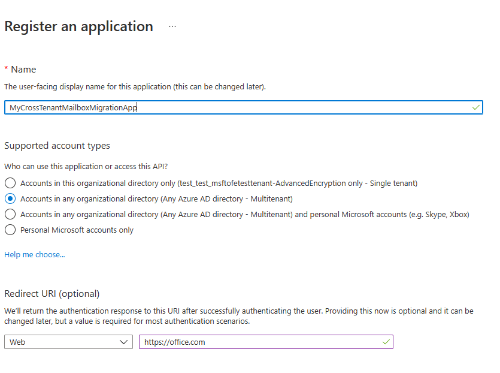

# Cross-tenant mailbox migration (preview)

Commonly, during mergers or divestitures, you need the ability to move your users' Exchange Online mailboxes into a new tenant. Cross-tenant mailbox migration allows tenant administrators to use well-known interfaces like Exchange Online PowerShell and MRS to transition users to their new organization.

Administrators can use the **New-MigrationBatch** cmdlet, available through the _Move Mailboxes_ management role, to execute cross-tenant moves.

Users migrating must be present in the target tenant Exchange Online system as MailUsers, marked with specific attributes to enable the cross-tenant moves. The system will fail moves for users that aren't properly set up in the target tenant.

When the moves are complete, the source user mailbox is converted to a MailUser and the targetAddress (shown as ExternalEmailAddress in Exchange) is stamped with the routing address to the destination tenant. This process leaves the legacy MailUser in the source tenant and allows for coexistence and mail routing. When business processes allow, the source tenant may remove the source MailUser or convert them to a mail contact.

Cross-tenant Exchange mailbox migrations are supported for tenants in hybrid or cloud only, or any combination of the two.

This article describes the process for cross-tenant mailbox moves and provides guidance on how to prepare source and target tenants for the Exchange Online mailbox content moves.

> [!IMPORTANT]
> Do not use this feature to migrate mailboxes on any type of hold. Migrating source mailboxes for users on hold is not supported.  
> When a mailbox is migrated cross-tenant with this feature, only user visible content in the mailbox (email, contacts, calendar, tasks, and notes) is migrated. to the target (destination tenant). After successful migration, the source mailbox is deleted. This means that after the migration, under no circumstances, is the source mailbox available, discoverable, or accessible in the source tenant.

> [!NOTE]
> If you are interested in previewing our new feature Domain Sharing for email alongside your cross-tenant mailbox migrations, please complete the form at [aka.ms/domainsharingpreview](https://aka.ms/domainsharingpreview). Domain sharing for email enables users in separate Microsoft 365 tenants to send and receive email using addresses from the same custom domain. The feature is intended to solve scenarios where users in separate tenants need to represent a common corporate brand in their email addresses. The current preview supports sharing domains indefinitely and shared domains during cross-tenant mailbox migration coexistence.

## Preparing source and target tenants

### Prerequisites for source and target tenants

Before starting, be sure you have the necessary permissions to configure the Move Mailbox application in Azure, EXO Migration Endpoint, and the EXO Organization Relationship.

Additionally, at least one mail-enabled security group in the source tenant is required. These groups are used to scope the list of mailboxes that can move from source (or sometimes referred to as resource) tenant to the target tenant. This allows the source tenant admin to restrict or scope the specific set of mailboxes that need to be moved, preventing unintended users from being migrated. Nested groups aren't supported.

You'll also need to communicate with your trusted partner company (with whom you will be moving mailboxes) to obtain their Microsoft 365 tenant ID. This tenant ID is used in the Organization Relationship DomainName field.

To obtain the tenant ID of a subscription, sign in to the [Microsoft 365 admin center](https://go.microsoft.com/fwlink/p/?linkid=2024339) and go to [https://aad.portal.azure.com/\#blade/Microsoft_AAD_IAM/ActiveDirectoryMenuBlade/Properties](https://aad.portal.azure.com/#blade/Microsoft_AAD_IAM/ActiveDirectoryMenuBlade/Properties). Click the copy icon for the Tenant ID property to copy it to the clipboard.

### Configuration steps to enable your tenants for cross-tenant mailbox migrations

> [!NOTE]
> You must configure the target (destination) first. To complete these steps, you are not required to have or know the tenant admin credentials for both source and target tenant. Steps can be performed individually for each tenant by different administrators.

### Prepare the target (destination) tenant by creating the migration application and secret

1. Log in to your Azure AD portal (<https://portal.azure.com>) with your target tenant admin credentials

   

2. Click view under Manage Azure Active Directory.

   

3. On the left navigation bar, select App registrations.

4. Select New registration

   

5. On the Register an application page, under Supported account types, select Accounts in any organizational directory (Any Azure AD directory - Multitenant). Then, under Redirect URI (optional), select Web and enter <https://office.com>. Lastly, select Register.

   

6. On the top-right corner of the page, you'll see a notification pop-up that states the app was successfully created.

7. Go back to Home, Azure Active Directory and click on App registrations.

8. Under Owned applications, find the app you created and click on it.

9. Under ^Essentials, you'll need to copy down the Application (client) ID as you'll need it later to create a URL for the target tenant.

10. Now, on the left navigation bar, click on API permissions to view permissions assigned to your app.

11. By default, User. Read permissions are assigned to the app you created, but we don't require them for mailbox migrations, you can remove that permission.

    

12. Now we need to add permission for mailbox migration, select Add a permission

13. In the Request API permissions windows, select APIs my organization uses, search for Office 365 Exchange Online, and select it.

    

14. Next, select Application permissions

15. Then, under Select permissions, expand Mailbox, check Mailbox.Migration, and, at the bottom on the screen, select Add permissions.

    

16. Now select Certificates & secrets on the left navigation bar for your application.

17. Under Client secrets, select new client secret.

    

18. In the Add a client secret window, enter a description, and configure your desired expiration settings.

    > [!NOTE]
    > This is the password that will be used when creating your migration endpoint. It is extremely important that you copy this password to your clipboard and or copy this password to secure/secret password safe location. This is the only time you will be able to see this password! If you do somehow lose it or need to reset it, you can log back into our Azure portal, go to App registrations, find your migration app, select Secrets & certificates, and create a new secret for your app.

19. Now that you've successfully created the migration application and secret, you'll need to consent to the application. To consent to the application, go back to the Azure Active Directory landing page, click on Enterprise applications in the left navigation, find your migration app you created, select it, and select Permissions on the left navigation.

20. Click on the Grant admin consent for [your tenant] button.

21. A new browser window will open and select Accept.

22. You can go back to your portal window and select Refresh to confirm your acceptance.

23. Formulate the URL to send to your trusted partner (source tenant admin) so they can also accept the application to enable mailbox migration. Here's an example of the URL to provide to them you'll need the application ID of the app you created:

    ```powershell
    https://login.microsoftonline.com/sourcetenant.onmicrosoft.com/adminconsent?client_id=[application_id_of_the_app_you_just_created]&redirect_uri=https://office.com
    ```

    > [!NOTE]
    > You will need the application ID of the mailbox migration app you just created.
    >
    > You will need to replace sourcetenant.onmicrosoft.com in the above example with your source tenants correct onmicrosoft.com name.
    >
    > You will also need to replace [application_id_of_the_app_you_just_created] with the application ID of the mailbox migration app you just created.

### Prepare the target tenant by creating the Exchange Online migration endpoint and organization relationship

1. [Connect to Exchange Online PowerShell](/powershell/exchange/connect-to-exchange-online-powershell) in the target Exchange Online tenant.

2. Create a new migration endpoint for cross-tenant mailbox moves

   > [!NOTE]
   > You will need the application ID of the mailbox migration app you just created and the password (the secret) you configured during this process. Also depending on the Microsoft 365 Cloud Instance you use your endpoint may be different. Please refer to the [Microsoft 365 endpoints](/microsoft-365/enterprise/microsoft-365-endpoints) page and select the correct instance for your tenant and review the Exchange Online Optimize Required address and replace as appropriate.

   ```powershell

   # Enable customization if tenant is dehydrated
   $dehydrated=Get-OrganizationConfig | select isdehydrated
   if ($dehydrated.isdehydrated -eq $true) {Enable-OrganizationCustomization}
   $AppId = "[guid copied from the migrations app]"
   $Credential = New-Object -TypeName System.Management.Automation.PSCredential -ArgumentList $AppId, (ConvertTo-SecureString -String "[this is your secret password you saved in the previous steps]" -AsPlainText -Force)
   New-MigrationEndpoint -RemoteServer outlook.office.com -RemoteTenant "sourcetenant.onmicrosoft.com" -Credentials $Credential -ExchangeRemoteMove:$true -Name "[the name of your migration endpoint]" -ApplicationId $AppId
   ```

3. Create new or edit your existing organization relationship object to your source tenant.

   ```powershell
   $sourceTenantId="[tenant id of your trusted partner, where the source mailboxes are]"
   $orgrels=Get-OrganizationRelationship
   $existingOrgRel = $orgrels | ?{$_.DomainNames -like $sourceTenantId}
   If ($null -ne $existingOrgRel)
   {
       Set-OrganizationRelationship $existingOrgRel.Name -Enabled:$true -MailboxMoveEnabled:$true -MailboxMoveCapability Inbound
   }
   If ($null -eq $existingOrgRel)
   {
       New-OrganizationRelationship "[name of the new organization relationship]" -Enabled:$true -MailboxMoveEnabled:$true -MailboxMoveCapability Inbound -DomainNames $sourceTenantId
   }
   ```

### Prepare the source (current mailbox location) tenant by accepting the migration application and configuring the organization relationship

1. From a browser, go to the URL link provided by your trusted partner to consent to the mailbox migration application. The URL will look like this:

   ```powershell
   https://login.microsoftonline.com/sourcetenant.onmicrosoft.com/adminconsent?client_id=[application_id_of_the_app_you_just_created]&redirect_uri=https://office.com
   ```

   > [!NOTE]
   > You will need the application ID of the mailbox migration app you just created.
   > You will need to replace sourcetenant.onmicrosoft.com in the above example with your source tenants correct onmicrosoft.com name.
   > You will also need to replace [application_id_of_the_app_you_just_created] with the application ID of the mailbox migration app you just created.

2. Accept the application when the pop-up appears. You can also log into your Azure Active Directory portal and find the application under Enterprise applications.

3. [Connect to Exchange Online PowerShell](/powershell/exchange/connect-to-exchange-online-powershell) on the source Exchange Online tenant.
4. Create a new organization relationship or edit your existing organization relationship object to your target (destination) tenant in Exchange Online PowerShell:

   ```powershell
   $targetTenantId="[tenant id of your trusted partner, where the mailboxes are being moved to]"
   $appId="[application id of the mailbox migration app you consented to]"
   $scope="[name of the mail enabled security group that contains the list of users who are allowed to migrate]"
   $orgrels=Get-OrganizationRelationship
   $existingOrgRel = $orgrels | ?{$_.DomainNames -like $targetTenantId}
   If ($null -ne $existingOrgRel)
   {
       Set-OrganizationRelationship $existingOrgRel.Name -Enabled:$true -MailboxMoveEnabled:$true -MailboxMoveCapability RemoteOutbound -OAuthApplicationId $appId -MailboxMovePublishedScopes $scope
   }
   If ($null -eq $existingOrgRel)
   {
       New-OrganizationRelationship "[name of your organization relationship]" -Enabled:$true -MailboxMoveEnabled:$true -MailboxMoveCapability RemoteOutbound -DomainNames $targetTenantId -OAuthApplicationId $appId -MailboxMovePublishedScopes $scope
   }
   ```

> [!NOTE]
> The tenant ID that you enter as the $sourceTenantId and $targetTenantId is the GUID and not the tenant domain name. For an example of a tenant ID and information about finding your tenant ID, see [Find your Microsoft 365 tenant ID](/onedrive/find-your-office-365-tenant-id).

### How do I know this worked?

You can verify cross-tenant mailbox migration configuration by running the [Test-MigrationServerAvailability](/powershell/module/exchange/Test-MigrationServerAvailability) cmdlet against the cross-tenant migration endpoint that you created on your target tenant.

```powershell
Test-MigrationServerAvailability -EndPoint "Migration endpoint for cross-tenant mailbox moves" -TestMailbox "Primary SMTP of MailUser object in target tenant"
```

### Move mailboxes back to the original source

If a mailbox is required to move back to the original source tenant, the same set of steps and scripts will need to be run in both new source and new target tenants. The existing Organization Relationship object will be updated or appended, not recreated. The migration can't happen both ways simultaneously.

## Prepare target user objects for migration

Users migrating must be present in the target tenant and Exchange Online system (as MailUsers) marked with specific attributes to enable the cross-tenant moves. The system will fail moves for users that aren't properly set up in the target tenant. The following section details the MailUser object requirements for the target tenant.

### Prerequisites for target user objects

Ensure the following objects and attributes are set in the target organization.

> [!TIP]
> Microsoft is developing a feature to provide a secure automated method to set many of the attributes in the following section. This feature, named Cross-Tenant Identity Mapping, is currently looking for customers willing to participate in a small private preview. For more information about this pre-release feature and how it can simplify your cross-tenant migration processes, see the article **[Cross-Tenant Identity Mapping](cross-tenant-identity-mapping.md)**.

1. For any mailbox moving from a source organization, you must provision a MailUser object in the Target organization:

   - The Target MailUser must have these attributes from the source mailbox or assigned with the new User object:

     - ExchangeGUID (direct flow from source to target): The mailbox GUID must match. The move process will not proceed if this isn't present on target object.
     - ArchiveGUID (direct flow from source to target): The archive GUID must match. The move process won't proceed if this isn't present on the target object. (This is only required if the source mailbox is Archive enabled).
     - LegacyExchangeDN (flow as proxyAddress, "x500:\<LegacyExchangeDN>"): The LegacyExchangeDN must be present on target MailUser as x500: proxyAddress. In addition, you also need to copy all x500 addresses from the source mailbox to the target mail user. The move processes won't proceed if these aren't present on the target object. Also, this step is important for enabling reply ability for emails that are sent before migration. The sender/recipient address in each email item and the auto-complete cache in Microsoft Outlook and in Microsoft Outlook Web App (OWA) uses the value of the LegacyExchangeDN attribute. If a user cannot be located using the LegacyExchangeDN value then the delivery of email messages may fail with a 5.1.1 NDR.
     - UserPrincipalName: UPN will align to the user's NEW identity or target company (for example, user@northwindtraders.onmicrosoft.com).
     - Primary SMTPAddress: Primary SMTP address will align to the user's NEW company (for example, user@northwind.com).
     - TargetAddress/ExternalEmailAddress: MailUser will reference the user's current mailbox hosted in source tenant (for example user@contoso.onmicrosoft.com). When assigning this value, verify that you have/are also assigning PrimarySMTPAddress or this value will set the PrimarySMTPAddress, which will cause move failures.
     - You can't add legacy smtp proxy addresses from source mailbox to target MailUser. For example, you can't maintain contoso.com on the MEU in fabrikam.onmicrosoft.com tenant objects). Domains are associated with one Azure AD or Exchange Online tenant only.

     Example **target** MailUser object:

     | Attribute            | Value                                                                                                                   |
     | -------------------- | ----------------------------------------------------------------------------------------------------------------------- |
     | Alias                | LaraN                                                                                                                   |
     | RecipientType        | MailUser                                                                                                                |
     | RecipientTypeDetails | MailUser                                                                                                                |
     | UserPrincipalName    | LaraN@northwintraders.onmicrosoft.com                                                                                   |
     | PrimarySmtpAddress   | Lara.Newton@northwind.com                                                                                               |
     | ExternalEmailAddress | SMTP:LaraN@contoso.onmicrosoft.com                                                                                      |
     | ExchangeGuid         | 1ec059c7-8396-4d0b-af4e-d6bd4c12a8d8                                                                                    |
     | LegacyExchangeDN     | /o=First Organization/ou=Exchange Administrative Group                                                                  |
     |                      | (FYDIBOHF23SPDLT)/cn=Recipients/cn=74e5385fce4b46d19006876949855035Lara                                                 |
     | EmailAddresses       | x500:/o=First Organization/ou=Exchange Administrative Group (FYDIBOHF23SPDLT)/cn=Recipients/cn=d11ec1a2cacd4f81858c8190 |
     |                      | 7273f1f9-Lara                                                                                                           |
     |                      | smtp:LaraN@northwindtraders.onmicrosoft.com                                                                             |
     |                      | SMTP:Lara.Newton@northwind.com                                                                                          |

     Example **source** Mailbox object:

     | Attribute            | Value                                                                   |
     | -------------------- | ----------------------------------------------------------------------- |
     | Alias                | LaraN                                                                   |
     | RecipientType        | UserMailbox                                                             |
     | RecipientTypeDetails | UserMailbox                                                             |
     | UserPrincipalName    | LaraN@contoso.onmicrosoft.com                                           |
     | PrimarySmtpAddress   | Lara.Newton@contoso.com                                                 |
     | ExchangeGuid         | 1ec059c7-8396-4d0b-af4e-d6bd4c12a8d8                                    |
     | LegacyExchangeDN     | /o=First Organization/ou=Exchange Administrative Group                  |
     |                      | (FYDIBOHF23SPDLT)/cn=Recipients/cn=d11ec1a2cacd4f81858c81907273f1f9Lara |
     | EmailAddresses       | smtp:LaraN@contoso.onmicrosoft.com                                      |
     |                      | SMTP:Lara.Newton@contoso.com                                            |

   - Additional attributes may be included in Exchange hybrid write-back already. If not, they should be included.
   - msExchBlockedSendersHash – Writes back online safe and blocked sender data from clients to on-premises Active Directory.
   - msExchSafeRecipientsHash – Writes back online safe and blocked sender data from clients to on-premises Active Directory.
   - msExchSafeSendersHash – Writes back online safe and blocked sender data from clients to on-premises Active Directory.

2. If the source mailbox Recoverable Items size is greater than our database default (30 GB), moves will not proceed since the target quota is less than the source mailbox size. You can update the target MailUser object to transition the ELC mailbox flags from the source environment to the target, which triggers the target system to expand the quota of the MailUser to 100 GB, thus allowing the move to the target. In a Hybrid environment you will need set the appropriate msExchELCMailboxFlags on the target ADUser.

3. Non-hybrid target tenants can modify the quota on the Recoverable Items folder for the MailUsers prior to migration by running the following command to enable Litigation Hold on the target MailUser object and increasing the quota to 100 GB:

   ```powershell
   Set-MailUser -Identity <MailUserIdentity> -EnableLitigationHoldForMigration
   ```

   Note this will not work for tenants in hybrid.

4. Users in the target organization must be licensed with appropriate Exchange Online subscriptions applicable for the organization. You may apply a license in advance of a mailbox move but ONLY once the target MailUser is properly set up with ExchangeGUID and proxy addresses. Applying a license before the ExchangeGUID is applied will result in a new mailbox provisioned in target organization.

   > [!NOTE]
   > When you apply a license on a Mailbox or MailUser object, all SMTP type proxyAddresses are scrubbed to ensure only verified domains are included in the Exchange EmailAddresses array.

5. You must ensure that the target MailUser has no previous ExchangeGuid that does not match the Source ExchangeGuid. This might occur if the target MEU was previously licensed for Exchange Online and provisioned a mailbox. If the target MailUser was previously licensed for or had an ExchangeGuid that does not match the Source ExchangeGuid, you need to perform a cleanup of the cloud MEU. For these cloud MEUs, you can run `Set-User <identity> -PermanentlyClearPreviousMailboxInfo`.

   > [!CAUTION]
   > This process is irreversible. If the object has a softDeleted mailbox, it cannot be restored after this point. Once cleared, however, you can synchronize the correct ExchangeGuid to the target object and MRS will connect the source mailbox to the newly created target mailbox. (Reference EHLO blog on the new parameter.)

   Find objects that were previously mailboxes using this command.

   ```powershell
   Get-User <identity> | select Name, *recipient* | Format-Table -AutoSize
   ```

   Here is an example.

   ```powershell
   Get-User John@northwindtraders.com |select name, *recipient*| Format-Table -AutoSize

   Name       PreviousRecipientTypeDetails     RecipientType RecipientTypeDetails
   ----       ---------------------------- ------------- --------------------
   John       UserMailbox                  MailUser      MailUser
   ```

   Clear the soft-deleted mailbox using this command.

   ```powershell
   Set-User <identity> -PermanentlyClearPreviousMailboxInfo
   ```

   Here is an example.

   ```powershell
   Set-User John@northwindtraders.com -PermanentlyClearPreviousMailboxInfo -Confirm

   Are you sure you want to perform this action?
   Delete all existing information about user "John@northwindtraders.com"?. This operation will clear existing values from Previous home MDB and Previous Mailbox GUID of the user. After deletion, reconnecting to the previous mailbox that existed in the cloud will not be possible and any content it had will be unrecoverable PERMANENTLY.
   Do you want to continue?
   [Y] Yes  [A] Yes to All  [N] No  [L] No to All  [?] Help (default is "Y"): Y
   ```

### Perform mailbox migrations

Cross-tenant Exchange mailbox migrations are initiated from the target tenant as migration batches. This is like the way that on-boarding migration batches work when migrating from Exchange on-premises to Microsoft 365.

### Create Migration batches

Here is an example migration batch cmdlet for kicking off moves.

```powershell
New-MigrationBatch -Name T2Tbatch -SourceEndpoint target_source_7977 -CSVData ([System.IO.File]::ReadAllBytes('users.csv')) -Autostart -TargetDeliveryDomain target.onmicrosoft.com

Identity                   Status  Type               TotalCount
--------                   ------  ----               ----------
T2Tbatch                   Syncing ExchangeRemoteMove 1
```

> [!NOTE]
> The email address in the CSV file must be the one specified in the target tenant (for example, userA@targettenant.onmicrosoft.com), not the one in the source tenant.
>
> [For more information on the cmdlet click here](/powershell/module/exchange/new-migrationbatch)
>
> [For some example CSV file info click here](/exchange/csv-files-for-mailbox-migration-exchange-2013-help)

The following is a minimal example CSV file:

```csv
EmailAddress
userA@targettenant.onmicrosoft.com
userB@targettenant.onmicrosoft.com
userC@targettenant.onmicrosoft.com
```

Migration batch submission is also supported from the new [Exchange admin center](https://go.microsoft.com/fwlink/p/?linkid=2059104) when selecting the cross-tenant option.

### Update on-premises MailUsers

Once the mailbox moves from source to target, you should ensure that the on-premises mail users, in both the source and target, are updated with the new targetAddress. In the examples, the targetDeliveryDomain used in the move is **contoso.onmicrosoft.com**. Update the mail users with this targetAddress.

### Remove endpoints and organization relationships after migration

Use the Remove-MigrationEndpoint(/powershell/module/exchange/remove-migrationendpoint) cmdlet to remove existing migration endpoints for source or destination servers after the migration is complete.

Use the Remove-OrganizationRelationship (/exchange/sharing/organization-relationships/remove-an-organization-relationship#use-exchange-online-powershell-to-remove-an-organization-relationship) cmdlet to remove existing organization relationships for source or destination servers after the migration is complete.

## Frequently asked questions

### Do we need to update RemoteMailboxes in source on-premises after the move?

Yes, you should update the targetAddress (RemoteRoutingAddress/ExternalEmailAddress) of the source on-premises users when the source tenant mailbox moves to target tenant. While mail routing can follow the referrals across multiple mail users with different targetAddresses, Free/Busy lookups for mail users MUST target the location of the mailbox user. Free/Busy lookups will not chase multiple redirects.

### Do Teams meetings migrate cross-tenant?

The meetings will move, however the Teams meeting URL does not update when items migrate cross-tenant. Since the URL will be invalid in the target tenant, you will need to remove and recreate the Teams meetings.

### Does the Teams chat folder content migrate cross-tenant?

No, the Teams chat folder content does not migrate cross-tenant. When a mailbox is migrated cross-tenant with this feature, only user visible content in the mailbox (email, contacts, calendar, tasks, and notes) is migrated.

### How can I see just moves that are cross-tenant moves, not my onboarding and off-boarding moves?

Use the _Flags_ parameter. Here is an example.

```powershell
Get-MoveRequest -Flags "CrossTenant"
```

### Can you provide example scripts for copying attributes used in testing?

> [!NOTE]
> SAMPLE – AS IS, NO WARRANTY
> This script assumes a connection to both source mailbox (to get source values) and the target on-premises Active Directory Domain Services (to stamp the ADUser object).

```powershell
# This will export users from the source tenant with the CustomAttribute1 = "Cross-Tenant-Project"
# These are the 'target' users to be moved to the Northwind org tenant
$outFileUsers = "$home\desktop\UsersToMigrate.txt"
$outFileUsersXML = "$home\desktop\UsersToMigrate.xml"
Get-Mailbox -Filter "CustomAttribute1 -like 'Cross-Tenant-Project'" -ResultSize Unlimited | Select-Object -ExpandProperty  Alias | Out-File $outFileUsers
$mailboxes = Get-Content $outFileUsers
$mailboxes | ForEach-Object {Get-Mailbox $_} | Select-Object PrimarySMTPAddress,Alias,SamAccountName,FirstName,LastName,DisplayName,Name,ExchangeGuid,ArchiveGuid,LegacyExchangeDn,EmailAddresses | Export-Clixml $outFileUsersXML
```

```powershell
# Copy the file $outfile to the desktop of the target on-premises then run the below to create MEU in Target
$mailboxes = Import-Clixml $home\desktop\UsersToMigrate.xml
add-type -AssemblyName System.Web
foreach ($m in $mailboxes) {
    $organization = "@contoso.onmicrosoft.com"
    $mosi = $m.Alias+$organization
    $Password = [System.Web.Security.Membership]::GeneratePassword(16,4) | ConvertTo-SecureString -AsPlainText -Force
    $x500 = "x500:" +$m.LegacyExchangeDn
    $tmpUser = New-MailUser -MicrosoftOnlineServicesID $mosi -PrimarySmtpAddress $mosi -ExternalEmailAddress $m.PrimarySmtpAddress -FirstName $m.FirstName -LastName $m.LastName -Name $m.Name -DisplayName $m.DisplayName -Alias $m.Alias -Password $Password
    $tmpUser | Set-MailUser -EmailAddresses @{add=$x500} -ExchangeGuid $m.ExchangeGuid -ArchiveGuid $m.ArchiveGuid -CustomAttribute1 "Cross-Tenant-Project"
    $tmpx500 = $m.EmailAddresses | ?{$_ -match "x500"}
    $tmpx500 | %{Set-MailUser $m.Alias -EmailAddresses @{add="$_"}}
    }
```

```powershell
# Now sync the changes from On-Premises to Azure and Exchange Online in the Target tenant
# This action should create the target mail enabled users (MEUs) in the Target tenant
Start-ADSyncSyncCycle
```

### How do we access Outlook on Day 1 after the user mailbox is moved?

Since only one tenant can own a domain, the former primary SMTPAddress will not be associated to the user in the target tenant when the mailbox move completes; only those domains associated with the new tenant. Outlook uses the user's new UPN to authenticate to the service and the Outlook profile expects to find the legacy primary SMTPAddress to match the mailbox in the target system. Since the legacy address is not in the target System the outlook profile will not connect to find the newly moved mailbox.

For this initial deployment, users will need to rebuild their profile with their new UPN, primary SMTP address and resync OST content.

> [!NOTE]
> Plan accordingly as you batch your users for completion. You need to account for network utilization and capacity when Outlook client profiles are created and subsequent OST and OAB files are downloaded to clients.

### What Exchange RBAC roles do I need to be member of to set up or complete a cross-tenant move?

There is a matrix of roles based on assumption of delegated duties when executing a mailbox move. Currently, two roles are required:

- The first role is for a one-time setup task that establishes the authorization of moving content into or out of your tenant/organizational boundary. As moving data out of your organizational control is a critical concern for all companies, we opted for the highest assigned role of Organization Administrator (OrgAdmin). This role must alter or set up a new OrganizationRelationship that defines the -MailboxMoveCapability with the remote organization. Only the OrgAdmin can alter the MailboxMoveCapability setting, while other attributes on the OrganizationRelationship can be managed by the Federated Sharing administrator.

- The role of executing the actual move commands can be delegated to a lower-level function. The role of Move Mailboxes is assigned to the capability of moving mailboxes in or out of the organization.

### How do we target which SMTP address is selected for targetAddress (TargetDeliveryDomain) on the converted mailbox (to MailUser conversion)?

Exchange mailbox moves using MRS craft the targetAddress on the original source mailbox when converting to a MailUser by matching an email address (proxyAddress) on the target object. The process takes the -TargetDeliveryDomain value passed into the move command, then checks for a matching proxy for that domain on the target side. When we find a match, the matching proxyAddress is used to set the ExternalEmailAddress (targetAddress) on the converted mailbox (now MailUser) object.

### How mail flow works after migration?

Cross-Tenant mail flow after migration works similar to Exchange Hybrid mail flow. Each migrated mailbox needs the source MailUser with the correct targetaddress to forward incoming mail from source tenant to mailboxes in target tenant. Transport rules, security and compliance features will run as configured in each tenant that the mail flows through. So, for inbound mail, features like anti-spam, anti-malware, quarantine, as well as transport rules and journaling rules will run in the source tenant first, then in the target tenant.

### How do mailbox permissions transition?

Mailbox permissions include Send on Behalf of and Mailbox Access:

- Send On Behalf Of (AD:publicDelegates) stores the DN of recipients with access to a user's mailbox as a delegate. This value is stored in Active Directory and currently does not move as part of the mailbox transition. If the source mailbox has publicDelegates set, you will need to restamp the publicDelegates on the target Mailbox once the MEU to Mailbox conversion completes in the target environment by running `Set-Mailbox <principle> -GrantSendOnBehalfTo <delegate>`.

- Mailbox Permissions that are stored in the mailbox will move with the mailbox when both the principal and the delegate are moved to the target system. For example, the user TestUser*7 is granted FullAccess to the mailbox TestUser_8 in the tenant SourceCompany.onmicrosoft.com. After the mailbox move completes to TargetCompany.onmicrosoft.com, the same permissions are set up in the target directory. Examples using \_Get-MailboxPermission* for TestUser_7 in both source and target tenants are shown below. Exchange cmdlets are prefixed with source and target accordingly.

Here is an example of the output of the mailbox permission before a move.

```powershell
Get-SourceMailboxPermission TestUser_7 | Format-Table -AutoSize User, AccessRights, IsInherited, Deny

User                                             AccessRights                         IsInherited Deny
----                                             ------------                         ----------- ----
NT AUTHORITY\SELF                                {FullAccess, ReadPermission}         False       False
TestUser_8@SourceCompany.onmicrosoft.com         {FullAccess}                         False       False
```

Here's an example of the output of the mailbox permission after the move.

```powershell
Get-TargetMailboxPermission TestUser_7 | Format-Table -AutoSize User, AccessRights, IsInherited, Deny

User                                             AccessRights                         IsInherited Deny
----                                             ------------                         ----------- ----
NT AUTHORITY\SELF                                {FullAccess, ReadPermission}         False       False
TestUser_8@TargetCompany.onmicrosoft.com         {FullAccess}                         False       False
```

> [!NOTE]
> Cross-tenant mailbox and calendar permissions are NOT supported. You must organize principals and delegates into consolidated move batches so that these connected mailboxes are transitioned at the same time from the source tenant.

### What X500 proxy should be added to the target MailUser proxy addresses to enable migration?

The cross-tenant mailbox migration requires that the LegacyExchangeDN value of the source mailbox object to be stamped as an x500 email address on the target MailUser object.

Example:

```powershell
LegacyExchangeDN value on source mailbox is:
/o=First Organization/ou=Exchange Administrative Group(FYDIBOHF23SPDLT)/cn=Recipients/cn=d11ec1a2cacd4f81858c81907273f1f9Lara

so, the x500 email address to be added to target MailUser object would be:
x500:/o=First Organization/ou=Exchange Administrative Group (FYDIBOHF23SPDLT)/cn=Recipients/cn=d11ec1a2cacd4f81858c81907273f1f9-Lara
```

> [!NOTE]
> In addition to this X500 proxy, you will need to copy all X500 proxies from the mailbox in the source to the mailbox in the target.

### Can the source and target tenants utilize the same domain name?

No, the source tenant and target tenant domain names must be unique. For example, a source domain of contoso.com and the target domain of fourthcoffee.com.

### Will shared mailboxes move and still work?

Yes, however, we only keep the store permissions as described in these articles:

- [Manage permissions for recipients in Exchange Online](/exchange/recipients-in-exchange-online/manage-permissions-for-recipients)

- [How to grant Exchange and Outlook mailbox permissions in Office 365 dedicated](https://support.microsoft.com/topic/how-to-grant-exchange-and-outlook-mailbox-permissions-in-office-365-dedicated-bac01b2c-08ff-2eac-e1c8-6dd01cf77287)

### Do you have any recommendations for batches?

Do not exceed 2000 mailboxes per batch. We strongly recommend submitting batches two weeks prior to the cut-over date as there is no impact on the end users during synchronization. If you need guidance for mailboxes quantities over 50,000 you can reach out to the Engineering Feedback Distribution List at crosstenantmigrationpreview@service.microsoft.com.

### What if I use Service encryption with Customer Key?

The mailbox will be decrypted prior to moving. Ensure Customer Key is configured in the target tenant if it is still required. See [here](/microsoft-365/compliance/customer-key-overview) for more information.

### What is the estimated migration time?

To help you plan your migration, the table present [here](/exchange/mailbox-migration/office-365-migration-best-practices#estimated-migration-times) shows the guidelines about when to expect bulk mailbox migrations or individual migrations to complete. These estimates are based on a data analysis of previous customer migrations. Because every environment is unique, your exact migration velocity may vary.

Do remember that this feature is currently in preview and the SLA, and any applicable Service Levels do not apply to any performance or availability issues during the preview status of this feature.

### Protecting documents in the source tenant consumable by users in the destination tenant.\*\*

Cross-tenant migration only migrates mailbox data and nothing else. There are multiple other options, which are documented in the following blog post that may help: <https://techcommunity.microsoft.com/t5/security-compliance-and-identity/mergers-and-spinoffs/ba-p/910455>

### Can I have the same labels in the destination tenant as you had in the source tenant, either as the only set of labels or an additional set of labels for the migrated users depending on alignment between the organizations.\*\*

Because cross-tenant migrations do not export labels and there is no way to share labels between tenants, you can only achieve this by recreating the labels in the destination tenant.

### Do you support moving Microsoft 365 Groups?

Currently the Cross-Tenant mailbox migrations feature does not support the migration of Microsoft 365 Groups.

### Can a source tenant admin perform an eDiscovery search against a mailbox after the mailbox has been migrated to the new/target tenant?

No, after a cross tenant mailbox migration, eDiscovery against the migrated user's mailbox in the source does not work. This is because there is no longer a mailbox in the source to search against as the mailbox has been migrated to the target tenant and now belongs to the target tenant. eDiscovery, post mailbox migration can only be done in the target tenant (where the mailbox now exists). If a copy of the source mailbox needs to persist in the source tenant after migration, the admin in the source can copy the contents to an alternate mailbox pre migration for future eDiscovery operations against the data.

### At which point will the destination MailUser be converted to a destination mailbox and the source mailbox converted to a source MailUser?

These conversions happen automatically during the migration process. No manual steps are necessary.

### At which step should I assign the Exchange Online license to destination MailUsers?

This can be done before the migration is complete, but you should not assign a license prior to stamping the _ExchangeGuid_ attribute or the conversion of MailUser object to mailbox will fail and a new mailbox will be created instead. To mitigate this risk, it is best to wait until after the migration is complete, and assign licenses during the 30 day grace period.

### Can I use Azure AD Connect to sync users to the new tenant if I am keeping the on-prem Active Directory?

Yes. It is possible to have two instances of Azure AD Connect synchronize to different tenants.
However, there are some things you need to be aware of.

- Preprovisioning the user's accounts with the script provided in this article should not be done. Instead, a selective OU sync of the users in scope for the migration can be performed to populate the target tenant; you will receive a warning about the UPN not matching during Azure AD Connect configuration.
- Depending on your current state of Hybrid Exchange, you need to verify that the on-prem directory objects have the required attributes (such as msExchMailboxGUID and proxyAddresses) populated correctly before attempting to sync to another tenant, or you will run into issues with double mailboxes and migration failures.
- You need to take some extra steps to manage UPN transitioning, changing it on-prem once the migration has been completed for a user unless you are also moving the custom domain during a cut-over migration.

## Known issues

- **Issue: Post migration Teams functionality in the source tenant will be limited.** After the mailbox is migrated to the target tenant, Teams in the source tenant will no longer have access to the user's mailbox. So, if a user logs into Teams with the source tenant credential, then there will be a loss of functionality such as the inability to update your profile picture, no calendar application, and an inability to search and join public teams.

- **Issue: Auto Expanded archives cannot be migrated.** The cross-tenant migration feature supports migrations of the primary mailbox and archive mailbox for a specific user. If the user in the source however has an auto expanded archive – meaning more than one archive mailbox, the feature is unable to migrate the additional archives and should fail.

- **Issue: Cloud MailUsers with non-owned smtp proxyAddress block MRS moves background.** When creating target tenant MailUser objects, you must ensure that all SMTP proxy addresses belong to the target tenant organization. If an SMTP proxyAddress exists on the target mail user that does not belong to the local tenant, the conversion of the MailUser to Mailbox is prevented. This is due to our assurance that mailbox objects can only send mail from domains for which the tenant is authoritative (domains claimed by the tenant):

  - When you synchronize users from on-premises using Azure AD Connect, you provision on-premises MailUser objects with ExternalEmailAddress pointing to the source tenant where the mailbox exists (LaraN@contoso.onmicrosoft.com) and you stamp the PrimarySMTPAddress as a domain that resides in the target tenant (Lara.Newton@northwind.com). These values synchronize down to the tenant and an appropriate mail user is provisioned and ready for migration. An example object is shown here.

    ```powershell
    Get-MailUser LaraN | select ExternalEmailAddress, EmailAddresses

    ExternalEmailAddress               EmailAddresses
    --------------------               --------------
    SMTP:LaraN@contoso.onmicrosoft.com {SMTP:lara.newton@northwind.com}
    ```

  > [!NOTE]
  > The _contoso.onmicrosoft.com_ address is _not_ present in the EmailAddresses / proxyAddresses array.

- **Issue: MailUser objects with "external" primary SMTP addresses are modified / reset to "internal" company claimed domains**

  MailUser objects are pointers to non-local mailboxes. In the case for cross-tenant mailbox migrations, we use MailUser objects to represent either the source mailbox (from the target organization's perspective) or target mailbox (from the source organization's perspective). The MailUsers will have an ExternalEmailAddress (targetAddress) that points to the smtp address of the actual mailbox (ProxyTest@fabrikam.onmicrosoft.com) and primarySMTP address that represents the displayed SMTP address of the mailbox user in the directory. Some organizations choose to display the primary SMTP address as an external SMTP address, not as an address owned/verified by the local tenant (such as fabrikam.com rather than as contoso.com). However, once an Exchange service plan object is applied to the MailUser via licensing operations, the primary SMTP address is modified to show as a domain verified by the local organization (contoso.com). There are two potential reasons:

  - When any Exchange service plan is applied to a MailUser, the Azure AD process starts to enforce proxy scrubbing to ensure that the local organization is not able to send mail out, spoof, or mail from another tenant. Any SMTP address on a recipient object with these service plans will be removed if the address is not verified by the local organization. As is the case in the example, the Fabikam.com domain is NOT verified by the contoso.onmicrosoft.com tenant, so the scrubbing removes that fabrikam.com domain. If you wish to persist these external domains on MailUser, either before the migration or after migration, you need to alter your migration processes to strip licenses after the move completes or before the move to ensure that the users have the expected external branding applied. You will need to ensure that the mailbox object is properly licensed to not affect mail service.
  - An example script to remove the service plans on a MailUser in the contoso.onmicrosoft.com tenant is shown here.

    ```powershell
    $LO = New-MsolLicenseOptions -AccountSkuId "contoso:ENTERPRISEPREMIUM" DisabledPlans "LOCKBOX_ENTERPRISE","EXCHANGE_S_ENTERPRISE","INFORMATION_BARRIERS","MIP_S_CLP2","MIP_S_CLP1","MYANALYTICS_P2","EXCHANGE_ANALYTICS","EQUIVIO_ANALYTICS","THREAT_INTELLIGENCE","PAM_ENTERPRISE","PREMIUM_ENCRYPTION"
    Set-MsolUserLicense -UserPrincipalName ProxyTest@contoso.com LicenseOptions $lo
    ```

    Results in the set of ServicePlans assigned are shown here.

    ```powershell
    (Get-MsolUser -UserPrincipalName ProxyTest@contoso.com).licenses | Select-Object -ExpandProperty ServiceStatus |sort ProvisioningStatus -Descending

    ServicePlan           ProvisioningStatus
    -----------           ------------------
    ATP_ENTERPRISE        PendingProvisioning
    MICROSOFT_SEARCH      PendingProvisioning
    INTUNE_O365           PendingActivation
    PAM_ENTERPRISE        Disabled
    EXCHANGE_ANALYTICS    Disabled
    EQUIVIO_ANALYTICS     Disabled
    THREAT_INTELLIGENCE   Disabled
    LOCKBOX_ENTERPRISE    Disabled
    PREMIUM_ENCRYPTION    Disabled
    EXCHANGE_S_ENTERPRISE Disabled
    INFORMATION_BARRIERS  Disabled
    MYANALYTICS_P2        Disabled
    MIP_S_CLP1            Disabled
    MIP_S_CLP2            Disabled
    ADALLOM_S_O365        PendingInput
    RMS_S_ENTERPRISE      Success
    YAMMER_ENTERPRISE     Success
    PROJECTWORKMANAGEMENT Success
    BI_AZURE_P2           Success
    WHITEBOARD_PLAN3      Success
    SHAREPOINTENTERPRISE  Success
    SHAREPOINTWAC         Success
    KAIZALA_STANDALONE    Success
    OFFICESUBSCRIPTION    Success
    MCOSTANDARD           Success
    Deskless              Success
    STREAM_O365_E5        Success
    FLOW_O365_P3          Success
    POWERAPPS_O365_P3     Success
    TEAMS1                Success
    MCOEV                 Success
    MCOMEETADV            Success
    BPOS_S_TODO_3         Success
    FORMS_PLAN_E5         Success
    SWAY                  Success
    ```

    The user's PrimarySMTPAddress is no longer scrubbed. The fabrikam.com domain is not owned by the contoso.onmicrosoft.com tenant and will persist as the primary SMTP address shown in the directory.

    Here is an example.

    ```powershell
    Get-Recipient ProxyTest | Format-Table -AutoSize UserPrincipalName, PrimarySmtpAddress, ExternalEmailAddress, ExternalDirectoryObjectId
    UserPrincipalName               PrimarySmtpAddress              ExternalEmailAddress                 ExternalDirectoryObjectId
    -----------------               ------------------              --------------------                 -------------------------
    ProxyTest@fabrikam.com          ProxyTest@fabrikam.com          SMTP:ProxyTest@fabrikam.com          e2513482-1d5b-4066-936a-cbc7f8f6f817
    ```

    - When msExchRemoteRecipientType is set to 8 (DeprovisionMailbox), for on-premises MailUsers that are migrated to the target tenant, the proxy scrubbing logic in Azure will remove non-owned domains and reset the primarySMTP to an owned domain. By clearing msExchRemoteRecipientType in the on-premises MailUser, the proxy scrub logic no longer applies.

      Below is the full set of current service plans that include Exchange Online.

      | Name                                             |
      | ------------------------------------------------ |
      | eDiscovery (Premium) Storage (500 GB)            |
      | Customer Lockbox                                 |
      | Data Loss Prevention                             |
      | Exchange Enterprise CAL Services (EOP, DLP)      |
      | Exchange Essentials                              |
      | Exchange Foundation                              |
      | Exchange Online (P1)                             |
      | Exchange Online (Plan 1)                         |
      | Exchange Online (Plan 2)                         |
      | Exchange Online Archiving for Exchange Online    |
      | Exchange Online Archiving for Exchange Server    |
      | Exchange Online Inactive User Add-on             |
      | Exchange Online Kiosk                            |
      | Exchange Online Multi-Geo                        |
      | Exchange Online Plan 1                           |
      | Exchange Online POP                              |
      | Exchange Online Protection                       |
      | Graph Connectors Search with Index               |
      | Information Barriers                             |
      | Information Protection for Office 365 - Premium  |
      | Information Protection for Office 365 - Standard |
      | Insights by MyAnalytics                          |
      | Microsoft Information Governance                 |
      | Microsoft Purview Audit (Premium)                |
      | Microsoft Bookings                               |
      | Microsoft Business Center                        |
      | Microsoft Data Investigations                    |
      | Microsoft MyAnalytics (Full)                     |
      | Microsoft Communications Compliance              |
      | Microsoft Communications DLP                     |
      | Microsoft Customer Key                           |
      | Microsoft 365 Advanced Auditing                  |
      | Microsoft Records Management                     |
      | Office 365 eDiscovery (Premium)                  |
      | Office 365 Advanced eDiscovery                   |
      | Microsoft Defender for Office 365 (Plan 1)       |
      | Microsoft Defender for Office 365 (Plan 2)       |
      | Office 365 Privileged Access Management          |
      | Premium Encryption in Office 365                 |
