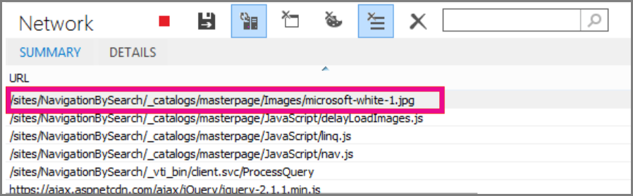
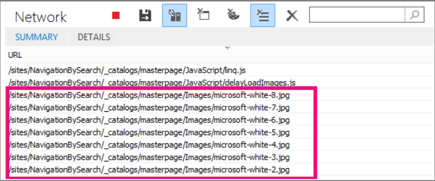

# Delay loading images and JavaScript in SharePoint

The article describes how you can decrease the load time for SharePoint pages by using JavaScript to delay loading images and also by waiting to load nonessential JavaScript until after the page loads.
  
Images can negatively affect page load speeds on SharePoint. By default, most modern Internet browsers prefetch images when loading an HTML page. This process can cause the page to be slow to load if the images aren't visible on the screen until the user scrolls down. The images can block the browser from loading the visible part of the page. To work around this problem, you can use JavaScript to skip loading the images first. Also, loading nonessential JavaScript can slow download times on your SharePoint pages too. This article describes some methods you can use to improve page load times with JavaScript in SharePoint.
  
## Improve page load times by delaying image loading in SharePoint pages by using JavaScript

You can use JavaScript to prevent a web browser from prefetching images. This technique speeds up overall document rendering. To do it, you remove the value of the src attribute from the \ tag and replace it with the path to a file in a data attribute such as: data-src. For example:
  
```html

```

In this method, the browser doesn't download the images immediately. If the image is already in the viewport, JavaScript tells the browser to retrieve the URL from the data attribute and insert it as the value for the src attribute. The image only loads as the user scrolls and it comes into view.
  
To perform this function, you need to use JavaScript.
  
In a text file, define the **isElementInViewport()** function to check whether or not an element is in the part of the browser that is visible to the user.
  
```javascript
function isElementInViewport(el) {
  if (!el)
    return false;
  var rect = el.getBoundingClientRect();
  return (
    rect.top >= 0 &amp;&amp;
    rect.left >= 0 &amp;&amp;
    rect.bottom <= (window.innerHeight || document.documentElement.clientHeight) &amp;&amp;
    rect.right <= (window.innerWidth || document.documentElement.clientWidth)
  );
}
```

Next, use **isElementInViewport()** in the **loadItemsInView()** function. The **loadItemsInView()** function loads all images that have a value for the data-src attribute if they are in the part of the browser that is visible to the user. Add the following function to the text file:
  
```javascript
function loadItemsInView() {
  //Select elements by the row id.
  $("#row [data-src]").each(function () {
      var isVisible = isElementInViewport(this);
      if (isVisible) {
          if ($(this).attr("src") == undefined) {
              $(this).attr("src", $(this).data("src"));
          }
      }
  });
}
```

Finally, call **loadItemsInView()** from within **window.onscroll()** as shown in the following example. This function ensures that any images that are in the viewport are loaded as the user needs them, but not before. Add the following to the text file:
  
```javascript
//Example of calling loadItemsInView() from within window.onscroll()
$(window).on("scroll", function () {
    loadItemsInView();
});

```

For SharePoint, you need to attach the following function to the scroll event on the #s4-workspace \<div\> tag because the window events are overridden in order to ensure the ribbon remains attached to the top of the page.
  
```javascript
//Keep the ribbon at the top of the page
$('#s4-workspace').on("scroll", function () {
    loadItemsInView();
});
```

Save the text file as a JavaScript file with the extension .js, for example delayLoadImages.js.
  
Once you finish writing delayLoadImages.js, you can add the contents of the file to a master page in SharePoint by adding a script link to the header in the master page. Once it's in a master page, the JavaScript is applied to all pages in your SharePoint site that use that master page layout. Alternatively, if you intend to only use the functionality on one page of your site, use the script editor Web Part to embed the JavaScript into the page. For more information, see:
  
- [How to: Apply a master page to a site in SharePoint 2013](/sharepoint/dev/general-development/how-to-apply-a-master-page-to-a-site-in-sharepoint)

- [How to: Create a page layout in SharePoint 2013](/sharepoint/dev/general-development/how-to-create-a-page-layout-in-sharepoint)

### Example: Referencing the JavaScript delayLoadImages.js file from a master page in SharePoint
  
For this example to work, you also need to reference jQuery in the master page. In the following example, you can see in the initial page load that there's only one image loaded but there are several more on the page.
  

  
The following screenshot shows the rest of the images that are downloaded after they scroll into view.
  

  
Delaying image loading by using JavaScript can be an effective technique in increasing performance; however, if the technique is applied on a public website then search engines aren't able to crawl the images in the same way they would crawl a regularly formed image. This technique can affect rankings on search engines because metadata on the image itself isn't there until the page loads. Search engine crawlers only read the HTML and therefore can't see the images as content on the page. Images are one of the factors used to rank pages in search results. A work-around is to use introductory text for your images.
  
## GitHub code sample: Injecting JavaScript to improve performance

Don't miss the article and code sample on [JavaScript injection](https://go.microsoft.com/fwlink/p/?LinkId=524759) provided on GitHub.
  
## See also

[Supported browsers in Office 2013 and Microsoft 365 Apps for enterprise](https://support.office.com/article/57342811-0dc4-4316-b773-20082ced8a82)
  
[How to: Apply a master page to a site in SharePoint 2013](/sharepoint/dev/general-development/how-to-apply-a-master-page-to-a-site-in-sharepoint)
  
[How to: Create a page layout in SharePoint 2013](/sharepoint/dev/general-development/how-to-create-a-page-layout-in-sharepoint)
