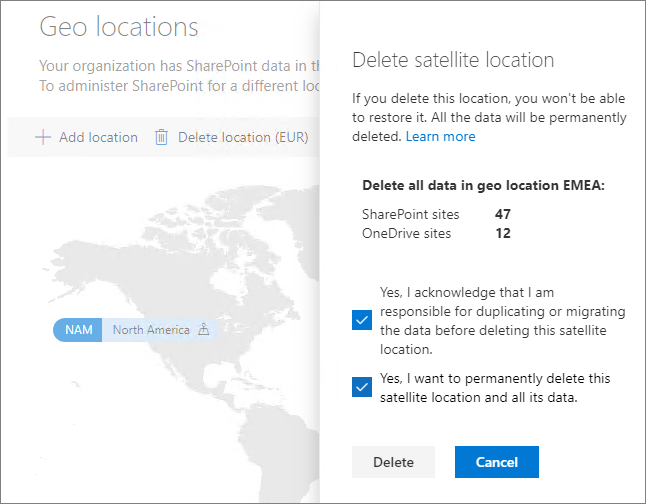

# Delete a _Satellite Geography_ location in Microsoft 365 Multi-Geo

If you no longer need a _Satellite Geography_ location, you can delete it from your _Tenant_ from the <a href="https://go.microsoft.com/fwlink/?linkid=2185219" target="_blank">SharePoint admin center</a>.

> [!WARNING]
> All user data in the _Satellite Geography_ location will be permanently deleted. This includes all OneDrive content, SharePoint sites and Exchange mailboxes including Microsoft 365 Group mailboxes. You must migrate any data to another _Satellite Geography_ location or the _Primary Provisioned Geography_ location before you delete the _Satellite Geography_ location. This action cannot be undone.

Only SharePoint Administrators can delete _Satellite Geography_ locations.

To delete a _Satellite Geography_ location

1. Open the SharePoint admin center, and go to the <a href="https://go.microsoft.com/fwlink/?linkid=2185076" target="_blank">**Geo locations** tab</a>.

2. On the map, select the _Satellite Geography_ location that you want to delete.

3. Select **Delete location**.

4. Confirm the deletion by selecting the confirmation check boxes.

5. Select **Delete**.

The deletion will take at least 7 days to complete.
