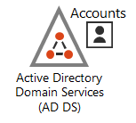
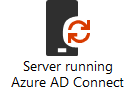
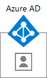
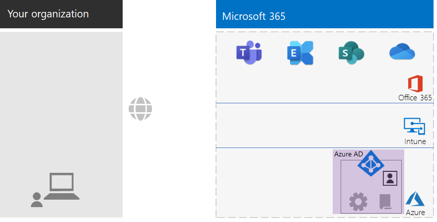
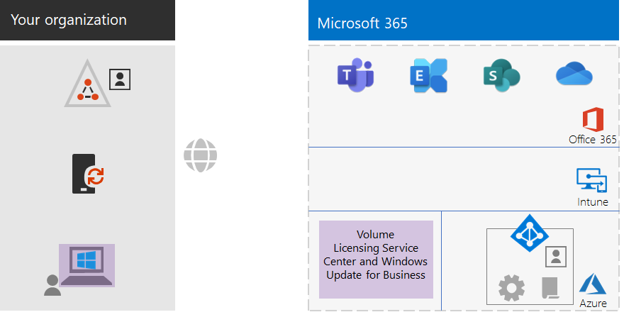
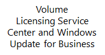
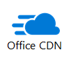
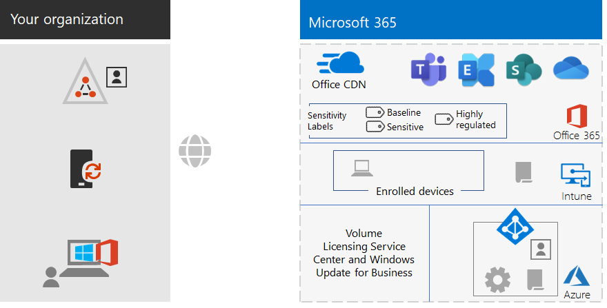
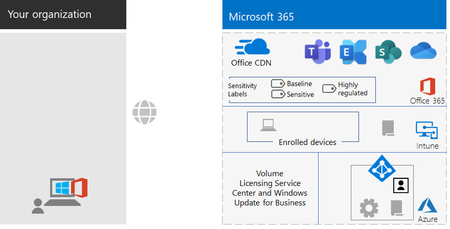

# Microsoft 365 for enterprise foundation infrastructure for non-enterprises

Non-enterprise organizations can also deploy Microsoft 365 for enterprise and realize the business value of an integrated and secure infrastructure that enables teamwork and unlocks creativity. A non-enterprise typically has:

- A small amount of on-premises IT infrastructure, such as email and file servers and an Active Directory Domain Services (AD DS) domain, or none at all.
- A small IT staff, most of whom are IT generalists, rather than specialists in a specific technology or workload such as networking or email.

For smaller, non-enterprise organizations, Microsoft offers [Microsoft 365 for business](https://www.microsoft.com/microsoft-365/business). However, there are reasons why you might need Microsoft 365 for enterprise, such as:

- Your organization needs more or will need more than 300 Microsoft 365 licenses, which is the maximum for Microsoft 365 for business.
- Your organization needs the advanced productivity, voice, security, and analytics capabilities that are not available with Microsoft 365 for business.

This article steps you through a simplified deployment of the foundation infrastructure of Microsoft 365 for enterprise suitable for your non-enterprise.

## First, set up your subscription

You must set up the Domain Name System (DNS) domains for your subscription. If you already have a Microsoft 365 subscription, this should have been done. If not, follow the instructions in [Add a domain to Office 365](https://docs.microsoft.com/office365/admin/setup/add-domain?view=o365-worldwide).

Next, you need to configure additional security for Microsoft 365. Follow the instructions in [Configure increased security](https://docs.microsoft.com/office365/securitycompliance/tenant-wide-setup-for-increased-security).

## Phase 1: Networking

Non-enterprise organizations typically have local Internet connections in each office and do not use proxy servers, firewalls, or packet inspection devices. The Internet service provider (ISP) serving each office has a regionally local DNS server so that traffic is directed to the Microsoft 365 network location that is closest to your offices and their on-premises users. For more information, see [Configure local Internet connections for each office](networking-dns-resolution-same-location.md).

Therefore, you only need to verify with your ISP that the connection at each of your office locations:

- Uses a regionally local DNS server.
- Is adequate for current and future needs as your users begin using more Microsoft 365 cloud services.

If you do use proxy servers, firewalls, or packet inspection devices, see [Configure traffic bypass](networking-configure-proxies-firewalls.md) for information on how to optimize performance to Microsoft 365 services.

### Your configuration so far

Here is a visual summary with the Phase 1 element highlighted. **Your organization** can be multiple offices, each of which has a local Internet connection with an ISP that uses a regionally local DNS server. Through the ISP, users in each office can reach the nearest Microsoft 365 network location and the resources of your Microsoft 365 subscription.

## Phase 2: Identity

Each employee of your organization must be able to sign in, which requires a user account in the Azure Active Directory (Azure AD) tenant of your Microsoft 365 for enterprise subscription. Groups are then used to contain user accounts and other groups to communicate or gain access to permissioned resources, such as a SharePoint Online site or a team. 

### Administrator accounts

Protect your global administrator user accounts by requiring strong passwords and multi-factor authentication (MFA). See [Protect global administrator accounts](identity-create-protect-global-admins.md#protect-global-administrator-accounts) for more information.

If your organization requires high security and you have Microsoft 365 E5, use Azure AD Privileged Identity Management to enable just-in-time administrator access. See [Set up on-demand global administrators](identity-create-protect-global-admins.md#identity-pim) for more information.

### Recommendations for groups

If you have an on-premises AD DS domain, continue to use those groups in Microsoft 365 for enterprise as groups in Azure AD.

If you don't have an on-premises AD DS domain, create security groups in Azure AD using these levels of security.

| Security level | Description | Examples |
|:-------|:-----|:-----|
| Baseline | This is a minimum and default  standard for protecting data and the identities and devices that access your data.    This is typically most of your organization's data managed by most of your users. | Groups for first line workers, such as sales, marketing, support, administration, and manufacturing. |
| Sensitive | This is additional protection for a subset of your data that must be protected beyond the baseline level. These groups contain users that use and create sensitive data that is specific to departments and projects that are not meant to be available to everyone. | Product or marketing teams that are developing future products |
| Highly regulated | This is the highest level of protection for a typically small amount of data that is highly classified, considered intellectual property or trade secrets, or data that must adhere to security regulations. |  Research, legal, and financial teams, or teams storing or using customer or partner data. |
||||

### Hybrid identity

If you have an on-premises AD DS domain, you need to synchronize the set of user accounts, groups, and contacts of your domain with the Azure AD tenant of your Microsoft 365 for enterprise subscription. For your non-enterprise, you configure Azure AD Connect on a server with password hash synchronization (PHS). See [Synchronize identities](identity-add-user-accounts.md#synchronize-identities-for-hybrid-identity) for more information.

### More secure user access with Conditional Access policies

Azure AD evaluates the conditions of user sign-ins and can use Conditional Access policies to grant or deny access and impose further actions that must be taken to complete the sign-in. For example, if Azure AD determines that the sign-in is happening under medium or high-risk conditions, it can require the user to perform MFA to complete the sign-in.

You apply Conditional Access policies to user accounts or groups. To facilitate an easier assignment of Conditional Access policies, create these Azure AD security groups in your organization:

- BASELINE

  Contains the groups or user accounts for users with access to baseline data.

- SENSITIVE

  Contains the groups or user accounts for users with access to sensitive data.

- HIGHLY-REGULATED

  Contains the groups or user accounts for users with access to highly regulated data.

- COND-ACCESS-EXCLUDE

  An empty group that you can use to temporarily exclude a user from Conditional Access policies.

Here is the list of Azure AD Conditional Access policies to enable or create.

| Azure AD Conditional Access policy | Groups to which it applies |
|:------|:-----|
| Baseline policy: Require MFA for admins | This policy applies to admin roles, so no groups need to be specified. This policy just needs to be enabled. All subsequent policies need to be created and enabled. |
| Block clients that don't support modern authentication | Select "All users" in the policy settings. |
| Require MFA when sign-in risk is medium or high (requires Microsoft 365 E5) | BASELINE |
| Require MFA when sign-in risk is low, medium, or high (requires Microsoft 365 E5) | SENSITIVE |
| Always require MFA | HIGHLY-REGULATED |
| Require approved apps on iOS and Android devices | BASELINE, SENSITIVE, HIGHLY-REGULATED |
| Require compliant PCs | BASELINE |
| Require compliant PCs and iOS and Android devices | SENSITIVE, HIGHLY-REGULATED |
|||

Here is the Azure AD Identity Protection (requires Microsoft 365 E5) user risk policy to create and enable.

| Azure AD Identity Protection user risk policy | Groups to which it applies |
|:------|:-----|
| High risk users must change passwords | Select "All users" in the policy settings. |
|||

See [Common identity and device access policies](identity-access-policies.md) for the instructions.

### Groups for easier management

Here are some features that can make group and licensing management easier for you.

| Feature | Use |
|:------|:-----|
| Self-service group management | Allow management of Azure AD groups by group owners instead of IT staff. See [Self-service group management](identity-use-group-management.md#allow-users-to-create-and-manage-their-own-groups) for more information. |
| Dynamic group membership | Configure automatic addition or removal of user accounts from Azure AD groups based on user account attributes, such as Department or Country. See [Dynamic group membership](identity-use-group-management.md#set-up-dynamic-group-membership) for more information. |
| Group-based licensing | Use group membership to automatically assign or unassign licenses to user accounts. See [Group-based licensing](identity-use-group-management.md#set-up-automatic-licensing) for more information. |
|  |  |

If you are using group-based licensing, create a group named LICENSED to contain user account names that are assigned a Microsoft 365 for enterprise license.

### Monitor user access

If you have Microsoft 365 E5, you can use Azure AD Identity Protection to monitor and analyze user sign-ins for credential compromise. See [Protect against credential compromise](identity-secure-user-sign-ins.md#protect-against-credential-compromise) for more information.

### Your configuration so far

Here is a visual summary of the Identity phase for hybrid identity, with existing and new elements highlighted.

 
The new and highlighted hybrid identity elements include:
 
|||
|:------:|:-----|
|  | An on-premises AD DS domain with user accounts and groups. |
|  | A Windows-based server running Azure AD Connect. |
|  | The synchronized set of AD DS user accounts and groups in Azure AD. |
|  | Azure AD settings for authentication, securing global accounts, and making it easier to manage groups and licenses. |
|  | Azure AD Conditional Access policies. |
|||

Here is a visual summary of the Identity phase for cloud-only identity, with the new elements highlighted.

 
The new and highlighted cloud-only identity elements include:
 
|||
|:------:|:-----|
|  | The user accounts and groups in Azure AD. |
|  | Azure AD settings for authentication, securing global accounts, and making it easier to manage groups and licenses. |
|  | Azure AD Conditional Access policies. |
|||

## Phase 3: Windows 10 Enterprise

To ensure that your Windows 10 Enterprise devices are integrated into the identity and security infrastructure of Microsoft 365 for enterprise, here are your options:

- Hybrid (you have an on-premises AD DS domain)

  For each existing Windows 10 Enterprise device already joined to your AD DS domain, join them to the Azure AD tenant. See [How to configure hybrid Azure Active Directory joined devices](https://go.microsoft.com/fwlink/p/?linkid=872870) for the instructions.

  For each new Windows 10 Enterprise device, join them to your AD DS domain, and then join them to the Azure AD tenant.

  For each Windows 10 Enterprise device, enroll them for mobile device management. See [Enroll a Windows 10 device with Intune by using a Group Policy](https://go.microsoft.com/fwlink/p/?linkid=872871) for the instructions.

- Cloud-only (you do not have an on-premises AD DS domain)

  Join each Windows 10 Enterprise device to the Azure AD tenant of your subscription.

  See [Join your work device to your organization's network](https://docs.microsoft.com/azure/active-directory/user-help/user-help-join-device-on-network) for more information.

Once installed and joined, each Windows 10 Enterprise device automatically installs updates from the Windows Update for Business cloud service. There is typically no need in a non-enterprise organization to set up an infrastructure to distribute and install Windows 10 updates.

### Your configuration so far

Here is a visual summary of the Windows 10 Enterprise phase with the new elements highlighted.

 
The new and highlighted Windows 10 Enterprise elements include:

|||
|:------:|:-----|
|  | Windows 10 Enterprise installed on Windows devices, with an on-premises laptop as an example. |
|  | The Volume Licensing Service Center, which provides images for new installations of Windows 10 Enterprise, and the Windows Update for Business service, which provides the latest updates. |
|||

## Phase 4: Microsoft 365 Apps for enterprise

Microsoft 365 for enterprise includes Microsoft 365 Apps for enterprise, the subscription version of Microsoft Office. Like Office 2016 or Office 2019, Microsoft 365 Apps for enterprise is installed directly on your client devices. However, Microsoft 365 Apps for enterprise receives updates that include new features on a regular basis. See [About Microsoft 365 Apps for enterprise in the enterprise](https://docs.microsoft.com/deployoffice/about-office-365-proplus-in-the-enterprise) for more information.

For your non-enterprise organization, you manually install Microsoft 365 Apps for enterprise on devices, which can include Windows, iOS, and Android devices. This can be done as part of preparing a new device for use, or by the user as part of their onboarding process.

In either case, the administrator or the user signs in to the Office 365 portal at https://portal.office.com. On the **Microsoft Office Home** tab, click **Install Office** and step through the installation process.

Feature updates to Microsoft 365 Apps for enterprise are downloaded monthly by each computer on which it is installed. There is typically no need in a non-enterprise organization to set up an infrastructure to distribute Microsoft 365 Apps for enterprise updates. 

### Your configuration so far

Here is a visual summary of the Microsoft 365 Apps for enterprise phase with the new elements highlighted.

 
The new and highlighted Microsoft 365 Apps for enterprise elements include:
 
|||
|:------:|:-----|
|  | Microsoft 365 Apps for enterprise installed on devices, with an on-premises laptop as an example. |
|  | The Office Content Delivery Network (CDN) for Microsoft 365 Apps for enterprise, which devices access for Microsoft 365 Apps for enterprise updates. |
|||

## Phase 5: Mobile device management

Microsoft 365 for enterprise includes Microsoft Intune for mobile device management. With Intune, you can manage Windows, iOS, Android, and macOS devices to protect access to your organization's resources, including your data. Intune uses the user, group, and computer accounts of Azure AD.

Intune provides two types of mobile device management:

- Mobile device management (MDM) is when devices get enrolled in Intune. Once enrolled, they are managed devices and can receive the policies, rules, and settings used by your organization. These types of devices are typically owned by your organization and issued to your employees.

- Users with their own personal devices may not want to enroll their devices or be managed by Intune with your policies and settings. However, you still need to protect your organization's resources and data. For this scenario, you can protect your apps with mobile application management (MAM).  

Intune policies can enforce device compliance and app protection. Here is the list of Intune policies to create.

| Intune policies | Groups to which it applies |
|:------|:-----|
| Device compliance policy for Windows | BASELINE, SENSITIVE, HIGHLY-REGULATED |
| Device compliance policy for iOS | SENSITIVE, HIGHLY-REGULATED |
| Device compliance for macOS | SENSITIVE, HIGHLY-REGULATED |
| Device compliance policy for Android and Android Enterprise | SENSITIVE, HIGHLY-REGULATED |
| App protection policy for iOS | BASELINE, SENSITIVE, HIGHLY-REGULATED |
| App protection policy for macOS | BASELINE, SENSITIVE, HIGHLY-REGULATED |
| App protection policy for Android and Android Enterprise | BASELINE, SENSITIVE, HIGHLY-REGULATED |
|||
    
See [Common identity and device access policies](identity-access-policies.md) for the instructions.

### Your configuration so far

Here is a visual summary of the Mobile Device Management phase with the new elements highlighted.

 
The new and highlighted mobile device management elements include:

|||
|:------:|:-----|
|  | Devices that are enrolled in Intune, showing an on-premises laptop running Windows 10 Enterprise as an example. |
|  | Intune policies for device compliance and app protection. |
|||

## Phase 6: Information protection

Microsoft 365 for enterprise has a host of information protection features that allow you to treat classifications of data differently by applying different levels of governance, security, and protection. 

For example, normal correspondence between most employees and the documents on which they work need a certain baseline level of protection. Financial records, customer data, and your intellectual property need a higher level of protection.

The first step to an information protection strategy is to determine the levels of protection. Many organizations use these levels, which are already being used for Conditional Access policies:

- Baseline

  Examples include normal business communications (email) and files for administrative, sales, and support workers.

- Sensitive

  Examples include financial and legal information and research and development data for new products or services.

- Highly regulated

  Examples include customer and partner personally identifiable information and your organization's strategic plans or intellectual property.

Based on these levels of data security, the next step is to identify and implement:

- Custom sensitive information types

  Microsoft 365 supplies a wide selection of sensitive information types, such as health service and credit card numbers. If you do not find one that you need in the supplied list, you can create your own.

- Retention labels

  To comply with organization policies and regional regulations, you might have to specify how long specific types of documents or documents with specific contents should be retained. You can implement this for email and documents using retention labels. Retention labels can also be used in conjunction with Data Loss Prevention (DLP) policies that can restrict the sharing of files or email outside your organization.

- Sensitivity labels

  You can label email or documents with a named sensitivity label so that additional levels of security can be applied. Examples are watermarks, encryption, and permissions, which specify who is allowed to access the email or document and what they are allowed to do.

See [Microsoft 365 classification types](infoprotect-configure-classification.md#microsoft-365-classification-types) for more information.

If you use sensitivity labels with permissions, you might have to create additional security groups to define who is allowed to do what with email and documents that have the sensitivity label applied. 

For example, you need to create a RESEARCH sensitivity label to protect the email and documents of your research team. You determine that:

- Researchers must have the ability to change documents marked with the RESEARCH sensitivity label.
- Non-research employees only need to have the ability to view documents marked with the RESEARCH sensitivity label. 

This means you need to create and manage two additional Office 365 groups:

- RESEARCH-ALL
- RESEARCH-VIEW

These groups and their permissions become part of the RESEARCH sensitivity label's configuration.

For sensitivity labels configured with group-based permissions, you must manage the membership of these groups.

### Your configuration so far

Here is a visual summary of the Information Protection phase with the new elements highlighted.

 
The new and highlighted information protection elements include:
 
|||
|:------:|:-----|
|  | Sensitivity labels for the three levels of security that users can apply to documents and email. |
|||

Custom information types and retention labels are not shown.

## Onboarding

With your Microsoft 365 for enterprise infrastructure in place, you can easily onboard your employees.

### A new Windows 10 Enterprise device

Before giving an employee a new Windows 10 Enterprise device:

- For hybrid identity

  Join the device to your AD DS domain, join the device to your Azure AD tenant, and then enroll the device in Intune.

- For cloud-only identity

  Join the device to your Azure AD tenant.

### Existing employee with an AD DS user account

As part of the initial onboarding for your organization when using hybrid identity, add the AD DS user account to these Azure AD groups:

- LICENSED
- The appropriate AD DS or Azure AD security groups that are members of the BASELINE, SENSITIVE, and HIGHLY-REGULATED Azure AD groups
- Sensitivity label groups (as needed)

The existing employee should already be added to the appropriate workgroup, departmental, and regional AD DS groups.

You can add a user account to multiple Azure AD groups in the Microsoft 365 admin center. From the properties of the user account, click **Manage groups > Add memberships**.

If you want to use PowerShell, see this [downloadable Excel workbook](https://github.com/MicrosoftDocs/microsoft-365-docs/raw/public/microsoft-365/media/deploy-foundation-infrastructure-non-enterprises/Group-License-Mgmt-PowerShell.xlsx), which generates the PowerShell commands based on a specified user account and selected group names.

### New employee with a cloud-only user account

As part of the initial onboarding for your organization when using cloud-only identity, add the new user account to these groups:

- LICENSED
- The appropriate Azure AD security groups that are members of the BASELINE, SENSITIVE, and HIGHLY-REGULATED Azure AD groups
- Workgroup, departmental, and regional groups
- Sensitivity label groups (as needed)

### Initial sign-in to Microsoft 365

For the first time employees sign in to Microsoft 365, instruct them to:

1. Sign into their devices with their user account credentials.
2. Using a browser, sign in to the Office 365 portal at https://portal.office.com.
3. From the **Office 365 Home** tab, click **Install Office** to install Microsoft 365 Apps for enterprise on their device.

## End results

Here are the results of configuring the Microsoft 365 for enterprise foundation infrastructure for your non-enterprise organization.

### Infrastructure results

After the build-out and configuration of your Microsoft 365 for enterprise infrastructure, you should have:

- A local Internet connection for each of your offices with sufficient bandwidth supplied by an ISP that uses a regionally local DNS server.
- For hybrid identity, Azure AD Connect running on a server that synchronizes your on-premises AD DS domain with your Azure AD tenant.
- These groups:
  - LICENSED
  - COND-ACCESS-EXCLUDE
  - The appropriate AD DS or Azure AD security groups that are also members of the BASELINE, SENSITIVE, and HIGHLY-REGULATED Azure AD groups 
  - Workgroup, departmental, and regional groups
  - Sensitivity label Office 365 groups (as needed)
- Azure AD sign-in Conditional Access policies that use the BASELINE, SENSITIVE, and HIGHLY-REGULATED, and COND-ACCESS-EXCLUDE Azure AD groups.
- Intune application and device compliance policies.
- Custom sensitive information types (as needed).
- Retention labels (as needed).
- Sensitivity labels (as needed).

Here is a visual summary of the infrastructure if your organization uses hybrid identity, which includes your AD DS domain, an Azure AD Connect server, and synchronized AD DS users and groups.

 
Here is a visual summary of the infrastructure if your organization uses cloud-only identity.
 

### Employee results

After their onboarding, each employee should have:

- A performant, on-premises network path from their device to the Microsoft 365 cloud services in their region.
- A user account with these group memberships:
   - LICENSED
   - The appropriate AD DS or Azure AD security groups, which are also members of the BASELINE, SENSITIVE, and HIGHLY-REGULATED Azure AD groups for Conditional Access policies 
   - The appropriate workgroup, departmental, and regional groups
   - Sensitivity label Office 365  groups (as needed)
- A Windows 10 Enterprise device that:
   - Is joined to the Azure AD tenant (cloud-only) or to both the Azure AD tenant and your AD DS domain (hybrid).
   - Automatically updates itself with the latest Windows 10 Enterprise product improvements and security enhancements.
   - Has Microsoft 365 Apps for enterprise installed, which automatically updates itself with the latest Office product improvements and security enhancements.
   - Is enrolled in Intune and subject to Intune device compliance policies and app protection policies.

## Next step

Deploy your [workloads and scenarios](deploy-workloads.md) to take advantage of the features and configuration of your Microsoft 365 for enterprise foundation infrastructure.
