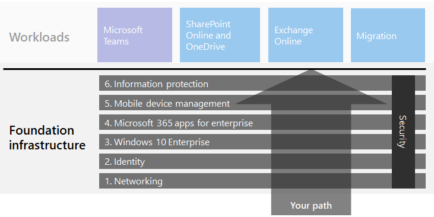
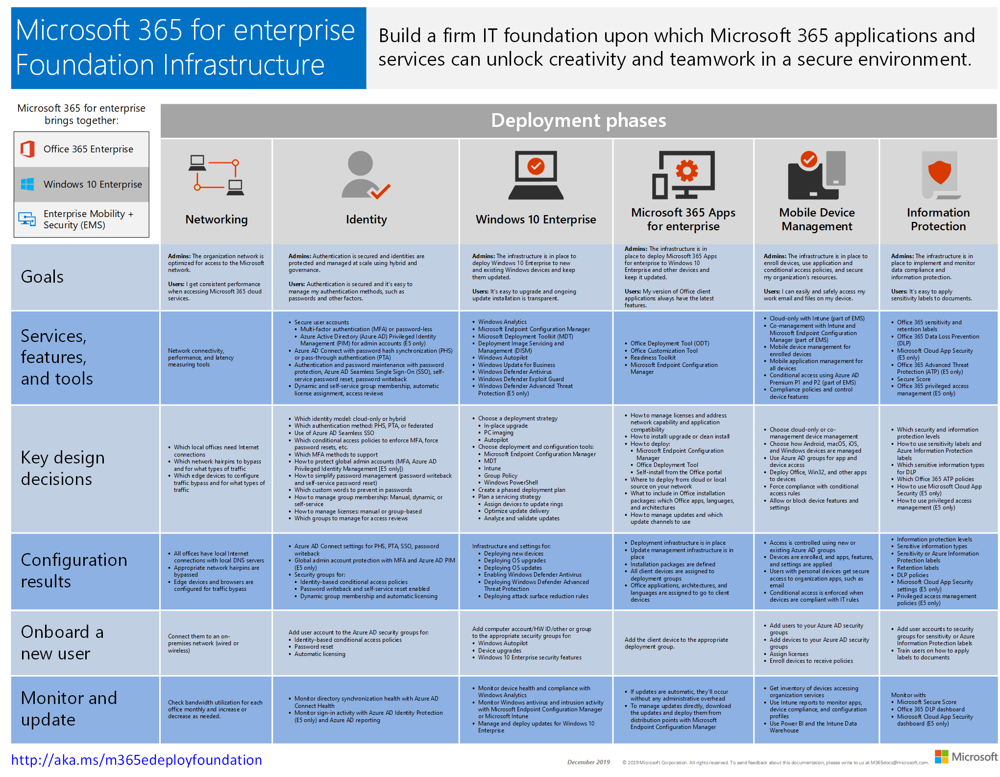

# Microsoft 365 for enterprise foundation infrastructure

If you're doing the end-to-end deployment of Microsoft 365 for enterprise yourself, you should first build a firm foundation upon which applications and services can unlock creativity and teamwork in a secure environment. This foundation is sometimes referred to as a *core deployment*.

For a defined end-to-end path for deployment, you can use these phases to plan for and deploy the foundation infrastructure of Microsoft 365 for enterprise:

| | Phase | Results |
|:-------|:-----|:-----|
||[Phase 1: Networking](networking-infrastructure.md)| Your network is optimized for access to Microsoft 365's cloud-based services. |
||[Phase 2: Identity](identity-infrastructure.md)| Your admin accounts are protected, your users and groups are synchronized, and your user authentication is strong. |
||[Phase 3: Windows 10 Enterprise](windows10-infrastructure.md)| Your existing Windows-based computers can upgrade to Windows 10 Enterprise and new devices are installed with Windows 10 Enterprise. |
||[Phase 4: Office 365 ProPlus](office365proplus-infrastructure.md)| Your existing users of Microsoft Office can upgrade to Office 365 ProPlus. |
||[Phase 5: Mobile device management](mobility-infrastructure.md)| Your devices can be enrolled and managed. |
||[Phase 6: Information protection](infoprotect-infrastructure.md)| Office 365 security features are enabled and your labels and policies are ready to protect documents and email. |

The phases start with the most foundational (networking and identity), and then create layers of infrastructure settings and groups to:

- Install the most current and secure version of Windows on your devices and keep it current.
- Install the most current version of Microsoft Office on your devices and keep it current.
- Manage your organization's devices and their access to apps.
- Protect the information on those devices and in the cloud.

However, you have the flexibility of configuring and rolling out the phases or steps within phases to fit your IT resources and business needs.

- **If you are a smaller or newer organization**, follow the phases as needed to methodically build out your infrastructure. For a simplified deployment for non-enterprises, click [here](deploy-foundation-infrastructure-non-enterprises.md).

-  **If you are an enterprise organization**, view the phases as layers of IT infrastructure, rather than a defined path, and determine how to best work toward eventual adherence to the requirements for each layer across your organization.

At the end of each phase, you should examine its *exit criteria*, which include required conditions that you must meet and optional conditions to consider. Exit criteria for each phase ensures that your on-premises and cloud infrastructure and resulting end-to-end configuration meet the requirements for a Microsoft 365 for enterprise deployment.

To see how the content is structured, watch this short video.

> [!VIDEO https://www.microsoft.com/videoplayer/embed/RE23VRG]

Here's the foundation infrastructure in the overall Microsoft 365 for enterprise deployment guide:

## At-a-glance

The [Microsoft 365 for enterprise foundation infrastructure poster](../media/deploy-foundation-infrastructure/Microsoft365EnterpriseFoundInfra.pdf) is a central location for you to view, for each phase:

- The overall goals of the phase for administrators and users
- The services, features, and tools
- The key design decisions for planning
- The configuration results
- The process for onboarding a new user
- How to monitor and update

To download a copy of the poster, click [here](https://github.com/MicrosoftDocs/microsoft-365-docs/raw/public/microsoft-365/enterprise/media/deploy-foundation-infrastructure/Microsoft365EnterpriseFoundInfra.pdf).

## Infrastructure configuration vs. user rollout

The foundation infrastructure is a set of configured software and services that, when combined together for a user, allow them to take advantage of the entire spectrum of capabilities and protections that Microsoft 365 for enterprise offers. The ultimate destination of your end-to-end deployment journey is to have this infrastructure apply to all of your users and their Windows-based devices. 

However, it is important to note that the Microsoft 365 for enterprise foundation infrastructure is independent of the rollout of software and services to your users. ***You can configure the layers of the foundation infrastructure without having to roll out those layers to all of your users.***

It is possible to configure, test, and pilot elements of the foundation infrastructure well ahead of the rollout of those elements to the multitude of your users in the offices, regions, or divisions of your organization.

For example, you create the settings for:

| Phase | Results |
|:-------|:-----|
| Identity | Account synchronization and groups for identity-based conditional access policies. |
| Windows 10 Enterprise | Groups to automatically upgrade computers running Windows 7 or Windows 8.1 to Windows 10 Enterprise in place. |
| Office 365 ProPlus | Groups to automatically deploy Office 365 ProPlus for users with Office 2010, Office 2013, or Office 2016. |
| Mobile device management | Groups for device enrollment and device-based conditional access policies. |
| Information protection | Groups for Office 365 sensitivity labels. |

When you are ready to rollout elements of this infrastructure to users, you:

| Phase | Rollout action |
|:-------|:-----|
| Identity | Add user accounts to the groups for identity-based conditional access policies. |
| Windows 10 Enterprise | Add accounts to the groups to automatically deploy Windows 10 Enterprise in place for users with Windows 7 or Windows 8.1. |
| Office 365 ProPlus | Add user accounts to the groups to automatically deploy Office 365 ProPlus for users with Office 2010, Office 2013, or Office 2016. |
| Mobile device management | Add accounts to the groups for device enrollment and device-based conditional access policies. |
| Information protection | Add user accounts to the groups for sensitivity labels. |

Once phases or elements of the foundation infrastructure are completed, tested, and piloted, you can roll out installed software, such as Windows 10 Enterprise and Office 365 ProPlus, and cloud-based services and protections, such as device enrollment and conditional access policies, to your users in the manner that best fits your business goals and IT resources.

## Deployment and project management strategies

To give you some ideas on how to approach the project management of the different phases of the foundation infrastructure for pilot users and the rest of your organization, see [deployment strategies](deployment-strategies-microsoft-365-enterprise.md).

## Deployment for non-enterprises

If your organization is smaller and Microsoft 365 Business is not suitable for you, see [deployment for non-enterprises](deploy-foundation-infrastructure-non-enterprises.md) for a simplified deployment method.

## Next step

| Where I am | Where I need to go |
|:-------|:-----|
| I have existing infrastructure for Office 365, Enterprise Mobility + Security (EMS), or Windows 10 Enterprise | Start with [Deploy with existing infrastructure](deploy-with-existing-infrastructure.md), which steps you through the exit criteria for each phase. |
| I'm starting from scratch as an enterprise | Begin your end-to-end deployment journey with [Phase 1: Networking](networking-infrastructure.md). |
| I'm starting from scratch as a non-enterprise | Begin your end-to-end deployment journey with [Deployment for non-enterprises](deploy-foundation-infrastructure-non-enterprises.md). |
