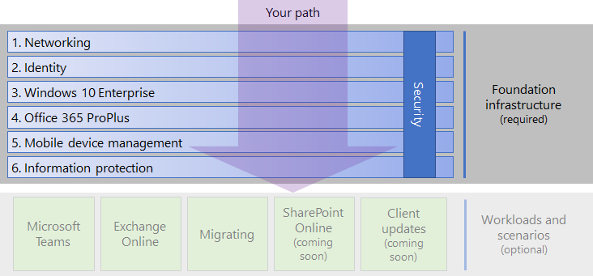

# Microsoft 365 Enterprise foundation infrastructure

To fully realize the benefits of Microsoft 365 Enterprise, you’ll begin your deployment with its foundation infrastructure. 

## Foundation infrastructure for deploying Microsoft 365 Enterprise

The foundation infrastructure is the groundwork upon which you can deploy productivity workloads (such as Microsoft Teams and Exchange Online in Office 365) and scenarios (such as migrating to Microsoft 365 and creating a secure SharePoint Online site). It provides intelligent security and integration that simplifies ongoing management, which ensures that your client software is updated with the latest productivity and security enhancements.

You'll use the following phases to plan for and deploy the foundation infrastructure of Microsoft 365 Enterprise in your organization:

|||
|:-------|:-----|
||[Phase 1: Networking](networking-infrastructure.md)|
||[Phase 2: Identity](identity-infrastructure.md)|
||[Phase 3: Windows 10 Enterprise](windows10-infrastructure.md)|
||[Phase 4: Office 365 ProPlus](office365proplus-infrastructure.md)|
||[Phase 5: Mobile device management](mobility-infrastructure.md)|
||[Phase 6: Information protection](infoprotect-infrastructure.md)|

Before you can exit each phase, you must examine its exit criteria, which is a set of required conditions that you must meet and optional conditions to consider. Exit criteria for each phase ensures that your on-premises and cloud infrastructure and resulting end-to-end configuration meet the requirements for a Microsoft 365 Enterprise deployment.

Watch this short video on how the foundation infrastructure content works.

> [!VIDEO https://www.microsoft.com/videoplayer/embed/RE23VRG]

The following figure shows the foundation infrastructure in the overall Microsoft 365 Enterprise deployment content and your path through it.

## FastTrack

FastTrack is an ongoing and repeatable benefit—available as part of your subscription—that is delivered by Microsoft engineers to help you move to the cloud at your own pace. FastTrack also gives you access to qualified partners for additional services, as needed. With over 40,000 customers enabled to date, FastTrack helps maximize ROI, accelerate deployment, and increase adoption across your organization. See [FastTrack for Microsoft 365](https://fasttrack.microsoft.com/microsoft365). 

If you want to take advantage of FastTrack to deploy Microsoft 365 Enterprise, you can use the FastTrack [Microsoft 365 deployment advisor](https://aka.ms/microsoft365setupguide) for guidance on how to deploy and set up your foundation infrastructure. You must be signed on as a global administrator in an Office 365 or Microsoft 365 tenant in order to access this page.

## Next step

If you have existing infrastructure for Office 365, Enterprise Mobility + Security, or Windows 10 Enterprise, see [Deployment of Microsoft 365 Enterprise with existing infrastructure](deploy-with-existing-infrastructure.md). This article steps you through the exit criteria for each phase. With this information, you can more quickly determine what you need to change to make your IT infrastructure Microsoft 365 Enterprise-compliant.

Otherwise, you can begin your Microsoft 365 Enterprise end-to-end deployment journey with [Phase 1: Networking](networking-infrastructure.md).