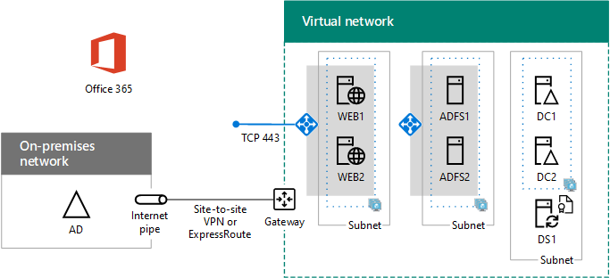

# Deploy high availability federated authentication for Microsoft 365 in Azure

This article has links to the step-by-step instructions for deploying high availability federated authentication for Microsoft Microsoft 365 in Azure infrastructure services with these virtual machines:
  
- Two web application proxy servers
    
- Two Active Directory Federation Services (AD FS) servers
    
- Two replica domain controllers
    
- One directory synchronization server running Azure AD Connect
    
Here is the configuration, with placeholder names for each server.
  
**A high availability federated authentication for Microsoft 365 infrastructure in Azure**

  
All of the virtual machines are in a single cross-premises Azure virtual network (VNet). 
  
> [!NOTE]
> Federated authentication of individual users does not rely on any on-premises resources. However, if the cross-premises connection becomes unavailable, the domain controllers in the VNet will not receive updates to user accounts and groups made in the on-premises Active Directory Domain Services (AD DS). To ensure this does not happen, you can configure high availability for your cross-premises connection. For more information, see [Highly Available Cross-Premises and VNet-to-VNet Connectivity](/azure/vpn-gateway/vpn-gateway-highlyavailable)
  
Each pair of virtual machines for a specific role is in its own subnet and availability set.
  
> [!NOTE]
> Because this VNet is connected to the on-premises network, this configuration does not include jumpbox or monitoring virtual machines on a management subnet. For more information, see [Running Windows VMs for an N-tier architecture](/azure/guidance/guidance-compute-n-tier-vm). 
  
The result of this configuration is that you will have federated authentication for all of your Microsoft 365 users, in which they can use their AD DS credentials to sign in rather than their Microsoft 365 account. The federated authentication infrastructure uses a redundant set of servers that are more easily deployed in Azure infrastructure services, rather than in your on-premises edge network.
  
## Bill of materials

This baseline configuration requires the following set of Azure services and components:
  
- Seven virtual machines
    
- One cross-premises virtual network with four subnets
    
- Four resource groups
    
- Three availability sets
    
- One Azure subscription
    
Here are the virtual machines and their default sizes for this configuration.
  
|**Item**|**Virtual machine description**|**Azure gallery image**|**Default size**|
|:-----|:-----|:-----|:-----|
|1.    |First domain controller    |Windows Server 2016 Datacenter    |D2    |
|2.    |Second domain controller    |Windows Server 2016 Datacenter    |D2    |
|3.    |Azure AD Connect server    |Windows Server 2016 Datacenter    |D2    |
|4.    |First AD FS server    |Windows Server 2016 Datacenter    |D2    |
|5.    |Second AD FS server    |Windows Server 2016 Datacenter    |D2    |
|6.    |First web application proxy server    |Windows Server 2016 Datacenter    |D2    |
|7.    |Second web application proxy server    |Windows Server 2016 Datacenter    |D2    |
   
To compute the estimated costs for this configuration, see the [Azure pricing calculator](https://azure.microsoft.com/pricing/calculator/)
  
## Phases of deployment

You deploy this workload in the following phases:
  
- [Phase 1: Configure Azure](high-availability-federated-authentication-phase-1-configure-azure.md). Create resource groups, storage accounts, availability sets, and a cross-premises virtual network.
    
- [Phase 2: Configure domain controllers](high-availability-federated-authentication-phase-2-configure-domain-controllers.md). Create and configure replica AD DS domain controllers and the directory synchronization server.
    
- [Phase 3: Configure AD FS servers](high-availability-federated-authentication-phase-3-configure-ad-fs-servers.md). Create and configure the two AD FS servers.
    
- [Phase 4: Configure web application proxies](high-availability-federated-authentication-phase-4-configure-web-application-pro.md). Create and configure the two web application proxy servers.
    
- [Phase 5: Configure federated authentication for Microsoft 365](high-availability-federated-authentication-phase-5-configure-federated-authentic.md). Configure federated authentication for your Microsoft 365 subscription.
    
These articles provide a prescriptive, phase-by-phase guide for a predefined architecture to create a functional, high availability federated authentication for Microsoft 365 in Azure infrastructure services. Keep the following in mind:
  
- If you are an experienced AD FS implementer, feel free to adapt the instructions in phases 3 and 4 and build the set of servers that best suits your needs.
    
- If you already have an existing Azure hybrid cloud deployment with an existing cross-premises virtual network, feel free to adapt or skip the instructions in phases 1 and 2 and place the AD FS and web application proxy servers on the appropriate subnets.
    
To build a dev/test environment or a proof-of-concept of this configuration, see [Federated identity for your Microsoft 365 dev/test environment](federated-identity-for-your-microsoft-365-dev-test-environment.md).
  
## Next step

Start the configuration of this workload with [Phase 1: Configure Azure](high-availability-federated-authentication-phase-1-configure-azure.md). 
