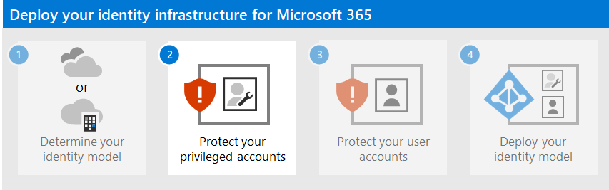

# Step 1. Determine your cloud identity model

Check out all of our small business content on [Small business help & learning](https://go.microsoft.com/fwlink/?linkid=2224585).

Microsoft 365 uses Microsoft Entra ID, a cloud-based user identity and authentication service that is included with your Microsoft 365 subscription, to manage identities and authentication for Microsoft 365. Getting your identity infrastructure configured correctly is vital to managing Microsoft 365 user access and permissions for your organization.

Before you begin, watch this video for an overview of identity models and authentication for Microsoft 365.

 

> [!VIDEO https://www.microsoft.com/videoplayer/embed/RE2Pjwu]

Your first planning choice is your cloud identity model.

## Microsoft cloud identity models

To plan for user accounts, you first need to understand the two identity models in Microsoft 365. You can maintain your organization's identities only in the cloud, or you can maintain your on-premises Active Directory Domain Services (AD DS) identities and use them for authentication when users access Microsoft 365 cloud services.

Here are the two types of identity and their best fit and benefits.

| Attribute | Cloud-only identity | Hybrid identity |
|:-------|:-----|:-----|
| **Definition** | User account only exists in the Microsoft Entra tenant for your Microsoft 365 subscription. | User account exists in AD DS and a copy is also in the Microsoft Entra tenant for your Microsoft 365 subscription. The user account in Microsoft Entra ID might also include a hashed version of the already hashed AD DS user account password. |
| **How Microsoft 365 authenticates user credentials** | The Microsoft Entra tenant for your Microsoft 365 subscription performs the authentication with the cloud identity account. | The Microsoft Entra tenant for your Microsoft 365 subscription either handles the authentication process or redirects the user to another identity provider. |
| **Best for** | Organizations that do not have or need an on-premises AD DS. | Organizations using AD DS or another identity provider. |
| **Greatest benefit** | Simple to use. No extra directory tools or servers required. | Users can use the same credentials when accessing on-premises or cloud-based resources. |
||||

## Cloud-only identity

A cloud-only identity uses user accounts that exist only in Microsoft Entra ID. Cloud-only identity is typically used by small organizations that do not have on-premises servers or do not use AD DS to manage local identities.

Here are the basic components of cloud-only identity.

Both on-premises and remote (online) users use their Microsoft Entra user accounts and passwords to access Microsoft 365 cloud services. Microsoft Entra authenticates user credentials based on its stored user accounts and passwords.

### Administration

Because user accounts are only stored in Microsoft Entra ID, you manage cloud identities with tools such as the [Microsoft 365 admin center](/admin) and [Windows PowerShell](manage-user-accounts-and-licenses-with-microsoft-365-powershell.md).

## Hybrid identity

Hybrid identity uses accounts that originate in an on-premises AD DS and have a copy in the Microsoft Entra tenant of a Microsoft 365 subscription. Most changes, with the exception of [specific account attributes](/azure/active-directory/hybrid/reference-connect-sync-attributes-synchronized), only flow one way. Changes that you make to AD DS user accounts are synchronized to their copy in Microsoft Entra ID.

Microsoft Entra Connect provides the ongoing account synchronization. It runs on an on-premises server, checks for changes in the AD DS, and forwards those changes to Microsoft Entra ID. Microsoft Entra Connect provides the ability to filter which accounts are synchronized and whether to synchronize a hashed version of user passwords, known as password hash synchronization (PHS).

When you implement hybrid identity, your on-premises AD DS is the authoritative source for account information. This means that you perform administration tasks mostly on-premises, which are then synchronized to Microsoft Entra ID.

Here are the components of hybrid identity.

The Microsoft Entra tenant has a copy of the AD DS accounts. In this configuration, both on-premises and remote users accessing Microsoft 365 cloud services authenticate against Microsoft Entra ID.

> [!NOTE]
> You always need to use Microsoft Entra Connect to synchronize user accounts for hybrid identity. You need the synchronized user accounts in Microsoft Entra ID to perform license assignment and group management, configure permissions, and other administrative tasks that involve user accounts.

### Hybrid identity and directory synchronization for Microsoft 365

Depending on your business needs and technical requirements, the hybrid identity model and directory synchronization is the most common choice for enterprise customers who are adopting Microsoft 365. Directory synchronization allows you to manage identities in your Active Directory Domain Services (AD DS) and all updates to user accounts, groups, and contacts are synchronized to the Microsoft Entra tenant of your Microsoft 365 subscription.

> [!NOTE]
> When AD DS user accounts are synchronized for the first time, they are not automatically assigned a Microsoft 365 license and cannot access Microsoft 365 services, such as email. You must first assign them a usage location. Then, assign a license to these user accounts, either individually or dynamically through group membership.

#### Authentication for hybrid identity

There are two types of authentication when using the hybrid identity model:

- Managed authentication

  Microsoft Entra ID handles the authentication process by using a locally-stored hashed version of the password or sends the credentials to an on-premises software agent to be authenticated by the on-premises AD DS.

- Federated authentication

  Microsoft Entra ID redirects the client computer requesting authentication to another identity provider.

#### Managed authentication

There are two types of managed authentication:

- Password hash synchronization (PHS)

  Microsoft Entra ID performs the authentication itself.

- Pass-through authentication (PTA)

  Microsoft Entra ID has AD DS perform the authentication.

##### Password hash synchronization (PHS)

With PHS, you synchronize your AD DS user accounts with Microsoft 365 and manage your users on-premises. Hashes of user passwords are synchronized from your AD DS to Microsoft Entra ID so that the users have the same password on-premises and in the cloud. This is the simplest way to enable authentication for AD DS identities in Microsoft Entra ID.

When passwords are changed or reset on-premises, the new password hashes are synchronized to Microsoft Entra ID so that your users can always use the same password for cloud resources and on-premises resources. The user passwords are never sent to Microsoft Entra ID or stored in Microsoft Entra ID in clear text. Some premium features of Microsoft Entra ID, such as Identity Protection, require PHS regardless of which authentication method is selected.
  
See [choosing the right authentication method](/azure/active-directory/hybrid/choose-ad-authn) to learn more.
  
##### Pass-through authentication (PTA)

PTA provides a simple password validation for Microsoft Entra authentication services using a software agent running on one or more on-premises servers to validate the users directly with your AD DS. With PTA, you synchronize AD DS user accounts with Microsoft 365 and manage your users on-premises.

PTA allows your users to sign in to both on-premises and Microsoft 365 resources and applications using their on-premises account and password. This configuration validates users passwords directly against your on-premises AD DS without storing password hashes in Microsoft Entra ID.

PTA is also for organizations with a security requirement to immediately enforce on-premises user account states, password policies, and logon hours.
  
See [choosing the right authentication method](/azure/active-directory/hybrid/choose-ad-authn) to learn more.
  
##### Federated authentication

Federated authentication is primarily for large enterprise organizations with more complex authentication requirements. AD DS identities are synchronized with Microsoft 365 and users accounts are managed on-premises. With federated authentication, users have the same password on-premises and in the cloud and they do not have to sign in again to use Microsoft 365.

Federated authentication can support additional authentication requirements, such as smartcard-based authentication or a third-party multi-factor authentication and is typically required when organizations have an authentication requirement not natively supported by Microsoft Entra ID.

See [choosing the right authentication method](/azure/active-directory/hybrid/choose-ad-authn) to learn more.
  
For third-party authentication and identity providers, on-premises directory objects may be synchronized to Microsoft 365 and cloud resource access that are primarily managed by a third-party identity provider (IdP). If your organization uses a third-party federation solution, you can configure sign-on with that solution for Microsoft 365 provided that the third-party federation solution is compatible with Microsoft Entra ID.
  
See the [Microsoft Entra federation compatibility list](/azure/active-directory/connect/active-directory-aadconnect-federation-compatibility) to learn more.
  
### Administration

Because the original and authoritative user accounts are stored in the on-premises AD DS, you manage your identities with the same tools as you manage your AD DS.

You don't use the Microsoft 365 admin center or PowerShell for Microsoft 365 to manage synchronized user accounts in Microsoft Entra ID.

## Next step

Continue with [Step 2](protect-your-global-administrator-accounts.md) to secure your global administrator accounts.
