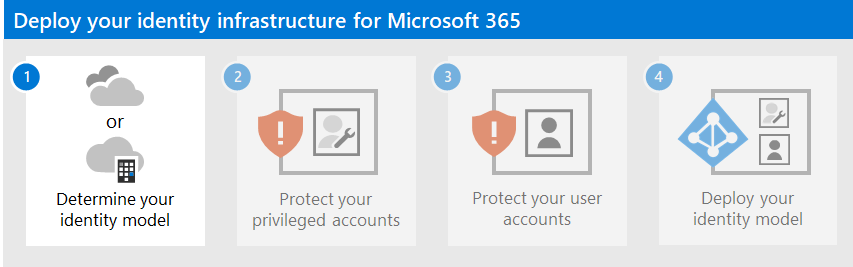

# Deploy your identity infrastructure for Microsoft 365

Check out all of our small business content on [Small business help & learning](https://go.microsoft.com/fwlink/?linkid=2224585).

In Microsoft 365 for enterprise, a well-planned and executed identity infrastructure paves the way for stronger security, including restricting access to your productivity workloads and their data to only authenticated users and devices. Security for identities is a key element of a Zero Trust deployment, in which all attempts to access resources both on-premises and in the cloud are authenticated and authorized.

For information about the identity features of each Microsoft 365 for enterprise, the role of Microsoft Entra ID, on-premises and cloud-based components, and the most common authentication configurations, see the [Identity Infrastructure poster](https://download.microsoft.com/download/a/e/1/ae1a5a93-e0ec-43e5-bfe6-0e8acaaee1af/m365e-identity-infra.pdf).

Review this two-page poster to quickly ramp up on identity concepts and configurations for Microsoft 365 for enterprise.

You can [download this poster](https://download.microsoft.com/download/a/e/1/ae1a5a93-e0ec-43e5-bfe6-0e8acaaee1af/m365e-identity-infra.pdf) and can print it in letter, legal, or tabloid (11 x 17) format.

This solution is the first step to build out the Microsoft 365 Zero Trust deployment stack.

For more information, see the [Microsoft 365 Zero Trust deployment plan](/microsoft-365/security/microsoft-365-zero-trust).

## What’s in this solution

This solution steps you through the deployment of an identity infrastructure for your Microsoft 365 tenant to provide access for your employees and protection against identity-based attacks.

The steps in this solution are:

1. [Determine your identity model.](deploy-identity-solution-identity-model.md)
2. [Protect your Microsoft 365 privileged accounts.](protect-your-global-administrator-accounts.md)
3. [Protect your Microsoft 365 user accounts.](microsoft-365-secure-sign-in.md)
4. [Deploy your identity model.](cloud-only-identities.md)

This solution supports the key principles of [Zero Trust](https://www.microsoft.com/security/business/zero-trust/):

- **Verify explicitly:** Always authenticate and authorize based on all available data points.
- **Use least privilege access:** Limit user access with Just-In-Time and Just-Enough-Access (JIT/JEA), risk-based adaptive policies, and data protection.
- **Assume breach:** Minimize blast radius and segment access. Verify end-to-end encryption and use analytics to get visibility, drive threat detection, and improve defenses.

Unlike conventional intranet access, which trusts everything behind an organization's firewall, Zero Trust treats each sign-in and access as though it originated from an uncontrolled network, whether it's behind the organization firewall or on the Internet. Zero Trust requires protection for the network, infrastructure, identities, endpoints, apps, and data.

## Microsoft 365 capabilities and features

Microsoft Entra ID provides a full suite of identity management and security capabilities for your Microsoft 365 tenant.

|Capability or feature|Description|Licensing|
|---|---|---|
|[Multifactor authentication (MFA)](/azure/active-directory/authentication/concept-mfa-howitworks)|MFA requires users to provide two forms of verification, such as a user password plus a notification from the Microsoft Authenticator app or a phone call. MFA greatly reduces the risk that stolen credentials can be used to access your environment. Microsoft 365 uses the Microsoft Entra multifactor authentication service for MFA-based sign-ins.|Microsoft 365 E3 or E5|
|[Conditional Access](/azure/active-directory/conditional-access/overview)|Microsoft Entra ID evaluates the conditions of the user sign-in and uses Conditional Access policies to determine the allowed access. For example, in this guidance we show you how to create a Conditional Access policy to require device compliance for access to sensitive data. This greatly reduces the risk that a hacker with their own device and stolen credentials can access your sensitive data. It also protects sensitive data on the devices, because the devices must meet specific requirements for health and security.|Microsoft 365 E3 or E5|
|[Microsoft Entra groups](/azure/active-directory/fundamentals/active-directory-manage-groups)|Conditional Access policies, device management with Intune, and even permissions to files and sites in your organization rely on the assignment to user accounts or Microsoft Entra groups. We recommend you create Microsoft Entra groups that correspond to the levels of protection you're implementing. For example, members of your executive staff are likely higher value targets for hackers. Therefore, it makes sense to add the user accounts of these employees to a Microsoft Entra group and assign this group to Conditional Access policies and other policies that enforce a higher level of protection for access.|Microsoft 365 E3 or E5|
|[Microsoft Entra ID Protection](/azure/active-directory/identity-protection/overview)|Enables you to detect potential vulnerabilities affecting your organization's identities and configure automated remediation policy to low, medium, and high sign-in risk and user risk. This guidance relies on this risk evaluation to apply Conditional Access policies for multifactor authentication. This guidance also includes a Conditional Access policy that requires users to change their password if high-risk activity is detected for their account.|Microsoft 365 E5, Microsoft 365 E3 with the E5 Security add-on, EMS E5, or Microsoft Entra ID P2 licenses|
|[Self-service password reset (SSPR)](/azure/active-directory/authentication/concept-sspr-howitworks)|Allow your users to reset their passwords securely and without help-desk intervention, by providing verification of multiple authentication methods that the administrator can control.|Microsoft 365 E3 or E5|
|[Microsoft Entra password protection](/azure/active-directory/authentication/concept-password-ban-bad)|Detect and block known weak passwords and their variants and additional weak terms that are specific to your organization. Default global banned password lists are automatically applied to all users in a Microsoft Entra tenant. You can define additional entries in a custom banned password list. When users change or reset their passwords, these banned password lists are checked to enforce the use of strong passwords.|Microsoft 365 E3 or E5|
|

## Next steps

Use these steps to deploy an identity model and authentication infrastructure for your Microsoft 365 tenant:

1. [Determine your cloud identity model.](deploy-identity-solution-identity-model.md)
2. [Protect your Microsoft 365 privileged accounts.](protect-your-global-administrator-accounts.md)
3. [Protect your Microsoft 365 user accounts.](microsoft-365-secure-sign-in.md)
4. Deploy your cloud identity model: [cloud-only](cloud-only-identities.md) or [hybrid](prepare-for-directory-synchronization.md).

  
## Additional Microsoft cloud identity resources

### Manage

To manage your Microsoft cloud identity deployment, see:

- [User accounts](manage-microsoft-365-accounts.md)
- [Licenses](assign-licenses-to-user-accounts.md)
- [Passwords](manage-microsoft-365-passwords.md)
- [Groups](manage-microsoft-365-groups.md)
- [Governance](manage-microsoft-365-identity-governance.md)
- [Directory synchronization](view-directory-synchronization-status.md)

### How Microsoft does identity for Microsoft 365

Learn how IT experts at Microsoft [manage identities and secure access](https://www.microsoft.com/en-us/itshowcase/managing-user-identities-and-secure-access-at-microsoft).

>[!Note]
>This IT Showcase resource is available only in English.
>

### How Contoso did identity for Microsoft 365

For an example of how a fictional but representative multinational organization has deployed a hybrid identity infrastructure for Microsoft 365 cloud services, see [Identity for the Contoso Corporation](contoso-identity.md).

<!--

## Plan

To plan for your identity implementation:

- [Understand the different identity models](about-microsoft-365-identity.md)
- [Plan for hybrid identity and directory synchronization](plan-for-directory-synchronization.md)

## Deploy

To deploy your identity implementation:

- [Protect your global administrator accounts](protect-your-global-administrator-accounts.md)
- [Configure and use cloud-only identities](cloud-only-identities.md)
- [Configure and use hybrid identities](prepare-for-directory-synchronization.md)
- [Set up directory synchronization](set-up-directory-synchronization.md)
- If needed, deploy [hybrid identity scenarios](hybrid-solutions.md)

### Identity and device access recommendations

To help ensure a secure and productive workforce, Microsoft provides a set of recommendations for [identity and device access](../security/office-365-security/zero-trust-identity-device-access-policies-overview.md). For identity, use the recommendations and settings in these articles:

- [Prerequisites](../security/office-365-security/zero-trust-identity-device-access-policies-prereq.md)
- [Common identity and device access policies](../security/office-365-security/zero-trust-identity-device-access-policies-common.md)

-->
