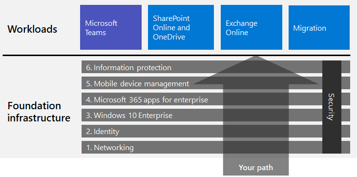
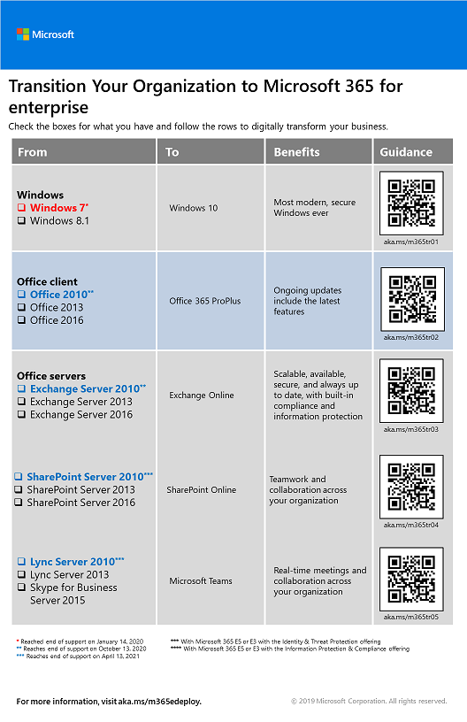

# Deploy Microsoft 365 for enterprise

Microsoft 365 for enterprise is a combination of local and cloud-based productivity apps and services with Windows 10 Enterprise that:  

- Has intelligent security.
- Is integrated for simplicity.
- Unlocks creativity.
- Is built for teamwork.

You can realize these benefits by deploying the infrastructure and productivity workloads in an integrated way that includes state-of-the-art security services and features.

There are three main ways to deploy Microsoft 365 for enterprise:

- Do it with Microsoft engineers using [FastTrack for Microsoft 365](#fasttrack-for-microsoft-365).
- Do it with help from Microsoft Consulting Services or a [Microsoft partner](https://partner.microsoft.com/).
- Do it yourself with the [Microsoft 365 for enterprise deployment guide](#microsoft-365-for-enterprise-deployment-guide).

## FastTrack for Microsoft 365

FastTrack is an ongoing and repeatable benefit—*available for free as part of your subscription*—that is delivered by Microsoft engineers to help you move to the cloud at your own pace. FastTrack also gives you access to qualified partners for additional services. With over 40,000 customers enabled to date, FastTrack helps maximize ROI, accelerate deployment, and increase adoption across your organization. See [FastTrack for Microsoft 365](https://fasttrack.microsoft.com/microsoft365).

If you want to take advantage of FastTrack to deploy Microsoft 365 for enterprise, you can use the FastTrack [Microsoft 365 deployment advisor](https://aka.ms/microsoft365setupguide) for guidance on how to deploy and set up your foundation infrastructure. You must be signed in as a global administrator in an Office 365 or Microsoft 365 tenant to access this page.

Get started on your end-to-end deployment journey with FastTrack [here](https://fasttrack.microsoft.com/microsoft365).

## Microsoft 365 for enterprise deployment guide

The Microsoft 365 for enterprise deployment guide steps you through the correct and required configuration of Microsoft 365 for enterprise products and features.

To deploy Microsoft 365 for enterprise yourself, you can:

- Deploy the [foundation infrastructure](deploy-foundation-infrastructure.md) for built-in security and integration for simplified management, which makes it easier to ensure your client software is updated with the latest productivity and security enhancements. 
 
  The foundation infrastructure is organized as a series of numbered phases that build upon each other and towards an environment that supports Microsoft 365 for enterprise workloads and scenarios. 

  **If you are a smaller or newer organization**, follow the phases in order to methodically build out your infrastructure.

  However, you can deploy phases or the portions of phases of this infrastructure in any order as needed, [one after the other or in parallel](deployment-strategies-microsoft-365-enterprise.md), to integrate with your current infrastructure, fit your IT plans and resources, and meet your business needs. For a simplified deployment for non-enterprises, click [here](deploy-foundation-infrastructure-non-enterprises.md).

  **If you are an enterprise organization**, view the phases as layers of IT infrastructure, rather than a defined path, and determine how to best work toward eventual adherence to the requirements of each layer across your organization.

- Deploy key productivity [workloads and scenarios](deploy-workloads.md) on top of your infrastructure. These unlock creativity and teamwork in your organization.

Here's the relationship between the foundation infrastructure and the workloads and scenarios.

Workloads and scenarios operate over the top of the foundation infrastructure. However, you do not have to have all of the foundation infrastructure phases built out to begin using workloads for productivity and collaboration.

Get self-started on your end-to-end deployment journey [here](deploy-foundation-infrastructure.md).

## Take a test drive

“*For the things we have to learn before we can do them, we learn by doing them.*” - Aristotle

If you're new to Microsoft 365 for enterprise or to a specific product or feature, one of the best ways to gain understanding is to build it out yourself and see it working.

We've made this easier with Test Lab Guides (TLGs), which step you through the configuration of infrastructure or a feature in a simplified but representative test environment using trial or paid subscriptions.

With TLGs, you can self-learn, demonstrate, customize, or build a proof of concept (PoC) of a complex configuration, workload, or end-to-end scenario.

For more information, see [Microsoft 365 for enterprise Test Lab Guides](m365-enterprise-test-lab-guides.md).

## Transition your entire organization

To get a better picture of how to move your entire organization to the products and services in Microsoft 365 for enterprise, see the [Transition Your Organization to Microsoft 365](../media/deploy-microsoft-365-enterprise/transition-org-to-m365.pdf) poster.

This two-page poster is a quick way to inventory your existing infrastructure and get to the guidance for moving to the corresponding product or service in Microsoft 365 for enterprise. It includes Windows and Office products and other infrastructure and security elements such as device management, identity, and information and threat protection.

You can also [download the transition poster](https://github.com/MicrosoftDocs/microsoft-365-docs/raw/public/microsoft-365/enterprise/media/deploy-microsoft-365-enterprise/transition-org-to-m365.pdf) and print it in letter, legal, or tabloid (11 x 17) formats.

## How did others do it?

Use these resources to understand how others have deployed and are using Microsoft 365 for enterprise.

### How customers use Microsoft 365 for enterprise

Use the Customer Stories site to see how Microsoft customers are using Microsoft 365 for enterprise.

1. Go to [https://customers.microsoft.com/](https://customers.microsoft.com/) and click **Search**.
2. In the left pane, select your language in **Language**.
3. Select your organization's industry in **Industry**.
4. Select **Microsoft 365** in **Product**.
5. Click on a card for the customer's case study.

### How Microsoft uses Microsoft 365 for enterprise

Defining a digital culture is a major priority for every leader who strives to foster a modern workplace. Microsoft 365 was designed to support this kind of cultural shift helping leaders empower everyone at their companies to unleash creativity and collaboration. Establishing Microsoft's foundational infrastructure has sparked precisely this kind of digital culture shift. Implementing Microsoft 365 for enterprise has allowed us to deploy collaboration technology, like Microsoft Teams and Exchange Online, and to share sensitive data online across secure SharePoint intranet sites.

At the same time, intelligent security features and product integration helps streamline management needs and minimize the total cost of ownership across the IT lifecycle. 

Learn how Core Services Engineering and Operations (formerly Microsoft IT) [planned and deployed a foundation](https://www.microsoft.com/itshowcase/deploying-and-managing-microsoft-365) to support the applications and services that unlock creativity and foster teamwork in a secure environment.

> [!Note]
> This web page is only available in English.

### How the Contoso Corporation deployed Microsoft 365 for enterprise

The Contoso Corporation is a fictional but representative global manufacturing conglomerate with its headquarters in Paris, France. See how [Contoso deployed Microsoft 365 for enterprise](contoso-case-study.md) and addressed major design decisions and implementation details for networking, identity, Windows 10 Enterprise, Office 365 ProPlus, mobile device management, information protection, and security. 

## Stay current with deployment content

For the latest changes in content, see [this article](microsoft-365-deploment-guide-changes.md).

## Next step

To do it with direct Microsoft assistance, use [FastTrack](https://fasttrack.microsoft.com/microsoft365).

To do it with a consultant, contact Microsoft Consulting Services or a [Microsoft partner](https://partner.microsoft.com/).

To get started doing it yourself, see the [foundation infrastructure](deploy-foundation-infrastructure.md).
