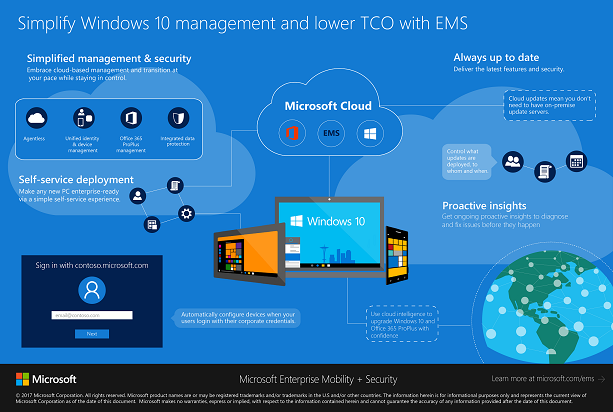
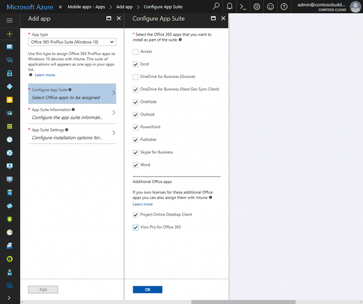
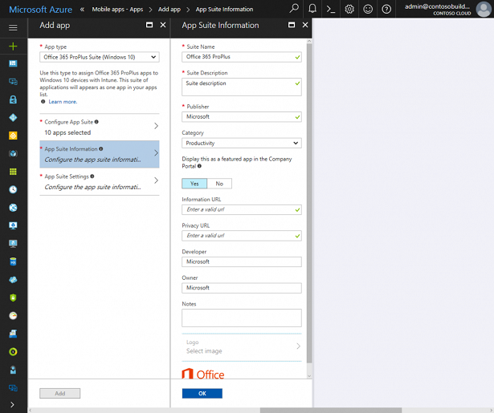
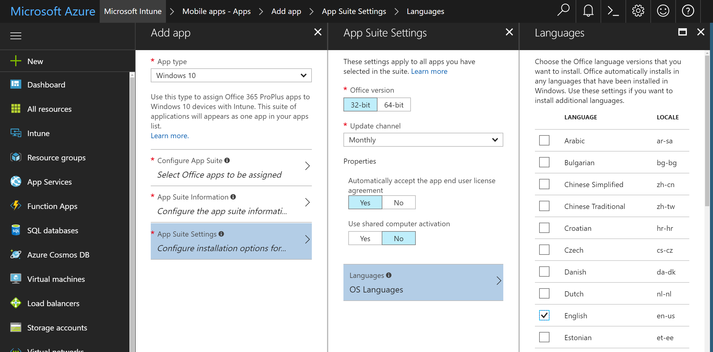

# Deploy Office 365 ProPlus with Microsoft Intune
Microsoft 365 Enterprise is a modern workplace solution that empowers everyone to be creative and work together, securely. Microsoft 365 Enterprise solutions are the result of close collaboration between the Enterprise Mobility + Security (EMS), Office 365, and Windows 10 teams. This collaboration leads to innovative solutions such as the ability to deploy Office 365 ProPlus applications to Windows 10 devices with Intune.

It's now easier than ever for you to select specific Office 365 ProPlus apps (using Click-to-Run), deploy them to enrolled devices running Windows 10 Creators Update, and view deployment metrics through the new Intune portal on Azure. This works nicely with Windows AutoPilot to get employees' devices work-ready by just providing company credentials during the out of box experience (OOBE) while Azure AD and Intune work together in the background to register the device, deploy the necessary configurations, and now also install Office 365 ProPlus apps.

You can [download this infographic here](https://gallery.technet.microsoft.com/Infographic-Simplify-37e77674).

## Deploy Office 365 ProPlus with Intune
Let’s take a look at how you can configure an Office 365 ProPlus deployment with Intune.

Through the new Intune portal, we have made it easy to add and customize Office 365 ProPlus deployments. After choosing the **Office 365 ProPlus Suite (Windows 10)** app type, you can customize the deployment of Office apps in three easy steps.

First, choose the applications you want to install on end user devices:

Next, configure the application suite’s information. For example, you might want to add a short description of which apps are in this suite to be displayed in the Intune Company Portal:

Finally, configure a few installation settings, such as system architecture or update channel:

Your end users can install Office apps through the Intune Company portal if you’ve made them available. Otherwise, users simply enjoy a silent install. Once Office is installed on their devices, users can sign in, activate the product, and experience the latest features as [Office is automatically kept up to date  by the service](https://support.office.com/article/Overview-of-update-channels-for-Office-365-ProPlus-9ccf0f13-28ff-4975-9bd2-7e4ea2fefef4).

> [!NOTE]
> Currently, this form of Office 365 ProPlus deployment is only supported for devices without an existing version of Office installed. For devices with existing versions of Office, it is recommended to remove all versions of Office prior to enrollment. We are working with Windows and Office teams on future enhancements to support devices with existing Office deployments.

## Learn more
For detailed step-by-step instructions, see [Deploy Office 365 apps for Windows 10 with Intune](https://docs.microsoft.com/intune/apps-add-office365).
