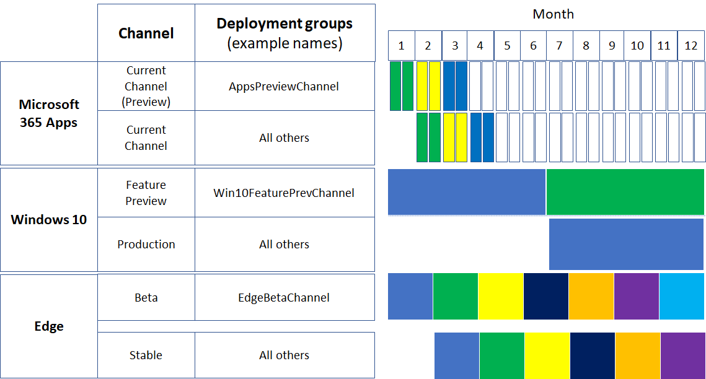

# Example of broad deployment for the latest releases

This channel configuration example is for an organization that uses rapid deployment of the latest releases to fit these business priorities:

- Ensure business continuity with Microsoft apps and services.
- Maximize device, service, and data security with the latest features and fixes from Microsoft.
- Maximize user productivity with the latest features from Microsoft.

These goals translate to the IT task of finding the balance between rapid production deployment and early vetting with a representative subset of users and devices to validate functionally before broad deployment.

Our example organization has 5,000 employees in buildings across the world in Europe, Africa, Asia, and the Americas. 70% of the employees use Microsoft 365 E3 and the rest of the organization uses Microsoft 365 E5.

>[!Note]
>This example is designed to show you how you can use deployment stages and groups, which can work for organizations of many types and sizes.
>

This organization's IT infrastructure: 

- Is largely homogeneous, with Windows, Microsoft 365 Apps, and Microsoft cloud services comprising 60% of the installed base. A few legacy systems remain after an intensive, multi-year effort to simplify and streamline the IT infrastructure.
- Is maintained by highly experienced staff and tasked with keeping users and their devices productive and secure by following Microsoft’s lead in their releases.

## Deployment and update stages

Based on rapid deployment goals of the latest release, this example organization uses a two-step deployment process.

1. **Use a preview or pilot deployment:** Validate and iterate with early adopters, IT staff, users with representative configurations, and training staff. 

   The early adopters, IT staff, users with representative configurations can validate functionality with other apps and on devices before the new features roll out to the rest of the organization.

   Change managers have an early peek at the new features before widespread rollout and can plan messaging and rollout.

   Training staff can plan new internal courses or update existing courses for the new features before widespread rollout.

2. **Production deployment:** Roll out to all remaining users by region, department, or other deployment method.

## Deployment configuration for Windows 10

The overall goal is to perform a broad deployment of the latest Semi-Annual Channel release after validation of Release Preview Channel changes by a group of representative users and their devices.

See [Windows 10 deployment](https://docs.microsoft.com/windows/deployment/) for more information on Windows 10 deployment methods and strategies.

| Stage | Channel | Deployment group |
|:-------|:-------|:-----|
| Pilot |  **Release Preview Channel**  <ul><li>Purpose: Deployment of feature updates to IT staff and early adopters for validation on representative devices and configurations (languages, 3rd party apps). </li><li> State: Fully compliant and supported. </li></ul> | **Win10ReleasePreviewChannel** (example name)    Members are groups containing: <ul><li> Windows enthusiasts across departments and locations </li><li> Staff with configurations that need validation </li><li> IT admins and IT deployment staff </li><li> Change managers </li><li> Internal training staff </li></ul> |
| Production |  **Semi-Annual Channel**  <ul><li>Purpose: Broad deployment of the latest feature updates to the rest of the organization. </li><li> State: Fully compliant and supported. </li></ul> | **Win10SemiAnnualChannel** (example name)    Members are all users that are not in the Win10ReleasePreviewChannel group. |
||||

Ongoing updates process:

1. Release Preview Channel changes are deployed to the Win10ReleasePreviewChannel (example name) deployment group.
2. Win10ReleasePreviewChannel group members confirm that Release Preview Channel changes are working to IT deployment staff, who can provide feedback to Microsoft and wait for the next Release Preview Channel changes for additional validation.
3. Semi-Annual Channel feature changes are deployed to the Win10SemiAnnualChannel deployment group. 

## Deployment configuration for Microsoft 365 Apps

The overall goal is to perform a broad deployment of the latest Current Channel release after validation of Current Channel (Preview) changes by a group of representative users.

See [Microsoft 365 Apps deployment](https://docs.microsoft.com/deployoffice/plan-office-365-proplus) for more information on Microsoft 365 Apps deployment methods and strategies.

| Stage | Channel | Deployment group |
|:-------|:-------|:-----|
| Pilot |  **Current Channel (Preview)** <ul><li> Purpose: {give a group of representative users a sneak peek of new Microsoft 365 Apps features} Deployment of feature updates as soon as they are tested with Current Channel (Preview) users and are production-ready. </li><li> State: Fully compliant and supported.</li><li> How often: Updates 2-3 times each month. </li></ul> | **AppsCurrentChannelPreview** (example name)    Members are groups containing: <ul><li> Office apps enthusiasts across departments and locations </li><li> Staff with configurations that need validation </li><li> IT admins and IT deployment staff </li><li> Change managers </li><li> Internal training staff </li></ul>|
| Production | **Current Channel** <ul><li> Purpose: Broad deployment of the latest feature updates to the rest of the organization. </li><li> State: Fully compliant and supported. </li></ul> |  **AppsCurrentChannel** (example name)    Members are all users that are not in the AppsCurrentChannelPreview group. |
|||

Ongoing updates process:

1. Current Channel (Preview) changes are deployed to the AppsCurrentChannelPreview deployment group.
2. AppsCurrentChannelPreview group members confirm that Current Channel (Preview) changes are working to IT deployment staff, who can provide feedback to Microsoft and wait for the next Current Channel (Preview) release for additional validation.
3. Current Channel changes are deployed to the AppsCurrentChannel deployment group. 

## Deployment configuration for Microsoft Edge

The overall goal is to perform a broad deployment of the latest Stable Channel release after validation of Beta Channel changes by a group of representative users.

See [Microsoft Edge deployment](https://docs.microsoft.com/DeployEdge/microsoft-edge-channels) for more information on Edge deployment channels.

| Stage | Channel | Deployment groups |
|:-------|:-------|:-----|
| Pilot | **Beta Channel** <ul><li> Purpose: Deployment of feature updates to IT staff and early adopters for validation on representative devices and configurations. </li><li> State: Fully compliant and supported. </li><li> How often: Updates every six weeks. | **EdgeBetaChannel** (example name)    Members are groups containing:   <ul><li> Edge enthusiasts across departments and locations </li><li> Staff with configurations that need validation </li><li> IT admins and IT deployment staff </li><li> Change managers </li><li> Internal training staff </li></ul>   |
| Production | **Stable Channel** <ul><li> Purpose: Broad deployment of the latest feature updates to the rest of the organization. <li> State: Fully compliant and supported. </li> </ul> |  **EdgeStableChannel** (example name)     Members are all users that are not in the EdgeBetaChannel group.|
||||

Ongoing updates process:

1. Edge Beta Channel changes are deployed to the EdgeBetaChannel deployment group.
2. EdgeBetaChannel group members confirm that Beta Channel changes are working to IT deployment staff, who can provide feedback to Microsoft and wait for the next Beta Channel release for additional validation.
3. Edge Stable Channel changes are deployed to the EdgeStableChannel deployment group. 

## Visual summaries

Here are the products, their channels, and the deployment groups used by this example organization. 

Here is an example of the timing of successive broad deployments of the latest releases over a 12-month period.

## See also

[Deployment guide](deploy-microsoft-365-enterprise.md)

[Test lab guides](m365-enterprise-test-lab-guides.md)

<!--

|  **Current**    **Purpose:** Deployment of feature updates to IT staff and early adopters for testing on representative devices and configurations (language packs, 32-vs-64 bit, 3rd party apps, macros).    **Users:** Office suite fans (no matter their technical ability), IT admins, change managers, and trainers. Current channel (Preview) deployment groups contain the user accounts.    **State:** Fully compliant and supported.    **How often:** Updates 2-3 times each month. | **AppsCurrentChannel** (example name)    Members are groups containing: <ul><li> Office enthusiasts across departments and locations </li><li> Staff with configurations that need testing </li><li> IT admins and IT deployment staff </li><li> Change managers </li><li> Internal training staff </li></ul> |

| Channel | Deployment groups |
|:-------|:-----|
|  **Semi-Annual**  <ul><li>Purpose: Deployment of feature updates to IT staff and early adopters for testing on representative devices and configurations (languages, 3rd party apps). </li><li> Users: Windows fans (no matter their technical ability), IT admins, change managers, and trainers. Feature Preview deployment groups contain the user accounts. </li><li> State: Fully compliant and supported. </li><li> How often: Updates every 6 months (with monthly undocumented feature updates). </li></ul> | **Win10SemiAnnualChannel-Pilot** (example name)    Members are groups containing: <ul><li> Windows enthusiasts across departments and locations </li><li> Staff with configurations that need testing </li><li> IT admins and IT deployment staff </li><li> Change managers </li><li> Internal training staff </li></ul>   **Win10SemiAnnualChannel-All** (example name)    Members are all other users. |
|||
--> 
