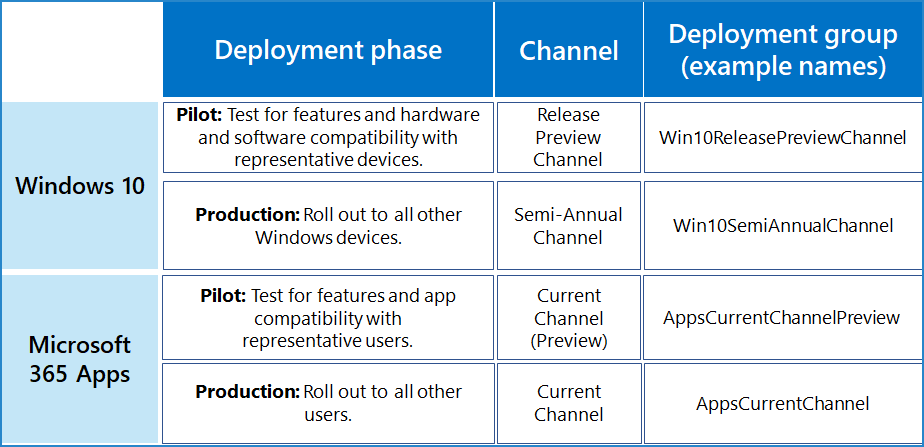

# Rapid deployment channel configuration example

This channel configuration example is for an organization that uses rapid deployment to fit these business priorities:

- Ensure business continuity with Microsoft apps and services.
- Maximize device, service, and data security with the latest features and fixes from Microsoft.
- Maximize user productivity with the latest features from Microsoft.

These goals translate to the IT task of finding the balance between rapid production deployment and proper testing with a representative subset of users and devices to prevent widespread functionality outages.

Our example organization has over 100,000 employees in multiple campuses across the world in Europe, Africa, Asia, and the Americas.

This organization's IT infrastructure: 

- Is largely homogeneous, with Windows, Office, and Microsoft cloud services comprising 95% of the installed base. A few legacy systems remain after an intensive, multi-year effort to simplify and streamline the IT infrastructure.
- Is maintained by highly experienced staff and tasked with keeping users and their devices productive by following Microsoft’s lead in their releases.

## Deployment and update stages

Based on rapid deployment goals, this example organization uses a two-step deployment process for initial deployment and updates.

1. **Use a preview or pilot deployment:** Test and iterate with early adopters, IT staff, users with representative configurations, and training staff. 

   The early adopters, IT staff, users with representative configurations can test functionality with other apps and add-ins and on devices before the new features roll out to the rest of the organization.

   Change managers have an early peek at the new features before widespread rollout and can plan messaging and rollout.

   Training staff can plan new internal courses or updated existing courses for the new features before widespread rollout.

2. **Production deployment:** Roll out to all remaining users by region, department, or other deployment method.

## Deployment configuration for Windows 10

The overall deployment goal is to give a group of representative users a sneak peek of new Windows 10 features that will be released in a month or longer without major disruptions to the organization. 

See [Windows 10 deployment](https://docs.microsoft.com/windows/deployment/) for more information on Windows 10 deployment methods and strategies.

| Channel | Deployment groups |
|:-------|:-----|
|  **Feature Preview**    **Purpose:** Deployment of feature updates to IT staff and early adopters for testing on representative devices and configurations (languages, 3rd party apps).    **Users:** Windows fans (no matter their technical ability), IT admins, change managers, and trainers. Feature Preview deployment groups contain the user accounts.    **State:** Fully compliant and supported.    **How often:** Updates every 6 months (with monthly undocumented feature updates). | **Win10FeaturePreviewChannel** (example name)    Members are groups containing:   - Windows enthusiasts across departments and locations   - Staff with configurations that need testing   - IT admins and IT deployment staff   - Change managers   - Internal training staff |
|||

Ongoing updates process:

1. Preview channel changes are deployed to the Win10PreviewChannel (example name) deployment group.
2. Win10PreviewChannel members confirm that Preview Channel changes are working to IT deployment staff, who can provide feedback to Microsoft and wait for the next Current Channel (Preview) release to additional testing.
3. Feature changes are deployed to the rest of the organization. 

## Deployment configuration for Microsoft 365 Apps

The overall deployment goal is to give a group of representative users a sneak peek of new Microsoft 365 Apps features that will be released 2-3 times each month without major disruptions to the organization. 

See [Microsoft 365 Apps deployment](https://docs.microsoft.com/deployoffice/plan-office-365-proplus) for more information on Microsoft 365 Apps methods and strategies.

| Channel | Deployment groups |
|:-------|:-----|
|  **Current Channel (Preview)**    **Purpose:** Deployment of feature updates to IT staff and early adopters for testing on representative devices and configurations (language packs, 32-vs-64 bit, 3rd party apps, macros).    **Users:** Office suite fans (no matter their technical ability), IT admins, change managers, and trainers. Current channel (Preview) deployment groups contain the user accounts.    **State:** Fully compliant and supported.    **How often:** Updates 2-3 times each month. | **AppsCurrentChannelPrev** (example name)    Members are groups containing:   -Office enthusiasts across departments and locations   - Staff with configurations that need testing   - IT admins and IT deployment staff   - Change managers   - Internal training staff |
|  **Current Channel**    **Purpose:** Deployment of feature updates as soon as they are tested with Current channel (Preview) users and are production-ready.    **Users:** All other user accounts besides those in the Current channel (Preview) deployment groups.    **State:** Fully compliant and supported.    **How often:** Updates 2-3 times each month. | **AppsCurrentChannel** (example name)    Members are all other users. |
|||

Ongoing updates process:

1. Current channel changes are deployed to the AppsCurrentChannelPrev deployment group.
2. AppsCurrentChannelPrev members confirm that Current Channel (Preview) changes are working to IT deployment staff, who can provide feedback to Microsoft and wait for the next Current Channel (Preview) release for additional testing.
3. Current channel changes are deployed to the AppsCurrentChannel. 

## Deployment configuration for Microsoft Edge

WORK IN PROGRESS

Deployment goal: Give a group of representative users a sneak peek of features that will be released 2-3 times each month, without major disruptions to the organization.
https://docs.microsoft.com/en-us/DeployEdge/microsoft-edge-channels

Channels

Beta
Purpose: 
Users: 
State: Fully compliant and supported.
How often: Every 6 weeks
Stable
Purpose: Deployment of updates as soon as they are tested with Beta channel users and are production-ready. 
Users: All other user accounts besides those in the Canary, Dev, and Beta deployment groups.
State: Fully compliant and supported.
How often: Every 6 weeks

Deployment groups
EdgeCanaryChannel (example name)
Channel
Canary
Members
Groups containing:

EdgeDevChannel (example name)
Channel
Dev
Members
Groups containing:

EdgeBetaChannel (example name)
Channel
Beta
Members
Groups containing:

EdgeStableChannel (example name)
Channel
Stable
Members
Groups for everyone except the members of the EdgeCanaryChannel, EdgeDevChannel, and EdgeBetaChannel deployment groups
Departments
Regions
Ongoing updates process

## Visual summaries

For an at-a-glance view of the products and their channels, deployment groups, and timing for a rapid deployment organization, see the following figures.

Deployment groups for each channel:

Example of channels and their timing:

## See also

[Deployment guide](deploy-microsoft-365-enterprise.md)

[Test lab guides](m365-enterprise-test-lab-guides.md)

