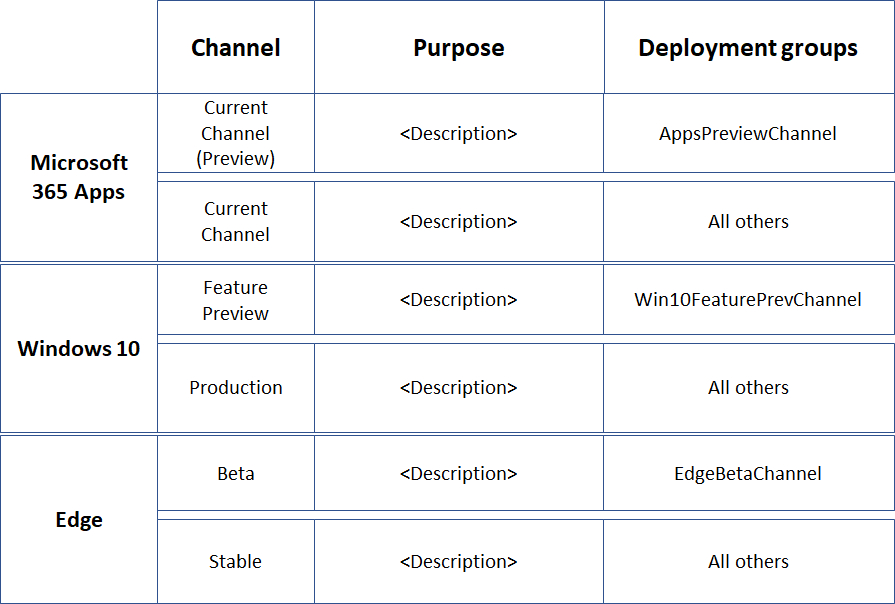

# Deployment and update channel example configurations

Choosing which update channels to use for Windows 11 and Microsoft 365 Apps can depend on your type of organization and where on the development cycle you want to be deploying and using new features and capabilities. Find the prerelease and production channels that best fit your needs.

## Prerelease channels

|Customer/Channel Offering|Windows 11|Microsoft 365 Apps for Enterprise (Windows 11)|
|---|---|---|
|Right for highly technical users and developers.    Be the first to access the latest builds earliest in the development cycle with the newest code.    There will be rough edges and some instability.|Dev|N/A|
|Right for early adopters and IT Pros who want more reliable builds that are still in development.    See what"s coming up next and help validate new features.|Preview Channel|Preview Channel|
|Right for those who want early access to upcoming releases.    Where companies preview and validate upcoming releases before broad deployment.    These are supported.|Release Preview|Current Channel (Preview)    Semi-Annual Enterprise Channel (Preview)|

## Production channels for broad deployment

Click the link in the **Example** column to step through deployment stages and groups for an example organization.

|Customer/Channel Offering|Windows 11|Microsoft 365 Apps for Enterprise (Windows 11)|Example|
|---|---|---|---|
|Right for customers who want the latest releases as soon as they're ready.|Semi-Annual Enterprise Channel|[Current Channel](/deployoffice/overview-update-channels#current-channel-overview)|[Latest releases](#example-of-broad-deployment-for-the-latest-releases)|
|Right for enterprises who want the latest release with more predictability.|Semi-Annual Enterprise Channel|[Monthly Enterprise Channel](/deployoffice/overview-update-channels#monthly-enterprise-channel-overview)||
|Right for enterprises with need for extensive IT testing before each update.|Semi-Annual Enterprise Channel|[Semi-Annual Enterprise Channel](/deployoffice/overview-update-channels#semi-annual-enterprise-channel-overview)||

## Example of broad deployment for the latest releases

This channel configuration example is for an organization that uses rapid deployment of the latest releases to fit these business priorities:

- Ensure business continuity with Microsoft apps and services.
- Maximize device, service, and data security with the latest features and fixes from Microsoft.
- Maximize user productivity with the latest features from Microsoft.

These goals translate to the IT task of finding the balance between rapid production deployment and early vetting with a representative subset of users and devices to validate functionally before broad deployment.

Our example organization has 5,000 employees in buildings across the world in Europe, Africa, Asia, and the Americas. Seventy percent of the employees use Microsoft 365 E3 and the rest of the organization uses Microsoft 365 E5.

> [!NOTE]
> This example is designed to show you how you can use deployment stages and groups, which can work for organizations of many types and sizes.
>

This organization's IT infrastructure:

- Is largely homogeneous, with Windows, Microsoft 365 Apps, and Microsoft cloud services comprising 60% of the installed base. A few legacy systems remain after an intensive, multi-year effort to simplify and streamline the IT infrastructure.
- Is maintained by highly experienced staff and tasked with keeping users and their devices productive and secure by following Microsoft’s lead in their releases.

### Deployment and update stages

Based on rapid deployment goals of the latest release, this example organization uses a two-step deployment process.

1. **Use a preview or pilot deployment:** Validate and iterate with early adopters, IT staff, users with representative configurations, and training staff.

   The early adopters, IT staff, users with representative configurations can validate functionality with other apps and on devices before the new features roll out to the rest of the organization.

   Change managers have an early peek at the new features before widespread rollout and can plan messaging and rollout.

   Training staff can plan new internal courses or update existing courses for the new features before widespread rollout.

2. **Production deployment:** Roll out to all remaining users by region, department, or other deployment method.

### Deployment configuration for Windows 11

The overall goal is to perform a broad deployment of the latest Semi-Annual Channel release after validation of Release Preview Channel changes by a group of representative users and their devices.

See [Windows 11 deployment](/windows/deployment/) for more information on Windows 11 deployment methods and strategies.

| Stage | Channel | Deployment group |
|:-------|:-------|:-----|
| Pilot |  **Release Preview Channel**  <ul><li>Purpose: Deployment of feature updates to IT staff and early adopters for validation on representative devices and configurations (languages, 3rd party apps). </li><li> State: Fully compliant and supported for commercial customers and it doesn't count against your support agreements. </li></ul> | **Win11ReleasePreviewChannel** (example name)    Members are groups containing: <ul><li> Windows enthusiasts across departments and locations </li><li> Staff with configurations that need validation </li><li> IT admins and IT deployment staff </li><li> Change managers </li><li> Internal training staff </li></ul> |
| Production |  **Semi-Annual Channel**  <ul><li>Purpose: Broad deployment of the latest feature updates to the rest of the organization. </li><li> State: Fully compliant and supported. </li></ul> | **Win11SemiAnnualChannel** (example name)    Members are all users that aren't in the Win11ReleasePreviewChannel group. |
||||

This organization uses the best practice of deploying the Release Preview Channel payload in the same way as they deploy Semi-Annual Channel releases, such as Windows Update or Windows Server Update Services, and that they apply the same policies for both channel updates.

Ongoing updates process:

1. Release Preview Channel changes are deployed to the Win11ReleasePreviewChannel (example name) deployment group.
2. Win11ReleasePreviewChannel group members confirm that Release Preview Channel changes are working to IT deployment staff, who can provide feedback to Microsoft and wait for the next Release Preview Channel changes for additional validation.
3. Semi-Annual Channel feature changes are deployed to the Win11SemiAnnualChannel deployment group.

> [!NOTE]
> While the Semi-Annual Channel is the recommended channel, your IT department should utilize their management tools and determine when to deploy the latest Semi-Annual Channel release within their organization and then roll it out in waves.
>

### Deployment configuration for Microsoft 365 Apps

The overall goal is to perform a broad deployment of the latest Current Channel release after validation of Current Channel (Preview) changes by a group of representative users.

See [Microsoft 365 Apps deployment](/deployoffice/plan-office-365-proplus) for more information on Microsoft 365 Apps deployment methods and strategies.

| Stage | Channel | Deployment group |
|:-------|:-------|:-----|
| Pilot |  **Current Channel (Preview)** <ul><li> Purpose: {give a group of representative users a sneak peek of new Microsoft 365 Apps features} Deployment of feature updates as soon as they're tested with Current Channel (Preview) users and are production-ready. </li><li> State: Fully compliant and supported.</li><li> How often: Updates 2-3 times each month. </li></ul> | **AppsCurrentChannelPreview** (example name)    Members are groups containing: <ul><li> Office apps enthusiasts across departments and locations </li><li> Staff with configurations that need validation </li><li> IT admins and IT deployment staff </li><li> Change managers </li><li> Internal training staff </li></ul>|
| Production | **Current Channel** <ul><li> Purpose: Broad deployment of the latest feature updates to the rest of the organization. </li><li> State: Fully compliant and supported. </li></ul> |  **AppsCurrentChannel** (example name)    Members are all users that aren't in the AppsCurrentChannelPreview group. |
||||

Ongoing updates process:

1. Current Channel (Preview) changes are deployed to the AppsCurrentChannelPreview deployment group.
2. AppsCurrentChannelPreview group members confirm that Current Channel (Preview) changes are working to IT deployment staff, who can provide feedback to Microsoft and wait for the next Current Channel (Preview) release for additional validation.
3. Current Channel changes are deployed to the AppsCurrentChannel deployment group.

### Visual summary

Here are the products, their channels, and the deployment groups used by this example organization.

## See also

[Microsoft 365 for enterprise overview](microsoft-365-overview.md)
