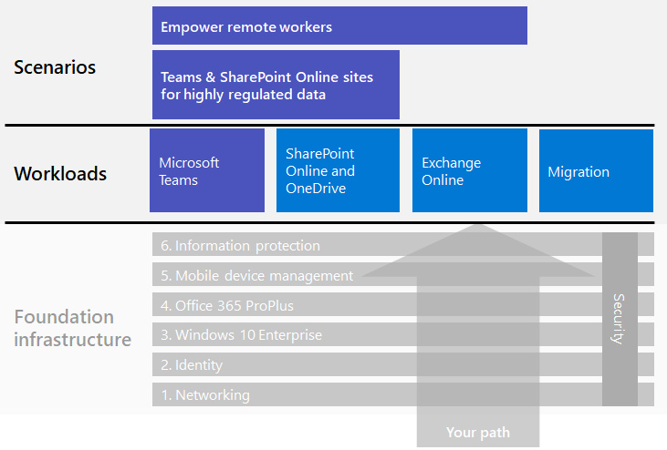

# Microsoft 365 for enterprise workloads and scenarios

To get the creativity and teamwork benefits of Microsoft 365 for enterprise, deploy these workloads over your foundation infrastructure:

- [Microsoft Teams](teams-workload.md)
- [Exchange Online](exchangeonline-workload.md)
- [SharePoint and OneDrive](sharepoint-online-onedrive-workload.md)

See the [migration](migration-microsoft-365-enterprise-workload.md) article for a general roadmap to migrate your entire organization to Microsoft 365 for enterprise, which includes Microsoft Office client products, on-premises Office Server products, and Microsoft Windows-based devices.

Scenarios use features and services from across Microsoft 365 for enterprise in an integrated way to address a business need. 

One such need is to ensure that your employees can work productively and securely when they're not directly connected to your intranet. See the [Empower remote workers](empower-people-to-work-remotely.md) scenario for a roadmap to deploy the infrastructure elements and drive remote user adoption for key workloads, such as Teams and Exchange Online.

Another such need is to protect highly regulated data stored in Microsoft 365. Highly regulated data includes digital assets that are:

- Subject to regional regulations.
- The most valuable data for your organization, such as trade secrets, financial or human resources information, and organization strategy.

To protect this data from internal and external threats, see:

- [Teams for highly regulated data](secure-teams-highly-regulated-data-scenario.md)
- [SharePoint sites for highly regulated data](teams-sharepoint-online-sites-highly-regulated-data.md). 

These scenarios step you through configuring a Microsoft Teams team or SharePoint site to securely store your most valuable data.

Here are the workloads and scenarios in the overall Microsoft 365 for enterprise deployment guide:

See the [Microsoft 365 Productivity Library](https://aka.ms/productivitylibrary) (https://aka.ms/productivitylibrary) for additional scenarios. 

## Foundation infrastructure prerequisites

*Ideally*, you should deploy workloads and scenarios after you have configured all of the phases of the [foundation infrastructure](deploy-foundation-infrastructure.md). This ensures that all of the underlying foundation layers are in place to provide integration, security, and the best experience for your users and their devices.

| Phase | Result |
|:-------|:-----|
| Network | Your network is updated for optimum performance to Microsoft 365 cloud services. |
| Identity | Identity is synchronized and secured with strong authentication for user accounts and protection for admin accounts. |
| Windows 10 Enterprise | Your computers running Windows 7 or Windows 8.1 can upgrade to Windows 10 Enterprise and new devices are installed with Windows 10 Enterprise. |
| Microsoft 365 Apps for enterprise | Your existing users of Microsoft Office can upgrade to Microsoft 365 Apps for enterprise. |
| Mobile device management | Your devices can be enrolled and managed. |
| Information protection | Microsoft 365 information protection features are configured and your sensitivity or Azure Information Protection labels are ready to protect documents and email. |

Remember that this is ideal and can take some time to plan for, configure, test, and pilot, especially in large organizations with existing infrastructure and multiple locations. Completing all of these phases in all locations is not necessary for you to more quickly get business value from Microsoft 365 for enterprise. 

Here are some common workloads to deploy right away: 

- After the **Identity** phase of the foundation infrastructure is rolled out to users, many organizations deploy:
  - [Microsoft 365 Apps for enterprise](office365proplus-infrastructure.md) combined with [OneDrive](https://docs.microsoft.com/onedrive/plan-onedrive-enterprise). Microsoft 365 Apps for enterprise provides the security of modern authentication and the user experience of the latest Microsoft Office client. The migration of user's personal files to OneDrive reduces infrastructure and the need to support home folders and drives.
  - [Exchange Online](exchangeonline-workload.md) so that users can begin using cloud-based email.
- If you don't have an immediate need for storing highly regulated digital assets in the cloud, deploy [Microsoft Teams](teams-workload.md) and [SharePoint](sharepoint-online-onedrive-workload.md) for your users prior to the **Information protection** phase.

You must decide on how to best order and deploy the configuration of prerequisite phases of foundation infrastructure to meet your business needs.

### Best practice

We highly recommend that you deploy and roll out the **Identity** phase of the foundation infrastructure prior to onboarding your users to any workloads or scenarios.

The **Identity** phase ensures that your cloud-based identity, whether cloud-only or synchronized with your on-premises Active Directory Domain Services (AD DS), contains the user and computer accounts and groups to manage authentication and access. Strong authentication for all your users along with strong protection of admin accounts is required before placing your organization's digital assets in the Microsoft 365 cloud.

Although foundational and very important to overall performance, the rollout of the **Networking** phase can be in progress while onboarding your users to workloads, with the understanding that Microsoft 365 workload and service performance will improve over time. This is especially true for enterprise organizations with multiple locations and a mixture of edge devices and Internet connections.
