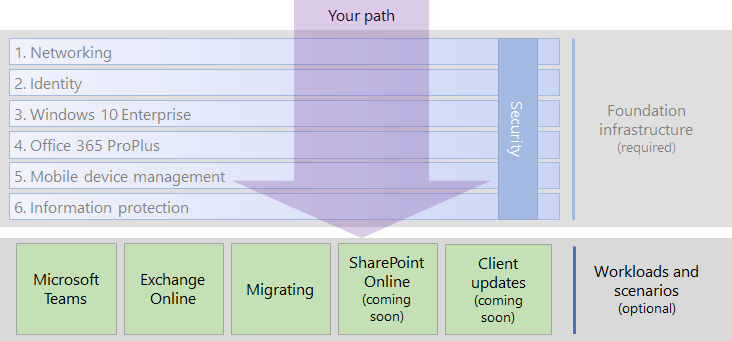

# Microsoft 365 Enterprise workloads and scenarios

To get the creativity and teamwork benefits of Microsoft 365 Enterprise, deploy these workloads and scenarios over your foundation infrastructure:

- [Microsoft Teams](teams-workload.md)
- [Exchange Online](exchangeonline-workload.md)
- [SharePoint Online](sharepoint-online-onedrive-workload.md)
- [Migration to Microsoft 365 Enterprise](migration-microsoft-365-enterprise-workload.md)
- [Microsoft Teams and SharePoint Online sites for highly regulated data](teams-sharepoint-online-sites-highly-regulated-data.md)

Here are the workloads and scenarios in the overall Microsoft 365 Enterprise deployment guide:

>[!Note]
>To deploy OneDrive for Business for Microsoft 365 Enterprise, see the [OneDrive guide for enterprises](https://docs.microsoft.com/onedrive/plan-onedrive-enterprise).
>

## Foundation infrastructure prerequisites

Ideally, you should deploy workloads and scenarios after you have configured all of the phases of the [foundation infrastructure](deploy-foundation-infrastructure.md). This ensures that all of the underlying layers are in place to provide integration, security, and the best experience for your users.

| Phase | Result |
|:-------|:-----|
| Network | Your network is updated for optimum performance to Microsoft 365 cloud services. |
| Identity | Identity is synchronized and secured with strong authentication for user accounts and protection for admin accounts. |
| Windows 10 Enterprise | Your computers running Windows 7 or Windows 8.1 can upgrade to Windows 10 Enterprise and new devices are installed with Windows 10 Enterprise. |
| Office 365 ProPlus | Your existing users of Microsoft Office can upgrade to Office 365 ProPlus. |
| Mobile device management | Your devices can be enrolled and managed. |
| Information protection | Your labels are ready to protect documents and Office 365 security features are enabled. |

This is ideal but can take some time to plan for, configure, test, and pilot. Putting all of these layers in place is not necessary for you to more quickly realize the business value of Microsoft 365 Enterprise. 

For example: 

- Organizations often deploy [Exchange Online](exchangeonline-workload.md) after the **Identity** layer of the foundation infrastructure is rolled out to users so that they can begin using cloud-based email. 
- Organizations that don't have an immediate need for storing highly regulated digital assets in the cloud can deploy [Microsoft Teams](teams-workload.md) and [SharePoint Online](sharepoint-online-onedrive-workload.md) for their users prior to the **Information protection** phase.

You must decide on how to best order the configuration of prerequisite layers of foundation infrastructure to meet your business needs.

### Best practice

We highly recommend that you deploy and roll out the **Identity** phase of the foundation infrastructure prior to onboarding your users to any workloads or scenarios.

The **Identity** phase ensures that your cloud-based identity, whether cloud-only or synchronized with your on-premises Windows Server Active Directory (AD), contains the user and computer accounts and groups to manage authentication and access. Strong authentication for all your users along with strong protection of admin accounts is required before placing your organization's digital assets in the Microsoft 365 cloud.

Although foundational and very important to overall performance, the rollout of the **Networking** phase on your network can be in progress while onboarding your users to workloads, with the understanding that Microsoft 365 application and service performance will improve over time.
