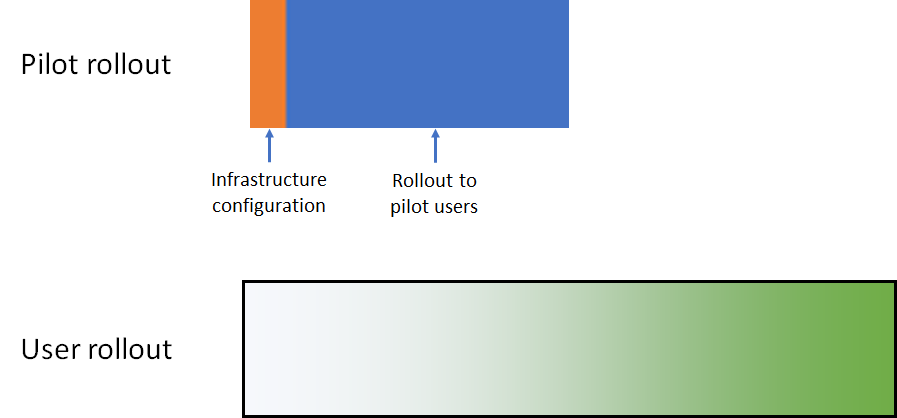

# Microsoft 365 for enterprise foundation infrastructure deployment strategies

There are many ways you can deploy the phases of the [foundation infrastructure](deploy-foundation-infrastructure.md) of Microsoft 365 for enterprise and roll out its capabilities, software, and services to your users. To get you started on the project management of this undertaking, which can be large and complex depending on the size of your organization and its existing infrastructure, consider the following deployment strategies:

- Serial deployment
- Parallel deployment with non-overlapping user rollout
- Parallel deployment with overlapping user rollout
- Up-front infrastructure and rollout of the end-to-end configuration

Use these strategies for ideas on how to manage the overall project and more quickly realize the business benefits of Microsoft 365 for enterprise.

>[!Note]
>This article contains assumptions and simplifications for a consistent way to describe the deployment strategies. These deployment strategies are generalized and are not meant to imply any specific timeframes, nor are they meant to apply to all organizations and situations.
>

## Elements of IT project management for typical enterprise organizations

IT infrastructure includes both backend services and the rollout of new or improved capabilities or installed software to end users. IT departments typically deploy elements of an IT infrastructure in a methodical way. One approach to the successful deployment of an element of IT infrastructure consists of:

- A pilot rollout 

  This includes initial infrastructure configuration and rollout to a pilot set of users, testing, and subsequent modifications to the infrastructure configuration.

- A user rollout

  This includes the rollout to the rest of your organization based on regions, departments, groups, or other types of systematic propagation of configuration or software.

The set of users in the pilot rollout are not the same as those in the user rollout.

This article uses the following graphics to depict these definitions: 

 

The shading for the user rollout graphic indicates the percentage across your organization from 0% to 100% using a structured or methodical approach such as groups, departments, or regions.

## Deployment strategies

Consider the following deployment strategies:

- Serial deployment
- Parallel deployment with non-overlapping user rollout
- Parallel deployment with overlapping user rollout
- Up-front infrastructure and rollout of the end-to-end configuration

### Serial deployment

With a serial deployment, you completely roll out a phase, allowing the phase to reach 100% completion of deployment to all of your users, before moving on to the next one. Here are some of the reasons why you might deploy this way:

- Risk mitigation
- Resourcing constraints
- IT department funding cycles
- IT technology dependencies
- Business change management and end-user resistance

This Gantt chart shows a simplified serial deployment of phases 2-6 of the foundation infrastructure for Microsoft 365 for enterprise.

 
 
To simplify the discussion and example, each phase and deployment segment within each phase are assumed to take the same amount of time.

>[!Note]
>Phase 1: Networking of the Microsoft 365 for enterprise Foundation Infrastructure is an IT department-only phase. Users reap the benefits of optimized connectivity to Microsoft’s cloud resources but are not imposed upon to achieve it.
>

Here’s a simplified pilot user experience as an example:

- In December, I need to use my smart phone for MFA. (Identity)
- In March, I get Windows 10 Enterprise installed on my Windows 8.1 desktop. (Windows 10 Enterprise)
- In June, I get Office 365 ProPlus installed, replacing Office 2013. (Office 365 ProPlus)
- In September, I get device enrollment and app and device policies applied. (Mobile device management)
- In December, I get the Azure Information Protection client installed and get trained on how to apply labels to documents. (Information protection)

The result is a 90-day cadence between successive pilot rollouts.

Here’s a simplified end-user experience as an example:

- In January, I need to use my smart phone for MFA. (Identity)
- In April, I get Windows 10 Enterprise installed on my Windows 8.1 desktop. (Windows 10 Enterprise)
- In July, I get Office 365 ProPlus installed, replacing Office 2013. (Office 365 ProPlus)
- In October, I get device enrollment and app and device policies applied. (Mobile device management)
- In January of the following year, I get the Azure Information Protection client installed and get trained on how to apply labels to documents. (Information protection)

The result is a 90-day cadence between successive user rollouts.

The disadvantage to this deployment strategy is that it can take a long time to fully deploy the Microsoft 365 for enterprise foundation infrastructure.

### Parallel deployment with non-overlapping user rollout (Parallel 1)

For this deployment strategy, you start the pilot rollout of the next phase during the last part of the user rollout of the current phase.
Here is the deployment of phases 2-6 when the pilot rollout occurs as the user rollout of the previous phase is wrapping up.

 
 
The end result is that user rollout for the current phase completes across your organization before the next one starts. Users that are not in pilot rollouts are not dealing with the rollouts of multiple phases at the same time, but pilot rollouts are done in parallel with user rollouts.

Here’s a simplified pilot user experience as an example:

- In December, I need to use my smart phone for MFA. (Identity)
- In February, I get Windows 10 Enterprise installed on my Windows 8.1 desktop. (Windows 10 Enterprise)
- In April, I get Office 365 ProPlus installed, replacing Office 2013. (Office 365 ProPlus)
- In June, I get device enrollment and app and device policies applied. (Mobile device management)
- In August, I get the Azure Information Protection client installed and get trained on how to apply labels to documents. (Information protection)

The result is a 60-day cadence between successive pilot rollouts.

Here’s a simplified end-user experience as an example:

- In January, I need to use my smart phone for MFA. (Identity)
- In March, I get Windows 10 Enterprise installed on my Windows 8.1 desktop. (Windows 10 Enterprise)
- In May, I get Office 365 ProPlus installed, replacing Office 2013. (Office 365 ProPlus)
- In July, I get device enrollment and app and device policies applied. (Mobile device management)
- In September, I get the Azure Information Protection client installed and get trained on how to apply labels to documents. (Information protection)

The result is a 60-day cadence between successive user rollouts.

The advantage to this deployment strategy is that it can take less time to fully deploy the Microsoft 365 for enterprise foundation infrastructure, without having your IT department and users deal with multiple rollouts the same time.

### Parallel deployment with overlapping user rollout (Parallel 2)

For this deployment strategy, you start the:

- Pilot rollout of the next phase during the last part of the user rollout of the current phase.
- User rollout of the next phase during the user rollout of the current phase in such a way that no user is dealing with the rollouts of multiple phases at the same time. This assumes that you are rolling out each phase of the foundation infrastructure in the same way, using regions, departments, or other groupings.

Here is a simplified comparison between the different deployment strategies.

 

The end result is that:

- Pilot rollouts go from one phase to the next without a pause.
- The user rollout for a phase begins before the completion of the user rollout of the previous phase, but no individual user is rolling out more than one phase at a time.

Here’s a simplified pilot user experience as an example:

- In December, I need to use my smart phone for MFA. (Identity)
- In January, I get Windows 10 Enterprise installed on my Windows 8.1 desktop. (Windows 10 Enterprise)
- In February, I get Office 365 ProPlus installed, replacing Office 2013. (Office 365 ProPlus)
- In March, I get device enrollment and app and device policies applied. (Mobile device management)
- In April, I get the Azure Information Protection client installed and get trained on how to apply labels to documents. (Information protection)

The result is a 30-day cadence between successive pilot rollouts.

Here’s a simplified end-user experience as an example:

- In January, I need to use my smart phone for MFA. (Identity)
- In February, I get Windows 10 Enterprise installed on my Windows 8.1 desktop. (Windows 10 Enterprise)
- In March, I get Office 365 ProPlus installed, replacing Office 2013. (Office 365 ProPlus)
- In April, I get device enrollment and app and device policies applied. (Mobile device management)
- In May, I get the Azure Information Protection client installed and get trained on how to apply labels to documents. (Information protection)

The result is a 30-day cadence between successive user rollouts.

The advantage to this deployment strategy is that it can take even less time to fully deploy the Microsoft 365 for enterprise foundation infrastructure, still without having end-users deal with multiple rollouts the same time. However, users don’t get a break between successive phases.

### Up-front infrastructure and rollout of the end-to-end configuration

For smaller organizations with the ability to compress phases 2-6 into a single deployment segment, the resulting deployment looks like this:
 
 

The IT department configures the infrastructure for phases 2-6, then rolls out to the pilot users to check for the end-to-end functionality. For example, pilot users get all of this functionality at the same time:

- MFA and other identity features (Identity)
- Windows 10 Enterprise on Windows devices (Windows 10 Enterprise)
- Office 365 ProPlus for the Office suite (Office 365 ProPlus)
- App and device policies (Mobile device management)
- Azure Information Protection client installed and training on how to apply labels to documents (Information protection)

Once the pilot rollout is concluded, the user rollout begins in which each user gets all the functionality the same time.

## Next step

Start your deployment of Microsoft 365 for enterprise with the [foundation infrastructure](deploy-foundation-infrastructure.md).
