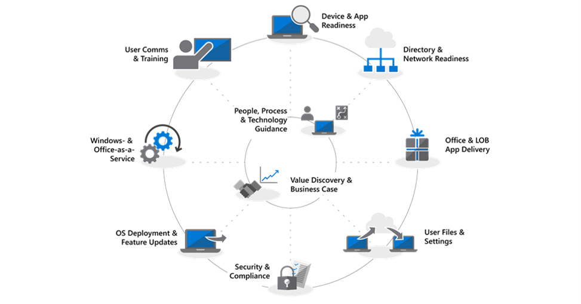

---
title: Desktop Deployment Center
ms.author: jogruszc
author: JGruszczyk
manager: jemed
ms.date: 06/01/19
ms.audience: ITPro
ms.topic: article
ms.service: o365-solutions
localization_priority: Priority
ms.collection: 
- Ent_O365
- Strat_O365_Enterprise
ms.custom: 
description: Overview of the Desktop Deployment Center.
---

# Desktop Deployment Center

<body lang=EN-US link="#0563C1" vlink="#954F72" style='tab-interval:.5in'>

<table class=MsoTableGrid border=1 cellspacing=0 cellpadding=0 width="100%"
 style='width:100.0%;background:#FFF2CC;mso-background-themecolor:accent4;
 mso-background-themetint:51;border-collapse:collapse;border:none;mso-border-alt:
 solid windowtext .5pt;mso-yfti-tbllook:1184;mso-padding-alt:5.75pt 5.75pt 5.75pt 5.75pt'>
 <tr style='mso-yfti-irow:0;mso-yfti-firstrow:yes;mso-yfti-lastrow:yes'>
  <td width="100%" valign=top style='width:100.0%;border:solid windowtext 1.0pt;
  mso-border-alt:solid windowtext .5pt;padding:5.75pt 5.75pt 5.75pt 5.75pt'>
  
<b>Upgrading from Windows 7 to Windows
  10?</b><o:p></o:p>

  
Windows 7 extended support ends January 14, 2020.
  In-place upgrade from Windows 7 to Windows 10 is the fastest method to
  deploy. You can <a
  href="https://docs.microsoft.com/en-us/microsoft-365/enterprise/windows-7-to-windows-10-upgrade-manual">upgrade
  a single PC</a> or <a
  href="https://docs.microsoft.com/en-us/microsoft-365/enterprise/windows-7-to-windows-10-upgrade-automated">upgrade
  thousands of PCs using System Center Configuration Manager</a>. You don’t
  need to focus on app delivery, file migration, custom imaging, or enabling
  cloud-based services with in-place upgrades. You can use tools you already
  have to upgrade existing PCs and focus on the following deployment steps for
  upgrades:<o:p></o:p>

  <table class=MsoTableGrid border=0 cellspacing=1 cellpadding=0 width="100%"
   style='width:100.0%;mso-cellspacing:.7pt;border:none;mso-yfti-tbllook:1184;
   mso-padding-alt:5.75pt 1.45pt 5.75pt 1.45pt;mso-border-insideh:3.0pt solid #FFF2CC;
   mso-border-insideh-themecolor:accent4;mso-border-insideh-themetint:51;
   mso-border-insidev:3.0pt solid #FFF2CC;mso-border-insidev-themecolor:accent4;
   mso-border-insidev-themetint:51'>
   <tr style='mso-yfti-irow:0;mso-yfti-firstrow:yes;mso-yfti-lastrow:yes'>
    <td width="32%" valign=top style='width:32.8%;border:solid #FFF2CC 3.0pt;
    mso-border-themecolor:accent4;mso-border-themetint:51;background:white;
    mso-background-themecolor:background1;padding:5.75pt 1.45pt 5.75pt 1.45pt'>
    <table class=MsoTableGrid border=0 cellspacing=0 cellpadding=0
     style='border-collapse:collapse;border:none;mso-yfti-tbllook:1184;
     mso-padding-alt:0in 5.4pt 0in 5.4pt;mso-border-insideh:none;mso-border-insidev:
     none'>
     <tr style='mso-yfti-irow:0;mso-yfti-firstrow:yes'>
      <td valign=top style='background:white;mso-background-themecolor:background1;
      padding:0in 5.4pt 0in 5.4pt'>
      
<b style='mso-bidi-font-weight:normal'><!--[if gte vml 1]><v:shapetype
       id="_x0000_t75" coordsize="21600,21600" o:spt="75" o:preferrelative="t"
       path="m@4@5l@4@11@9@11@9@5xe" filled="f" stroked="f">
       <v:stroke joinstyle="miter"/>
       <v:formulas>
        <v:f eqn="if lineDrawn pixelLineWidth 0"/>
        <v:f eqn="sum @0 1 0"/>
        <v:f eqn="sum 0 0 @1"/>
        <v:f eqn="prod @2 1 2"/>
        <v:f eqn="prod @3 21600 pixelWidth"/>
        <v:f eqn="prod @3 21600 pixelHeight"/>
        <v:f eqn="sum @0 0 1"/>
        <v:f eqn="prod @6 1 2"/>
        <v:f eqn="prod @7 21600 pixelWidth"/>
        <v:f eqn="sum @8 21600 0"/>
        <v:f eqn="prod @7 21600 pixelHeight"/>
        <v:f eqn="sum @10 21600 0"/>
       </v:formulas>
       <v:path o:extrusionok="f" gradientshapeok="t" o:connecttype="rect"/>
       <o:lock v:ext="edit" aspectratio="t"/>
      </v:shapetype><v:shape id="Picture_x0020_1" o:spid="_x0000_i1027" type="#_x0000_t75"
       style='width:29pt;height:29pt;visibility:visible;mso-wrap-style:square'>
       <v:imagedata src="media/desktop-deployment-center-home-media/desktop-deployment-center-home-media-5.png"
        o:title=""/>
      </v:shape><![endif]--><![if !vml]><![endif]></b><b><o:p></o:p></b>

      </td>
      <td valign=top style='background:white;mso-background-themecolor:background1;
      padding:0in 5.4pt 0in 5.4pt'>
      
<b>Upgrade ConfigMgr to current branch</b><o:p></o:p>

      </td>
     </tr>
     <tr style='mso-yfti-irow:1;mso-yfti-lastrow:yes'>
      <td colspan=2 valign=top style='background:white;mso-background-themecolor:
      background1;padding:0in 5.4pt 0in 5.4pt'>
      
Part of Directory and network
      readiness step for organizations using SCCM<o:p></o:p>

      </td>
     </tr>
    </table>
    
<o:p></o:p>

    </td>
    <td width="34%" valign=top style='width:34.82%;border:solid #FFF2CC 3.0pt;
    mso-border-themecolor:accent4;mso-border-themetint:51;background:white;
    mso-background-themecolor:background1;padding:5.75pt 1.45pt 5.75pt 1.45pt'>
    <table class=MsoTableGrid border=0 cellspacing=0 cellpadding=0
     style='border-collapse:collapse;border:none;mso-yfti-tbllook:1184;
     mso-padding-alt:0in 5.4pt 0in 5.4pt;mso-border-insideh:none;mso-border-insidev:
     none'>
     <tr style='mso-yfti-irow:0;mso-yfti-firstrow:yes'>
      <td valign=top style='background:white;mso-background-themecolor:background1;
      padding:0in 5.4pt 0in 5.4pt'>
      
<!--[if gte vml 1]><v:shape
       id="Picture_x0020_2" o:spid="_x0000_i1026" type="#_x0000_t75" alt="Device and App Readiness"
       style='width:29pt;height:29pt;visibility:visible;mso-wrap-style:square'>
       <v:imagedata src="media/desktop-deployment-center-home-media/desktop-deployment-center-home-media-3.png"
        o:title="Device and App Readiness"/>
      </v:shape><![endif]--><![if !vml]><![endif]><o:p></o:p>

      </td>
      <td valign=top style='background:white;mso-background-themecolor:background1;
      padding:0in 5.4pt 0in 5.4pt'>
      
<b>Validate device and app readiness</b><o:p></o:p>

      </td>
     </tr>
     <tr style='mso-yfti-irow:1;mso-yfti-lastrow:yes'>
      <td colspan=2 valign=top style='background:white;mso-background-themecolor:
      background1;padding:0in 5.4pt 0in 5.4pt'>
      
Part of Device and app readiness
      step; help is available via Desktop App Assure<o:p></o:p>

      </td>
     </tr>
    </table>
    
<o:p></o:p>

    </td>
    <td width="31%" valign=top style='width:31.76%;border:solid #FFF2CC 3.0pt;
    mso-border-themecolor:accent4;mso-border-themetint:51;background:white;
    mso-background-themecolor:background1;padding:5.75pt 1.45pt 5.75pt 1.45pt'>
    <table class=MsoTableGrid border=0 cellspacing=0 cellpadding=0
     style='border-collapse:collapse;border:none;mso-yfti-tbllook:1184;
     mso-padding-alt:0in 5.4pt 0in 5.4pt;mso-border-insideh:none;mso-border-insidev:
     none'>
     <tr style='mso-yfti-irow:0;mso-yfti-firstrow:yes;height:.4in'>
      <td valign=top style='background:white;mso-background-themecolor:background1;
      padding:0in 5.4pt 0in 5.4pt;height:.4in'>
      
<!--[if gte vml 1]><v:shape
       id="Picture_x0020_3" o:spid="_x0000_i1025" type="#_x0000_t75" alt="A close up of a logo&#10;&#10;Description automatically generated"
       style='width:29pt;height:29pt;visibility:visible;mso-wrap-style:square'>
       <v:imagedata src="media/desktop-deployment-center-home-media/desktop-deployment-center-home-media-9.png"
        o:title="Upgrade Windows 7 to Windows 100"/>
      </v:shape><![endif]--><![if !vml]><![endif]><o:p></o:p>

      </td>
      <td valign=top style='background:white;mso-background-themecolor:background1;
      padding:0in 5.4pt 0in 5.4pt;height:.4in'>
      
<b>Upgrade Windows 7 PCs to Windows 10</b><o:p></o:p>

      </td>
     </tr>
     <tr style='mso-yfti-irow:1;mso-yfti-lastrow:yes;height:.4in'>
      <td colspan=2 valign=top style='background:white;mso-background-themecolor:
      background1;padding:0in 5.4pt 0in 5.4pt;height:.4in'>
      
Part of OS deployment and feature
      updates step for user-retained PCs<o:p></o:p>

      </td>
     </tr>
    </table>
    
<o:p></o:p>

    </td>
   </tr>
  </table>
  
<o:p></o:p>

  </td>
 </tr>
</table>

<o:p>&nbsp;</o:p>

</body>

Follow the steps below to plan and carry out your large-scale deployment of Windows 10 and Office 365 ProPlus. Each step below is part of the overall planning and deployment process with steps typically running in parallel to each other in a phased deployment. Download the free [Desktop Deployment and Management Lab Kit](https://aka.ms/howtoshiftlabs) for hands-on training with the tools highlighted in the deployment process. You can also [find help](https://aka.ms/mddhelp) for your desktop deployment from Microsoft partners and FastTrack services.

 

<table>
<tr class="even">
<td></td>
<td>
<strong><a href="https://aka.ms/mdd0">Getting Started: People, Process and Technology Guidance</a></strong>

Discover the benefits of moving to Windows 10 and Office 365 ProPlus, major changes and considerations versus previous deployments, and best practices to ensure a smooth transition to Windows 10 and Office 365 ProPlus.
</td>
<td></td>
</tr>
<tbody>
<tr class="odd">
<td></td>
<td>
<strong><a href="https://aka.ms/mdd1">Step 1: Device and App Readiness</a></strong>

Begin your desktop deployment project with an inventory of your devices and apps, prioritize what you need to move forward, test prioritized apps and devices, then remediate what’s needed to get ready for deployment.
</td>
<td></td>
</tr>
<tr class="even">
<td></td>
<td>
<strong><a href="https://aka.ms/mdd2">Step 2: Directory and Network Readiness</a></strong>

Cloud connected services in Office 365 ProPlus and new deployment options like Windows Autopilot require Azure Active Directory. Your network and connectivity are also important areas to plan when moving Windows images, apps, drivers and related files to your PCs. Learn how new tools and deployment options reduce and streamline network traffic.
</td>
<td></td>
</tr>
<tr class="odd">
<td></td>
<td>
<strong><a href="https://aka.ms/mdd3">Step 3: Office and LOB App Delivery</a></strong>

Ensure your apps are packaged and ready for automated installation. Learn how Click-to-Run packaging with Office 365 ProPlus gives you new options to configure, deliver, and keep your Office apps up-to-date.
</td>
<td></td>
</tr>
<tr class="even">
<td></td>
<td>
<strong><a href="https://aka.ms/mdd4">Step 4: User Files and Settings</a></strong>

When refreshing or replacing PCs, save time by automating user state backup and restore. New options for cloud file sync allow you to enforce per user sync of Desktop, Documents, and Pictures folders to OneDrive for seamless file access from new Windows installs.
</td>
<td></td>
</tr>
<tr class="odd">
<td></td>
<td>
<strong><a href="https://aka.ms/mdd5">Step 5: Security and Compliance Considerations</a></strong>

Windows 10 and Office 365 ProPlus provide new ways to protect your data, devices and users, and quickly detect and respond to threats. Also, learn how to deal with common problems associated with disk encryption, anti-malware apps, and policies when moving to Windows 10.
</td>
<td></td>
</tr>
<tr class="even">
<td></td>
<td>
<strong><a href="https://aka.ms/mdd6">Step 6: OS Deployment and Feature Updates</a></strong>

Task sequence-based deployment is used to automate large scale, phased deployment for bare metal installs, PC refresh, and PC replacement. Upgrade task sequences will also help you stay current with major semi-annual updates. Windows Autopilot is a recent addition that modernizes imaging new and existing devices.
</td>
<td></td>
</tr>
<tr class="odd">
<td></td>
<td>
<strong><a href="https://aka.ms/mdd7">Step 7: Windows and Office Servicing</a></strong>

Both Windows 10 and Office 365 ProPlus continually add new capabilities to keep bringing user experiences and security forward with the latest innovations. Learn how to stay current with semi-annual and monthly updates, how the new servicing model works, and the tools and options you have.
</td>
<td></td>
</tr>
<tr class="even">
<td></td>
<td>
<strong><a href="https://aka.ms/mdd8">Step 8: User Communication and Training</a></strong>

Make sure your users are informed about new experiences and new ways of working as you shift your PCs to Windows 10 and Office 365 ProPlus. Learn how to take advantage of user adoption assistance with Microsoft FastTrack, training materials and communication templates, as well as new ways to monitor user acceptance and usage.
</td>
<td></td>
</tr>
<tr class="odd">
<td></td>
<td>
<strong><a href="https://transform.microsoft.com" target="_blank">Get your Leadership on Board: Value Discovery and Business Case</a></strong>

If you’ve done your deployment research, assessed app and device readiness, built your deployment plan and started piloting your deployment, but don’t have the support or resources needed from your management team to meet your deployment timelines, the Business Value Program at Microsoft can help. Learn how to build a business case to move to Windows 10 and Office 365 ProPlus and help get everyone on board.
</td>
<td><a href="https://transform.microsoft.com" target="_blank"></td>
</tr>
</tbody>
</table>
