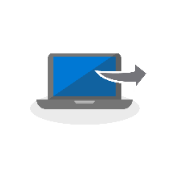
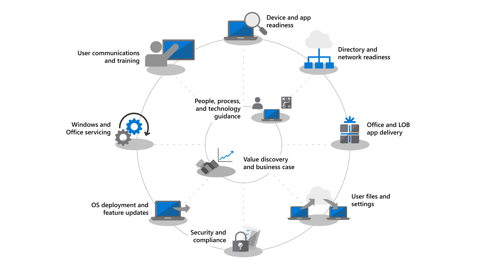
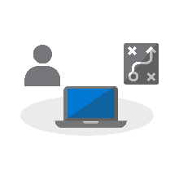
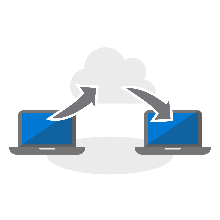

# Desktop Deployment Center

<strong>Upgrading from Windows 7 to Windows 10</strong>

Windows 7 extended support ends January 14, 2020. In-place upgrade from Windows 7 to Windows 10 is the fastest method to deploy. You can <a href="https://docs.microsoft.com/microsoft-365/enterprise/windows-7-to-windows-10-upgrade-manual">upgrade a single PC</a> or <a href="https://docs.microsoft.com/microsoft-365/enterprise/windows-7-to-windows-10-upgrade-automated">upgrade thousands of PCs using Microsoft Endpoint Configuration Manager</a>. You don’t need to focus on app delivery, file migration, custom imaging, or enabling cloud-based services with in-place upgrades. You can use tools you already have to upgrade existing PCs and focus on the following deployment steps for upgrades: 

<ul class="panelContent cardsM">
    <li>
        <a href="https://docs.microsoft.com/microsoft-365/enterprise/step-2-directory-and-network-readiness">
        

            

                

                    

                        

                            
                        

                    

                    

                        <h3>Upgrade ConfigMgr to Current Branch</h3>
			
Part of Directory and Network Readiness for organizations using Configuration Manager

                    

                

            

        

        </a>
    </li>
    <li>
        <a href="https://docs.microsoft.com/microsoft-365/enterprise/step-1-device-and-app-readiness">
        

            

                

                    

                        

                            
                        

                    

                    

                        <h3>Validate device and app readiness</h3>
			
Part of Device and App Readiness; help is available via Desktop App Assure

                    

                

            

        

        </a>
    </li>
    <li>
        <a href="https://docs.microsoft.com/microsoft-365/enterprise/windows-7-to-windows-10-upgrade-automated">
        

            

                

                    

                        

                            
                        

                    

                    

                        <h3>Upgrade Windows 7 PCs to Windows 10</h3>
			
Part of OS Deployment and Feature Updates for user-retained PCs

                    

                

            

        

        </a>
    </li>
</ul>

Follow the steps below to plan and carry out your large-scale deployment of Windows 10 and Office 365 ProPlus. Each step below is part of the overall planning and deployment process with steps typically running in parallel to each other in a phased deployment. Download the free [Desktop Deployment and Management Lab Kit](https://aka.ms/howtoshiftlabs) for hands-on training with the tools highlighted in the deployment process. You can also [find help](https://aka.ms/mddhelp) for your desktop deployment from Microsoft partners and FastTrack services.

 

<table>
<tr class="even">
<td></td>
<td>
<strong><a href="https://aka.ms/mdd0">Getting Started: People, Process and Technology Guidance</a></strong>

Discover the benefits of moving to Windows 10 and Office 365 ProPlus, major changes and considerations versus previous deployments, and best practices to ensure a smooth transition to Windows 10 and Office 365 ProPlus.
</td>
<td></td>
</tr>
<tbody>
<tr class="odd">
<td></td>
<td>
<strong><a href="https://aka.ms/mdd1">Step 1: Device and App Readiness</a></strong>

Begin your desktop deployment project with an inventory of your devices and apps, prioritize what you need to move forward, test prioritized apps and devices, then remediate what’s needed to get ready for deployment.
</td>
<td></td>
</tr>
<tr class="even">
<td></td>
<td>
<strong><a href="https://aka.ms/mdd2">Step 2: Directory and Network Readiness</a></strong>

Cloud connected services in Office 365 ProPlus and new deployment options like Windows Autopilot require Azure Active Directory. Your network and connectivity are also important areas to plan when moving Windows images, apps, drivers and related files to your PCs. Learn how new tools and deployment options reduce and streamline network traffic.
</td>
<td></td>
</tr>
<tr class="odd">
<td></td>
<td>
<strong><a href="https://aka.ms/mdd3">Step 3: Office and LOB App Delivery</a></strong>

Ensure your apps are packaged and ready for automated installation. Learn how Click-to-Run packaging with Office 365 ProPlus gives you new options to configure, deliver, and keep your Office apps up-to-date.
</td>
<td></td>
</tr>
<tr class="even">
<td></td>
<td>
<strong><a href="https://aka.ms/mdd4">Step 4: User Files and Settings</a></strong>

When refreshing or replacing PCs, save time by automating user state backup and restore. New options for cloud file sync allow you to enforce per user sync of Desktop, Documents, and Pictures folders to OneDrive for seamless file access from new Windows installs.
</td>
<td></td>
</tr>
<tr class="odd">
<td></td>
<td>
<strong><a href="https://aka.ms/mdd5">Step 5: Security and Compliance Considerations</a></strong>

Windows 10 and Office 365 ProPlus provide new ways to protect your data, devices and users, and quickly detect and respond to threats. Also, learn how to deal with common problems associated with disk encryption, anti-malware apps, and policies when moving to Windows 10.
</td>
<td></td>
</tr>
<tr class="even">
<td></td>
<td>
<strong><a href="https://aka.ms/mdd6">Step 6: OS Deployment and Feature Updates</a></strong>

Task sequence-based deployment is used to automate large scale, phased deployment for bare metal installs, PC refresh, and PC replacement. Upgrade task sequences will also help you stay current with major semi-annual updates. Windows Autopilot is a recent addition that modernizes imaging new and existing devices.
</td>
<td></td>
</tr>
<tr class="odd">
<td></td>
<td>
<strong><a href="https://aka.ms/mdd7">Step 7: Windows and Office Servicing</a></strong>

Both Windows 10 and Office 365 ProPlus continually add new capabilities to keep bringing user experiences and security forward with the latest innovations. Learn how to stay current with semi-annual and monthly updates, how the new servicing model works, and the tools and options you have.
</td>
<td></td>
</tr>
<tr class="even">
<td></td>
<td>
<strong><a href="https://aka.ms/mdd8">Step 8: User Communication and Training</a></strong>

Make sure your users are informed about new experiences and new ways of working as you shift your PCs to Windows 10 and Office 365 ProPlus. Learn how to take advantage of user adoption assistance with Microsoft FastTrack, training materials and communication templates, as well as new ways to monitor user acceptance and usage.
</td>
<td></td>
</tr>
</tbody>
</table>
