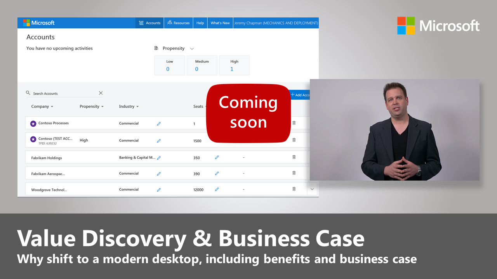

# Modern Desktop Deployment Center

Follow the steps below to plan and carry out your large-scale deployment of Windows 10 and Office 365 ProPlus. Each step below is part of the overall planning and deployment process and steps typically run in parallel to each other in a phased deployment.

 

<table>
<thead>
<tr class="even">
<td></td>
<td>
<strong>[Getting Started: People, Process and Technology Guidance](https://aka.ms/mdd0)</strong>

Discover the benefits of a modern desktop, major changes and considerations versus previous deployments and best practices to ensure a smooth transition to Windows 10 and Office 365 ProPlus.
</td>
<td></td>
</tr>
</thead>
<tbody>
<tr class="odd">
<td></td>
<td>
<strong>[Step 1: Device and App Readiness](https://aka.ms/mdd1)</strong>

Begin your desktop deployment project with an inventory of your devices and apps, prioritize what you to move forward, test prioritized apps and devices, then remediate what’s needed to get ready for deployment.
</td>
<td></td>
</tr>
<tr class="even">
<td></td>
<td>
<strong>[Step 2: Directory and Network Readiness](https://aka.ms/mdd2)</strong>

Cloud connected services in Office 365 ProPlus and new deployment options like Windows Autopilot require Azure Active Directory. Your network and connectivity are also important areas to plan when moving Windows images, apps, drivers and related files to your PCs. Learn how new tools and deployment options reduce and streamline network traffic.
</td>
<td></td>
</tr>
<tr class="odd">
<td></td>
<td>
<strong>[Step 3: Office and LOB App Delivery](https://aka.ms/mdd3)</strong>

Ensure your apps are packaged and ready for automated installation. Learn how Click-to-Run packaging with Office 365 ProPlus gives you new options to configure, deliver and keep your Office apps up-to-date.
</td>
<td></td>
</tr>
<tr class="even">
<td></td>
<td>
<strong>[Step 4: User Files and Settings](https://aka.ms/mdd4)</strong>

When refreshing or replacing PCs, save time by automating user state backup and restore. New options for cloud file sync allow you to enforce per user sync of Desktop, Documents and Pictures folders to OneDrive for seamless file access from new Windows installs.
</td>
<td></td>
</tr>
<tr class="odd">
<td></td>
<td>
<strong>[Step 5: Security and Compliance Considerations](https://aka.ms/mdd5)</strong>

Windows 10 and Office 365 ProPlus provide new ways to protect your data, devices and users and quickly detect and respond to threats. Also, learn how to deal with common problems associated with disk encryption, anti-malware apps and policies when moving to Windows 10.
</td>
<td></td>
</tr>
<tr class="even">
<td></td>
<td>
<strong>[Step 6: OS Deployment and Feature Updates](https://aka.ms/mdd6)</strong>

Task sequence-based deployment is used to automate large scale, phased deployment for bare metal installs, PC refresh and PC replacement. Upgrade task sequences will also help you stay current with major semi-annual updates. And Windows Autopilot is a recent addition that modernizes the new PC acquisition process.
</td>
<td></td>
</tr>
<tr class="odd">
<td></td>
<td>
<strong>[Step 7: Preparing for Windows and Office as a Service](https://aka.ms/mdd7)</strong>

Both Windows 10 and Office 365 ProPlus continually add new capabilities to keep bringing user experiences and security forward with the latest innovations. Learn how to stay current with semi-annual and monthly updates, how the new servicing model works and the tools and options you have.
</td>
<td></td>
</tr>
<tr class="even">
<td></td>
<td>
<strong>[Step 8: User Communication and Training](https://aka.ms/mdd8)</strong>

Make sure your users are informed about new experiences and new ways of working as you shift your PCs to Windows 10 and Office 365 ProPlus. Learn how to take advantage of user adoption assistance with Microsoft FastTrack, training materials and communication templates, as well as new ways to monitor user acceptance and usage.
</td>
<td></td>
</tr>
<tr class="odd">
<td></td>
<td>
<strong>[Get your Leadership on Board: Value Discovery and Business Case](https://transform.microsoft.com)</strong>

If you’ve done your deployment research, assessed app and device readiness, built your deployment plan and started piloting your deployment, but don’t have the support or resources needed from your management team to meet your deployment timelines, the Business Value Programs at Microsoft can help. Learn how to build a business case for a modern desktop and help get everyone on board.
</td>
<td></td>
</tr>
</tbody>
</table>
