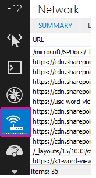
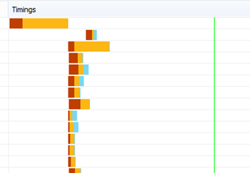
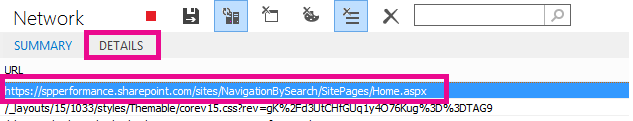
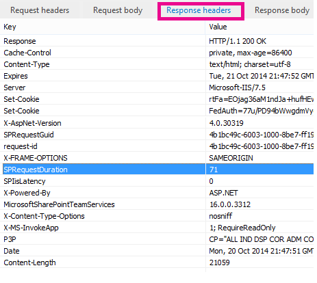

# Diagnosing performance issues with SharePoint Online

This article shows you how you can diagnose common issues with your SharePoint Online site using Internet Explorer developer tools.
  
There are three different ways that you can identify that a page on a SharePoint Online site has a performance problem with the customizations.
  
- The F12 tool bar network monitor

- Comparison to a non-customized baseline

- SharePoint Online response header metrics

This topic describes how to use each of these methods to diagnose performance issues. Once you've figured out the cause of the problem, you can work toward a solution using the articles about improving SharePoint performance that you can find on https://aka.ms/tune.
  
## Using the F12 tool bar to diagnose performance in SharePoint Online

In this article we use Internet Explorer 11. Versions of the F12 developer tools on other browsers have similar features though they may look slightly different. For information on the F12 developer tools, see:
  
- [What's new in F12 Tools](/previous-versions/windows/internet-explorer/ie-developer/dev-guides/bg182632(v=vs.85))

- [Using the F12 developer tools](/previous-versions/windows/internet-explorer/ie-developer/samples/bg182326(v=vs.85))

To bring up the developer tools press **F12** and then click the Wi-Fi icon:
  

  
On the **Network** tab, press the green play button to load a page. The tool returns all of the files that the browser requests in order to get the page you asked for. The following screen shot shows one such list.
  

  
You can also see the download times of the files on the right side as shown in this screen shot.
  

  
This gives you a visual representation of how long the file took to load. The green line represents when the page is ready to be rendered by the browser. This can give you a quick view of the different files that might be causing slow page loads on your site.
  
## Setting up a non-customized baseline for SharePoint Online

The best way to determine your site's performance weak points is to set up a completely out-of-the-box site collection in SharePoint Online. This way you can compare all the various aspects of your site with what you would get with no customization on the page. The OneDrive for Business home page is a good example of a separate site collection that is unlikely to have any customizations.
  
## Viewing SharePoint response header information

In SharePoint Online, you can access the information that is sent back to the browser in the response header for each file. The most useful value for diagnosing performance issues is **SPRequestDuration**, which displays the amount of time that the request took on the server to be processed. This can help determine if the request is very heavy and resource intensive. This is the best insight you have into how much work the server is doing to serve the page.

### To view SharePoint response header information
  
1. Ensure that you have the F12 tools installed. For more information on downloading and installing these tools, see [What's new in F12 tools](/previous-versions/windows/internet-explorer/ie-developer/dev-guides/bg182632(v=vs.85)).

2. In the F12 tools, on the **Network** tab, press the green play button to load a page.

3. Click one of the .aspx files returned by the tool and then click **DETAILS**.

    
  
4. Click **Response headers**.

    
  
## What's causing performance issues in SharePoint Online?

The article [Navigation options for SharePoint Online](navigation-options-for-sharepoint-online.md) shows an example of using the SPRequestDuration value to determine that the complicated structural navigation was causing the page to take a long time to process on the server. By taking a value for a baseline site (without customization), it is possible to determine if any given file is taking a long time to load. The example used in [Navigation options for SharePoint Online](navigation-options-for-sharepoint-online.md) is the main .aspx file. That file contains most of the ASP.NET code that runs for your page load. Depending on the site template you use, this could be start.aspx, home.aspx, default.aspx, or another name if you customize the home page. If this number is considerably higher than your baseline site, then it's a good indication that there is something complex going on in your page that is causing performance issues.
  
Once you have identified that an issue specific to your site, the recommended way to figure out what is causing poor performance is to eliminate all of the possible causes, like page customizations, and then add them back to the site one by one. Once you have removed enough customizations that the page is performing well, you can then add back specific customizations one by one.
  
For example, if you have a very complex navigation try changing the navigation to not show sub-sites then check the developer tools to see if this makes a difference. Or if you have a large amount of content roll-ups try removing them from your page and see if this improves things. If you eliminate all of the possible causes and add them back in one at a time, you can easily identify which features are the biggest problem and then work towards a solution.